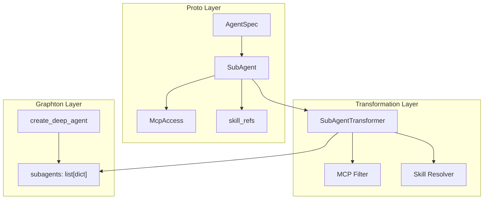

# Subagent Execution Support Implementation

## Architecture Overview

The implementation wires proto `SubAgent` definitions from `AgentSpec.sub_agents` to graphton's `create_deep_agent()` function. This requires three transformation layers:




## Key Design Decisions

### 1. New Transformation Module

Create `worker/activities/graphton/subagent_transformer.py` - a dedicated module following the established pattern of `config_transformer.py` and `skill_writer.py`. This keeps `execute_graphton.py` focused on orchestration while encapsulating transformation complexity.

### 2. MCP Access Restriction Strategy

SubAgents inherit parent MCP servers with restrictions:

- Filter parent's `mcp_servers_config` to only include servers listed in `SubAgent.mcp_access`
- Intersect tools: `enabled_tools = parent_enabled ∩ subagent_enabled` (empty subagent list = all parent tools)
- Pass per-subagent MCP configs via `tools` parameter (graphton wraps MCP into tool instances)

### 3. Skill Resolution Per SubAgent

Each SubAgent can have independent skills:

- Fetch all SubAgent skills in batch (single gRPC call per unique skill)
- Generate per-subagent skill prompt sections
- Append to each subagent's `system_prompt`

### 4. Error Handling Philosophy

Fail gracefully with clear logging:

- Invalid MCP access reference (slug not in parent) → log warning, skip that MCP server
- Skill fetch failure → log error, continue without skills for that subagent
- Empty subagents after filtering → pass `None` to graphton (no subagents)

## Implementation Details

### File: `worker/activities/graphton/subagent_transformer.py` (New)

```python
# Core transformation function signature
async def transform_sub_agents(
    sub_agents: list[SubAgent],
    parent_mcp_servers: dict[str, dict[str, Any]],  # Already transformed parent MCP
    parent_mcp_tools: dict[str, list[str]],         # Parent's enabled tools per server
    parent_mcp_usages: list[McpServerUsage],        # For slug → full config lookup
    skill_client: SkillClient,
    skill_writer: SkillWriter,
    sandbox_type: str,
    logger: logging.Logger,
) -> list[dict[str, Any]] | None:
    """
    Transform proto SubAgents to graphton format.
    
    Returns list of dicts with: name, description, system_prompt, mcp_servers, mcp_tools
    Returns None if no valid subagents after transformation.
    """
```

Key helper functions:

- `_filter_mcp_for_subagent()` - Filter parent MCP configs based on McpAccess grants
- `_resolve_subagent_skills()` - Fetch and generate skill prompt section
- `_build_subagent_dict()` - Assemble final graphton-compatible dict

### File: `execute_graphton.py` Changes

Location: Around line 700 (before `create_deep_agent` call)

```python
# Step 5.9: Transform SubAgents (NEW)
transformed_subagents = None
if agent.spec.sub_agents:
    from worker.activities.graphton.subagent_transformer import transform_sub_agents
    
    transformed_subagents = await transform_sub_agents(
        sub_agents=list(agent.spec.sub_agents),
        parent_mcp_servers=mcp_servers_config or {},
        parent_mcp_tools=mcp_tools_config or {},
        parent_mcp_usages=list(agent.spec.mcp_server_usages),
        skill_client=skill_client,
        skill_writer=SkillWriter(sandbox_type=sandbox_type, sandbox_config=sandbox_config),
        sandbox_type=sandbox_type,
        logger=activity.logger,
    )
```

Then update `create_deep_agent` call:

```python
agent_graph = create_deep_agent(
    ...
    subagents=transformed_subagents,  # Was: None
    ...
)
```

### MCP Restriction Logic

```python
def _filter_mcp_for_subagent(
    mcp_access_list: list[McpAccess],
    parent_mcp_servers: dict[str, dict[str, Any]],
    parent_mcp_tools: dict[str, list[str]],
    parent_mcp_usages: list[McpServerUsage],
    logger: logging.Logger,
) -> tuple[dict[str, dict[str, Any]], dict[str, list[str]]]:
    """
    Filter parent MCP configs based on SubAgent's McpAccess grants.
    
    Permission model:
    - SubAgent can only access servers explicitly listed in mcp_access
    - Tools are intersected: subagent_tools ∩ parent_tools
    - Empty enabled_tools in McpAccess = all parent tools (no additional restriction)
    """
    filtered_servers = {}
    filtered_tools = {}
    
    # Build slug → usage mapping for validation
    usage_by_slug = {u.mcp_server_ref.slug: u for u in parent_mcp_usages}
    
    for access in mcp_access_list:
        slug = access.mcp_server
        
        # Validate: slug must exist in parent's usages
        if slug not in usage_by_slug:
            logger.warning(f"SubAgent references unknown MCP server '{slug}', skipping")
            continue
        
        # Validate: server must be in transformed parent configs
        if slug not in parent_mcp_servers:
            logger.warning(f"MCP server '{slug}' not in parent configs, skipping")
            continue
        
        # Copy server config
        filtered_servers[slug] = parent_mcp_servers[slug]
        
        # Intersect tools
        parent_tools = parent_mcp_tools.get(slug, [])
        if access.enabled_tools:
            # Explicit restriction - intersect with parent
            filtered_tools[slug] = [t for t in access.enabled_tools if t in parent_tools]
        else:
            # No restriction - inherit all parent tools
            filtered_tools[slug] = parent_tools
    
    return filtered_servers, filtered_tools
```

### Graphton Subagent Dict Format

Based on graphton's `AgentConfig.validate_subagents()`:

```python
{
    "name": "code-reviewer",           # Required: from SubAgent.name
    "description": "Reviews code...",  # Required: from SubAgent.description
    "system_prompt": "You are...",     # Required: SubAgent.instructions + skills
    # Optional - passed via graphton's subagent mechanism:
    # Note: graphton passes parent's MCP servers to subagents by default
    # We need to verify how to restrict per-subagent
}
```

### Critical Investigation Needed

Before implementation, verify graphton's subagent MCP restriction mechanism:

1. Does graphton support per-subagent `mcp_servers`/`mcp_tools` in the subagent dict?
2. Or do subagents inherit parent's MCP servers automatically?
3. If no per-subagent restriction, we may need to enhance graphton first

Check in: `backend/libs/python/graphton/src/graphton/core/agent.py` (lines 391-397, 516-528)

## Files to Modify


| File                                                 | Change Type | Purpose                                     |
| ---------------------------------------------------- | ----------- | ------------------------------------------- |
| `worker/activities/graphton/subagent_transformer.py` | New         | Transformation logic                        |
| `worker/activities/execute_graphton.py`              | Modify      | Add Step 5.9, update create_deep_agent call |
| `worker/activities/graphton/__init__.py`             | Modify      | Export new module                           |


## Testing Strategy

### Unit Tests: `subagent_transformer_test.py`

1. Transform single SubAgent with full config
2. Transform multiple SubAgents
3. MCP filtering - valid slug
4. MCP filtering - invalid slug (warning, skip)
5. MCP tools intersection
6. Empty mcp_access (subagent gets no MCP servers)
7. Skill resolution per subagent
8. Empty sub_agents list returns None

### Integration Tests

1. End-to-end agent execution with one subagent
2. Agent with multiple subagents delegating different tasks
3. Subagent with restricted MCP access (verify tools are limited)
4. Subagent with skills (verify skills in system_prompt)

## Success Criteria

1. `AgentSpec.sub_agents` are transformed and passed to `create_deep_agent`
2. SubAgent MCP access restrictions are enforced (tools intersection)
3. SubAgent skills are resolved and injected into system_prompt
4. SubAgentExecution tracking works end-to-end (already implemented in StatusBuilder)
5. No regression in existing agent execution flow
6. Clean, well-documented code following established patterns

## Risk Mitigations


| Risk                                      | Mitigation                                                   |
| ----------------------------------------- | ------------------------------------------------------------ |
| Graphton doesn't support per-subagent MCP | Investigate graphton internals; may need library enhancement |
| Recursive skill resolution complexity     | Batch skill fetches; cache within execution                  |
| Circular subagent delegation              | Graphton's recursion_limit handles this                      |
| Performance impact from skill fetching    | Fetch all unique skills in single batch call                 |


