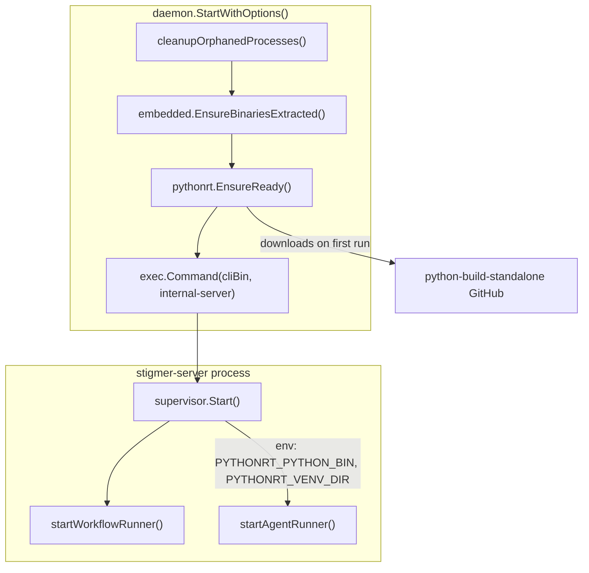
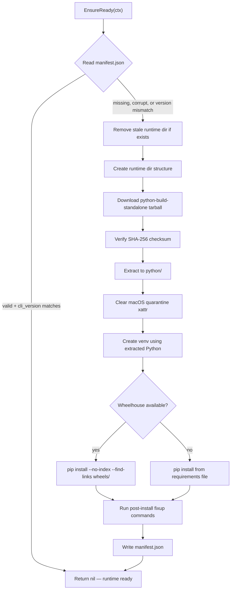

# T01.2: Go CLI — Python Runtime Manager

## Domain Analysis (Architect Role)

### Critique of the Original T01.2 Specification

The original plan describes T01.2 as a single package that does five things: detect platform, download Python, create venv, install deps, manage versions. This risks producing a monolithic file. Per engineering standards, every file must have exactly one reason to change (50-150 lines ideal, 250+ forbidden).

I also want to call out three design tensions in the original specification:

1. **"Download python-build-standalone" conflates two concerns**: resolving *which* tarball to download (platform mapping, URL construction, version pinning) vs. *performing* the download (HTTP, progress, checksums). These should be separate.
2. **"Install dependencies from a local wheelhouse"** assumes the wheelhouse exists. Since T01.3 (CI wheelhouse pipeline) hasn't been built yet, T01.2 needs a dependency installation strategy that works without a wheelhouse, or we block until T01.3 is done. I propose supporting both modes: wheelhouse-preferred with network-fallback.
3. **The `deepagents-cli` namespace collision fix** is agent-runner-specific business logic, not a generic Python runtime concern. It should not live inside the `pythonrt` package. Instead, the caller should be able to provide post-install fixup commands via configuration.

### Proposed Domain Model

The core domain concept is a **RuntimeEnvironment** — a self-contained, versioned, platform-specific Python installation with a virtual environment and installed dependencies. The key invariant: **a RuntimeEnvironment is either fully bootstrapped (manifest exists and is valid) or does not exist at all**. There is no partially-bootstrapped state; if any step fails, the entire directory is removed.

Key domain concepts:

- **RuntimeEnvironment**: The aggregate — python interpreter + venv + wheels + manifest, all under one versioned directory
- **Manifest**: Value object recording the immutable state of a bootstrapped environment (as defined in DD-01)
- **Platform**: Value object mapping Go's `runtime.GOOS`/`runtime.GOARCH` to python-build-standalone naming conventions
- **Bootstrap**: The atomic operation that provisions a RuntimeEnvironment from scratch

---

## Architecture

### Where This Lives in the Startup Flow




**Key architectural decision**: Bootstrap (the slow, network-dependent part) happens in `daemon.StartWithOptions()`, *before* stigmer-server starts. The supervisor only needs the path to the bootstrapped Python binary to spawn agent-runner. Paths are passed via environment variables, following the existing pattern where daemon.go passes Temporal addresses and backend endpoints to the supervisor.

This separation matters because the `supervisor` package lives in `backend/services/stigmer-server/pkg/supervisor/` — a different Go module that cannot import CLI internal packages. The daemon is the bridge.

**Note**: Wiring into daemon.go and supervisor.go is T01.4 scope. T01.2 produces the standalone package.

### EnsureReady Bootstrap Flow




If *any* step fails, the entire runtime directory is removed (atomic: all or nothing). The caller sees either success or a clean error.

---

## Package Design

### Location

`client-apps/cli/internal/cli/pythonrt/`

Follows the established pattern: Temporal manager is at `internal/cli/temporal/`, daemon code at `internal/cli/daemon/`.

### File Structure


| File           | Responsibility                                                             | Est. Lines |
| -------------- | -------------------------------------------------------------------------- | ---------- |
| `manager.go`   | `Manager` struct, `EnsureReady()` orchestration, `PythonBin()`/`IsReady()` | 100-130    |
| `manifest.go`  | `Manifest` value object, `Read`/`Write`, `IsValid`                         | 70-80      |
| `platform.go`  | `Platform` value object, Go-to-PBS naming mapping, URL construction        | 70-80      |
| `download.go`  | Download python-build-standalone tarball, verify checksum                  | 100-120    |
| `extract.go`   | Extract tar.gz, handle symlinks, clear macOS quarantine                    | 80-100     |
| `venv.go`      | Create venv, install dependencies, run post-install commands               | 100-120    |
| `checksums.go` | Pinned SHA-256 checksums for each platform's PBS tarball                   | 30-50      |


**Total**: ~550-680 lines across 7 files, averaging ~85 lines each. All well within the 250-line limit.

### Key Types

`**manager.go`** — The entry point:

```go
type Config struct {
    BaseDir        string     // e.g., ~/.stigmer/runtimes/agent-runner
    CLIVersion     string     // from embedded.GetBuildVersion()
    DepsSource     string     // path to requirements.txt (exported from poetry.lock)
    WheelDir       string     // optional: path to pre-built wheelhouse
    PostInstallCmds [][]string // e.g., [["pip", "install", "--force-reinstall", "deepagents==0.4.0"]]
}

type Manager struct { /* config, platform, computed paths */ }

func NewManager(cfg Config) (*Manager, error)
func (m *Manager) EnsureReady(ctx context.Context) error
func (m *Manager) PythonBin() string   // venv python binary path
func (m *Manager) IsReady() bool       // quick manifest check
func (m *Manager) RuntimeDir() string  // versioned platform directory
```

`**manifest.go**` — Value object (matches DD-01):

```go
type Manifest struct {
    SchemaVersion       int       `json:"schema_version"`
    CLIVersion          string    `json:"cli_version"`
    Platform            string    `json:"platform"`
    PythonVersion       string    `json:"python_version"`
    PBSTag              string    `json:"python_build_standalone_tag"`
    DepsLockSHA256      string    `json:"deps_lock_sha256"`
    InstalledAt         time.Time `json:"installed_at"`
    BootstrapDurationMS int64     `json:"bootstrap_duration_ms"`
}
```

`**platform.go**` — Maps Go identifiers to python-build-standalone naming:

```go
type Platform struct {
    OS   string // runtime.GOOS
    Arch string // runtime.GOARCH
}

func (p Platform) String() string       // "darwin-arm64" (hyphen, per DD-01)
func (p Platform) PBSArch() string      // "aarch64" or "x86_64"
func (p Platform) PBSTriple() string    // "aarch64-apple-darwin" or "x86_64-unknown-linux-gnu"
func (p Platform) TarballName() string  // "cpython-3.11.x+TAG-TRIPLE-install_only.tar.gz"
func (p Platform) DownloadURL() string  // full GitHub releases URL
```

**Platform mapping** (verified from python-build-standalone releases):


| Go `GOOS-GOARCH` | PBS triple                  | PBS arch  |
| ---------------- | --------------------------- | --------- |
| `darwin-arm64`   | `aarch64-apple-darwin`      | `aarch64` |
| `darwin-amd64`   | `x86_64-apple-darwin`       | `x86_64`  |
| `linux-amd64`    | `x86_64-unknown-linux-gnu`  | `x86_64`  |
| `linux-arm64`    | `aarch64-unknown-linux-gnu` | `aarch64` |


Note: DD-01 uses **hyphen** separator (`darwin-arm64`). The existing `embedded.Platform` uses **underscore** (`darwin_arm64`). The `pythonrt` package will use hyphen per DD-01 and will NOT reuse `embedded.Platform` to avoid coupling and convention mismatch.

### Python Version Pinning

The `pythonrt` package owns the pinned Python version and PBS release tag as constants:

```go
const (
    PythonVersion = "3.11.12"
    PBSTag        = "20260211"
)
```

These are intentionally **hardcoded in the package**, not passed by the caller, because:

- The package must know the exact PBS release to construct download URLs
- The checksums (in `checksums.go`) are tied to specific releases
- Changing the Python version is a conscious engineering decision that requires testing
- The CLI version already acts as the "freshness" key (per DD-01) — if we change the Python version, we release a new CLI version

### Tarball Extraction

The python-build-standalone `install_only` tarball contains a top-level `python/` directory with `bin/`, `lib/`, `include/`, `share/`. Extracting into the runtime platform directory produces `<platform>/python/bin/python3.11` — exactly matching DD-01's layout.

The existing `embedded.extractTarball()` ([extract.go](client-apps/cli/embedded/extract.go)) handles tar.gz with symlinks and path traversal protection. However, it operates on `[]byte` (designed for embedded data). The `pythonrt` package needs to extract from a **file on disk** (the downloaded tarball is ~50MB, too large to hold in memory). A new `extract.go` will implement file-based tar.gz extraction, reusing the same security patterns (path traversal check, symlink handling).

---

## Decision Points (Need Your Review)

### Decision 1: Checksum Verification Strategy

**My recommendation: Hardcode SHA-256 checksums in Go constants.**

In `checksums.go`, we store the expected SHA-256 for each platform's tarball:

```go
var pbsChecksums = map[string]string{
    "aarch64-apple-darwin":       "abc123...",
    "x86_64-apple-darwin":        "def456...",
    "x86_64-unknown-linux-gnu":   "789abc...",
    "aarch64-unknown-linux-gnu":  "012def...",
}
```

**Why**: This is the most secure approach. The CLI knows exactly what bytes to expect. No MITM risk from downloading a separate checksum file. Each CLI release locks its supply chain.

**Trade-off**: Requires a code change to update the PBS release. I consider this a feature, not a bug — updating the Python runtime should be a deliberate, tested change.

**Alternative rejected**: Downloading SHA256SUMS from the same GitHub release and verifying. Less secure (both download and verification come from the same source).

### Decision 2: Dependency Installation Strategy for T01.2

**My recommendation: Support both wheelhouse and network install; test with network for now.**

The `venv.go` logic:

1. If `Config.WheelDir` is set and non-empty, use `pip install --no-index --find-links <wheelDir>`
2. Otherwise, use `pip install -r <depsSource>` (network)

For T01.2 development and testing, we generate a `requirements.txt` by exporting from `backend/services/agent-runner/poetry.lock` (a one-time manual step) and install from the network. When T01.3 delivers the wheelhouse, the same code path works with `--no-index`.

**Why not block on T01.3**: T01.2 and T01.3 can proceed in parallel. The interface is clean: T01.2 consumes a wheel directory if provided, T01.3 produces it.

### Decision 3: Use `httputil.DownloadFile` or Custom Download

**My recommendation: Use the existing `httputil.DownloadFile`.**

It already has:

- Progress callback (`OnProgress`)
- Configurable timeout (default 10 min, sufficient for ~50MB tarball)
- Parent directory auto-creation
- Proper error handling

The Temporal download ([temporal/download.go](client-apps/cli/internal/cli/temporal/download.go)) uses raw `http.Get` — but it was written before `httputil` existed. New code should use the existing utility. No need to reinvent.

### Decision 4: macOS Quarantine Handling

Downloaded files from the internet get the `com.apple.quarantine` extended attribute on macOS. This can prevent execution of the extracted Python binary.

**My recommendation**: After extraction, run `xattr -dr com.apple.quarantine <pythonDir>` on macOS. This is a well-known pattern for downloaded developer tools (Homebrew does this too).

This goes in `extract.go`, conditional on `runtime.GOOS == "darwin"`.

---

## Surprises and Flags

### Surprise 1: Workspace Path Environment Variable Mismatch

During exploration, I discovered that `daemon.go` passes `-e WORKSPACE_ROOT=/workspace` to the Docker container, but `worker/config.py` reads `SANDBOX_ROOT_DIR` (not `WORKSPACE_ROOT`). In Docker mode, the volume mount makes both work. In native mode, there is no volume mapping — the environment variable name must be correct.

**Impact on T01.2**: None directly (T01.2 doesn't touch daemon.go). But T01.4 will need to fix this when wiring up the native process startup. Flagging now so it's not missed.

**Recommendation**: Document this as a known issue for T01.4. Do not fix it in T01.2.

### Surprise 2: `embedded.Platform` Convention Mismatch

The existing `embedded.Platform` type uses underscore separator (`darwin_arm64`). DD-01 specifies hyphen (`darwin-arm64`). The `pythonrt` package needs its own Platform type.

**Impact**: Minor. The two conventions coexist. No refactoring of `embedded.Platform` needed.

### Surprise 3: `findAgentRunnerBinary()` Legacy Code Path

There is still a legacy binary-based fallback in `daemon.go` that calls `findAgentRunnerBinary()` which looks for `dataDir/bin/agent-runner` and falls back to downloading from GitHub releases. This code path is dormant but still exists alongside the Docker path.

**Impact on T01.2**: None. But T01.4 will need to decide whether to repurpose this, remove it, or leave it alongside the new native mode. Flagging for awareness.

### Surprise 4: PBS Tarball Size (~50MB download)

The python-build-standalone `install_only` tarball for macOS arm64 is approximately 40-55MB compressed. This is a significant first-run download. The existing Temporal download is ~30MB, so this pattern is already established but users will see a longer wait.

**Recommendation**: Use `httputil.DownloadFile` with progress callback to show download progress. Match the UX of the Temporal download.

---

## Implementation Sequence

### Step 1: Package Scaffolding — Types and Paths

Create the package structure with:

- `platform.go`: Platform value object with PBS naming map (pure logic, no I/O)
- `manifest.go`: Manifest value object with read/write/validation (minimal I/O)
- `checksums.go`: Pinned checksum constants
- `manager.go`: Config struct, Manager struct with constructor, stub `EnsureReady()`

**Verification**: Unit tests for Platform mapping and Manifest serialization.

### Step 2: Download + Extract

Implement the download and extraction pipeline:

- `download.go`: Download PBS tarball using `httputil.DownloadFile`, verify SHA-256 checksum
- `extract.go`: Extract tar.gz from file (not `[]byte`), handle symlinks, path traversal protection, macOS quarantine cleanup

**Verification**: Download and extract PBS tarball for the current platform. Confirm `python/bin/python3.11` exists and is executable.

### Step 3: Venv + Dependency Installation

Implement virtual environment management:

- `venv.go`: Create venv using extracted Python, install deps from wheelhouse or network, run post-install fixup commands

**Verification**: Create a venv, install a small subset of agent-runner deps, confirm import works.

### Step 4: EnsureReady Orchestration

Wire everything together in `Manager.EnsureReady()`:

- Manifest check (skip if valid)
- Full bootstrap pipeline (atomic: remove dir on failure)
- Write manifest on success
- Timing instrumentation (bootstrap_duration_ms)

**Verification**: Full end-to-end bootstrap on macOS arm64. Run `EnsureReady()` twice — first bootstraps, second is a no-op.

---

## Scope Boundaries

**In scope for T01.2:**

- New `internal/cli/pythonrt/` package
- Download + extract python-build-standalone
- Venv creation + dependency installation
- Manifest management
- SHA-256 checksum verification
- macOS quarantine handling
- All code follows engineering standards (SRP, <250 lines, interfaces, error wrapping)

**Explicitly out of scope:**

- Wiring into `daemon.go` or `supervisor.go` (T01.4)
- CI wheelhouse build pipeline (T01.3)
- Docker fallback logic (T01.4)
- Log integration (T01.5)
- Windows support (not in the 4-platform target)
- `deepagents` upstream fix (separate task; workaround provided via `PostInstallCmds`)

---

## Key Files to Reference During Implementation

- `[client-apps/cli/internal/cli/temporal/manager.go](client-apps/cli/internal/cli/temporal/manager.go)` — EnsureInstalled pattern
- `[client-apps/cli/internal/cli/temporal/download.go](client-apps/cli/internal/cli/temporal/download.go)` — Download + tar.gz extraction pattern
- `[client-apps/cli/internal/cli/httputil/download.go](client-apps/cli/internal/cli/httputil/download.go)` — Existing download utility with progress
- `[client-apps/cli/embedded/extract.go](client-apps/cli/embedded/extract.go)` — Tar extraction with symlink + path traversal handling
- `[client-apps/cli/embedded/embedded.go](client-apps/cli/embedded/embedded.go)` — Platform detection (reference, not to import)
- `[client-apps/cli/embedded/version.go](client-apps/cli/embedded/version.go)` — `GetBuildVersion()` for CLI version
- `[client-apps/cli/internal/cli/config/config.go](client-apps/cli/internal/cli/config/config.go)` — `GetConfigDir()` path conventions
- `[_projects/2026-03/20260301.02.native-agent-runner/design-decisions/DD01_runtime_filesystem_layout.md](design-decisions/DD01_runtime_filesystem_layout.md)` — Runtime layout specification

