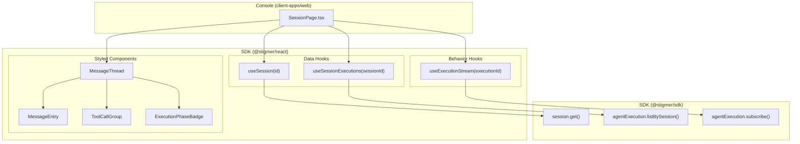

# T01.6: Active Session View — Sub-Project Breakdown

T01.6 is too large to ship as a single task. It is decomposed into 5 independent sub-projects, each delivering a complete, testable increment. Only SP1 is detailed here — subsequent sub-projects will be planned when we reach them.

## Sub-Project Roadmap


| Sub-Project                            | Scope                                                                                                 | Delivers                                                                                                     | Depends On |
| -------------------------------------- | ----------------------------------------------------------------------------------------------------- | ------------------------------------------------------------------------------------------------------------ | ---------- |
| **SP1: Core Thread + Streaming**       | Data hooks, streaming hook, message rendering, collapsed tool summaries, auto-scroll                  | A working session view: user navigates to `/sessions/[id]`, sees the conversation, watches streaming updates | Nothing    |
| **SP2: Follow-Up + Conversation Loop** | `FollowUpInput`, create execution flow, refetch + stream new execution                                | Users can send follow-up messages and continue the conversation                                              | SP1        |
| **SP3: Context Panel**                 | Context panel slot mechanism, `SessionContextContent`, `UsageSummary`, `ExecutionPhaseBadge` in panel | Right panel shows execution metadata (phase, model, tokens, cost, workspace)                                 | SP1        |
| **SP4: Expandable Tool Groups**        | Click-to-expand tool groups, individual tool call detail (args, result), sub-agent sections           | Users can inspect what tools did and see sub-agent activity                                                  | SP1        |
| **SP5: HITL Approvals**                | `useSubmitApproval` hook, `ApprovalCard` component, approval flow integration                         | Users can approve/skip/reject tool calls that require authorization                                          | SP1 + SP4  |


SP2, SP3, SP4 are independent of each other — they can be done in any order after SP1. SP5 depends on SP4 because approvals are attached to specific tool calls.

---

## SP1: Core Thread + Streaming (Detailed Plan)

### What SP1 Delivers

The user creates a session from the launcher, navigates to `/sessions/[id]`, and sees:

- The conversation thread with user messages and agent responses (markdown-rendered)
- Collapsed tool call summaries (e.g., "Ran 2 commands", "Read 5 files") — not expandable yet
- Real-time streaming of the active execution
- Auto-scroll following new content
- Loading skeleton while data loads
- Error state if session not found or stream fails

What SP1 does **not** include: follow-up input, context panel content, expandable tool details, HITL approvals.

### SP1 Visual Layout

```
┌─────────────────────────────────────────────────────────────┐
│ Sidebar │              Message Thread              │CtxPnl │
│         │                                          │(empty) │
│ [+New]  │  ┌─ User ────────────────────────────┐   │        │
│ ──────  │  │ Help me organize my downloads     │   │        │
│ Recents │  └────────────────────────────────────┘   │        │
│  S1 ◀── │                                          │        │
│  S2     │  Let me take a look at what's in your    │        │
│  S3     │  Downloads folder.                       │        │
│         │                                          │        │
│         │  ┌ Ran 2 commands ────────────────────┐   │        │
│         │  └────────────────────────────────────┘   │        │
│         │                                          │        │
│         │  Good, I have a clear picture now.       │        │
│         │  Let me check for actual duplicates.     │        │
│         │                                          │        │
│         │  ┌ Check MD5 checksums ───────────────┐   │        │
│         │  └────────────────────────────────────┘   │        │
│         │                                          │        │
│         │  I found the following:                  │        │
│         │  - file_a.csv is a duplicate of...       │        │
│         │  - file_b.md has different content...     │        │
│         │                                          │        │
│         │  ┌ Updated todo list, ran 5 commands ─┐   │        │
│         │  └────────────────────────────────────┘   │        │
│         │                                          │        │
│         │  Everything is organized! Here's what    │        │
│         │  was done:                               │        │
│         │  - **Usage Data/** — all 8 CSV files     │        │
│         │                                          │        │
│         │           ● Completed                    │        │
│         │                                          │        │
└─────────────────────────────────────────────────────────────┘
```

Key observations:

- Agent text is rendered with **markdown** (bold, lists, code blocks, etc.)
- Tool calls are **aggregated into summary lines** — "Ran 2 commands", "Check MD5 checksums", "Updated todo list, ran 5 commands". Not expandable in SP1.
- A terminal **phase indicator** at the bottom ("Completed", "Failed", or a streaming animation)
- The right context panel exists in the layout but has no content yet (SP3)
- No follow-up input (SP2)

### SP1 Component Architecture




### SP1 Component Inventory

#### SDK — New Data Hooks

- `**useSession(id: string)**` in `sdk/react/src/session/useSession.ts`
  - Calls `stigmer.session.get(id)`
  - Returns `{ session: Session | null, isLoading: boolean, error: string | null }`
  - Follows the same pattern as existing `useCreateSession` (uses `useStigmer()`, manages loading/error state)
- `**useSessionExecutions(sessionId: string)**` in `sdk/react/src/session/useSessionExecutions.ts`
  - Calls `stigmer.agentExecution.listBySession({ sessionId })`
  - Returns `{ executions: AgentExecution[], isLoading: boolean, error: string | null, refetch: () => void }`
  - `refetch` is needed for SP2 (after creating follow-up executions) — include it now so the API is stable

#### SDK — New Behavior Hook

- `**useExecutionStream(executionId: string | null)**` in `sdk/react/src/execution/useExecutionStream.ts`
  - **The most complex piece in SP1.** Subscribes to `stigmer.agentExecution.subscribe(id, signal)` (async generator).
  - Accepts `null` to mean "don't subscribe" (no active execution to stream).
  - Returns:
    - `execution: AgentExecution | null` — latest full snapshot
    - `phase: ExecutionPhase` — convenience extraction from `execution.status.phase`
    - `isStreaming: boolean` — true while subscription is active and phase is non-terminal
    - `isConnecting: boolean` — true during initial connection before first message
    - `error: string | null` — connection or protocol errors
  - **Lifecycle**: Creates `AbortController` on mount. On `executionId` change, aborts previous subscription and starts new one. On terminal phase (`COMPLETED`, `FAILED`, `CANCELLED`, `TERMINATED`), stops consuming the stream. On unmount, aborts.
  - **Each update replaces state atomically** — the subscribe RPC returns the full `AgentExecution` on every update, not deltas. The hook calls `setState(newExecution)`. Simple, correct, no merge logic.

#### SDK — New Styled Components

- `**MessageEntry`** in `sdk/react/src/execution/MessageEntry.tsx`
  - Props: `message: AgentMessage`
  - Renders based on `message.type`:
    - `HUMAN` — user message with `bg-muted` background, left-aligned
    - `AI` — agent response, rendered as markdown via `react-markdown` + `remark-gfm`. Shows streaming cursor (`█`) when `message.is_streaming === true`
    - `SYSTEM` — muted, small text, inline
    - `TOOL` — not rendered directly (tool results are consumed by `ToolCallGroup`)
  - No fetch, no state — purely presentational
- `**ToolCallGroup`** in `sdk/react/src/execution/ToolCallGroup.tsx`
  - Props: `toolCalls: ToolCall[]`
  - Renders a **single collapsed summary line** for a group of tool calls from one AI turn
  - Format: `"Ran 2 commands"`, `"Read 5 files"`, `"Used 3 tools"` — or for a single tool: `"search"`, `"bash"`
  - Status-aware: shows spinner for running calls, checkmark for completed, X for failed
  - **Not expandable in SP1** — just the summary line. Expansion is SP4.
  - Grouping logic: tool calls from the same AI message are grouped. The `MessageThread` handles this grouping and passes the array.
- `**ExecutionPhaseBadge`** in `sdk/react/src/execution/ExecutionPhaseBadge.tsx`
  - Props: `phase: ExecutionPhase`
  - Small inline badge: `IN_PROGRESS` (animated dot + "Running"), `COMPLETED` (checkmark + "Completed"), `FAILED` (X + "Failed"), `WAITING_FOR_APPROVAL` (clock + "Waiting for approval"), `PAUSED` (pause icon + "Paused")
  - Used at the bottom of the thread to show terminal state, and later in SP3 for the context panel
- `**MessageThread`** in `sdk/react/src/execution/MessageThread.tsx`
  - Props: `executions: AgentExecution[]`, `activeStreamExecution?: AgentExecution | null`
  - **The composition component.** Flattens messages from all executions into a single thread. For each message:
    - `HUMAN` / `AI` / `SYSTEM` → renders `<MessageEntry>`
    - When an AI message has `tool_calls`, renders `<ToolCallGroup>` after the AI text
    - `TOOL` messages are skipped in rendering (their content is consumed by the tool call group)
  - After the last message, if the execution has a terminal phase, renders `<ExecutionPhaseBadge>`
  - The `activeStreamExecution` prop is merged after the completed executions — it's the one currently being streamed
  - **Auto-scroll**: Uses a `ref` on the scroll container + `IntersectionObserver` or scroll position tracking. When new content arrives and the user is near the bottom, scrolls to follow. If user has scrolled up, does not auto-scroll. When user scrolls back to bottom, resumes. This is the "sticky scroll" pattern.

#### Console — Modified Components

- `**SessionPage`** in `client-apps/web/src/app/sessions/[id]/SessionPage.tsx`
  - Rewrite from placeholder. Uses `useParams()` to get session ID.
  - Orchestrates SDK hooks:
    1. `useSession(id)` — loads session data (subject, workspace entries)
    2. `useSessionExecutions(id)` — loads execution history
    3. Identifies the active execution: the last execution whose phase is non-terminal
    4. `useExecutionStream(activeExecutionId)` — streams the active execution
  - Renders:
    - Loading skeleton while `isLoading`
    - Error state if session not found
    - `<MessageThread executions={completedExecutions} activeStreamExecution={streamedExecution} />`
  - Session subject shown as a subtle heading above the thread (or omitted if it matches the first message)

### SP1 Dependencies

- `react-markdown` — added to `sdk/react/package.json` as a regular dependency
- `remark-gfm` — added to `sdk/react/package.json` as a regular dependency

### SP1 File Changes

**SDK `@stigmer/react` — New files:**

- `[src/session/useSession.ts](sdk/react/src/session/useSession.ts)`
- `[src/session/useSessionExecutions.ts](sdk/react/src/session/useSessionExecutions.ts)`
- `[src/execution/useExecutionStream.ts](sdk/react/src/execution/useExecutionStream.ts)`
- `[src/execution/MessageThread.tsx](sdk/react/src/execution/MessageThread.tsx)`
- `[src/execution/MessageEntry.tsx](sdk/react/src/execution/MessageEntry.tsx)`
- `[src/execution/ToolCallGroup.tsx](sdk/react/src/execution/ToolCallGroup.tsx)`
- `[src/execution/ExecutionPhaseBadge.tsx](sdk/react/src/execution/ExecutionPhaseBadge.tsx)`

**SDK `@stigmer/react` — Modified files:**

- `[src/index.ts](sdk/react/src/index.ts)` — add new exports
- `[src/session/index.ts](sdk/react/src/session/index.ts)` — add new exports
- `[src/execution/index.ts](sdk/react/src/execution/index.ts)` — add new exports
- `[package.json](sdk/react/package.json)` — add `react-markdown`, `remark-gfm`

**Console `client-apps/web` — Modified files:**

- `[src/app/sessions/[id]/SessionPage.tsx](client-apps/web/src/app/sessions/[id]/SessionPage.tsx)` — rewrite from placeholder

### SP1 Design Decisions

1. **Full-width message blocks, not chat bubbles** — Developer tool, not messaging app. User messages get `bg-muted`; agent messages are plain. Matches Claude/ChatGPT (Jakob's Law).
2. **Tool calls aggregated into collapsed summary lines** — Inspired by Claude Cowork: "Ran 2 commands", "Read 5 files". One line per AI turn's tool calls. No individual `ToolCallCard` per call. Progressive disclosure (Hick's Law) — detail comes in SP4.
3. `**useExecutionStream` stores full snapshots** — The `subscribe` RPC sends the complete `AgentExecution` each time. Hook replaces state atomically. No delta merging, no message diffing. Simple, correct. Performance optimization deferred until measured.
4. **Continuous thread across executions** — No visual separators between execution boundaries. One conversation, multiple turns. The execution boundary is a system detail, not a user concept.
5. **Auto-scroll with user override (sticky scroll)** — Standard conversational UI pattern. New messages auto-scroll; manual scroll-up pauses it; scrolling back to bottom resumes.
6. `**MessageThread` accepts `AgentExecution[]`** — Not raw `AgentMessage[]`. Preserves execution-level context (phase, tool calls array) needed for grouping and terminal state display.
7. **TOOL messages skipped in direct rendering** — TOOL-type messages contain tool results. These are not rendered as separate entries; they will be consumed by `ToolCallGroup` expansion in SP4. In SP1, only the collapsed summary appears.
8. **No context panel changes in SP1** — The panel shell exists and works. Content is added in SP3. No slot mechanism needed until then.

### SP1 Risks

- `**react-markdown` bundle size** — ~40KB gzipped. Acceptable for styled components that render rich content. Platform builders using only hooks don't pay this cost (tree-shaking).
- **Streaming disconnection** — gRPC-Web over WebSocket can drop on network changes. SP1 implementation: if stream errors and execution is not in a terminal phase, show an error banner with a "Reconnect" action. Automatic reconnection deferred.
- **Large execution payloads** — Full `AgentExecution` on each update could be large for long-running executions. React state replacement is cheap; rendering is the bottleneck. Virtualized lists deferred until measured.

---

## What's NOT in SP1 (Deferred)


| Feature                      | Deferred To | Why                                                               |
| ---------------------------- | ----------- | ----------------------------------------------------------------- |
| Follow-up input              | SP2         | Separate concern — conversation loop is additive                  |
| Context panel content        | SP3         | Independent of thread rendering                                   |
| Expandable tool groups       | SP4         | Collapsed summaries are sufficient for SP1                        |
| HITL approvals               | SP5         | Advanced feature, not needed for basic sessions                   |
| Code syntax highlighting     | Future      | Bundle size + build complexity; unstyled `<code>` is fine for now |
| Virtualized message list     | Future      | Premature optimization; measure first                             |
| Context panel slot mechanism | SP3         | Not needed until SP3 populates the panel                          |


