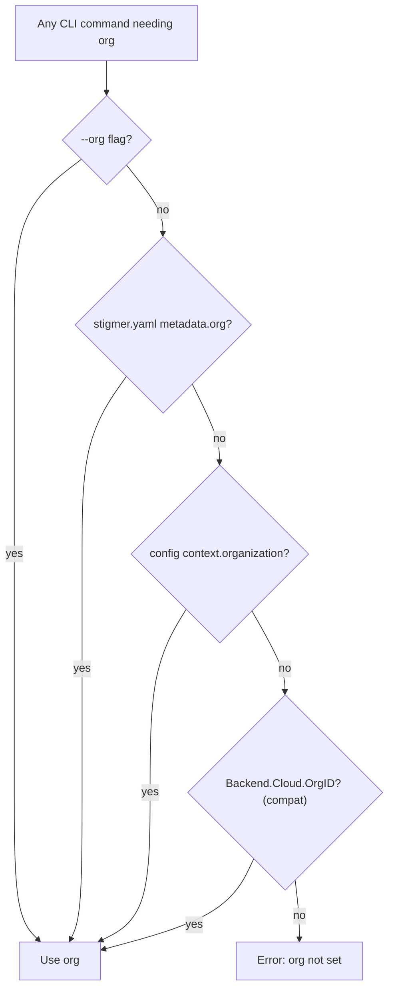
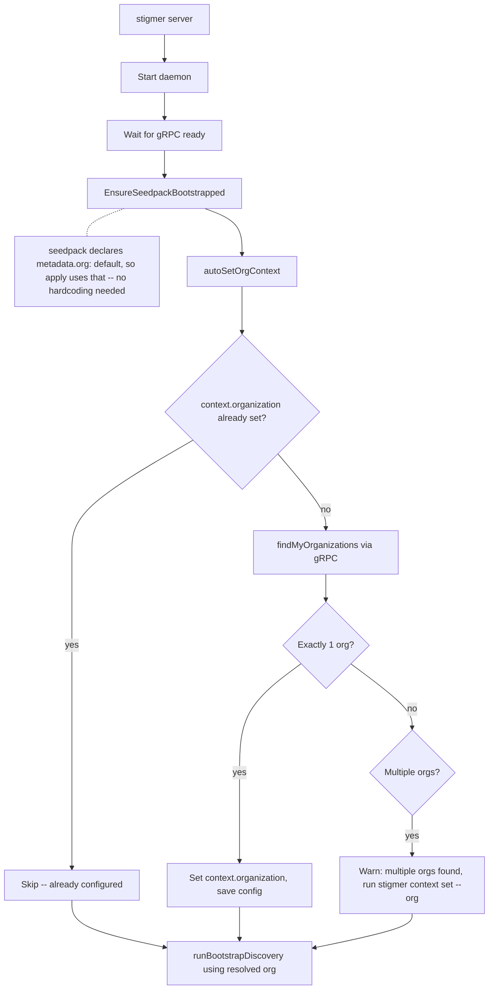

# T01.7: Unified Organization Context and CLI Defaults

## Domain Analysis (Architect's Critique)

### What's wrong today

The CLI has **three separate org-resolution functions** with inconsistent priority chains and backend-type branching:


| Function                   | File                 | Local behavior                            | Cloud behavior                            |
| -------------------------- | -------------------- | ----------------------------------------- | ----------------------------------------- |
| `resolveApplyOrganization` | `apply.go:130`       | flag -> metadata -> **hardcoded "local"** | flag -> metadata -> cloud config -> error |
| `resolveOrganization`      | `verb_helpers.go:63` | **hardcoded "local"** (ignores flag!)     | flag -> cloud config -> error             |
| `resolveOrgID`             | `run_resolve.go:47`  | flag -> **hardcoded "local"**             | flag -> cloud config -> ""                |


Plus a fourth inline usage in `server.go:302` (`runBootstrapDiscovery`).

**Problems:**

1. **Organization is a first-class domain concept**, but its resolution is scattered across 4 locations with 3 different priority chains. This is an anemic, leaky abstraction.
2. **Backend type (local/cloud) conflates connectivity with tenancy.** Backend type determines *where the server runs*. Organization determines *which tenant's resources you work with*. These are orthogonal concerns that should not be branched together.
3. `**ContextConfig` already exists** (`config.go:91`) with an `Organization` field -- but it is completely dead code. It was architecturally correct from the start, just never wired up.
4. **Hardcoded `"local"` creates two code paths** that diverge at every resolution point, which means every new resolution site needs to remember to handle both. This is a maintenance trap.

### The Fix

**Single priority chain, no backend-type branching for org:**

```
--org flag  >  stigmer.yaml metadata.org  >  config context.organization  >  error
```

Same chain for local AND cloud. The `context.organization` field in config becomes the single source of truth for the persistent active org (replacing both the hardcoded `"local"` fallback and the cloud-only `Backend.Cloud.OrgID`).

---

## Architecture

### Org Resolution (unified)




The backward-compat step for `Backend.Cloud.OrgID` ensures existing cloud users aren't broken. Over time that field can be deprecated.

### Server Startup (auto-context)




On first `stigmer server` run: seedpack creates the `default` org, then `autoSetOrgContext` discovers it and persists `context.organization: default` to `~/.stigmer/config.yaml`. All subsequent commands read from config. Zero manual steps for the user.

### Command Surface

**No new verb-first commands needed.** Organization is already registered in the type registry (T01.2). These already work or need minimal wiring:

- `stigmer get organization <slug>` -- existing `get` verb
- `stigmer list organizations` -- existing `list` verb
- `stigmer delete organization <slug>` -- existing `delete` verb

**New Configuration-group command** (parallel to `backend` and `config`):

- `stigmer context show` -- displays current org (and environment, for future)
- `stigmer context set --org <slug>` -- validates org exists via server, then saves to `context.organization`

---

## Files to Change

### 1. Unified org resolution -- new helper in config package

Add `ResolveContextOrganization()` to [config/config.go](client-apps/cli/internal/cli/config/config.go):

```go
func (cfg *Config) ResolveContextOrganization() string {
    if cfg.Context.Organization != "" {
        return cfg.Context.Organization
    }
    if cfg.Backend.Cloud != nil && cfg.Backend.Cloud.OrgID != "" {
        return cfg.Backend.Cloud.OrgID
    }
    return ""
}
```

### 2. Collapse 3 org-resolution functions into 1

**[apply.go](client-apps/cli/cmd/stigmer/root/apply.go)** -- `resolveApplyOrganization()` (line 130):

- Remove backend-type branching and `"local"` fallback
- New chain: flag -> metadata -> `cfg.ResolveContextOrganization()` -> error
- Error message references `stigmer context set --org`

**[verb_helpers.go](client-apps/cli/cmd/stigmer/root/verb_helpers.go)** -- `resolveOrganization()` (line 63):

- Remove entire `switch` on backend type
- New chain: flag -> `cfg.ResolveContextOrganization()` -> error
- This also fixes the existing bug where the `--org` flag is ignored for local backend

**[run_resolve.go](client-apps/cli/cmd/stigmer/root/run_resolve.go)** -- `resolveOrgID()` (line 47):

- Remove backend-type branching
- New chain: flag -> `cfg.ResolveContextOrganization()` -> `""`

### 3. Server startup auto-context

**[server.go](client-apps/cli/cmd/stigmer/root/server.go)** -- `handleServerStart()`:

- After `EnsureSeedpackBootstrapped` (line 221), add `autoSetOrgContext(cfg)` call
- `autoSetOrgContext`: if `cfg.Context.Organization` is empty, query `findMyOrganizations`, auto-set if exactly one org, warn if multiple
- Update `runBootstrapDiscovery` (line 302): replace inline `orgID := "local"` with unified resolution from config

### 4. New `stigmer context` command

**New file: [context.go](client-apps/cli/cmd/stigmer/root/context.go)**

- `NewContextCommand()` -- top-level command with `set` and `show` subcommands
- `stigmer context show` -- loads config, prints `Organization: <slug>`, `Backend: <type>`
- `stigmer context set --org <slug>` -- validates org exists (calls `findMyOrganizations`, matches slug), saves `cfg.Context.Organization`, prints confirmation

**[root.go](client-apps/cli/cmd/stigmer/root.go)** -- register in Configuration group:

```go
rootCmd.AddCommand(withGroup(root.NewContextCommand(), "config"))
```

### 5. Config key support

**[config_values.go](client-apps/cli/cmd/stigmer/root/config_values.go)** -- add `context.organization` to `getConfigValue` and `setConfigValue`:

- `stigmer config get context.organization`
- `stigmer config set context.organization <slug>` (no validation -- power-user escape hatch)

### 6. Update `EnsureRunning` path

**[daemon.go](client-apps/cli/internal/cli/daemon/daemon.go)** -- `EnsureRunning()` (line 503):

- After `EnsureSeedpackBootstrapped`, call `EnsureOrgContext()` (same auto-detect logic as `autoSetOrgContext`)
- This covers the case where `EnsureRunning` is triggered by a non-`server` command (e.g., `stigmer apply`, `stigmer list`) and no org context exists yet
- Idempotent: skips if `context.organization` already set

### 7. Tests

**[apply_org_test.go](client-apps/cli/cmd/stigmer/root/apply_org_test.go):**

- `TestResolveApplyOrganization_LocalModeReturnsLocal` (line 92): change to test with config context set, expect context org returned
- `TestResolveApplyOrganization_NilProjectMetadata` (line 115): change to test with and without config context
- Add test: no flag, no metadata, no context -> error
- Add test: config context.organization is used when no flag/metadata
- Add test: cloud backward compat -- `Backend.Cloud.OrgID` used when `Context.Organization` empty

**New tests for context command:**

- `stigmer context set --org <slug>` saves to config
- `stigmer context show` displays current org
- Auto-detection logic: single org -> auto-set, multiple orgs -> no auto-set

---

## What This Plan Does NOT Do

- Does NOT add new proto RPCs (no `getBySlug` for Organization -- uses `findMyOrganizations` with client-side slug matching)
- Does NOT change the seedpack (seedpack already declares `metadata.org: default` from T01.6)
- Does NOT add `stigmer org` noun-first commands (Organization CRUD uses existing verb-first `get`/`list`/`delete`)
- Does NOT hardcode `"default"` anywhere in CLI code -- the string only exists in seedpack data files

## Risk Assessment


| Risk                                                               | Mitigation                                                                                            |
| ------------------------------------------------------------------ | ----------------------------------------------------------------------------------------------------- |
| Breaking change for local users who rely on implicit `"local"` org | `stigmer server` auto-sets context on startup. Normal flow (`stigmer server` first) is zero-friction. |
| Existing cloud configs with `Backend.Cloud.OrgID`                  | Backward-compat fallback in `ResolveContextOrganization()`. Existing configs keep working.            |
| `EnsureRunning` path doesn't auto-set context                      | Adding `EnsureOrgContext` to `EnsureRunning` covers this edge case.                                   |
| Organization `findMyOrganizations` fails during auto-detect        | Non-fatal. Logs warning, user can manually `stigmer context set --org`.                               |


