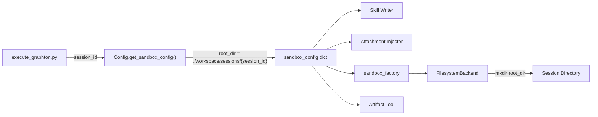

# T01: Local Mode -- Session-Scoped Directories

## What We Know

After thorough codebase exploration, here is the current state:

- **[config.py](backend/services/agent-runner/worker/config.py)** line 495: `get_sandbox_config()` returns a plain dict. In local mode, it returns `{"type": "filesystem", "root_dir": self.sandbox_root_dir}` where `sandbox_root_dir` defaults to `"./workspace"` (from `SANDBOX_ROOT_DIR` env var).
- **[execute_graphton.py](backend/services/agent-runner/worker/activities/execute_graphton.py)** line 648: single call site -- `sandbox_config = worker_config.get_sandbox_config()`. The `session_id` variable is already validated and available from line 519.
- **[filesystem.py](backend/libs/python/graphton/src/graphton/core/backends/filesystem.py)** line 49: `FilesystemBackend.__init__()` already calls `self.root_dir.mkdir(parents=True, exist_ok=True)` -- it creates the directory.
- **[sandbox_factory.py](backend/libs/python/graphton/src/graphton/core/sandbox_factory.py)** line 95: factory reads `config.get("root_dir", ".")` and passes it to `FilesystemBackend`.
- **No existing tests** reference `get_sandbox_config` or `sandbox_root_dir` -- zero breakage risk.
- All downstream consumers (skill writer, attachment injector, artifact tool, backend factory) read `sandbox_config.get('root_dir')` -- they will **automatically** pick up the session-scoped path with no changes.

## Scope -- Exactly Two Files

### 1. `config.py` -- Add `session_id` parameter to `get_sandbox_config()`

Add an optional `session_id: str | None = None` parameter. When provided in local mode, construct:

```
{SANDBOX_ROOT_DIR}/sessions/{session_id}/
```

When `session_id` is `None` (backward compatible), behavior is unchanged.

**Current code** (lines 495-521):

```python
def get_sandbox_config(self) -> dict:
    if self.mode == "local":
        return {
            "type": "filesystem",
            "root_dir": self.sandbox_root_dir,
        }
    ...
```

**Proposed code:**

```python
def get_sandbox_config(self, session_id: str | None = None) -> dict:
    if self.mode == "local":
        root_dir = self.sandbox_root_dir
        if session_id:
            root_dir = str(Path(self.sandbox_root_dir) / "sessions" / session_id)
        return {
            "type": "filesystem",
            "root_dir": root_dir,
        }
    ...
```

This requires adding `from pathlib import Path` at the top of config.py (currently uses only `os`).

**Session ID validation**: Add a lightweight guard against path traversal. Session IDs are platform-generated UUIDs, but defense in depth is appropriate for a foundational component:

```python
if session_id and ("/" in session_id or "\\" in session_id or ".." in session_id):
    raise ValueError(
        f"Invalid session_id '{session_id}': must not contain path separators or '..'"
    )
```

### 2. `execute_graphton.py` -- Pass `session_id` at the call site

**Current code** (line 648):

```python
sandbox_config = worker_config.get_sandbox_config()
```

**Proposed code:**

```python
sandbox_config = worker_config.get_sandbox_config(session_id=session_id)
```

The variable `session_id` is already validated and available from line 519. No new imports or variables needed.

The existing log at line 679-681 already prints the root_dir:

```python
activity_logger.info(
    f"Local mode - using filesystem backend at {sandbox_config.get('root_dir')}"
)
```

This will naturally show the session-scoped path (e.g., `./workspace/sessions/abc-123`) without any change.

## What We Are NOT Doing (and why)

- **NOT creating the directory in `get_sandbox_config()**`: The original T01 plan says "Create the directory if it doesn't exist." However, `FilesystemBackend.__init__()` already handles this with `mkdir(parents=True, exist_ok=True)`, and all intermediate operations (skill writer, attachment injector) also create their own subdirectories. Adding directory creation in a configuration method would be mixing concerns -- configuration should not have filesystem side effects. The existing code already handles this correctly.
- **NOT modifying `FilesystemBackend**`: It already works correctly with any root_dir path. The chroot-like path resolution, directory creation, and traversal protection are all root_dir-agnostic.
- **NOT modifying `sandbox_factory.py**`: It reads `config.get("root_dir", ".")` and passes it through. No changes needed.
- **NOT modifying cloud mode**: The `session_id` parameter is only used for local mode path construction. Cloud mode returns Daytona config unchanged.

## Data Flow After Change




## Total Change Size

- **config.py**: ~10 lines (1 import, parameter addition, path construction, validation)
- **execute_graphton.py**: 1 line (pass `session_id` kwarg)
- **Docstring updates**: ~5 lines (update `get_sandbox_config` docstring to document `session_id`)

Estimated: ~16 lines changed across 2 files.