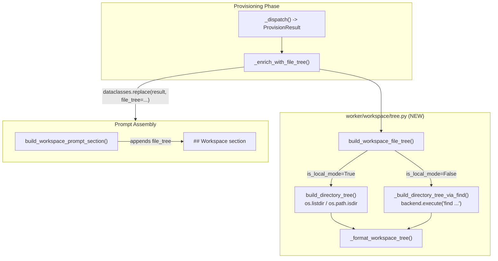

# T01: Workspace Tree Snapshot at Startup

## Domain Analysis (per Architect Role)

**The Critique:** The current design treats workspace awareness as a reactive discovery problem — the agent is told "Start by listing the root directory" and must burn tool calls + tokens exploring. This is anemic context delivery: the platform *knows* the workspace structure after provisioning but withholds it from the agent. The tree is a property of the provisioned workspace, yet `ProvisionResult` carries no structural data.

**The Fix:** Enrich `ProvisionResult` with a `file_tree` field. Generate the tree as a provisioning post-step (not in individual source handlers), and inject it into the `## Workspace` prompt section. Two tree-walking strategies — local `os.`* calls and remote `backend.execute("find ...")` — behind one interface.

---

## Architecture




---

## Key Deviation from T01 Plan

The original plan says to modify `git.py` and `local_path.py` to generate trees in each source handler. **I recommend against this** for three reasons:

1. **Import direction:** Source handlers live in `worker/workspace/sources/`. Importing tree-building utilities from `worker/activities/execute_graphton.py` creates a backwards dependency (sources -> activities).
2. **Duplication:** Two source handlers generating trees independently means duplicated invocation logic and two places to maintain limits/formatting.
3. **Separation of concerns:** Tree generation is a cross-cutting enrichment, not source-specific logic. The provisioner orchestrator is the natural home.

**Proposed approach:** The provisioner calls `build_workspace_file_tree()` *after* `_dispatch()` returns, enriching the result with `dataclasses.replace()`. Source handlers remain unchanged.

---

## File Changes

### 1. NEW: `backend/services/agent-runner/worker/workspace/tree.py`

Extract from `execute_graphton.py` and extend:

- **Extracted (unchanged logic):** `TREE_SKIP_DIRS`, `TREE_DEFAULT_MAX_DEPTH`, `TREE_DEFAULT_MAX_ENTRIES`, `human_size()`, `build_directory_tree()` (the existing local `os.`* walker)
- **New — remote walker:** `_build_directory_tree_via_find(backend, *, skip_dirs, max_depth, max_entries)` — uses `backend.execute()` with GNU `find -printf` to walk the tree inside a Daytona sandbox. Parses tab-delimited output (`D\t<path>` for dirs, `F\t<size>\t<path>` for files), sorts into DFS dirs-first order to match local walker output, and returns the same `(list[str], int)` shape.
- **New — public API:** `build_workspace_file_tree(root_dir, backend, *, is_local_mode, max_depth=4, max_entries=500) -> str | None` — picks the right walker, calls it, and formats the result into a prompt-ready string with a `### Project Structure` header and truncation notice.

### 2. MODIFY: `[backend/services/agent-runner/worker/workspace/provisioner.py](backend/services/agent-runner/worker/workspace/provisioner.py)`

- Add `file_tree: str | None = None` to `ProvisionResult` (between `workspace_description` and `git_metadata`). Default `None` preserves backward compatibility.
- Add `_enrich_with_file_tree(result, backend, is_local_mode)` method to `WorkspaceProvisioner` — calls `build_workspace_file_tree()` and returns an enriched `ProvisionResult` via `dataclasses.replace()`.
- Call it in `provision()` after `_dispatch()` and before the `consumed_keys` merge.
- **Also refactor** the existing `consumed_keys` rebuild (lines 188-194) to use `dataclasses.replace(result, consumed_keys=all_consumed)` instead of explicit field-by-field reconstruction. This prevents the class of bugs where adding a new field to `ProvisionResult` silently drops it during reconstruction.

### 3. MODIFY: `[backend/services/agent-runner/worker/activities/execute_graphton.py](backend/services/agent-runner/worker/activities/execute_graphton.py)`

- **Import migration:** Replace the local definitions of `_TREE_SKIP_DIRS`, `_TREE_MAX_DEPTH`, `_TREE_MAX_ENTRIES`, `_human_size()`, `_build_directory_tree()` with imports from `worker.workspace.tree`. Keep backward-compatible aliases at module level so existing in-module references (e.g., `build_referenced_files_prompt_section`) continue working without changes.
- **Update `build_workspace_prompt_section()`:** When `provision_result.file_tree` is not `None`, append it after the `workspace_description` text. The tree string is already fully formatted (includes header, entries, truncation notice, and guidance).

### 4. NOT modified: `git.py`, `local_path.py`, `empty.py`

Source handlers remain untouched. Tree generation is handled by the provisioner.

---

## Tree Format (Output Example)

For a typical project, the `## Workspace` section would look like:

```
## Workspace

Your workspace has been initialized from: https://github.com/acme/my-app (branch: main, commit: a1b2c3d)
Use your file system tools (ls, read, glob, grep) to explore the codebase.
Start by listing the root directory to understand the project structure.

Changes you make will be captured as artifacts when execution completes.

### Project Structure

    - `docs/`
    - `docs/guide.md` (1.3 KB)
    - `src/`
    - `src/components/`
    - `src/components/Button.tsx` (2.1 KB)
    - `src/main.py` (450 bytes)
    - `README.md` (500 bytes)

7 entries. Use `read` to view file contents, `grep` to search, and `glob` to find specific files.
```

When truncated (large repos):

```
### Project Structure

    - `api/`
    - `api/handlers/`
    ... (500 entries shown)

Showing 500 of 12,847 entries. Use `glob` and `grep` to discover additional files.
```

**Note:** The existing "Start by listing the root directory" instruction in the git description becomes redundant when a tree is present, but I deliberately do NOT modify it via fragile string replacement. The tree section below it naturally supersedes the instruction. The token cost (~~15 tokens) is negligible vs. the tree itself (~~2K-5K tokens). This avoids coupling the prompt builder to the exact wording of source handler descriptions.

---

## Remote Walker Design (Daytona)

The `find` command for Daytona sandboxes (Linux):

```bash
find . -maxdepth 4 \
  \( -name '.*' -o -name 'node_modules' -o -name '__pycache__' ... \) -prune \
  -o -type d -printf 'D\t%P\n' \
  -o -type f -printf 'F\t%s\t%P\n'
```

Parsing: tab-delimited lines. `D\t<path>` for directories, `F\t<size>\t<path>` for files. Entries are then sorted into DFS dirs-first order (matching the local walker's output) and capped at `max_entries`.

**Robustness:** If `find` fails or returns unexpected output, the function returns `None` (no tree) and logs a warning. Tree generation is best-effort — failure must never block provisioning.

---

## Test Plan

### NEW: `backend/services/agent-runner/tests/workspace/test_tree.py`

- **Local walker tests:** Reuse existing `TestDirectoryTreeExpansion` patterns from `test_workspace_prompt_section.py` — `tmp_path` fixtures, hidden file skipping, skip-dir filtering, depth limits, entry cap, truncation count.
- **Remote walker tests:** Mock `backend.execute()` to return pre-crafted `find -printf` output. Verify parsing, sorting, formatting, and truncation.
- `**build_workspace_file_tree()` integration:** Verify local vs remote dispatch, formatting with header/truncation, `None` return on inaccessible root.
- **Edge cases:** Empty workspace, single-file workspace, workspace at exact entry limit, workspace exceeding entry limit, `find` failure (non-zero exit), malformed `find` output.

### UPDATED: `backend/services/agent-runner/tests/test_workspace_prompt_section.py`

- Add tests for tree injection in `build_workspace_prompt_section()`: tree present, tree absent (`None`), tree ordering relative to description.
- Update `TestPromptAssemblyOrdering` to verify tree appears within `## Workspace` and before `## Available Skills`.

### UPDATED: `backend/services/agent-runner/tests/workspace/test_provisioner.py`

- Add tests for `_enrich_with_file_tree()`: local mode generates tree, Daytona mode generates tree via backend, empty workspace skips tree.
- Verify `file_tree` field survives the `consumed_keys` rebuild path.

---

## Risks and Mitigations

- **Large repos (100K+ files):** Capped at 500 entries + depth 4. Truncation notice signals incompleteness. Agent falls back to `glob`/`grep` for deeper discovery.
- `**find -printf` portability:** GNU extension, but Daytona sandboxes are Linux (Debian/Ubuntu) where it's standard. Not used for local mode (macOS).
- **Token budget:** 500 entries at ~~30 chars each = ~15K chars = ~4K tokens. This is well within budget given the 2-5 tool calls (~~10-20K tokens) it replaces.
- **Stale tree:** Tree reflects state at provisioning time. If the agent creates/deletes files, the tree is stale. This is acceptable — the tree is for initial orientation, not a live index (T03 addresses caching).

