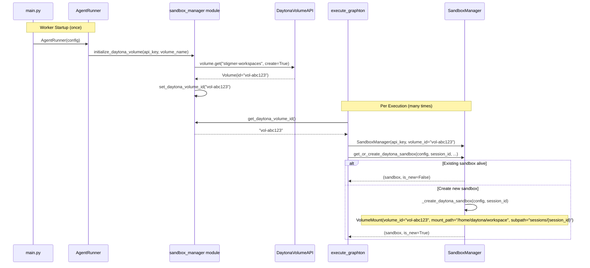

# T02: Daytona Volume Auto-Create at Worker Startup + Mount on Sandbox Creation

## Architecture

Volume and sandbox have fundamentally different lifecycles:

- **Volume**: Worker-level infrastructure. Created once at startup. Shared across all executions. Persists indefinitely.
- **Sandbox**: Per-session compute. Created/reused per execution. Ephemeral (may die anytime).

This implementation respects that separation. Volume initialization happens once in the worker startup path (alongside Redis), not per-activity. Activities receive the volume_id via a module-level store -- the same pattern used for the API key via [token_manager.py](backend/services/agent-runner/worker/token_manager.py).




## Files Modified (3 files)

### 1. [sandbox_manager.py](backend/services/agent-runner/worker/sandbox_manager.py)

This file gets three categories of changes:

**A. Module-level volume_id store + initialization function (top of file, after imports)**

Following the [token_manager.py](backend/services/agent-runner/worker/token_manager.py) pattern:

```python
# Worker-level Daytona volume state (initialized once at runner startup, read by activities)
_daytona_volume_id: str | None = None


def get_daytona_volume_id() -> str | None:
    """Get the Daytona volume ID initialized at worker startup."""
    return _daytona_volume_id


def set_daytona_volume_id(volume_id: str) -> None:
    """Set the Daytona volume ID (called once at worker startup)."""
    global _daytona_volume_id
    _daytona_volume_id = volume_id


def initialize_daytona_volume(api_key: str, volume_name: str = "stigmer-workspaces") -> str:
    """Initialize the global Daytona persistent volume.

    Called once at worker startup. Creates the volume if it does not exist
    (idempotent via Daytona's ``volume.get(name, create=True)``), then stores
    the volume ID in the module-level store for activities to read.

    Args:
        api_key: Daytona API key.
        volume_name: Volume name (configurable via DAYTONA_VOLUME_NAME env var).

    Returns:
        The volume ID string.

    Raises:
        RuntimeError: If the Daytona SDK is unavailable.
        Exception: If the volume cannot be created/retrieved (propagated from SDK).
    """
    if not DAYTONA_AVAILABLE:
        raise RuntimeError(
            "Daytona SDK not available. Install with: pip install daytona"
        )

    daytona = Daytona(DaytonaConfig(api_key=api_key))
    volume = daytona.volume.get(volume_name, create=True)
    set_daytona_volume_id(volume.id)

    logger.info(
        "Daytona volume initialized: name='%s', id='%s'",
        volume_name,
        volume.id,
    )
    return volume.id
```

Key points:

- `initialize_daytona_volume()` creates a short-lived Daytona client purely for the `volume.get()` call. This client is GC'd after startup. Activities create their own Daytona clients for sandbox operations -- the two concerns are independent.
- If `volume.get()` fails, the exception propagates and the worker fails to start. This is intentional -- workspace persistence is the core promise. Silent degradation would be a correctness bug.
- The function is a module-level public API, not a SandboxManager method, because volume initialization is a worker-level concern that happens before any SandboxManager instance exists.

**B. Add `VolumeMount` to imports (line 20)**

```python
try:
    from daytona import Daytona, DaytonaConfig, VolumeMount
    from daytona.common.daytona import CreateSandboxFromSnapshotParams
    DAYTONA_AVAILABLE = True
except ImportError:
    DAYTONA_AVAILABLE = False
```

Note: The [official Daytona docs](https://www.daytona.io/docs/en/volumes/) import `VolumeMount` from `daytona` top-level. If the installed SDK uses a different path, we will discover this immediately at import time.

**C. SandboxManager changes (constructor + create method)**

Constructor -- add `volume_id` parameter:

```python
def __init__(
    self,
    ...
    daytona_api_key: str | None = None,
    volume_id: str | None = None,
):
    ...
    self._volume_id = volume_id
```

`_create_daytona_sandbox` -- add `session_id` parameter, build volume mounts:

```python
def _create_daytona_sandbox(self, config: dict, session_id: str | None = None) -> Any:
```

Inside the method, before sandbox creation:

```python
# Build volume mounts for workspace persistence
volume_mounts = []
if self._volume_id and session_id:
    volume_mounts.append(
        VolumeMount(
            volume_id=self._volume_id,
            mount_path="/home/daytona/workspace",
            subpath=f"sessions/{session_id}",
        )
    )
    logger.info(
        "Volume mount: volume=%s, path=/home/daytona/workspace, subpath=sessions/%s",
        self._volume_id,
        session_id,
    )
elif not session_id:
    logger.info("No session_id -- sandbox without volume mount (ephemeral)")
```

Pass volumes to both snapshot and non-snapshot creation paths:

```python
if snapshot_id:
    params = CreateSandboxFromSnapshotParams(
        snapshot=snapshot_id,
        volumes=volume_mounts if volume_mounts else None,
    )
    sandbox = self._daytona.create(params=params)
else:
    if volume_mounts:
        params = CreateSandboxFromSnapshotParams(volumes=volume_mounts)
        sandbox = self._daytona.create(params=params)
    else:
        sandbox = self._daytona.create()
```

Internal call site in `get_or_create_daytona_sandbox` (line 486) passes `session_id` through:

```python
sandbox = self._create_daytona_sandbox(sandbox_config, session_id=session_id)
```

### 2. [worker.py](backend/services/agent-runner/worker/worker.py)

Add volume initialization in `AgentRunner.__init__`, in the cloud-mode block alongside Redis init (line 30-33):

```python
# Initialize cloud-mode infrastructure
if not config.is_local_mode():
    self._initialize_redis()
    self._initialize_daytona_volume()
else:
    self.logger.info(
        "Local mode: Skipping Redis and Daytona volume initialization"
    )
```

New private method:

```python
def _initialize_daytona_volume(self):
    """Initialize Daytona persistent volume for workspace persistence.

    Creates or retrieves the global workspace volume via the Daytona API.
    The volume ID is stored in a module-level store accessible to activities.

    Mirrors the pattern of _initialize_redis -- cloud-mode infrastructure
    initialized once at worker startup, used by all activities.
    """
    import os

    from worker.sandbox_manager import initialize_daytona_volume

    api_key = os.environ.get("DAYTONA_API_KEY", "")
    if not api_key:
        raise ValueError(
            "DAYTONA_API_KEY required for cloud mode Daytona volume initialization"
        )

    volume_name = os.environ.get("DAYTONA_VOLUME_NAME", "stigmer-workspaces")

    try:
        volume_id = initialize_daytona_volume(api_key, volume_name)
        self.logger.info(
            "Daytona persistent volume ready: name='%s', id='%s'",
            volume_name,
            volume_id,
        )
    except Exception as e:
        self.logger.error("Failed to initialize Daytona volume: %s", e)
        raise
```

### 3. [execute_graphton.py](backend/services/agent-runner/worker/activities/execute_graphton.py)

Two small changes:

Import (line 52) -- add `get_daytona_volume_id`:

```python
from worker.sandbox_manager import SandboxManager, get_daytona_volume_id
```

Constructor call site (line 664) -- pass volume_id:

```python
sandbox_manager = SandboxManager(
    daytona_api_key=api_key,
    volume_id=get_daytona_volume_id(),
)
```

## Behavioral Rules

- **Local mode**: Completely unaffected. Volume initialization is skipped (cloud-mode only guard in worker.py). SandboxManager is never created in local mode (line 658 guard in execute_graphton.py).
- **session_id is None**: No volume mount. Ephemeral sandbox, consistent with existing behavior.
- **Volume init failure**: Worker fails to start. This is correct -- workspace persistence is non-negotiable for cloud mode.
- **Reused sandbox (is_new=False)**: No volume action needed. Volume was mounted when the sandbox was originally created.
- **cleanup_sandbox.py**: No changes. It only needs the Daytona client for `sandbox.delete()`, not volumes.

## What This Does NOT Touch

- `config.py` -- no changes (volume name comes from env var, read at worker startup)
- Session proto -- no changes (DD01: volume is infrastructure, not per-session state)
- `cleanup_sandbox.py` -- no changes
- Local mode / filesystem backend -- no changes
- Graphton library -- no changes

## Risk Callout

One SDK uncertainty: The `CreateSandboxFromSnapshotParams` constructor keyword `volumes` is confirmed in [official Daytona docs](https://www.daytona.io/docs/en/volumes/), but the existing code imports this class from `daytona.common.daytona` (potentially an internal path). If the `volumes` kwarg is not accepted on this import path, we will see a clear `TypeError` at sandbox creation time. Resolution: switch the import to match the docs (`from daytona import CreateSandboxFromSnapshotParams`).