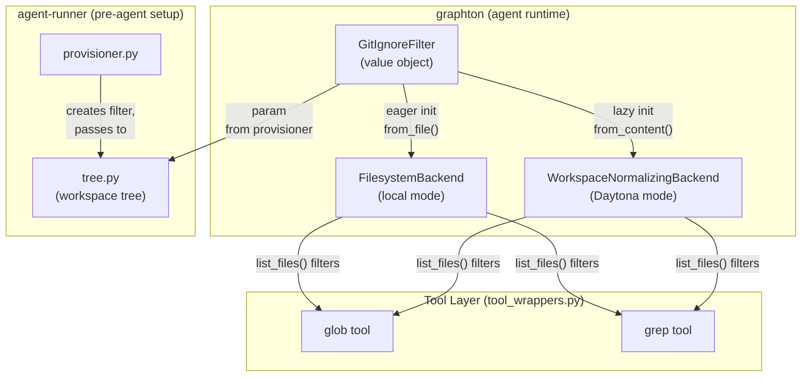

# T02: .gitignore-Aware File Filtering

## Domain Analysis (per Architect Role)

**The Critique:** The original T02 plan embeds `.gitignore` awareness directly into `FilesystemBackend.__init__`, coupling a filesystem-generic backend to git-specific concerns. It also only targets the local backend, leaving Daytona without filtering. And it does not address the tree module, creating a divergence between what the system prompt shows and what the tools can reach.

**The Fix:** Extract `.gitignore` parsing into a `GitIgnoreFilter` value object — immutable after construction, independently testable, composable into any consumer. Three consumers initialize it differently based on their lifecycle constraints:

- `**FilesystemBackend`** (local mode): eager init at construction time (`.gitignore` is on disk; provisioning already happened per the lifecycle in `[sandbox_factory.py](backend/libs/python/graphton/src/graphton/core/sandbox_factory.py)` which runs after provisioning)
- `**WorkspaceNormalizingBackend`** (Daytona): lazy init on first `list_files()` call (reads `.gitignore` via inner backend RPC; avoids constructor I/O)
- `**tree.py`** (agent-runner): receives filter as an optional parameter from the provisioner

**Confirmation:** This plan covers local, Daytona, and tree — all three surfaces the user requested.

---

## Architecture




**Key insight:** `glob` and `grep` tool wrappers call `backend.list_files()` recursively for traversal. Filtering in `list_files()` means both tools benefit automatically with **zero changes to `tool_wrappers.py`**.

---

## 1. New Module: `GitIgnoreFilter`

**File:** `[backend/libs/python/graphton/src/graphton/core/backends/gitignore_filter.py](backend/libs/python/graphton/src/graphton/core/backends/gitignore_filter.py)` (new)

```python
class GitIgnoreFilter:
    __slots__ = ("_spec",)
    
    def __init__(self, spec: pathspec.PathSpec) -> None:
        self._spec = spec  # immutable after construction
    
    @classmethod
    def from_file(cls, gitignore_path: Path) -> GitIgnoreFilter | None:
        """Parse a .gitignore file. Returns None if file doesn't exist or is empty."""
    
    @classmethod
    def from_content(cls, content: str) -> GitIgnoreFilter | None:
        """Parse raw .gitignore text. Returns None if no patterns found."""
    
    def is_ignored(self, rel_path: str, *, is_dir: bool | None = None) -> bool:
        """Check if a workspace-relative path is ignored.
        
        - is_dir=True  -> checks both path and path/ (catches dir-only patterns like venv/)
        - is_dir=False -> checks path only
        - is_dir=None  -> checks both (conservative; use when type is unknown e.g. Daytona)
        """
```

Uses `pathspec.patterns.gitwildmatch.GitWildMatchPattern` for correct `.gitignore` semantics. The `pathspec` library is the de facto standard (used by Black, isort, pre-commit).

**v1 scope:** Root-level `.gitignore` only. The interface (`is_ignored(rel_path)`) is forward-compatible with nested `.gitignore` support later — the implementation can be swapped without changing callers.

---

## 2. `FilesystemBackend` Integration (local mode)

**File:** `[backend/libs/python/graphton/src/graphton/core/backends/filesystem.py](backend/libs/python/graphton/src/graphton/core/backends/filesystem.py)`

### 2a. Extract a `_should_include()` helper

Consolidate the scattered `name.startswith(".") or name in _SKIP_DIR_NAMES` checks into a single method that also applies the gitignore filter. This creates one source of truth for "should this entry appear in agent-visible listings."

```python
def _should_include(self, parent_dir: Path, name: str, *, is_dir: bool) -> bool:
    if name.startswith(".") or name in self._SKIP_DIR_NAMES:
        return False
    if self._gitignore is not None:
        try:
            rel_path = str(parent_dir.relative_to(self.root_dir) / name)
        except ValueError:
            return True  # outside workspace root (e.g. platform mount) — skip filtering
        if self._gitignore.is_ignored(rel_path, is_dir=is_dir):
            return False
    return True
```

### 2b. Apply in three locations

- `**list_files()**` — replace inline filter with `_should_include()`. Requires adding `item.is_dir()` call per entry (negligible cost — one `stat()` per already-filtered entry on a local SSD).
- `**_format_directory_listing()**` — replace inline filter with `_should_include()` (both the outer loop and the inner item-count calculation). No extra cost; `child.is_dir()` is already called in the loop body.
- `**__init__()**` — add `self._gitignore = GitIgnoreFilter.from_file(self.root_dir / ".gitignore")`

### 2c. Filtering order (performance)

```
name.startswith(".")  →  name in _SKIP_DIR_NAMES  →  gitignore match
     (O(1))                   (O(1) frozenset)         (O(p) pathspec)
```

Cheap checks first. Gitignore only runs on entries that pass both static filters.

### 2d. Platform mount safety

`_should_include()` uses `try: parent_dir.relative_to(self.root_dir)` — if the path is under `_platform_root` instead of `root_dir`, the `ValueError` catch skips gitignore filtering. Platform files (`.stigmer/`) are Stigmer's internal files and should never be gitignore-filtered.

---

## 3. `WorkspaceNormalizingBackend` Integration (Daytona)

**File:** `[backend/libs/python/graphton/src/graphton/core/backends/daytona.py](backend/libs/python/graphton/src/graphton/core/backends/daytona.py)`

### 3a. Lazy initialization

```python
_UNSET = object()

class WorkspaceNormalizingBackend:
    def __init__(self, inner, workspace_root, sandbox_root=None):
        ...
        self._gitignore: GitIgnoreFilter | None | object = _UNSET
    
    def _get_gitignore(self) -> GitIgnoreFilter | None:
        if self._gitignore is _UNSET:
            try:
                content = self._inner.read(self._normalize(".gitignore"))
                self._gitignore = GitIgnoreFilter.from_content(content)
            except Exception:
                self._gitignore = None
        return self._gitignore
```

Lazy because the Daytona sandbox may not have a provisioned workspace at construction time (the `create_daytona_backend()` factory runs before `provisioner.provision()`). By first `list_files()` call, provisioning is complete.

### 3b. Filter in `list_files()`

```python
def list_files(self, path: str = ".") -> list[str]:
    entries = self._inner.list_files(self._normalize(path))
    gitignore = self._get_gitignore()
    if gitignore is None:
        return entries
    ws_rel = self._workspace_relative(path)
    return [
        name for name in entries
        if not gitignore.is_ignored(
            f"{ws_rel}/{name}" if ws_rel not in (".", "") else name,
            is_dir=None,  # type unknown for remote entries
        )
    ]
```

`**is_dir=None**` is the key Daytona tradeoff: we don't know entry types without an RPC call per entry, so we check both file and directory patterns. This over-filters only for the rare case of a **file** whose name matches a **directory-only** pattern (e.g., a file literally named `venv` when `.gitignore` has `venv/`). In practice, this never happens.

### 3c. Helper: `_workspace_relative()`

Extract a method to compute the workspace-relative path (before normalization/rebasing) for gitignore matching:

```python
def _workspace_relative(self, path: str) -> str:
    prefix = self._workspace_root + "/"
    if path.startswith(prefix):
        return path[len(prefix):]
    if path == self._workspace_root:
        return "."
    return path.lstrip("/") or "."
```

### 3d. Pre-existing gap: no `_SKIP_DIR_NAMES` in Daytona

Discovery during research: the Daytona path has **no skip-dir filtering at all** — the inner `DaytonaBackend` from `deepagents_cli` doesn't filter `node_modules`, `__pycache__`, etc. The `.gitignore` filter we're adding will cover most of these for git repos. For workspaces without `.gitignore`, this remains a gap. I recommend a follow-up task to add hardcoded skip-dir filtering to `WorkspaceNormalizingBackend`.

---

## 4. Tree Module Integration

**File:** `[backend/services/agent-runner/worker/workspace/tree.py](backend/services/agent-runner/worker/workspace/tree.py)`

### 4a. Accept optional filter parameter

Add `gitignore_filter: GitIgnoreFilter | None = None` to `build_directory_tree()` and `build_workspace_file_tree()`. When provided, entries matching the filter are excluded from the tree.

In the local walker's `_walk()` inner function (line 96), after the existing `name.startswith(".") or name in skip_dirs` check:

```python
if gitignore_filter is not None:
    rel = f"{rel_prefix}{name}" if rel_prefix else name
    if gitignore_filter.is_ignored(rel, is_dir=os.path.isdir(full)):
        continue
```

For the remote walker (`_build_directory_tree_via_find`), the `.gitignore` filtering can be applied during `_parse_find_output()` — the find command already reports file types (`D` vs `F`), so `is_dir` is known.

### 4b. Provisioner creates and passes the filter

**File:** `[backend/services/agent-runner/worker/workspace/provisioner.py](backend/services/agent-runner/worker/workspace/provisioner.py)`

In `_enrich_with_file_tree()`, before calling `build_workspace_file_tree()`:

```python
from graphton.core.backends.gitignore_filter import GitIgnoreFilter

if is_local_mode:
    gitignore = GitIgnoreFilter.from_file(Path(result.root_dir) / ".gitignore")
else:
    try:
        content = backend.read_file(".gitignore")
        raw = content.decode("utf-8") if isinstance(content, bytes) else content
        gitignore = GitIgnoreFilter.from_content(raw)
    except (FileNotFoundError, Exception):
        gitignore = None

file_tree = build_workspace_file_tree(
    result.root_dir, backend,
    is_local_mode=is_local_mode,
    gitignore_filter=gitignore,
)
```

This ensures the system prompt tree and the tool layer see the **same** filtered view.

---

## 5. Dependency

**File:** `[backend/libs/python/graphton/pyproject.toml](backend/libs/python/graphton/pyproject.toml)`

Add `pathspec` to runtime dependencies:

```toml
"pathspec>=0.12.0,<1.0.0",
```

`pathspec` is a lightweight, well-maintained library (used by Black, pre-commit, isort). `>=0.12.0` ensures `gitwildmatch` pattern class is available.

---

## 6. Tests

- `**test_gitignore_filter.py**` (new, in graphton tests): Unit tests for `GitIgnoreFilter` — basic patterns (`*.pyc`, `venv/`, `dist`), negation (`!important.log`), path-prefix patterns (`src/*.pyc`), `from_file` with missing/empty file, `from_content` with various inputs, `is_ignored` with `is_dir=True/False/None`
- `**test_filesystem_backend.py**` (extend): `list_files()` and `_format_directory_listing()` with gitignore active — verify gitignored entries are excluded, verify `_SKIP_DIR_NAMES` still work, verify no-gitignore fallback, verify platform mount paths bypass gitignore
- `**test_daytona.py**` (extend or new): `WorkspaceNormalizingBackend.list_files()` with lazy gitignore loading, mock inner backend, verify filtering, verify graceful degradation on read failure
- `**test_tree.py**` (extend): `build_directory_tree()` with `gitignore_filter` parameter — verify entries excluded, verify backwards compatibility when `None`

---

## Interaction with `_SKIP_DIR_NAMES`

The gitignore filter **composes** with existing filters — it does not replace them. An entry must pass ALL three gates to appear:

1. Not hidden (no `.` prefix)
2. Not in `_SKIP_DIR_NAMES`
3. Not matched by `.gitignore`

This is deliberate: `_SKIP_DIR_NAMES` remains a safety net for workspaces without `.gitignore` (empty scratch dirs, projects where `.gitignore` doesn't exist). The checkpoint notes confirm this was already the intended design: "T04 is a safety net; T02 (.gitignore) will be the main solution."

---

## Scope Boundaries

- **v1**: Root-level `.gitignore` only. Nested `.gitignore` files deferred.
- **v1**: No `.git/info/exclude` or global gitignore (`core.excludesFile`). Only workspace-root `.gitignore`.
- **Deferred**: Hardcoded `_SKIP_DIR_NAMES` for Daytona's `WorkspaceNormalizingBackend` (pre-existing gap, not introduced by T02).
- **No changes to `tool_wrappers.py`**: The tools benefit automatically because they traverse via `backend.list_files()`.

