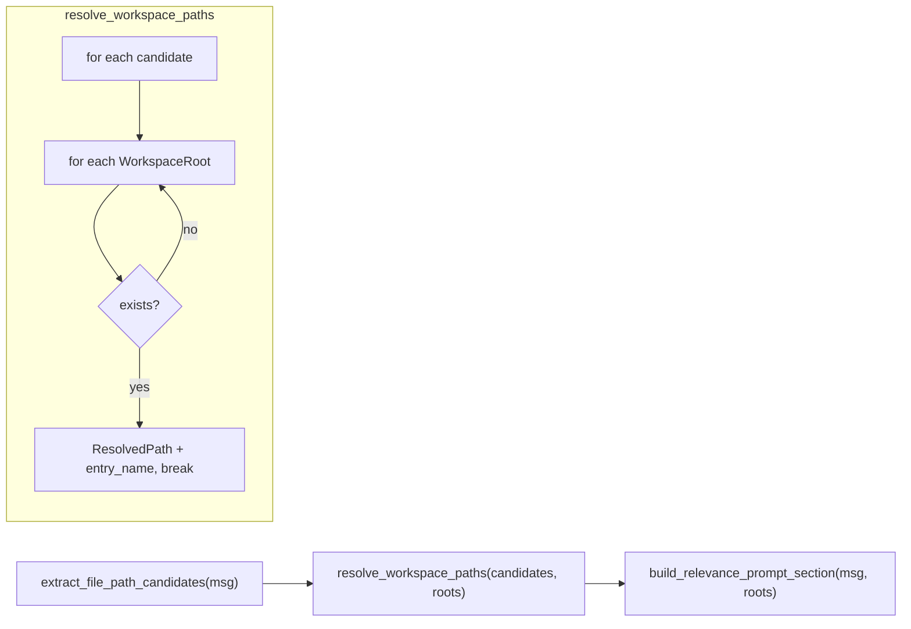

# T02: Fix Relevance Signaling for Multi-Workspace

## Problem

`[relevance.py](backend/services/agent-runner/worker/activities/relevance.py)` resolves path candidates from the user message against a **single** workspace root. The call site in `[execute_graphton.py](backend/services/agent-runner/worker/activities/execute_graphton.py)` (line 1875) passes only `provision_results[0].root_dir`. Paths that exist in other workspace entries are silently ignored — the agent never learns about them.

```1875:1878:backend/services/agent-runner/worker/activities/execute_graphton.py
        primary_root = provision_results[0].root_dir if provision_results else ""
        relevance_section = build_relevance_prompt_section(
            user_message, primary_root,
        )
```

## Design

### Core principle: first-match-wins across ordered entry roots

The three-function pipeline stays intact. The only structural change is widening the "workspace root" parameter from a single `str` to a sequence of labeled roots. Per candidate, we iterate roots in provision order; the first existing match wins and is stamped with the entry name.




### New value object: `WorkspaceRoot`

Introduced in `relevance.py` (not imported from provisioner — keeps the module dependency-free):

```python
@dataclass(frozen=True)
class WorkspaceRoot:
    name: str       # entry_name from ProvisionResult; "" for single-workspace
    root_dir: str   # absolute path
```

This follows the same frozen-dataclass pattern as the existing `ResolvedPath` in the same module.

### Updated `ResolvedPath`

Add one new field with a backward-compatible default:

```python
@dataclass(frozen=True)
class ResolvedPath:
    path: str
    is_directory: bool
    size_bytes: int | None = None
    entry_name: str = ""    # <-- NEW: which workspace entry this was found in
```

### Updated signatures

- `resolve_workspace_paths(candidates, workspace_roots: Sequence[WorkspaceRoot]) -> list[ResolvedPath]`
- `build_relevance_prompt_section(user_message, workspace_roots: Sequence[WorkspaceRoot], *, max_results=_MAX_RESULTS) -> str`

### Prompt formatting change

`_format_resolved_path` appends an entry annotation when `entry_name` is non-empty:

- Single workspace (no name): `- \`src/auth/login.go (320 bytes)` -- unchanged
- Multi-workspace: `- \`src/auth/login.go (320 bytes) -- in **svc-api**`

### Module docstring update

The architecture comment at the top of `relevance.py` describes the function signatures. These must be updated to reflect the new types.

## Files Changed

### 1. `[relevance.py](backend/services/agent-runner/worker/activities/relevance.py)`

- Add `from collections.abc import Sequence`
- Add `WorkspaceRoot` frozen dataclass (after `ResolvedPath`)
- Add `entry_name: str = ""` to `ResolvedPath`
- Change `resolve_workspace_paths` to accept `Sequence[WorkspaceRoot]`, iterate roots per candidate, first match wins, stamp `entry_name`
- Change `build_relevance_prompt_section` to accept `Sequence[WorkspaceRoot]`, pass through to `resolve_workspace_paths`
- Update `_format_resolved_path` to append entry annotation when name is non-empty
- Update module docstring signatures

### 2. `[execute_graphton.py](backend/services/agent-runner/worker/activities/execute_graphton.py)` (lines 1875-1878)

- Import `WorkspaceRoot` from `worker.activities.relevance`
- Map `provision_results` to `list[WorkspaceRoot]` and pass to `build_relevance_prompt_section`

### 3. `[test_relevance.py](backend/services/agent-runner/tests/test_relevance.py)`

- Import `WorkspaceRoot`
- Update all existing `resolve_workspace_paths` calls: wrap single root in `[WorkspaceRoot(name="", root_dir=str(workspace))]`
- Update all existing `build_relevance_prompt_section` calls: same wrapping
- Add new multi-root test class `TestMultiRootResolution` covering:
  - Candidate found in second root (not first)
  - First-match-wins when candidate exists in multiple roots
  - `entry_name` correctly stamped on `ResolvedPath`
  - Entry annotation appears in formatted prompt output
  - Empty roots list returns empty
  - Mix of single-root and multi-root candidates in one call

## Backward Compatibility

Single-workspace sessions pass `[WorkspaceRoot(name="", root_dir=primary_root)]` — a list of length 1 with an empty name. This produces identical output to today: no entry annotation, same resolution logic, same prompt format.

## Known Limitation (not in scope)

If the user references a path with the entry-name prefix (e.g., `svc-api/src/main.go`), this candidate is tried against each entry root as `{entry_root}/svc-api/src/main.go` — which won't exist. Container-relative paths are not resolved. This is intentional for T02; T04 (system prompt improvements) will guide agents to use entry-relative paths, making this a non-issue in practice.

## Verification

- Run existing relevance tests (should pass after signature update)
- Run new multi-root tests
- Run full agent-runner test suite

