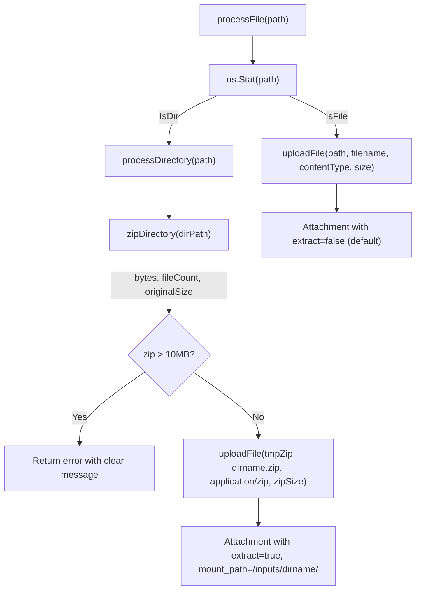

# T03: CLI -- Directory Zipping and Upload

## Scope

Single file modified: `[client-apps/cli/cmd/stigmer/root/run_attachments.go](client-apps/cli/cmd/stigmer/root/run_attachments.go)`
One new file created: `client-apps/cli/cmd/stigmer/root/run_attachments_zip.go`

No proto, server, or agent-runner changes (those are T04/T05).

## Why Two Files

The [CLI coding guidelines](client-apps/cli/.cursor/rules/client-apps/cli/coding-guidelines.mdc) mandate:

- Files under 250 lines, ideally 50-150
- Single responsibility per file

`run_attachments.go` is currently 156 lines. Adding ~80-100 lines of zip logic would push it past 250. Splitting keeps both files well within limits and gives clean separation: **attachment orchestration** (existing file) vs. **directory-to-zip compression** (new file).

## Architecture




## File 1: `run_attachments_zip.go` (new, ~100 lines)

### Constants

- `maxAttachmentSize = 10 * 1024 * 1024` -- matches server `MaxRecvMsgSize` in `[backend/libs/go/grpc/server.go:79](backend/libs/go/grpc/server.go)`

### `zipDirectory(dirPath string) ([]byte, int, int64, error)`

Pure function. Takes a directory path, returns zip bytes + metadata. No upload, no proto knowledge.

- Uses `filepath.WalkDir` to traverse (not `fs.WalkDir` -- we need `os.DirEntry.Type()` for symlink detection)
- **Skips hidden entries**: any file or directory whose name starts with `.` (covers `.git`, `.DS_Store`, `.env`, etc.). Skipping a hidden directory also skips its entire subtree.
- **Skips symlinks**: logs a warning via `cliprint.PrintWarning` for each skipped symlink
- Preserves relative paths inside the zip (e.g., `subdir/file.txt`)
- Returns `(zipBytes, fileCount, totalOriginalSize, error)`
- Errors if the directory walk finds zero eligible files (empty dir or all-hidden)

### `isHiddenEntry(name string) bool`

Returns `true` if name starts with `.`. Simple, explicit, no special-casing.

## File 2: `run_attachments.go` (modified, ~10 lines changed)

### `processFile()` modification

Replace the directory rejection block:

```go
// BEFORE (lines 61-62)
if info.IsDir() {
    return nil, fmt.Errorf("cannot attach directory: %s (only files are supported)", path)
}
```

With delegation:

```go
if info.IsDir() {
    return p.processDirectory(path)
}
```

### `processDirectory(path string) (*agentexecutionv1.Attachment, error)` (new method on AttachmentProcessor)

Orchestration method (~30 lines). Lives in the existing file because it uses `p.uploadFile()` and is part of the attachment processing flow.

Steps:

1. Call `zipDirectory(path)` to get bytes, file count, and original size
2. Print info: `"Zipping directory: {dirname}/ ({N} files, {originalSize})..."`
3. Check zip size against `maxAttachmentSize` -- return clear error if exceeded
4. Derive `dirname` from `filepath.Base(path)`, construct `filename = dirname + ".zip"`
5. Write zip bytes to a temp file, call `p.uploadFile()` with `contentType = "application/zip"`
6. Set `Extract: true` and `MountPath: fmt.Sprintf("inputs/%s/", dirname)` on the returned `Attachment`

### CLI output for directories

Follows existing `cliprint` patterns:

```
i  Zipping directory: inputs/ (5 files, 12.3 KB)...
✓  Uploaded inputs.zip (4.2 KB compressed)
```

## Edge Cases

- **Empty directory**: `zipDirectory` returns error `"directory contains no files: {path}"`
- **All hidden files**: Same error -- zero eligible files after filtering
- **Nested subdirectories**: Included in zip with relative paths preserved; hidden subdirs skipped entirely
- **Symlinks**: Skipped with `cliprint.PrintWarning("Skipping symlink: {path}")`
- **Zip exceeds 10MB**: Clear error `"zipped directory too large ({size}). Maximum attachment size is 10 MB"`
- **Unreadable files**: `zipDirectory` returns wrapped error identifying the file
- **Path `.`**: `filepath.Base(".")` returns `"."` -- we should resolve the absolute path first via `filepath.Abs` so dirname is the actual directory name

## Key Decisions

- **10MB limit**: Matches actual server `MaxRecvMsgSize`, not the 4MB from the proto comment
- **Symlinks skipped**: Avoids cycle and security risks; warn per-symlink
- **Hidden = dot-prefix**: Standard Unix convention, covers all common cases
- `**mount_path` = `"inputs/{dirname}/"`**: Consistent with the default `/inputs/{filename}` convention for regular files; the trailing slash signals directory semantics to the agent runner (T04 will honor this)
- `**processDirectory` stays in `run_attachments.go`**: It's an orchestration method that uses the existing `uploadFile` private method -- it belongs with the other attachment processing flow. Only the pure zip logic moves to the new file.
- **No temp file for upload**: `uploadFile` currently reads from disk (`os.ReadFile`). We need a small refactor: extract the upload-from-bytes logic so `processDirectory` can pass zip bytes directly without writing to a temp file first. This avoids unnecessary disk I/O and temp file cleanup. The refactoring creates an `uploadBytes` method and makes `uploadFile` a thin wrapper.

## Refactoring: uploadFile split

Current `uploadFile` reads a file from disk and uploads. For directory zipping, we already have the bytes in memory. Rather than writing to a temp file just to read it back:

- Extract `uploadBytes(content []byte, filename, contentType string) (*agentexecutionv1.Attachment, error)` -- does the gRPC call + prints
- `uploadFile(path, filename, contentType string, size int64) (*agentexecutionv1.Attachment, error)` -- reads file, calls `uploadBytes`
- `processDirectory` calls `uploadBytes` directly with the zip bytes

This keeps the code DRY and avoids temp file overhead.

## Verification

- `bazel build //client-apps/cli/cmd/stigmer/root/...` (note: pre-existing `com_github_alecthomas_chroma_v2` issue may require `bazel mod tidy` first)
- Manual test: `stigmer draft skill --attach some-directory/ -m "test"` against local daemon

