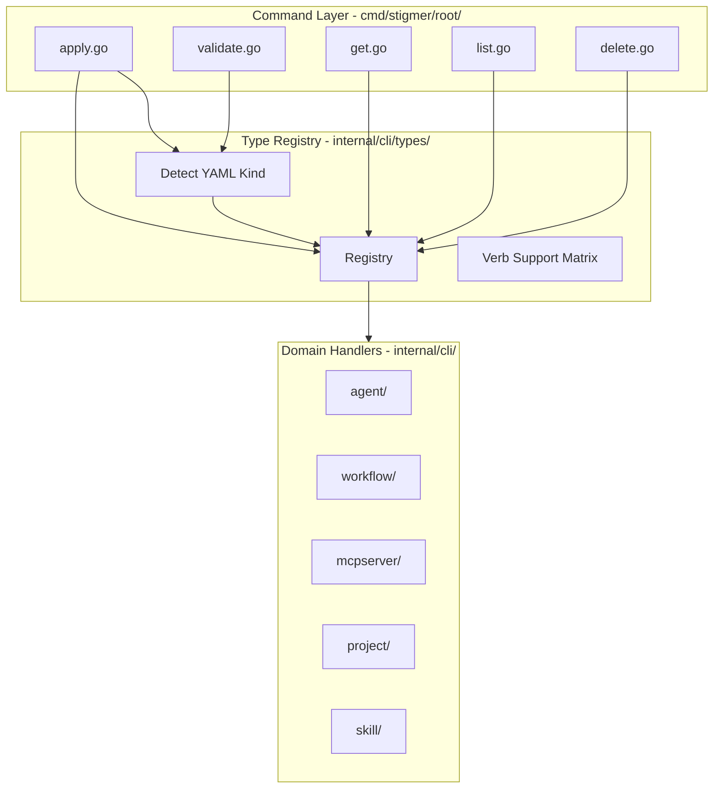

# T03: Core Verbs Implementation

## Summary

Create five unified verb-first commands that auto-detect or accept resource types, routing to existing handlers via the type registry. Remove old noun-first commands for these core verbs.

## Current State

- **Noun-first commands exist**: `stigmer workflow apply`, `stigmer agent get`, `stigmer mcpserver list`, etc.
- **Handlers exist in internal/cli/{resource}/**: `workflow.Apply()`, `agent.GetFromBackend()`, etc.
- **Type registry (T02) ready**: Provides `GetByAlias()`, `SupportsVerb()`, YAML kind detection
- **Current apply.go**: Project synthesis mode only (no file-based apply)

## Target Grammar

```bash
# File-based (auto-detect kind from YAML)
stigmer apply -f agent.yaml           # Single file
stigmer apply -f ./manifests/         # Directory (all YAML)
stigmer validate -f workflow.yaml     # Validate without applying

# Reference-based (type + id as separate args)
stigmer get agent abc123              # By ID
stigmer get workflow myorg/my-wf      # By org/slug
stigmer list agents                   # Plural form
stigmer list workflow                 # Singular also works
stigmer delete mcpserver github       # Delete by reference
```

## Architecture




## Implementation Details

### 1. Enhanced apply.go

Current `apply.go` handles project synthesis mode. Enhance to detect mode:

```go
// Mode detection:
// - No -f flag AND stigmer.yaml exists → Project synthesis (current)
// - -f flag provided → File-based apply with kind auto-detection
```

File-based flow:

1. Parse `-f` flag (file or directory path)
2. For directory: collect all `.yaml`/`.yml` files
3. For each file: use `types.Detect()` to get kind
4. Lookup handler via `registry.GetByYAMLKind()`
5. Check `SupportsVerb(VerbApply)` - error if not supported
6. Route to `{resource}.Apply()`

### 2. New validate.go

Similar to file-based apply, but calls validation only:

- Required: `-f` flag
- Uses `types.Detect()` for kind
- Routes to `{resource}.Validate()`
- Does not connect to backend

### 3. New get.go

Reference-based command:

```bash
stigmer get <type> <reference>
```

Flow:

1. Parse type argument via `registry.GetByAlias()`
2. Check `SupportsVerb(VerbGet)`
3. Route to appropriate handler

### 4. New list.go

```bash
stigmer list <type>   # Accepts: agents, agent, agt, workflows, wf, etc.
```

Flow:

1. Parse type via `registry.GetByAlias()` (handles plural/singular/aliases)
2. Check `SupportsVerb(VerbList)`
3. Route to appropriate handler

### 5. New delete.go

```bash
stigmer delete <type> <reference>
```

Same pattern as get.go.

## Handler Extraction Required

The `mcpserver.go` file (600+ lines) has handlers implemented inline. Before removal, extract to `internal/cli/mcpserver/`:

- `get.go` - GetFromBackend function
- `list.go` - List function  
- `delete.go` - Delete function
- (applier.go and loader.go already exist)

## Files to Create


| File                                | Purpose                      | Lines (est.) |
| ----------------------------------- | ---------------------------- | ------------ |
| `cmd/stigmer/root/validate.go`      | Unified validate command     | 80-100       |
| `cmd/stigmer/root/get.go`           | Unified get command          | 100-120      |
| `cmd/stigmer/root/list.go`          | Unified list command         | 80-100       |
| `cmd/stigmer/root/delete.go`        | Unified delete command       | 100-120      |
| `internal/cli/mcpserver/get.go`     | MCP server get handler       | 60-80        |
| `internal/cli/mcpserver/list.go`    | MCP server list handler      | 60-80        |
| `internal/cli/mcpserver/delete.go`  | MCP server delete handler    | 60-80        |
| `internal/cli/mcpserver/display.go` | MCP server display functions | 80-100       |


## Files to Modify


| File          | Changes                                                                     |
| ------------- | --------------------------------------------------------------------------- |
| `apply.go`    | Add `-f` flag, mode detection, file-based routing                           |
| `agent.go`    | Remove get/list/delete/validate subcommands (keep run/search for T04)       |
| `workflow.go` | Remove apply/get/list/delete/validate subcommands (keep run/search for T04) |
| `root.go`     | Add new verb commands, remove noun-first commands                           |


## Files to Remove

- `workflow_apply.go`
- `workflow_get.go`
- `workflow_list.go`
- `workflow_delete.go`
- `workflow_validate.go`
- `agent_get.go`
- `agent_list.go`
- `agent_delete.go`
- `agent_validate.go`
- `project_get.go`
- `project_delete.go`
- `project.go` (becomes empty after removals)
- `mcpserver.go` (after handler extraction)

## Files to Keep (for T04)

- `workflow_run.go` - Will become part of unified `run` in T04
- `agent_run.go` - Will become part of unified `run` in T04
- `workflow_search.go` - Will become part of unified `search` in T04
- `agent_search.go` - Will become part of unified `search` in T04
- `skill.go` - Has `push` command, will be refactored in T04

## Routing Strategy

Keep routing simple with a switch statement in each command (not a separate dispatcher package). With only 5 resource types, this is maintainable:

```go
func routeApply(info *types.TypeInfo, content []byte, opts ApplyOptions) error {
    switch info.ProtoKind {
    case apiresourcekind.ApiResourceKind_agent:
        return agent.ApplyFromBytes(content, opts.Conn, opts.OrgID)
    case apiresourcekind.ApiResourceKind_workflow:
        return workflow.ApplyFromBytes(content, opts.Conn, opts.OrgID)
    // ... etc
    default:
        return fmt.Errorf("apply not supported for %s", info.DisplayName)
    }
}
```

## Error Messages

Unsupported verb+type combinations show helpful errors:

```
$ stigmer apply -f skill.yaml
Error: "apply" is not supported for resource type "Skill"
Hint: Use "stigmer push skill" to push skills to the registry

$ stigmer run project abc
Error: "run" is not supported for resource type "Project"  
Hint: "run" is available for: Agent, Workflow
```

## Skill Handling Note

Skills do NOT support apply/validate from YAML files. Skills are:

- Pushed as artifacts: `stigmer push skill [dir]`
- Managed via get/list/delete after pushed

If a user tries `stigmer apply -f skill.yaml`, show clear error with guidance.

## Testing Strategy

- Unit tests for routing logic
- Integration tests for each verb + type combination
- Error case tests for unsupported combinations
- Multi-file/directory apply tests

## Quality Checklist

- Every file under 250 lines
- Every function under 50 lines
- Errors wrapped with context
- Command handlers: thin orchestration only
- Reuse existing handlers (no logic duplication)
- Clear error messages for unsupported combinations

