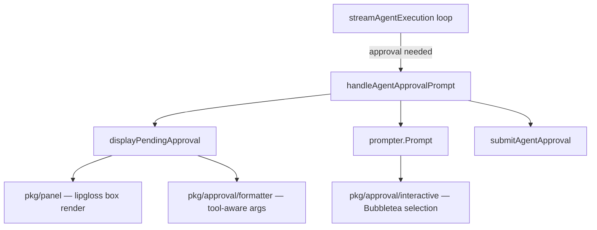

# T03: Rich Approval Experience

## Design Decisions (Confirmed)

- **Display rendering**: Lipgloss static rendering (box borders, colors, padding). No Bubbletea for display.
- **Interactive prompt**: Bubbletea inline program for Approve/Skip/Reject selection + optional rejection comment.
- **Panel location**: `pkg/panel/` (domain-agnostic, per coding guidelines).
- **Formatter location**: `pkg/approval/formatter.go` (approval-specific concern, separate from T04's tool call renderer).
- **Survey removal**: Survey is only used in `pkg/approval/`. It will be replaced entirely and the dependency removed.

## Architecture




## Step 1: `pkg/panel/` -- Reusable Box Panel Renderer

**New files**: `client-apps/cli/pkg/panel/panel.go`, `panel_test.go`, `BUILD.bazel`

Pure lipgloss rendering. No Bubbletea dependency. The core API:

```go
// Render draws a bordered box panel with an optional title.
// Content is padded and wrapped to fit within the panel width.
func Render(content string, opts Options) string
```

- `Options` struct: `Title string`, `Width int`, `Style PanelStyle`
- `PanelStyle` enum: `StyleDefault`, `StyleWarning`, `StyleError`, `StyleSuccess`
- Width defaults to 70 (or terminal width - 10, whichever is smaller)
- Border colors match the style (yellow for warning, red for error, etc.)
- Title rendered inline with the top border (e.g., `╭─ APPROVAL REQUIRED ───────╮`)
- Uses `lipgloss.RoundedBorder()` for clean box drawing

**Tests**: Render with empty content, long content, multi-line content, various styles, custom width.

## Step 2: `pkg/approval/formatter.go` -- Tool-Type-Aware Argument Formatter

**New file**: `client-apps/cli/pkg/approval/formatter.go`, update `interactive_test.go`

Formats `argsPreview` JSON based on `toolName` for decision-relevant display:

```go
// FormatArgs formats tool arguments for approval display.
// It highlights the most relevant fields based on the tool type.
func FormatArgs(toolName, argsPreview string) string
```

**Tool type mappings** (extensible via a map, not a switch):

- Shell tools (`shell`, `bash`, `execute_command`, `run_command`) -- highlight `command` field
- File write tools (`write_file`, `create_file`, `overwrite_file`) -- highlight `path`, show content preview
- File delete tools (`delete_file`, `remove_file`) -- highlight path with warning color
- Read tools (`read_file`, `list_directory`) -- highlight path, dim styling (low risk)
- Unknown tools -- pretty-print JSON with consistent indentation

**Fallback**: If `argsPreview` is not valid JSON or parsing fails, display it as-is with indentation (current behavior). Never crash on bad input.

**Tests**: Each tool category, malformed JSON, empty string, unknown tool names.

## Step 3: Rewrite `run_display_approval.go` -- Lipgloss Panel Display

**Modified file**: [run_display_approval.go](client-apps/cli/cmd/stigmer/root/run_display_approval.go)

Replace the current plain-text `displayPendingApproval()` with a structured panel:

```
╭─ APPROVAL REQUIRED ───────────────────────────────────────╮
│                                                           │
│  Tool:  delete_repository                                 │
│  From:  code-cleanup-agent (sub-agent)                    │
│                                                           │
│  Message: Delete the unused staging repository            │
│                                                           │
│  Arguments:                                               │
│    repository: acme-corp/staging-env                      │
│    force: true                                            │
│                                                           │
│  Waiting for: 15s                                         │
│                                                           │
╰───────────────────────────────────────────────────────────╯
```

- Uses `panel.Render()` for the box
- Uses `approval.FormatArgs()` for the arguments section
- Keeps `formatWaitingDuration()` (it's clean and well-tested)
- Sub-agent indicator only shown when `FromSubAgent` is true
- Content is built as a slice of labeled sections, then joined

## Step 4: Replace Survey with Bubbletea in `interactive.go`

**Modified file**: [interactive.go](client-apps/cli/pkg/approval/interactive.go)

Replace `showInteractivePrompt()` with a Bubbletea inline program. Single program handles both selection and optional rejection comment:

**Phase 1 - Selection**:

```
  ▸ Approve — Execute the tool
    Skip — Continue without executing
    Reject — Fail the execution

  ↑↓ move  enter select  ctrl+c cancel
```

**Phase 2 - Comment (only if Reject selected)**:

```
  Rejection reason (optional): _
  
  enter submit  esc skip
```

Key implementation details:

- Program runs inline (no alt screen) -- `tea.NewProgram(model)` without `WithAltScreen`
- Model has two phases: `phaseSelect` and `phaseComment`
- After selection, if Approve or Skip, program quits immediately
- If Reject, transitions to `phaseComment` with a `textinput.Model` from bubbles
- Options styled with lipgloss: active option has `▸` indicator and bold text, inactive options are dimmed
- Keyboard hints rendered at the bottom in dim text
- `Prompt()` method creates the program, calls `Run()`, extracts decision from the final model
- Non-interactive and no-TTY fallback paths remain unchanged (no Bubbletea, returns default action)

**Remove**: `survey/v2` import, the `askComment()` method, all Survey references.

## Step 5: BUILD.bazel + Dependency Cleanup

- **New**: `client-apps/cli/pkg/panel/BUILD.bazel` -- go_library + go_test
- **Update**: `client-apps/cli/pkg/approval/BUILD.bazel`:
  - Add `formatter.go` to srcs
  - Add `charmbracelet/bubbletea`, `charmbracelet/bubbles`, `charmbracelet/lipgloss` to deps
  - Remove `@com_github_alecaivazis_survey_v2//:survey`
- **Update**: `client-apps/cli/go.mod` -- remove `github.com/AlecAivazis/survey/v2` if no other usages exist (confirmed: none)
- Run `go mod tidy` to clean up

## Step 6: Verify Build and Tests

- `go build ./...` from `client-apps/cli/`
- `go test ./pkg/panel/...`
- `go test ./pkg/approval/...`
- `go test ./cmd/stigmer/root/...`
- Gazelle to regenerate BUILD files if needed

## Risk Awareness

- **Bubbletea inline rendering within streaming loop**: The streaming loop blocks on approval. Bubbletea runs inline (no alt screen), takes over stdin, renders the prompt, and returns. This mirrors how Survey works today. The gRPC stream will buffer updates; they'll be processed when the loop resumes. Low risk.
- **Terminal width detection**: `lipgloss.Width()` may not work in all environments. The panel renderer should have a sensible fallback width (70 chars).
- **Non-TTY environments**: The approval prompt must gracefully degrade. The existing `!display.IsTerminal()` check routes to `handleNonInteractive()` before any Bubbletea code runs. No change needed.

