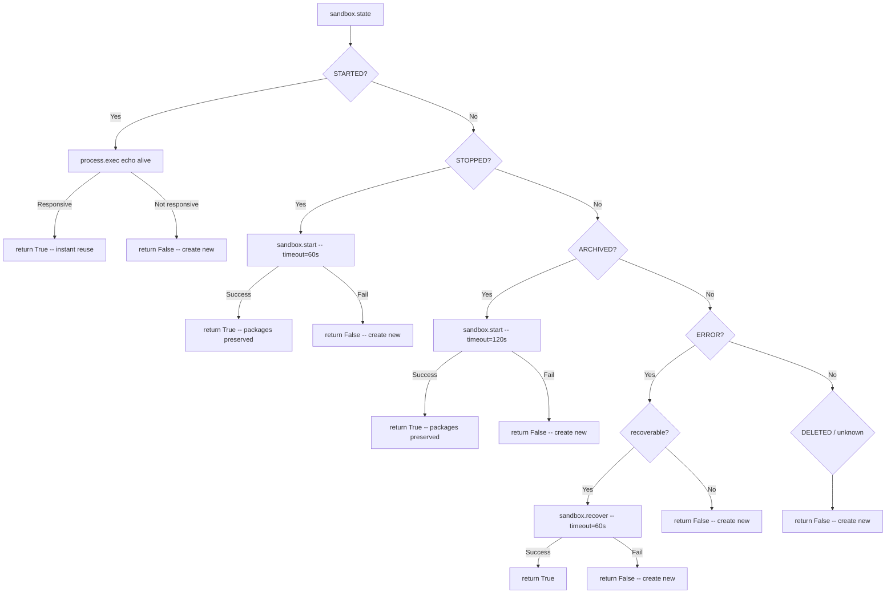

# T03: Sandbox Restart/Recovery Before Recreation

## Problem

The current `get_or_create_daytona_sandbox()` in [sandbox_manager.py](backend/services/agent-runner/worker/sandbox_manager.py) uses a binary health check (`_is_daytona_sandbox_alive`) that runs `echo alive` via `process.exec`. If the sandbox doesn't respond (e.g., it's STOPPED after 15-min auto-stop during an approval wait), the method falls through to creating a brand new sandbox. This wastes the sandbox's runtime state: installed packages, compiled tools, environment modifications.

The Daytona SDK provides a proper lifecycle API with states (STARTED, STOPPED, ARCHIVED, ERROR, DELETED) and methods (`start()`, `recover()`) that can revive a sandbox without recreating it. T03 replaces the binary check with a state-aware recovery chain, aligned with [DD02](backend/services/agent-runner/../../_projects/2026-02/20260215.01.persistent-session-workspace/design-decisions/DD02-sandbox-restart-before-recreation.md).

## Scope: sandbox_manager.py only

All changes are in a single file: `backend/services/agent-runner/worker/sandbox_manager.py`.

## Implementation

### 1. Add imports

```python
from daytona import Daytona, DaytonaConfig, SandboxState, VolumeMount
from daytona.common.errors import DaytonaNotFoundError
```

`SandboxState` is a first-class export from the `daytona` package (confirmed from [SDK source](https://github.com/daytonaio/daytona/blob/main/libs/sdk-python/src/daytona/__init__.py)). `DaytonaNotFoundError` lets us catch the specific case where a sandbox no longer exists, instead of bare `Exception`.

### 2. New method: `_try_revive_daytona_sandbox(self, sandbox) -> bool`

A private method that inspects `sandbox.state` and takes the appropriate recovery action. Returns `True` if the sandbox is now ready for use, `False` if a new sandbox must be created.

**Recovery priority chain (from DD02):**




**Key design choices in this method:**

- **STARTED still gets a health check**: `sandbox.start()` verifies readiness, but a sandbox that was already STARTED hasn't been re-verified. The lightweight `echo alive` check (5s timeout) catches edge cases where the process layer is hung but the state API hasn't caught up. This is the only state that needs the alive check -- `start()` and `recover()` already wait for readiness.
- **ARCHIVED uses the same `start()` call as STOPPED, just with longer timeout (120s)**: Daytona docs confirm "starting an archived sandbox takes more time, depending on its size" as the filesystem is restored from object storage. We use `start()` for both states; the SDK handles the internal restore-then-start sequence.
- **Every branch logs sandbox_id, state, action taken, and elapsed time**: Essential for operational visibility in a platform of this scale.
- **No retry loops**: Each recovery action gets one attempt with a generous timeout. If it fails, we fall through to creation. The volume mount (T02) guarantees file persistence regardless, so this is safe.

### 3. Update `get_or_create_daytona_sandbox()` caller

Replace the existing reuse block (lines 531-547):

**Before:**

```python
sandbox = self._daytona.get(existing_sandbox_id)
if self._is_daytona_sandbox_alive(sandbox):
    return (sandbox, False)
else:
    logger.warning("...not responsive, creating new one")
```

**After:**

```python
try:
    sandbox = self._daytona.get(existing_sandbox_id)
except DaytonaNotFoundError:
    logger.info("Sandbox %s no longer exists (deleted/expired), will create new", existing_sandbox_id)
    # fall through to creation
else:
    if self._try_revive_daytona_sandbox(sandbox):
        return (sandbox, False)
    else:
        logger.warning("Sandbox %s could not be revived (state: %s), creating new", 
                       existing_sandbox_id, sandbox.state)
```

This is a cleaner separation: `DaytonaNotFoundError` means the sandbox is gone (no object to inspect), while `_try_revive_daytona_sandbox` handles the case where we DO have a sandbox object but it needs recovery.

The outer `except Exception` stays as a safety net for unexpected API errors.

### 4. Set auto-lifecycle params at sandbox creation

In `_create_daytona_sandbox()`, add `auto_delete_interval=-1` to `CreateSandboxFromSnapshotParams`. This is available as a creation-time parameter on `CreateSandboxBaseParams` (the parent class), so it requires no extra API call:

```python
params = CreateSandboxFromSnapshotParams(
    snapshot=snapshot_id,
    volumes=volume_mounts if volume_mounts else None,
    auto_delete_interval=-1,  # Never auto-delete; we manage sandbox lifecycle
)
```

- `auto_stop_interval`: **Keep at default (15 min)**. Sandboxes will auto-stop during long approval waits, and T03's recovery chain handles the restart. This saves cloud resources.
- `auto_archive_interval`: **Keep at default (7 days)**. Unlikely to trigger during normal usage, but handled by the recovery chain if it does.
- `auto_delete_interval=-1`: **Explicitly disable**. Although the SDK docs say auto-delete is disabled by default, being explicit here is defense-in-depth for a critical invariant -- we never want a sandbox to disappear unexpectedly.

### 5. Deprecate `_is_daytona_sandbox_alive` (keep as helper)

Keep the existing `_is_daytona_sandbox_alive()` method. It's still used by `_try_revive_daytona_sandbox` for the STARTED state health check. No code changes needed to this method.

## Items to verify during implementation

- `**start()` on ARCHIVED sandboxes**: The Daytona docs strongly imply this works ("starting an archived sandbox takes more time"), but we haven't tested it. I'll write the code to handle both STOPPED and ARCHIVED with `start()`, and if the SDK raises for ARCHIVED, we catch it and fall through to creation. No silent failure.
- `**SandboxState` enum values**: Confirm the exact enum members at import time. The web search and SDK GitHub source show STARTED, STOPPED, ARCHIVED, DELETED. The ERROR state is indicated by `error_reason` and `recoverable` attributes. I need to verify whether ERROR is a distinct `SandboxState` member or is detected via these attributes on another state.

## What this does NOT change

- `execute_graphton.py` -- no changes needed; it already calls `get_or_create_daytona_sandbox`
- The resume fast-path (`is_resume`) -- unchanged; T05 will address that
- The manual readiness polling loop in `_create_daytona_sandbox` (lines 652-663) -- this appears redundant given `create()` already has a timeout, but it's out of scope for T03
- Volume mounting logic (T02) -- already complete
- Local mode -- unaffected; recovery only applies to Daytona sandboxes

