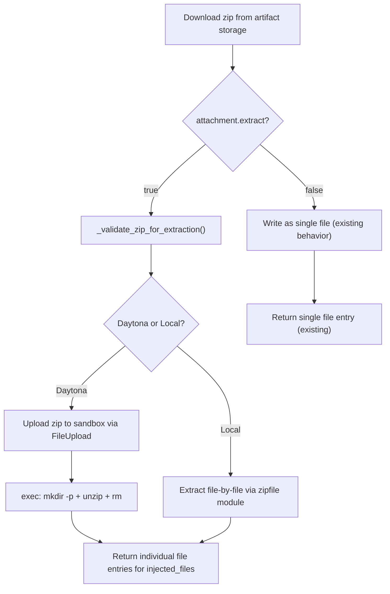

# T04: Agent Runner -- Zip Extraction

## Target File

`[backend/services/agent-runner/worker/activities/execute_graphton.py](backend/services/agent-runner/worker/activities/execute_graphton.py)` -- the `inject_attachments()` function (lines 195-357) and new helpers placed immediately above it.

## What Exists Today

- `inject_attachments()` downloads each attachment from artifact storage and writes it as a single file
- **Daytona mode**: collects `FileUpload` objects, batch-uploads via `sandbox.fs.upload_files()`
- **Local mode**: writes directly via `Path.write_bytes()`
- No branching on `attachment.extract` -- the field exists in the proto but is ignored
- Resume fast-path (line 1303-1318) reconstructs `injected_files` from proto metadata without I/O -- already handles directory mount_paths like `inputs/my-project/` correctly

## Established Codebase Patterns to Follow

`skill_writer.py` already extracts zips in both modes -- we follow the same approach:

- **Daytona extraction**: upload zip to sandbox, run `unzip` via `sandbox.process.exec()`, cleanup the zip file (see `_extract_artifact_daytona`, line 424)
- **Local extraction**: use Python `zipfile` module to extract to disk (see `_extract_artifact_local`, line 240)

Key difference: `skill_writer.py` extracts trusted platform artifacts, so it uses `zf.extractall()` without path traversal checks. **User attachments are untrusted**, so we MUST validate before extraction.

## Design

### Flow Diagram




### 1. Safety Validation -- `_validate_zip_for_extraction()`

New function placed above `inject_attachments()`. Runs BEFORE any extraction regardless of mode.

```python
_MAX_ZIP_FILES = 1000
_MAX_ZIP_EXTRACTED_SIZE = 100 * 1024 * 1024  # 100 MB

def _validate_zip_for_extraction(
    zip_data: bytes,
    attachment_filename: str,
    logger,
) -> list[str]:
```

**Checks (in order)**:

- Valid zip format (catch `zipfile.BadZipFile`)
- **Path traversal**: reject entries with absolute paths or `..` path components (using `os.path.normpath` + prefix check)
- **Zip bomb**: reject if >1000 files or total uncompressed size >100MB

**Returns**: sorted list of relative file paths (non-directory entries) -- used both for `injected_files` metadata and for the safe local extraction.

### 2. Local Mode Extraction

When `attachment.extract` is True and `sandbox is None`:

- Call `_validate_zip_for_extraction()` to get validated file list
- Extract file-by-file using `zipfile.ZipFile.open()` + write (NOT `extractall()`) to `{local_root}/{mount_path}/`
- Create parent directories with `os.makedirs(exist_ok=True)`
- Append one `injected_files` entry per extracted file

### 3. Daytona Mode Extraction

When `attachment.extract` is True and `sandbox is not None`:

- Call `_validate_zip_for_extraction()` to get validated file list
- Queue `FileUpload` for zip at `{ws_root}/{mount_path}/__attachment__.zip` (same pattern as skill_writer's `artifact.zip`)
- After the existing batch upload, run extraction for each extract attachment:

```
  mkdir -p {target_dir} && cd {target_dir} && unzip -o __attachment__.zip && rm __attachment__.zip
  

```

- Append one `injected_files` entry per extracted file (file list from validation step)

### 4. Restructuring `inject_attachments()` Loop

The existing loop collects `file_uploads` for Daytona batch upload. We add:

- A second tracking list: `extract_targets: list[tuple]` -- records `(target_dir, file_paths)` for post-upload extraction
- After the batch upload (`sandbox.fs.upload_files()`), iterate `extract_targets` and run `unzip` for each
- Non-extract attachments flow through unchanged

### 5. What We Are NOT Changing

- **Resume fast-path** (lines 1303-1318): Already handles `mount_path` like `inputs/my-project/` correctly. On resume, the agent sees the directory path; on fresh execution, it sees individual files. This asymmetry is acceptable -- resume is a degraded path that avoids I/O.
- **System prompt generation** (lines 1613-1629): The prompt says "Use the `read` tool to access them." For directory entries, the agent naturally `ls`es them. No change needed.
- `**_check_workspace_file_exists()`**: Uses skills as sentinel, not attachments. No change needed.

## Surprise Found During Research

`**skill_writer.py` uses `zf.extractall()` without path traversal protection** (line 253). This is acceptable for platform-managed skill artifacts (trusted source), but we should NOT follow this pattern for user-supplied attachments. Our implementation uses file-by-file extraction with explicit path validation. (Not fixing skill_writer -- separate concern, separate task.)

## Agent Prompt Behavior

**Fresh execution**: Agent sees individual extracted files in the prompt:

```
- `inputs/my-project/proto/agent.proto` (2345 bytes)
- `inputs/my-project/requirements.md` (890 bytes)
```

**Resume**: Agent sees directory entry (no I/O needed):

```
- `inputs/my-project/`
```

Both are correct and the agent handles either representation.