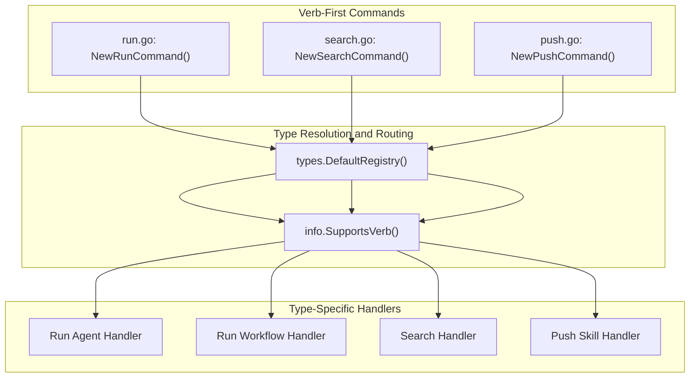

# T04: Specialized Verbs Migration

## Current State

The T03 implementation established the verb-first pattern with these commands:

- `apply`, `validate`, `get`, `list`, `delete`

The specialized verbs remain noun-first:

- `stigmer agent run <ref>` / `stigmer workflow run <ref>`
- `stigmer agent search <query>` / `stigmer workflow search <query>`
- `stigmer skill push [dir]`

## Target State

```bash
stigmer run agent my-agent           # Execute agent
stigmer run workflow my-wf           # Execute workflow
stigmer search agents "code review"  # Search agents
stigmer search workflows "deploy"    # Search workflows
stigmer push skill [dir]             # Push skill artifact
```

## Architecture Overview




## Implementation Steps

### Step 1: Unify Helper Functions

Extract the triplicated `resolveOrganization` functions into the shared `verb_helpers.go`:

**Files to modify:**

- `[client-apps/cli/cmd/stigmer/root/verb_helpers.go](client-apps/cli/cmd/stigmer/root/verb_helpers.go)` - Add unified helper
- Remove duplicates from `agent.go`, `workflow.go`, `skill.go`

### Step 2: Create Unified Run Command

Create `run.go` (new unified version replacing the auto-discovery version):

**Pattern:** `stigmer run <type> <ref> [flags]`

```go
// stigmer run agent my-agent --message "hello" --follow
// stigmer run workflow my-wf --env API_KEY=xxx
```

**Structure:**

- Parse type alias and reference
- Validate verb support (only Agent and Workflow support VerbRun)
- Route to handler based on type
- Share flags across types: `--message`, `--env`, `--env-file`, `--secret`, `--secret-file`, `--follow`, `--org`

**Files to create/modify:**

- `[client-apps/cli/cmd/stigmer/root/run.go](client-apps/cli/cmd/stigmer/root/run.go)` - Replace with unified verb-first version
- Keep existing `run_*.go` files (run_stream.go, run_execute.go, etc.) as they contain shared execution logic

**Key code to extract from `agent_run.go` and `workflow_run.go`:**

- The `executeAgentRun` and `executeWorkflowRun` functions become handler functions called by the unified router

### Step 3: Create Unified Search Command

Create `search.go`:

**Pattern:** `stigmer search <type> <query> [flags]`

```go
// stigmer search agents "code review"
// stigmer search workflows "deploy" --org acme-corp
```

**Structure:**

- Parse type alias and query
- Validate verb support (only Agent and Workflow support VerbSearch)
- Route to handler using existing `search.Search()` infrastructure
- Flags: `--output`, `--org`, `--exclude-public`, `--page`, `--page-size`

**Files to create:**

- `[client-apps/cli/cmd/stigmer/root/search.go](client-apps/cli/cmd/stigmer/root/search.go)` - New unified search command

**Existing infrastructure to leverage:**

- `[client-apps/cli/internal/cli/search/client.go](client-apps/cli/internal/cli/search/client.go)` - Already has `Search()` function
- `[client-apps/cli/internal/cli/agent/display.go](client-apps/cli/internal/cli/agent/display.go)` - `DisplaySearchResult()`
- `[client-apps/cli/internal/cli/workflow/display.go](client-apps/cli/internal/cli/workflow/display.go)` - `DisplaySearchResult()`

### Step 4: Create Unified Push Command

Create `push.go`:

**Pattern:** `stigmer push <type> [path] [flags]`

```go
// stigmer push skill
// stigmer push skill ./my-skill --tag v1.0.0
// stigmer push skill --git-url https://github.com/... --git-ref v1.0.0
```

**Structure:**

- Parse type alias and optional path
- Validate verb support (only Skill supports VerbPush)
- Route to handler
- All existing flags from `skill.go` push command preserved

**Files to create:**

- `[client-apps/cli/cmd/stigmer/root/push.go](client-apps/cli/cmd/stigmer/root/push.go)` - New unified push command

**Refactor from `skill.go`:**

- Extract `skillPushOptions`, `remotePushOptions`, `executeSkillPush`, `executeRemoteSkillPush` 
- These become the handler functions called by the unified router

### Step 5: Update Parent Commands

After migration, update the noun-first parent commands:

**agent.go changes:**

- Remove `run` and `search` subcommands
- Keep only as help/alias for migration guidance (or remove entirely)

**workflow.go changes:**

- Remove `run` and `search` subcommands  
- Keep only as help/alias for migration guidance (or remove entirely)

**skill.go changes:**

- Remove `push` subcommand
- Keep only as help/alias for migration guidance (or remove entirely)

**root.go changes:**

- Register new commands: `NewSearchCommand()`, `NewPushCommand()`
- Update `NewRunCommand()` to point to new unified version
- Consider removing/deprecating old parent commands

### Step 6: Cleanup

**Files to delete (after migration):**

- `agent_run.go` - logic moved to unified run.go
- `workflow_run.go` - logic moved to unified run.go
- `agent_search.go` - logic moved to unified search.go
- `workflow_search.go` - logic moved to unified search.go

**Files to modify:**

- `agent.go` - Remove run/search subcommands, add deprecation notice
- `workflow.go` - Remove run/search subcommands, add deprecation notice
- `skill.go` - Significantly slim down (push logic moves to push.go)

## Design Decisions


| Decision                | Choice              | Rationale                                          |
| ----------------------- | ------------------- | -------------------------------------------------- |
| Auto-discovery mode     | Drop                | User decision - always require explicit type + ref |
| Backward compatibility  | Deprecation notices | Old commands warn but still work via parent        |
| Shared execution logic  | Keep run_*.go files | Well-structured, tested code                       |
| Organization resolution | Single helper       | Eliminate 3 duplicated functions                   |


## File Size Estimates

Following the <250 line guideline:

- `run.go`: ~180 lines (command + routing + shared options)
- `search.go`: ~150 lines (simpler than run)
- `push.go`: ~180 lines (command + routing, handlers stay in internal/)
- `verb_helpers.go`: ~100 lines (add resolveOrganization)

## Verification Checklist

- `go build ./cmd/stigmer/...` succeeds
- All new commands work: `run agent`, `search agents`, `push skill`
- Old commands show deprecation warnings
- Verb support validation works (e.g., `run skill` shows helpful error)
- All flags preserved from original commands
- Files under 250 lines
- Functions under 50 lines
- Error messages wrapped with context

