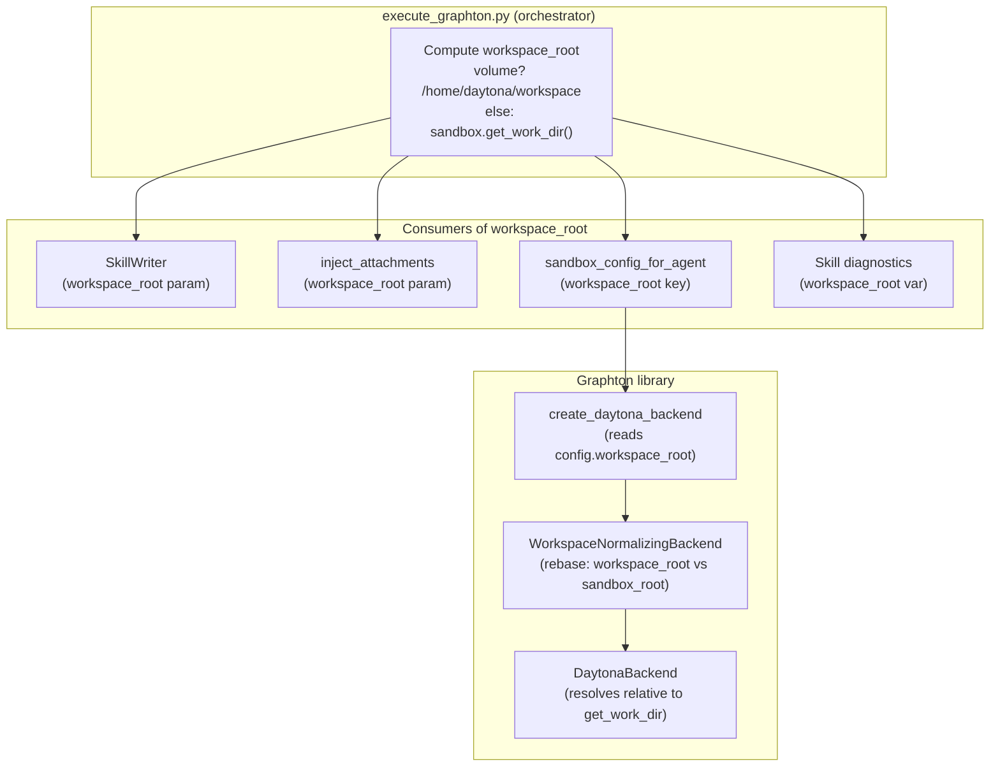

# T04: Backend Workspace Root from Volume Mount (Expanded)

## Problem

After T02, volumes are mounted at `/home/daytona/workspace` inside the sandbox. However, `sandbox.get_work_dir()` returns `/home/daytona` (the Daytona user home, not the volume mount). Three independent code paths each call `get_work_dir()` to discover the workspace root, leading to files being written/read outside the volume mount:

- **Agent backend** (`create_daytona_backend`): resolves workspace-relative paths like `bin/skills/abc/SKILL.md` to `/home/daytona/bin/skills/...` (wrong -- should be `/home/daytona/workspace/bin/skills/...`)
- **Skill writer** (`_resolve_workspace_root`): uploads skills to `/home/daytona/bin/skills/...` (not on volume)
- **Attachment injector** (`inject_attachments`): uploads files to `/home/daytona/inputs/...` (not on volume)

None of these files end up on the persistent volume, defeating the purpose of T02.

## Design

**Core principle**: Define a single, authoritative `workspace_root` early in `execute_graphton()` and thread it to every consumer. When a volume is mounted (cloud mode with `volume_id` and `session_id`), workspace root = the volume mount path. Otherwise, discover from `sandbox.get_work_dir()`.

**Rebase strategy for WorkspaceNormalizingBackend**: When the agent-facing workspace root (`/home/daytona/workspace`) differs from the inner `DaytonaBackend` root (`/home/daytona`), the normalizer computes a rebase prefix (`workspace`) and prepends it to all normalized paths so the inner backend resolves to the correct location. Backward-compatible: when roots match, prefix is empty.




## File Changes

### 1. `sandbox_manager.py` -- Extract constant

`[backend/services/agent-runner/worker/sandbox_manager.py](backend/services/agent-runner/worker/sandbox_manager.py)`

- Define `DAYTONA_WORKSPACE_MOUNT_PATH = "/home/daytona/workspace"` at module level
- Replace the hardcoded string on line 614 with this constant
- This becomes the single source of truth for the volume mount path

### 2. `daytona.py` -- Rebase support in WorkspaceNormalizingBackend

`[backend/libs/python/graphton/src/graphton/core/backends/daytona.py](backend/libs/python/graphton/src/graphton/core/backends/daytona.py)`

`**WorkspaceNormalizingBackend.__init__**`: Add optional `sandbox_root` parameter (what the inner backend resolves relative to). Compute `_rebase_prefix` -- the relative path from `sandbox_root` to `workspace_root` (e.g., `"workspace"` when workspace is `/home/daytona/workspace` and sandbox is `/home/daytona`). When roots match, prefix is empty -- fully backward-compatible.

`**_normalize()**`: After stripping the workspace-root prefix, prepend `_rebase_prefix` if non-empty. This ensures relative paths like `bin/skills/abc/SKILL.md` become `workspace/bin/skills/abc/SKILL.md`, and the inner backend resolves to `/home/daytona/workspace/bin/skills/abc/SKILL.md`.

`**create_daytona_backend()**`: Read optional `workspace_root` from `config` dict. Discover `sandbox_root` from `sandbox.get_work_dir()`. Pass both to `WorkspaceNormalizingBackend`. Fallback behavior unchanged when `workspace_root` is absent.

### 3. `execute_graphton.py` -- Thread workspace root through all consumers

`[backend/services/agent-runner/worker/activities/execute_graphton.py](backend/services/agent-runner/worker/activities/execute_graphton.py)`

**Compute workspace root once** (after sandbox creation, ~line 700):

```python
daytona_workspace_root: str | None = None
if not worker_config.is_local_mode() and sandbox is not None:
    volume_id = get_daytona_volume_id()
    if volume_id and resolved_session_id:
        daytona_workspace_root = DAYTONA_WORKSPACE_MOUNT_PATH
```

**Skill writer** (~line 789): Pass `workspace_root=daytona_workspace_root` to `SkillWriter(sandbox=sandbox, workspace_root=daytona_workspace_root)`.

**Attachment injector** (~line 937): Pass `workspace_root=daytona_workspace_root` to `inject_attachments(...)`.

**Agent config** (~line 1238): Add `"workspace_root": daytona_workspace_root` to `sandbox_config_for_agent` when it's set.

**Skill diagnostics** (~lines 804-818): Use `daytona_workspace_root or work_dir` for the diagnostic absolute path construction.

### 4. `inject_attachments()` -- Accept workspace root parameter

`[backend/services/agent-runner/worker/activities/execute_graphton.py](backend/services/agent-runner/worker/activities/execute_graphton.py)` (lines 131-283)

- Add `workspace_root: str | None = None` parameter
- When `workspace_root` is provided, use it as `ws_root` instead of calling `sandbox.get_work_dir()`
- When not provided, fall back to current behavior (`sandbox.get_work_dir()`)

### 5. `skill_writer.py` -- Accept workspace root override

`[backend/services/agent-runner/worker/activities/graphton/skill_writer.py](backend/services/agent-runner/worker/activities/graphton/skill_writer.py)`

- Add `workspace_root: str | None = None` parameter to `__init__`
- In `_resolve_workspace_root()`: prefer `self._configured_workspace_root` over `sandbox.get_work_dir()` discovery
- Fully backward-compatible: when not provided, existing `get_work_dir()` discovery unchanged

### 6. `__init__.py` -- No change needed

`[backend/libs/python/graphton/src/graphton/core/backends/__init__.py](backend/libs/python/graphton/src/graphton/core/backends/__init__.py)` already exports `WorkspaceNormalizingBackend`.

## Backward Compatibility

Every change has a "not provided" fallback that preserves exact current behavior:

- `WorkspaceNormalizingBackend(inner, workspace_root)` -- `sandbox_root` defaults to `workspace_root`, rebase prefix is empty
- `create_daytona_backend(config)` -- missing `workspace_root` key triggers `get_work_dir()` discovery
- `inject_attachments(...)` -- missing `workspace_root` triggers `get_work_dir()` discovery
- `SkillWriter(sandbox=sandbox)` -- missing `workspace_root` triggers `get_work_dir()` discovery
- Local mode is completely unaffected (no sandbox, no volume)

## What This Does NOT Change

- Volume creation/mounting (T02 -- already done)
- Sandbox restart/recovery logic (T03 -- separate conversation)
- Resume fast-path safety checks (T05 -- depends on this task)
- Any proto definitions or Temporal workflow changes

