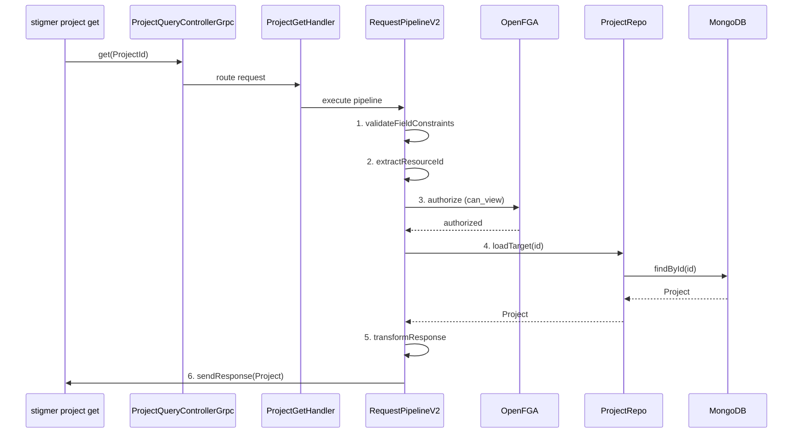

# T05.10: Project Get Handler Implementation

## Context

This is a critical backend component that enables CLI commands (`stigmer project get`) to retrieve Project resources from the backend. The handler follows the established `GetOperationHandlerV2` pattern used consistently across Agent, Workflow, McpServer, and Environment domains.

## Architecture




## Implementation

### File: [ProjectGetHandler.java](backend/services/stigmer-service/src/main/java/ai/stigmer/domain/agentic/project/request/handler/ProjectGetHandler.java) (NEW)

**Pattern Reference**: [AgentGetHandler.java](backend/services/stigmer-service/src/main/java/ai/stigmer/domain/agentic/agent/request/handler/AgentGetHandler.java)

```java
@Slf4j
@Component
@RequiredArgsConstructor
@RequestRoute(controller = ProjectQueryControllerGrpc.class,
        method = ProjectQueryController.Method.get)
public class ProjectGetHandler extends GetOperationHandlerV2<ProjectId, Project> {

    private final RequestOperationCommonSteps<ProjectId, Project> commonSteps;
    private final GetOperationSteps<ProjectId, Project> getSteps;
    private final Tracer tracer;

    @Override
    protected RequestPipelineV2<GetContextV2<ProjectId, Project>> pipeline() {
        return RequestPipelineV2.<GetContextV2<ProjectId, Project>>builder(this.getClass().getSimpleName())
                .withTracer(tracer)
                .addStep(commonSteps.validateFieldConstraints)  // 1. Validate ProjectId.value required
                .addStep(commonSteps.extractResourceId)          // 2. Extract ID from ProjectId.value
                .addStep(commonSteps.authorize)                  // 3. FGA: can_view on project:{id}
                .addStep(getSteps.loadTarget)                    // 4. Load from ProjectRepo
                .addStep(commonSteps.transformResponse)          // 5. Apply transformations
                .addStep(commonSteps.sendResponse)               // 6. Return Project
                .build();
    }
}
```

**Pipeline Steps (6 steps)**:

1. **validateFieldConstraints** - Validates `ProjectId.value` is present (proto constraint)
2. **extractResourceId** - Extracts the ID string from `ProjectId.value`
3. **authorize** - FGA check: `can_view` permission on `project:{id}` (proto-level)
4. **loadTarget** - Loads Project from `ProjectRepo.findById(id)`
5. **transformResponse** - Applies any response transformations
6. **sendResponse** - Returns the Project to the client

**Key Design Decisions**:

- Extends `GetOperationHandlerV2<ProjectId, Project>` for type-safe request/response
- Uses `ProjectQueryControllerGrpc.class` (not CommandController) for query routing
- Leverages framework's built-in ID extraction and repository lookup
- Authorization is declarative via proto options (no custom auth logic)

### File: [ProjectGetHandlerTest.java](backend/services/stigmer-service/src/test/java/ai/stigmer/domain/agentic/project/request/handler/ProjectGetHandlerTest.java) (NEW)

**Pattern Reference**: [ProjectUpdateHandlerTest.java](backend/services/stigmer-service/src/test/java/ai/stigmer/domain/agentic/project/request/handler/ProjectUpdateHandlerTest.java)

**Test Coverage** (12 test cases):

- Handler instantiation with all dependencies
- Class annotations (@Component, @RequestRoute, @Slf4j)
- Pipeline method returns non-null pipeline
- Pipeline has exactly 6 steps
- Pipeline step ordering matches specification
- Pipeline has tracer configured
- Handler extends correct base class
- Request route annotation configuration
- Generic type parameters are correct

### Proto Contract Reference

From [query.proto](apis/ai/stigmer/agentic/project/v1/query.proto):

```protobuf
rpc get(ProjectId) returns (Project) {
  option (ai.stigmer.iam.iampolicy.v1.rpcauthorization.config).resource_kind = project;
  option (ai.stigmer.iam.iampolicy.v1.rpcauthorization.config).permission = can_view;
  option (ai.stigmer.iam.iampolicy.v1.rpcauthorization.config).field_path = "value";
}
```

From [io.proto](apis/ai/stigmer/agentic/project/v1/io.proto):

```protobuf
message ProjectId {
  string value = 1 [(buf.validate.field).required = true];
}
```

## Success Criteria

1. **Compilation**: Handler compiles without errors
2. **Spring Discovery**: Handler is discoverable via `@Component`
3. **gRPC Routing**: Handler routes correctly via `@RequestRoute`
4. **Authorization**: FGA `can_view` permission is enforced
5. **Repository Integration**: Loads Project from `ProjectRepo`
6. **Tests**: All 12 test cases pass
7. **Pattern Consistency**: Identical structure to AgentGetHandler (52 lines)

## Engineering Standards

- **File Size**: Target ~52 lines (matches AgentGetHandler exactly)
- **Single Responsibility**: Handler only builds pipeline, no business logic
- **Dependency Injection**: Constructor injection via `@RequiredArgsConstructor`
- **Observability**: OpenTelemetry tracing via `withTracer(tracer)`
- **Documentation**: Javadoc explaining pipeline steps and purpose

## Verification Steps

1. Compile: `cd backend && ./gradlew :services:stigmer-service:compileJava`
2. Test: `cd backend && ./gradlew :services:stigmer-service:test --tests "*.ProjectGetHandlerTest"`
3. Full Build: `cd backend && ./gradlew :services:stigmer-service:build`

