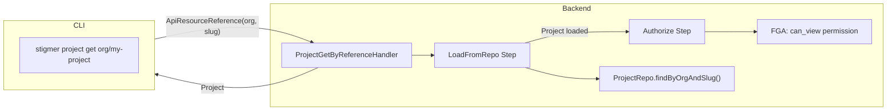

# T05.11: Project GetByReference Handler Implementation

## Objective

Implement `ProjectQueryController.getByReference()` handler that retrieves a Project by `ApiResourceReference` (org + slug), performing authorization after loading since the resource ID is not known upfront.

## Architecture Context




**Key Architectural Decision**: Post-load authorization is required because the input is an `ApiResourceReference` with org + slug, not a resource ID. The FGA check needs the resource ID, which is only available after loading.

## Pattern Reference

Primary pattern: `[McpServerGetByReferenceHandler.java](backend/services/stigmer-service/src/main/java/ai/stigmer/domain/agentic/mcpserver/request/handler/McpServerGetByReferenceHandler.java)`

The handler follows this 5-step pipeline:

1. `validateFieldConstraints` - Validate input reference proto constraints
2. `LoadFromRepo` (custom) - Load Project by org + slug using `projectRepo.findByOrgAndSlug()`
3. `Authorize` (custom) - Post-load FGA check: `can_view` permission on loaded project
4. `transformResponse` - Apply transformations (if any)
5. `sendResponse` - Return Project

## Implementation Details

### File: `ProjectGetByReferenceHandler.java`

**Location**: `backend/services/stigmer-service/src/main/java/ai/stigmer/domain/agentic/project/request/handler/ProjectGetByReferenceHandler.java`

**Structure** (~130-140 lines):

```java
@Slf4j
@Component
@RequiredArgsConstructor
@RequestRoute(controller = ProjectQueryControllerGrpc.class,
        method = ProjectQueryController.Method.getByReference)
public class ProjectGetByReferenceHandler 
    extends CustomOperationHandlerV2<ApiResourceReference, Project> {

    private final RequestOperationCommonSteps<ApiResourceReference, Project> commonSteps;
    private final LoadFromRepo loadFromRepo;
    private final Authorize authorize;
    private final Tracer tracer;

    @Override
    protected RequestPipelineV2<CustomOperationContextV2<ApiResourceReference, Project>> pipeline() {
        // 5-step pipeline with custom LoadFromRepo and Authorize steps
    }

    @Component
    @RequiredArgsConstructor
    static class LoadFromRepo implements RequestPipelineStepV2<...> {
        private final ProjectRepo projectRepo;
        // Validates kind=project, requires org + slug, calls findByOrgAndSlug()
    }

    @Component
    @RequiredArgsConstructor  
    static class Authorize implements RequestPipelineStepV2<...> {
        private final RequestAuthorizationService authorizationService;
        // Post-load FGA check: can_view permission on project:{id}
    }
}
```

**LoadFromRepo Step Validation Order**:

1. Validate `reference.getKind() == ApiResourceKind.project`
2. Validate `slug` is not null/blank
3. Validate `org` is not null/blank (org-scoped resource)
4. Query `projectRepo.findByOrgAndSlug(org, slug)`
5. Return `NOT_FOUND` if empty, set target if found

**Authorize Step Logic**:

1. Extract resource ID from loaded Project: `project.getMetadata().getId()`
2. Build `RpcAuthorizationConfig` with `can_view` permission
3. Delegate to `RequestAuthorizationService.authorize()`
4. Return `PERMISSION_DENIED` if unauthorized

### Test File: `ProjectGetByReferenceHandlerTest.java`

**Location**: `backend/services/stigmer-service/src/test/java/ai/stigmer/domain/agentic/project/request/handler/ProjectGetByReferenceHandlerTest.java`

**Test Coverage** (~400-500 lines):

- Handler Instantiation Tests (4 tests)
  - Constructor injection
  - Class annotations (@Component, @RequestRoute)
  - Routes to `getByReference` method
  - Extends `CustomOperationHandlerV2`
- Pipeline Construction Tests (5 tests)
  - Pipeline name matches handler class
  - Exactly 5 pipeline steps
  - Steps in correct order
  - Uses custom LoadFromRepo and Authorize steps
  - No command-specific steps (persist, publish)
- LoadFromRepo Step Tests (5 tests) - via inner class instantiation
  - Validates resource kind is project
  - Requires slug (not blank)
  - Requires org (not blank)
  - Sets target on success
  - Returns NOT_FOUND when project not found
- Authorize Step Tests (3 tests)
  - Uses can_view permission
  - Uses project resource kind
  - Returns PERMISSION_DENIED on auth failure

## Dependencies

**Handler Dependencies** (injected via constructor):

- `RequestOperationCommonSteps<ApiResourceReference, Project>` - Common pipeline steps
- `LoadFromRepo` - Custom step for org/slug lookup
- `Authorize` - Custom step for post-load FGA check
- `Tracer` - OpenTelemetry tracing

**LoadFromRepo Dependencies**:

- `ProjectRepo` - Already has `findByOrgAndSlug(String orgId, String slug)` method

**Authorize Dependencies**:

- `RequestAuthorizationService` - FGA authorization service

## Quality Checklist

- Handler extends `CustomOperationHandlerV2<ApiResourceReference, Project>`
- `@RequestRoute` routes to `ProjectQueryController.Method.getByReference`
- Pipeline has exactly 5 steps in correct order
- LoadFromRepo validates kind == project
- LoadFromRepo requires both org and slug (not blank)
- LoadFromRepo uses `projectRepo.findByOrgAndSlug()`
- Authorize uses `can_view` permission
- Authorize uses resource ID from loaded project
- Comprehensive JavaDoc documenting pipeline flow
- Debug logging for successful operations
- Warn logging for failures
- Error messages include org/slug for debugging
- Tests cover handler instantiation, pipeline construction, step ordering
- Tests verify annotation presence and values
- Zero linter errors
- Pattern matches McpServerGetByReferenceHandler 100%

## Files to Create


| File                                    | Lines | Description                                           |
| --------------------------------------- | ----- | ----------------------------------------------------- |
| `ProjectGetByReferenceHandler.java`     | ~140  | Handler with LoadFromRepo and Authorize inner classes |
| `ProjectGetByReferenceHandlerTest.java` | ~450  | Comprehensive test coverage                           |


## Estimated Duration

45-60 minutes (as specified in Phase 5 plan)

## Success Criteria

1. Handler compiles and registers with Spring
2. Pipeline executes in correct order (5 steps)
3. Project loaded by org + slug using existing repo method
4. Post-load authorization enforces can_view permission
5. All tests passing
6. Pattern matches McpServerGetByReferenceHandler exactly
7. Zero linter errors

