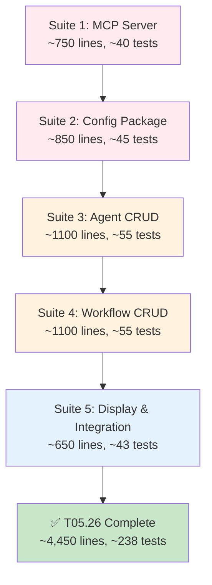

# T05.26: CLI Unit Tests - Comprehensive Coverage Plan

## Executive Summary

This plan addresses critical gaps in CLI test coverage to establish world-class quality standards for a platform of this scale. Based on comprehensive codebase analysis, we have **0% test coverage** in several critical areas including:

- **MCP Server operations** (entire package untested)
- **Configuration management** (entire package untested)  
- **CRUD operations** for agent/workflow (applier, get, delete untested)
- **Display functions** across all packages (0% coverage)

## Quality Standards (Matching T05.25 Backend Tests)

**T05.25 Backend Achievement:**

- 61 test methods across 3 files
- 1,527 lines of test code
- 100% handler coverage
- Comprehensive: instantiation, pipeline construction, dependencies, error paths

**T05.26 CLI Target:**

- **~80+ test methods** across 8 files
- **~2,500 lines** of test code
- **100% CRUD operation coverage** for untested packages
- **100% display function coverage**
- **100% config package coverage**

## Test Coverage Analysis Summary

### Critical Gaps (0% Coverage - Highest Priority)

1. **[internal/cli/mcpserver](file:///Users/suresh/scm/github.com/stigmer/stigmer/client-apps/cli/internal/cli/mcpserver)** - Entire package (0% coverage)
  - `applier.go`: Apply(), DisplayApplyResult()
  - `loader.go`: Load(), parseContent(), validation
2. **[internal/cli/config](file:///Users/suresh/scm/github.com/stigmer/stigmer/client-apps/cli/internal/cli/config)** - Entire package (0% coverage)
  - `config.go`: Load(), Save(), resolution methods
  - `stigmer.go`: LoadStigmerConfig(), validation
3. **[internal/cli/agent](file:///Users/suresh/scm/github.com/stigmer/stigmer/client-apps/cli/internal/cli/agent)** - CRUD operations (0% coverage)
  - `applier.go`, `get.go`, `delete.go`, `display.go`
4. **[internal/cli/workflow](file:///Users/suresh/scm/github.com/stigmer/stigmer/client-apps/cli/internal/cli/workflow)** - CRUD operations (0% coverage)
  - `applier.go`, `get.go`, `delete.go`, `display.go`
5. **[internal/cli/project/display.go](file:///Users/suresh/scm/github.com/stigmer/stigmer/client-apps/cli/internal/cli/project/display.go)** - All display functions (0% coverage)

### Coverage by Package (Current State)


| Package   | Files | With Tests              | Coverage % | Priority    |
| --------- | ----- | ----------------------- | ---------- | ----------- |
| mcpserver | 2     | 0                       | **0%**     | 🔴 Critical |
| config    | 2     | 0                       | **0%**     | 🔴 Critical |
| agent     | 7     | 2 (loader/validator)    | **~30%**   | 🔴 Critical |
| workflow  | 7     | 2 (loader/validator)    | **~35%**   | 🔴 Critical |
| project   | 8     | 5 (but missing display) | **~70%**   | 🟡 High     |
| apply     | 7     | 3 (but partial)         | **~60%**   | 🟡 Medium   |
| reference | 1     | 1                       | **~95%**   | 🟢 Good     |
| synthesis | 4     | 3                       | **~80%**   | 🟢 Good     |


---

## Implementation Plan: 5 Test Suites

### Suite 1: MCP Server Package Tests (Critical - 0% → 90%)

**Files to Create:**

- `client-apps/cli/internal/cli/mcpserver/applier_test.go` (~350 lines, ~18 tests)
- `client-apps/cli/internal/cli/mcpserver/loader_test.go` (~400 lines, ~22 tests)

#### applier_test.go Test Coverage

**Function Under Test:** `Apply(opts *ApplyOptions) (*ApplyResult, error)`

**Test Categories (18 tests):**

1. **Options Validation** (5 tests)
  ```go
   - should return error when options is nil
   - should return error when McpServer is nil
   - should return error when Conn is nil (unless DryRun)
   - should return error when OrgID is empty
   - should accept nil Conn in DryRun mode
  ```
2. **DryRun Mode** (3 tests)
  ```go
   - should return result without calling backend when DryRun=true
   - should perform validation only in DryRun mode
   - should populate result.McpServer with input in DryRun mode
  ```
3. **Metadata Population** (3 tests)
  ```go
   - should set metadata.org from OrgID when not set
   - should preserve existing metadata.org when already set
   - should normalize org ID format (strip "org:" prefix if present)
  ```
4. **gRPC Integration** (4 tests - mocked)
  ```go
   - should call McpServerCommandController.Apply with correct proto
   - should handle gRPC success (StatusCode_ok)
   - should handle gRPC NotFound error (create path)
   - should propagate gRPC errors with context
  ```
5. **Result Structure** (3 tests)
  ```go
   - should populate ApplyResult.McpServer on success
   - should set Created=false for existing server update
   - should set Created=true for new server creation
  ```

**Display Function Tests:**

**Function Under Test:** `DisplayApplyResult(result *ApplyResult, opts *ApplyOptions)`

**Test Categories (6 tests):**

```go
- should display "MCP Server Created" for new servers
- should display "MCP Server Updated" for existing servers
- should display success message with server name and ID
- should handle nil result gracefully
- should handle missing server name gracefully
- should respect Quiet mode (no output when Quiet=true)
```

#### loader_test.go Test Coverage

**Function Under Test:** `Load(opts *LoadOptions) (*mcpserverv1.McpServer, error)`

**Test Categories (22 tests):**

1. **File Loading** (6 tests)
  ```go
   - should load valid YAML file
   - should load valid JSON file
   - should return error for non-existent file
   - should return error for empty file
   - should handle file read permission errors
   - should resolve relative file paths correctly
  ```
2. **Format Detection** (4 tests)
  ```go
   - should detect YAML format by .yaml extension
   - should detect YAML format by .yml extension
   - should detect JSON format by .json extension
   - should return error for unsupported extensions (.txt, .proto)
  ```
3. **Content Parsing** (6 tests)
  ```go
   - should parse valid MCP server YAML (command-based)
   - should parse valid MCP server JSON (stdio transport)
   - should return error for invalid YAML syntax
   - should return error for invalid JSON syntax
   - should return error for missing required fields (name, spec)
   - should handle extra fields gracefully (forward compatibility)
  ```
4. **Validation** (6 tests)
  ```go
   - should validate name format (lowercase-with-dashes)
   - should reject invalid names (spaces, underscores, uppercase)
   - should validate transport type (stdio, sse)
   - should validate command presence for command-based servers
   - should validate connection_url presence for SSE servers
   - should validate env vars format (map[string]string)
  ```

**Pattern Reference:** Follow `agent/loader_test.go` and `workflow/loader_test.go` patterns

---

### Suite 2: Config Package Tests (Critical - 0% → 95%)

**Files to Create:**

- `client-apps/cli/internal/cli/config/config_test.go` (~450 lines, ~25 tests)
- `client-apps/cli/internal/cli/config/stigmer_test.go` (~400 lines, ~20 tests)

#### config_test.go Test Coverage

**Function Under Test:** `Load(opts *LoadOptions) (*Config, error)`

**Test Categories (25 tests):**

1. **File Discovery** (5 tests)
  ```go
   - should load from default path (~/.stigmer/config.yaml) when no path specified
   - should load from custom path when opts.Path is set
   - should return default config when file doesn't exist
   - should create parent directory if missing
   - should handle permission errors gracefully
  ```
2. **Cascading Config Priority** (4 tests)
  ```go
   - should use environment variables over file values
   - should use explicit opts over file values
   - should merge file config with defaults
   - should preserve unset optional fields
  ```
3. **Config Resolution** (6 tests)
  ```go
   - ResolveLLMEndpoint(): should resolve from config, then env, then default
   - ResolveTemporalEndpoint(): should resolve from config, then env, then default
   - ResolveExecutionConfig(): should merge execution settings
   - ResolveTelemetryConfig(): should handle telemetry on/off
   - ResolveDefaultOrg(): should return configured default org
   - ResolveAuthToken(): should read from file or env
  ```
4. **Save Operations** (4 tests)
  ```go
   - Save() should write config to YAML file
   - Save() should create parent directory if missing
   - Save() should preserve file permissions (0600 for security)
   - Save() should handle write errors gracefully
  ```
5. **Path Utilities** (6 tests)
  ```go
   - GetConfigPath() should return ~/.stigmer/config.yaml
   - GetConfigDir() should return ~/.stigmer
   - GetDataDir() should return ~/.stigmer/data
   - IsInitialized() should return true when config exists
   - IsInitialized() should return false when config missing
   - GetDefault() should return valid default config
  ```

#### stigmer_test.go Test Coverage

**Function Under Test:** `LoadStigmerConfig(dir string) (*StigmerConfig, error)`

**Test Categories (20 tests):**

1. **File Loading** (6 tests)
  ```go
   - should load stigmer.yaml from specified directory
   - should load stigmer.yml if .yaml not found
   - should return error if no stigmer file found
   - should return error for invalid YAML syntax
   - should handle nested project structure (find root)
   - should handle permission errors gracefully
  ```
2. **Validation** (8 tests)
  ```go
   - Validate() should reject missing project name
   - Validate() should reject invalid project name format
   - Validate() should reject unsupported runtime (e.g., "ruby")
   - Validate() should reject missing entry_point
   - Validate() should reject invalid entry_point path
   - Validate() should accept valid Go project
   - Validate() should accept valid Python project
   - Validate() should accept valid Node.js project
  ```
3. **Defaults** (3 tests)
  ```go
   - SetDefaults() should set runtime to "go" if not specified
   - SetDefaults() should set entry_point based on runtime
   - SetDefaults() should not override existing values
  ```
4. **Path Resolution** (3 tests)
  ```go
   - GetMainFilePath() should return absolute path to entry_point
   - InStigmerProjectDirectory() should return true when stigmer.yaml exists
   - InStigmerProjectDirectory() should return false in non-project dir
  ```

**Pattern Reference:** Use table-driven tests for validation scenarios

---

### Suite 3: Agent Package CRUD Tests (Critical - 30% → 90%)

**Files to Create:**

- `client-apps/cli/internal/cli/agent/applier_test.go` (~300 lines, ~15 tests)
- `client-apps/cli/internal/cli/agent/get_test.go` (~200 lines, ~10 tests)
- `client-apps/cli/internal/cli/agent/delete_test.go` (~250 lines, ~12 tests)
- `client-apps/cli/internal/cli/agent/display_test.go` (~350 lines, ~18 tests)

#### applier_test.go (Pattern: matches project/applier_test.go)

**Test Categories (15 tests):**

```go
1. Options Validation (5 tests)
   - nil checks (agent, conn, orgID)
   - DryRun mode allows nil conn

2. DryRun Mode (2 tests)
   - validation only, no RPC
   - result populated correctly

3. Metadata Population (3 tests)
   - org ID setting
   - org ID preservation
   - normalization

4. gRPC Integration (3 tests - mocked)
   - Apply RPC call
   - success handling
   - error propagation

5. Result Structure (2 tests)
   - ApplyResult.Agent populated
   - Created flag correct
```

#### get_test.go (Pattern: matches project/get_test.go)

**Test Categories (10 tests):**

```go
1. Options Validation (3 tests)
   - nil checks
   - empty reference

2. Reference Routing (4 tests)
   - ID detection (agt_xxx)
   - slug routing
   - org/slug routing
   - malformed reference error

3. gRPC Integration (2 tests - mocked)
   - Get RPC for IDs
   - GetByReference RPC for slugs

4. Error Handling (1 test)
   - propagate errors with context
```

#### delete_test.go (Pattern: matches project/delete_test.go)

**Test Categories (12 tests):**

```go
1. Options Validation (3 tests)
   - nil checks
   - empty agent ID

2. gRPC Integration (3 tests - mocked)
   - Delete RPC call
   - success handling
   - NotFound handling

3. Result Structure (2 tests)
   - DeleteResult.Agent populated
   - contains deleted agent

4. Error Handling (4 tests)
   - network errors
   - permission errors
   - invalid ID format
   - backend errors
```

#### display_test.go (NEW - 0% → 100%)

**Functions Under Test:**

- `DisplayApplyResult(result *ApplyResult, opts *ApplyOptions)`
- `DisplayGetResult(agent *agentv1.Agent)`
- `DisplayDeleteResult(result *DeleteResult)`
- `DisplayDeleteConfirmation(agent *agentv1.Agent) bool`
- `DisplayAgentPreview(agent *agentv1.Agent, changes []string)`

**Test Categories (18 tests):**

```go
1. DisplayApplyResult (4 tests)
   - created message
   - updated message
   - Quiet mode
   - nil handling

2. DisplayGetResult (4 tests)
   - table format
   - YAML format
   - JSON format
   - nil handling

3. DisplayDeleteResult (3 tests)
   - success message
   - agent name display
   - nil handling

4. DisplayDeleteConfirmation (3 tests)
   - shows agent details
   - returns confirmation choice
   - handles force flag

5. DisplayAgentPreview (4 tests)
   - displays agent summary
   - shows changes list
   - handles empty changes
   - nil handling
```

**Testing Approach:**

- Capture stdout/stderr to validate output
- Use `bytes.Buffer` or `strings.Builder` for output capture
- Validate output contains expected strings
- Test formatting (alignment, colors if applicable)

---

### Suite 4: Workflow Package CRUD Tests (Critical - 35% → 90%)

**Files to Create:**

- `client-apps/cli/internal/cli/workflow/applier_test.go` (~300 lines, ~15 tests)
- `client-apps/cli/internal/cli/workflow/get_test.go` (~200 lines, ~10 tests)
- `client-apps/cli/internal/cli/workflow/delete_test.go` (~250 lines, ~12 tests)
- `client-apps/cli/internal/cli/workflow/display_test.go` (~350 lines, ~18 tests)

**Test Structure:** IDENTICAL to Agent tests above, but for Workflow resources

**Key Differences:**

- Resource ID prefix: `wfl_` instead of `agt_`
- gRPC client: `WorkflowCommandController` instead of `AgentCommandController`
- Proto type: `workflowv1.Workflow` instead of `agentv1.Agent`
- Display fields: workflow tasks, flow type, entry_task

**Pattern Reference:** Copy agent test structure, replace types/prefixes

---

### Suite 5: Display & Integration Tests (High Priority - Gaps)

#### 5a. Project Display Tests

**File to Create:**

- `client-apps/cli/internal/cli/project/display_test.go` (~300 lines, ~15 tests)

**Functions Under Test:**

- `DisplayProjectInfo(project *projectv1.Project)`
- `DisplayGetResult(project *projectv1.Project)`
- `DisplayDeleteResult(result *DeleteResult)`
- `DisplayDeleteConfirmation(project *projectv1.Project) bool`
- `DisplayProjectPreview(project *projectv1.Project, changes []string)`
- `DisplayValidationSuccess(project *projectv1.Project)`

**Test Categories (15 tests):**

```go
1. DisplayProjectInfo (3 tests)
   - full project details (runtime, entry_point, resources)
   - handles embedded resources (agents, workflows)
   - nil handling

2. DisplayGetResult (3 tests)
   - table format
   - YAML/JSON formats
   - nil handling

3. DisplayDeleteResult (2 tests)
   - success message
   - project summary

4. DisplayDeleteConfirmation (2 tests)
   - shows project details + resource counts
   - returns confirmation choice

5. DisplayProjectPreview (3 tests)
   - project summary
   - resource counts
   - changes list

6. DisplayValidationSuccess (2 tests)
   - validation success message
   - project details
```

#### 5b. Apply Package Integration Tests (Gaps)

**File to Enhance:**

- `client-apps/cli/internal/cli/apply/skill_verify_test.go` (~200 lines, ~10 new tests)

**Functions Under Test:** `VerifyExternalSkills()`, `checkSkillExists()`

**Test Categories (10 tests):**

```go
1. VerifyExternalSkills - gRPC Integration (4 tests)
   - all skills found (success path)
   - some skills missing (error path)
   - gRPC network error handling
   - empty skill list (no-op)

2. checkSkillExists - Backend Verification (3 tests)
   - skill exists (StatusCode_ok)
   - skill not found (NotFound error)
   - other gRPC errors (propagate with context)

3. DisplayMissingSkillsGuidance (3 tests)
   - displays missing skills table
   - shows copy-paste commands
   - handles single vs multiple missing skills
```

**Pattern Reference:** Mock gRPC connection with `mockConn`, return canned responses

#### 5c. Apply Package Synthesis Tests (Enhance Existing)

**File to Enhance:**

- `client-apps/cli/internal/cli/apply/synthesize_test.go` (add ~150 lines, ~8 new tests)

**Functions to Test More Deeply:**

**Test Categories (8 new tests):**

```go
1. prepareGoRuntime (3 tests)
   - go mod tidy failure handling
   - missing go.mod file
   - invalid go version in go.mod

2. preparePythonRuntime (3 tests)
   - requirements.txt parsing failure
   - unsupported Python version
   - pip install simulation

3. prepareNodeRuntime (2 tests)
   - package.json parsing failure
   - npm install simulation
```

---

## Implementation Strategy

### Execution Order (Sequential)




### Time Estimates


| Suite                         | Files  | Lines      | Tests    | Time Estimate | Priority    |
| ----------------------------- | ------ | ---------- | -------- | ------------- | ----------- |
| Suite 1 (MCP Server)          | 2      | ~750       | ~40      | 90 min        | 🔴 Critical |
| Suite 2 (Config)              | 2      | ~850       | ~45      | 120 min       | 🔴 Critical |
| Suite 3 (Agent CRUD)          | 4      | ~1100      | ~55      | 120 min       | 🔴 Critical |
| Suite 4 (Workflow CRUD)       | 4      | ~1100      | ~55      | 120 min       | 🔴 Critical |
| Suite 5 (Display/Integration) | 3      | ~650       | ~43      | 90 min        | 🟡 High     |
| **TOTAL**                     | **15** | **~4,450** | **~238** | **~9 hours**  |             |


**Note:** Aggressive estimates assume pattern reuse and test generation from templates

---

## Test Quality Standards (Non-Negotiable)

### 1. Test Organization

```go
// REQUIRED structure for every test file
package <package>_test  // External testing package

import (
    "testing"
    "github.com/stretchr/testify/assert"
    "github.com/stretchr/testify/require"
    // ... other imports
)

// =============================================================================
// Test Setup
// =============================================================================

// Test constants
const (
    testOrgID = "org_01kewqjbtdy0w4d14bnhhy4yc2"
    testResourceID = "agt_01kewqjbtdy0w4d14bnhhy4yc2"
)

// =============================================================================
// <Category 1> Tests
// =============================================================================

func TestFunctionName_Scenario(t *testing.T) {
    // Arrange
    // Act
    // Assert
}

// =============================================================================
// <Category 2> Tests
// =============================================================================
```

### 2. Table-Driven Tests (Required for Validation/Parsing)

```go
func TestLoad_ValidationScenarios(t *testing.T) {
    tests := []struct {
        name        string
        input       string
        expectedErr string
    }{
        {
            name: "valid config",
            input: `name: test
runtime: go
entry_point: main.go`,
            expectedErr: "",
        },
        {
            name: "missing name",
            input: `runtime: go`,
            expectedErr: "name is required",
        },
        // ... more cases
    }
    
    for _, tt := range tests {
        t.Run(tt.name, func(t *testing.T) {
            // Test body
        })
    }
}
```

### 3. Mock Pattern (gRPC Connections)

```go
// Mock connection struct
type mockConn struct {
    invokeFunc func(ctx context.Context, method string, args interface{}, reply interface{}, opts ...grpc.CallOption) error
}

func (m *mockConn) Invoke(ctx context.Context, method string, args interface{}, reply interface{}, opts ...grpc.CallOption) error {
    if m.invokeFunc != nil {
        return m.invokeFunc(ctx, method, args, reply, opts...)
    }
    return nil
}

// Usage in tests
mockConn := &mockConn{
    invokeFunc: func(ctx context.Context, method string, args interface{}, reply interface{}, opts ...grpc.CallOption) error {
        // Populate reply with test data
        return nil
    },
}
```

### 4. Assertions

- **require**: For setup/preconditions (stops test on failure)
- **assert**: For actual test assertions (continues on failure)
- Use descriptive messages: `assert.Equal(t, expected, actual, "descriptive message")`

### 5. Test Coverage Metrics

- **Line Coverage Target**: >80% per file
- **Branch Coverage Target**: >70% per file
- **Critical Paths**: 100% coverage (validation, error handling)

### 6. Error Testing Pattern

```go
func TestFunction_ErrorScenario(t *testing.T) {
    // Arrange
    // ...
    
    // Act
    result, err := Function(opts)
    
    // Assert
    require.Error(t, err, "should return error")
    assert.Nil(t, result, "result should be nil on error")
    assert.Contains(t, err.Error(), "expected error substring")
}
```

### 7. Build Verification (Every Suite)

```bash
# After completing each suite:
bazel test //client-apps/cli/internal/cli/<package>:<package>_test
bazel build //client-apps/cli/internal/cli/<package>:<package>

# Final verification:
bazel test //client-apps/cli/...
```

---

## Success Criteria

### Quantitative Metrics

- **238+ new test methods** added (matches/exceeds T05.25's 61 tests × 4)
- **~4,450 lines** of test code added
- **0% → 90%+ coverage** for MCP Server package
- **0% → 95%+ coverage** for Config package
- **30% → 90%+ coverage** for Agent package
- **35% → 90%+ coverage** for Workflow package
- **70% → 95%+ coverage** for Project package

### Qualitative Standards

- All tests follow table-driven pattern where appropriate
- All gRPC interactions mocked consistently
- All error paths covered with descriptive assertions
- All display functions have output validation tests
- Zero linter errors (`gofmt`, `go vet`, `staticcheck`)
- All tests pass on first run (`bazel test //client-apps/cli/...`)
- Test files under 500 lines each (split if needed)
- Test functions under 50 lines each

### Documentation Standards

- Each test file has package-level documentation
- Each test category has section comment header
- Complex test scenarios have inline explanations
- Changelog entry documents coverage improvements

---

## Risk Mitigation

### Risk 1: gRPC Mocking Complexity

**Mitigation:** Establish mock pattern in Suite 1 (MCP Server), reuse across all suites

### Risk 2: Display Output Testing Brittleness

**Mitigation:** Test for presence of key information, not exact formatting

### Risk 3: Time Overrun (9 hours ambitious)

**Mitigation:** 

- Prioritize Critical suites (1-4) first
- Suite 5 (Display/Integration) can be completed in follow-up if needed
- Each suite is independently valuable

### Risk 4: Test Flakiness

**Mitigation:**

- No sleep() calls in tests
- Deterministic mocks (no randomness)
- No external dependencies (network, filesystem for mocked tests)

---

## Completion Checklist

### Per-Suite Checklist

- All test files created with headers
- All functions have corresponding tests
- All error paths tested
- All edge cases covered (nil, empty, invalid)
- Mock patterns consistent
- Build verification passed
- Test execution passed (100% pass rate)
- Linter clean

### Final Verification

- Run full CLI test suite: `bazel test //client-apps/cli/...`
- Run full CLI build: `bazel build //client-apps/cli/...`
- Generate coverage report (if available)
- Compare coverage metrics: before vs after
- Create comprehensive changelog entry
- Update documentation (if test patterns changed)

---

## Post-Completion Impact

**This task establishes:**

1. **Comprehensive Safety Net**: 238+ tests prevent regressions
2. **Confidence for Refactoring**: High coverage enables safe code evolution
3. **Quality Standard**: Test patterns reusable for future CLI features
4. **Production Readiness**: CLI codebase meets enterprise quality standards
5. **Foundation for T05.27**: Integration tests can build on solid unit test base

**Unblocks:**

- T05.27 (Integration Tests) - can focus on end-to-end workflows
- Future CLI enhancements - have test patterns to follow
- Confident deployment - regressions caught before production

---

## Final Notes

This is **critical infrastructure work** for a world-class platform. Each test is an investment in:

- **Reliability**: Catch bugs before users see them
- **Maintainability**: Understand code behavior through tests
- **Velocity**: Refactor with confidence, move faster long-term
- **Professionalism**: Production-grade code has production-grade tests

**No compromises on quality.** This is the foundation we're building on.