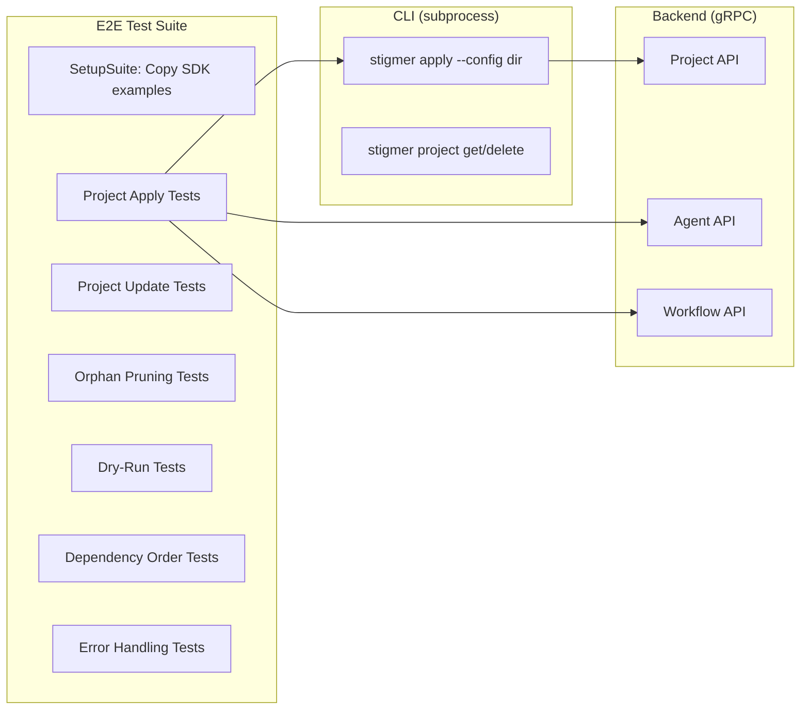

# T05.27: Integration Tests - End-to-End SDK to Deploy Workflow

## Context

The Phase 5 implementation has built a comprehensive Project Track architecture:

- **CLI**: `stigmer apply` command with SDK synthesis, manifest collection, and project apply
- **Backend**: ProjectReconciliationService with dependency graph derivation, diff algorithm, and ordered execution

The existing E2E test infrastructure covers the **Atomic Track** (individual agent/workflow deployment). T05.27 adds coverage for the **Project Track** (full reconciliation lifecycle).

## Architecture Overview




## Test Scenarios (from Phase 5 plan)

1. **Fresh project deployment** - All creates
2. **Project update** - Creates + updates
3. **Resource removal** - Orphan pruning
4. **Dry-run mode** - Validates without execution
5. **Backend derives dependency graph** - Ordering verification
6. **Circular dependency detection** - Error handling
7. **Error handling** - Invalid SDK, backend errors

## Implementation Plan

### 1. Test Infrastructure Additions

**File**: `[test/e2e/project_test_constants.go](test/e2e/project_test_constants.go)`

Constants for project tests:

```go
const (
    // Test fixture directories
    ProjectBasicTestDataDir     = "testdata/project/basic-project"
    ProjectMultiAgentTestDataDir = "testdata/project/multi-agent-project"
    ProjectUpdateTestDataDir    = "testdata/project/update-project"
    ProjectOrphanTestDataDir    = "testdata/project/orphan-project"
    ProjectCircularTestDataDir  = "testdata/project/circular-deps"
    
    // Project slugs
    BasicProjectName     = "basic-project"
    MultiAgentProjectName = "multi-agent-orchestrator"
)
```

**File**: `[test/e2e/project_test_helpers.go](test/e2e/project_test_helpers.go)`

Helper functions:

- `ApplyProject(t, serverPort, testDir)` - Execute apply and return result
- `GetProjectBySlug(serverPort, slug, org)` - Query project via gRPC
- `VerifyProjectResources(t, project, agents, workflows)` - Verify embedded resources
- `VerifyReconciliationSummary(t, output, creates, updates, deletes)` - Parse CLI output

**File**: `[test/e2e/helpers_test.go](test/e2e/helpers_test.go)` (additions)

New gRPC helpers:

```go
// GetProjectViaAPI retrieves a project by ID
func GetProjectViaAPI(serverPort int, projectID string) (*projectv1.Project, error)

// GetProjectBySlug queries a project by slug and org
func GetProjectBySlug(serverPort int, slug, org string) (*projectv1.Project, error)

// DeleteProjectViaAPI deletes a project
func DeleteProjectViaAPI(serverPort int, projectID string) error
```

### 2. Test Fixtures

**Directory structure**:

```
test/e2e/testdata/project/
├── basic-project/
│   ├── Stigmer.yaml          # Project manifest
│   └── main.go               # SDK code (1 agent, 1 workflow)
├── multi-agent-project/
│   ├── Stigmer.yaml          
│   └── main.go               # 3 agents, 1 MCP server, 1 workflow
├── update-project/
│   ├── v1/                   # Initial version
│   │   ├── Stigmer.yaml
│   │   └── main.go
│   └── v2/                   # Updated version (modified agent)
│       ├── Stigmer.yaml
│       └── main.go
├── orphan-project/
│   ├── v1/                   # Has 3 agents
│   │   ├── Stigmer.yaml
│   │   └── main.go
│   └── v2/                   # Has 2 agents (1 removed = orphan)
│       ├── Stigmer.yaml
│       └── main.go
└── circular-deps/
    ├── Stigmer.yaml
    └── main.go               # Agent A references Agent B which references A
```

### 3. Test Files

**File**: `[test/e2e/project_apply_fresh_test.go](test/e2e/project_apply_fresh_test.go)`

Scenario 1: Fresh project deployment (all creates)

```go
func (s *E2ESuite) TestProjectApplyFreshDeployment() {
    // Apply basic project
    // Verify all resources created
    // Verify reconciliation summary shows all creates
}

func (s *E2ESuite) TestProjectApplyMultiAgent() {
    // Apply multi-agent project
    // Verify 3 agents + 1 MCP server + 1 workflow created
    // Verify dependency ordering in reconciliation summary
}
```

**File**: `[test/e2e/project_apply_update_test.go](test/e2e/project_apply_update_test.go)`

Scenario 2: Project update (creates + updates)

```go
func (s *E2ESuite) TestProjectApplyUpdate() {
    // Step 1: Apply v1
    // Step 2: Apply v2 (modified agent)
    // Verify: reconciliation summary shows 1 update
    // Verify: agent spec changed
}
```

**File**: `[test/e2e/project_apply_orphan_test.go](test/e2e/project_apply_orphan_test.go)`

Scenario 3: Orphan pruning

```go
func (s *E2ESuite) TestProjectApplyOrphanPruning() {
    // Step 1: Apply v1 (3 agents)
    // Step 2: Apply v2 (2 agents, 1 removed)
    // Verify: reconciliation summary shows 1 delete
    // Verify: orphan agent no longer exists
}

func (s *E2ESuite) TestProjectApplyNoPruneFlag() {
    // Step 1: Apply v1 (3 agents)
    // Step 2: Apply v2 with --prune=false
    // Verify: orphan agent still exists
}
```

**File**: `[test/e2e/project_apply_dryrun_test.go](test/e2e/project_apply_dryrun_test.go)`

Scenario 4: Dry-run mode

```go
func (s *E2ESuite) TestProjectApplyDryRun() {
    // Apply with --dry-run
    // Verify: no resources created
    // Verify: dry-run output shows planned changes
}

func (s *E2ESuite) TestProjectApplyDryRunShowsDependencies() {
    // Apply multi-agent with --dry-run
    // Verify: output shows dependency order
}
```

**File**: `[test/e2e/project_apply_deps_test.go](test/e2e/project_apply_deps_test.go)`

Scenario 5: Dependency graph verification

```go
func (s *E2ESuite) TestProjectApplyDependencyOrder() {
    // Apply project with: MCP -> Agent -> Workflow
    // Verify: MCP created before Agent
    // Verify: Agent created before Workflow
    // (Check via timestamps or reconciliation order in summary)
}
```

**File**: `[test/e2e/project_apply_error_test.go](test/e2e/project_apply_error_test.go)`

Scenarios 6-7: Error handling

```go
func (s *E2ESuite) TestProjectApplyCircularDependency() {
    // Apply project with circular deps
    // Verify: error message about cycle
    // Verify: no resources created
}

func (s *E2ESuite) TestProjectApplyInvalidSDK() {
    // Apply project with syntax error in SDK
    // Verify: clear error message
}

func (s *E2ESuite) TestProjectApplyMissingSkill() {
    // Apply project referencing non-existent skill
    // Verify: validation error before deployment
}
```

### 4. Implementation Order


| Step | File                           | Description                         |
| ---- | ------------------------------ | ----------------------------------- |
| 1    | `project_test_constants.go`    | Constants and test data directories |
| 2    | `helpers_test.go`              | Project gRPC query helpers          |
| 3    | `project_test_helpers.go`      | Project-specific test utilities     |
| 4    | `testdata/project/`            | Test fixtures (SDK examples)        |
| 5    | `project_apply_fresh_test.go`  | Fresh deployment tests              |
| 6    | `project_apply_dryrun_test.go` | Dry-run tests                       |
| 7    | `project_apply_update_test.go` | Update tests                        |
| 8    | `project_apply_orphan_test.go` | Orphan pruning tests                |
| 9    | `project_apply_deps_test.go`   | Dependency order tests              |
| 10   | `project_apply_error_test.go`  | Error handling tests                |


### 5. Key Patterns to Follow

**From existing E2E tests**:

- Use `RunCLIWithServerAddr()` for CLI execution
- Query via gRPC API, not CLI parsing
- Use `t.TempDir()` for isolation where needed
- Follow table-driven test structure
- Use `testify/require` for assertions
- Log progress with `t.Logf()`

**Test structure**:

```go
func (s *E2ESuite) TestProjectApply...() {
    // STEP 1: Setup/Apply
    // STEP 2: Execute command
    // STEP 3: Verify CLI output
    // STEP 4: Query via API
    // STEP 5: Verify properties
    // STEP 6: Summary log
}
```

### 6. Success Criteria

- All 7 test scenarios covered
- Tests follow existing E2E patterns exactly
- Tests are deterministic (no flakiness)
- Tests run against shared stigmer server
- Test fixtures reuse SDK example patterns
- Clear documentation in test comments

### 7. Files to Create/Modify


| File                                    | Action | Lines (est.) |
| --------------------------------------- | ------ | ------------ |
| `test/e2e/project_test_constants.go`    | Create | ~40          |
| `test/e2e/project_test_helpers.go`      | Create | ~200         |
| `test/e2e/helpers_test.go`              | Modify | +50          |
| `test/e2e/testdata/project/`            | Create | 6 fixtures   |
| `test/e2e/project_apply_fresh_test.go`  | Create | ~80          |
| `test/e2e/project_apply_dryrun_test.go` | Create | ~70          |
| `test/e2e/project_apply_update_test.go` | Create | ~90          |
| `test/e2e/project_apply_orphan_test.go` | Create | ~100         |
| `test/e2e/project_apply_deps_test.go`   | Create | ~80          |
| `test/e2e/project_apply_error_test.go`  | Create | ~100         |
| `test/e2e/BUILD.bazel`                  | Modify | +10          |


**Total**: ~820 lines of test code + 6 SDK fixtures

### 8. Reference Files

**Existing E2E patterns**:

- `[test/e2e/basic_agent_apply_core_test.go](test/e2e/basic_agent_apply_core_test.go)` - Apply test pattern
- `[test/e2e/agent_test_helpers.go](test/e2e/agent_test_helpers.go)` - Helper pattern
- `[test/e2e/helpers_test.go](test/e2e/helpers_test.go)` - gRPC query pattern

**CLI implementation**:

- `[client-apps/cli/cmd/stigmer/root/apply.go](client-apps/cli/cmd/stigmer/root/apply.go)` - Apply command
- `[client-apps/cli/internal/cli/project/applier.go](client-apps/cli/internal/cli/project/applier.go)` - Project applier

**Backend reconciliation**:

- `[ReconciliationPlanTest.java](backend/services/stigmer-service/src/test/java/ai/stigmer/domain/agentic/project/reconcile/ReconciliationPlanTest.java)` - Backend test patterns

