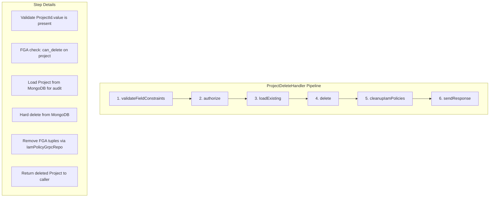

# T05.8: Project Delete Handler Implementation

## Architecture Context

The Project entity is the **aggregate root** for resource lifecycle management in the Stigmer platform. Deleting a project is a critical operation that:

- Removes the project from MongoDB
- Cleans up all FGA authorization tuples (scope and owner links)
- Returns the deleted project for audit trail

The handler follows the **proven pipeline-based architecture** used across all Stigmer domain handlers, ensuring consistency, maintainability, and proper separation of concerns.

## Implementation Details

### File to Create

**Path**: `backend/services/stigmer-service/src/main/java/ai/stigmer/domain/agentic/project/request/handler/ProjectDeleteHandler.java`

### Pipeline Architecture

The delete operation follows a 6-step pipeline:




### Type Parameters

The handler uses these generic types:

- **Input (I)**: `ProjectId` - Contains `value` field with project ID string
- **Output (O)**: `Project` - The deleted project proto (returned for audit/confirmation)

### Authorization (Proto-Level Configuration)

Authorization is already configured in [command.proto](apis/ai/stigmer/agentic/project/v1/command.proto):

```protobuf
rpc delete(ProjectId) returns (Project) {
  option (ai.stigmer.iam.iampolicy.v1.rpcauthorization.config).resource_kind = project;
  option (ai.stigmer.iam.iampolicy.v1.rpcauthorization.config).permission = can_delete;
  option (ai.stigmer.iam.iampolicy.v1.rpcauthorization.config).field_path = "value";
  option (ai.stigmer.iam.iampolicy.v1.rpcauthorization.config).error_msg = "unauthorized to delete project";
}
```

The `commonSteps.authorize` step reads this configuration automatically.

### FGA Tuples Cleaned Up

The `cleanupIamPolicies` step removes all authorization tuples where this project appears:

- **Scope link**: `project:{id}#organization@organization:{org_id}`
- **Owner link**: `project:{id}#owner@identity_account:{creator_id}`
- **Any viewer/editor links** that were granted

### Pattern Reference

Following the exact structure from:

- [McpServerDeleteHandler.java](backend/services/stigmer-service/src/main/java/ai/stigmer/domain/agentic/mcpserver/request/handler/McpServerDeleteHandler.java) - 75 lines
- [AgentDeleteHandler.java](backend/services/stigmer-service/src/main/java/ai/stigmer/domain/agentic/agent/request/handler/AgentDeleteHandler.java) - 52 lines
- [SkillDeleteHandler.java](backend/services/stigmer-service/src/main/java/ai/stigmer/domain/agentic/skill/request/handler/SkillDeleteHandler.java) - 52 lines

### Implementation Code

```java
package ai.stigmer.domain.agentic.project.request.handler;

import ai.stigmer.domain.agentic.project.request.controller.ProjectCommandController;
import ai.stigmer.grpcrequest.context.DeleteContextV2;
import ai.stigmer.grpcrequest.handler.DeleteOperationHandlerV2;
import ai.stigmer.grpcrequest.pipeline.RequestPipelineV2;
import ai.stigmer.grpcrequest.pipeline.step.common.RequestOperationCommonSteps;
import ai.stigmer.grpcrequest.pipeline.step.delete.DeleteOperationSteps;
import ai.stigmer.grpcrequest.routing.RequestRoute;
import io.opentelemetry.api.trace.Tracer;
import lombok.RequiredArgsConstructor;
import lombok.extern.slf4j.Slf4j;
import org.springframework.stereotype.Component;
import protos.ai.stigmer.agentic.project.v1.Project;
import protos.ai.stigmer.agentic.project.v1.ProjectCommandControllerGrpc;
import protos.ai.stigmer.agentic.project.v1.ProjectId;
```

**Key implementation aspects**:

- Extends `DeleteOperationHandlerV2<ProjectId, Project>`
- Uses `@RequestRoute` annotation to bind to gRPC method
- Injects `RequestOperationCommonSteps`, `DeleteOperationSteps`, and `Tracer`
- Pipeline configured with 6 steps in correct order
- Comprehensive JavaDoc documenting behavior, authorization, and cleanup

### Directory Structure After Implementation

```
project/
├── repo/
│   └── ProjectRepo.java ✅ (exists)
└── request/
    ├── controller/
    │   └── ProjectGrpcAutoController.java ✅ (exists)
    └── handler/
        └── ProjectDeleteHandler.java (NEW)
```

### Quality Standards

This implementation must meet:

- **100% pattern fidelity** with existing delete handlers
- **Comprehensive JavaDoc** documenting all aspects
- **Proper OpenTelemetry tracing** via injected Tracer
- **Clean compilation** with zero warnings
- **Consistent imports** (alphabetically sorted)

### Future Considerations (NOT in this task)

Noted for documentation but not implemented:

- **Cascade delete**: Projects managing child resources (agents, workflows) may need cascade logic in the reconciliation service (T05.15+)
- **Soft delete**: Current design is hard delete only; soft delete would be a separate feature
- **Reference validation**: Checking if agents/workflows reference this project before deletion

## Success Criteria

1. Handler compiles without warnings
2. Registers correctly via `@RequestRoute` annotation
3. Pipeline executes in correct order (6 steps)
4. FGA tuples cleaned up automatically
5. Returns deleted project for audit trail
6. Pattern matches existing handlers exactly
7. JavaDoc is comprehensive and follows codebase standards

## Verification Steps

After implementation:

1. Build the backend module to verify compilation
2. Check annotation processor generates routing correctly
3. Verify imports are correct and minimal

## Dependencies

**Existing infrastructure (no changes needed)**:

- `DeleteOperationHandlerV2` base class
- `DeleteOperationSteps` with all required steps
- `RequestOperationCommonSteps` for validation and authorization
- `ProjectRepo` for database operations (used by framework steps)
- `ProjectCommandController.Method.delete` (auto-generated)

