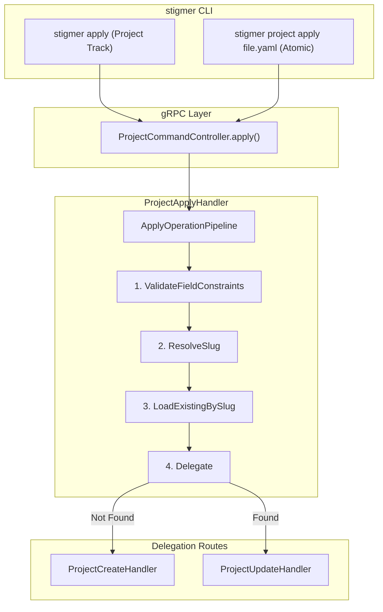

# T05.9: Project Apply Handler Implementation

## Context

This task implements the `apply()` RPC for ProjectCommandController - the **primary interface** for CLI-based project management. Apply provides Kubernetes-style semantics:

- If project **doesn't exist** (by org + slug): Creates new project via `ProjectCreateHandler`
- If project **exists**: Updates via `ProjectUpdateHandler`

The handler follows the established pattern from `McpServerApplyHandler` and `AgentApplyHandler`.

## Implementation Architecture




## File to Create

**Path**: `[backend/services/stigmer-service/src/main/java/ai/stigmer/domain/agentic/project/request/handler/ProjectApplyHandler.java](backend/services/stigmer-service/src/main/java/ai/stigmer/domain/agentic/project/request/handler/ProjectApplyHandler.java)`

## Implementation Details

### Class Structure

```java
@Slf4j
@Component
@RequiredArgsConstructor
@RequestRoute(controller = ProjectCommandControllerGrpc.class,
              method = ProjectCommandController.Method.apply)
public class ProjectApplyHandler extends ApplyOperationHandlerV2<Project> {

    private final ApplyOperationPipeline<Project> applyOperationPipeline;
    private final ProjectCreateHandler createHandler;
    private final ProjectUpdateHandler updateHandler;

    @Override
    protected RequestPipelineV2<ApplyContextV2<Project>> pipeline() {
        // Use default pipeline OR custom builder based on requirements
        return applyOperationPipeline.getDefault(this.getClass().getSimpleName());
    }

    @Override
    protected CreateOperationHandlerV2<Project> getCreateHandler() {
        return createHandler;
    }

    @Override
    protected UpdateOperationHandlerV2<Project> getUpdateHandler() {
        return updateHandler;
    }
}
```

### Pipeline Flow

1. **ValidateFieldConstraints**: Validates proto field constraints (apiVersion, kind, required fields)
2. **ResolveSlug**: Generates slug from `metadata.name` (critical for lookup)
3. **LoadExistingBySlug**: Checks if project exists by org + slug (org-scoped lookup)
4. **Delegate**: Routes to `ProjectCreateHandler` (if not found) or `ProjectUpdateHandler` (if found)

### Dependencies (Injected via Constructor)


| Dependency                        | Purpose                                                                        |
| --------------------------------- | ------------------------------------------------------------------------------ |
| `ApplyOperationPipeline<Project>` | Default pipeline with validation, slug resolution, existence check, delegation |
| `ProjectCreateHandler`            | Handles create path (new project)                                              |
| `ProjectUpdateHandler`            | Handles update path (existing project)                                         |


### Imports Required

```java
import ai.stigmer.domain.agentic.project.request.controller.ProjectCommandController;
import ai.stigmer.grpcrequest.context.ApplyContextV2;
import ai.stigmer.grpcrequest.handler.ApplyOperationHandlerV2;
import ai.stigmer.grpcrequest.handler.CreateOperationHandlerV2;
import ai.stigmer.grpcrequest.handler.UpdateOperationHandlerV2;
import ai.stigmer.grpcrequest.pipeline.RequestPipelineV2;
import ai.stigmer.grpcrequest.pipeline.operation.apply.ApplyOperationPipeline;
import ai.stigmer.grpcrequest.routing.RequestRoute;
import lombok.RequiredArgsConstructor;
import lombok.extern.slf4j.Slf4j;
import org.springframework.stereotype.Component;
import protos.ai.stigmer.agentic.project.v1.Project;
import protos.ai.stigmer.agentic.project.v1.ProjectCommandControllerGrpc;
```

## Pattern References

The implementation follows these existing handlers:


| Pattern File                                                                                                                                                  | Key Pattern                                             |
| ------------------------------------------------------------------------------------------------------------------------------------------------------------- | ------------------------------------------------------- |
| `[McpServerApplyHandler.java](backend/services/stigmer-service/src/main/java/ai/stigmer/domain/agentic/mcpserver/request/handler/McpServerApplyHandler.java)` | Uses `getDefault()` pipeline with comprehensive JavaDoc |
| `[AgentApplyHandler.java](backend/services/stigmer-service/src/main/java/ai/stigmer/domain/agentic/agent/request/handler/AgentApplyHandler.java)`             | Uses `toBuilder()` for custom pipeline                  |


## Existing Infrastructure (Already Implemented)


| Component                   | Status | Path                                                        |
| --------------------------- | ------ | ----------------------------------------------------------- |
| `ProjectRepo`               | Exists | `project/repo/ProjectRepo.java`                             |
| `ProjectCreateHandler`      | Exists | `project/request/handler/ProjectCreateHandler.java`         |
| `ProjectUpdateHandler`      | Exists | `project/request/handler/ProjectUpdateHandler.java`         |
| `ProjectDeleteHandler`      | Exists | `project/request/handler/ProjectDeleteHandler.java`         |
| `ProjectGrpcAutoController` | Exists | `project/request/controller/ProjectGrpcAutoController.java` |


## Authorization Model

Authorization is handled by the delegated handlers:

- **Create path**: `can_create_project` permission in the target organization
- **Update path**: `can_edit` permission on the existing project resource

## Testing Strategy

1. **Unit Tests** (with mocked dependencies):
  - Create path: New project (not found by slug) delegates to `createHandler`
  - Update path: Existing project (found by slug) delegates to `updateHandler`
  - Pipeline wiring: Verify `getDefault()` pipeline is used
2. **Integration Tests** (future):
  - End-to-end apply via gRPC
  - Idempotency verification (apply same project twice = update)

## Success Criteria

- Handler compiles and registers with Spring
- `@RequestRoute` correctly routes to `ProjectCommandController.Method.apply`
- Create path works for new projects (delegates to `ProjectCreateHandler`)
- Update path works for existing projects (delegates to `ProjectUpdateHandler`)
- JavaDoc follows McpServerApplyHandler quality standard

## File Size Target

~50-80 lines (matching McpServerApplyHandler at 81 lines)

## Build Verification

```bash
cd /Users/suresh/scm/github.com/stigmer/stigmer-cloud
make build  # Or bazel build //backend/services/stigmer-service/...
```

