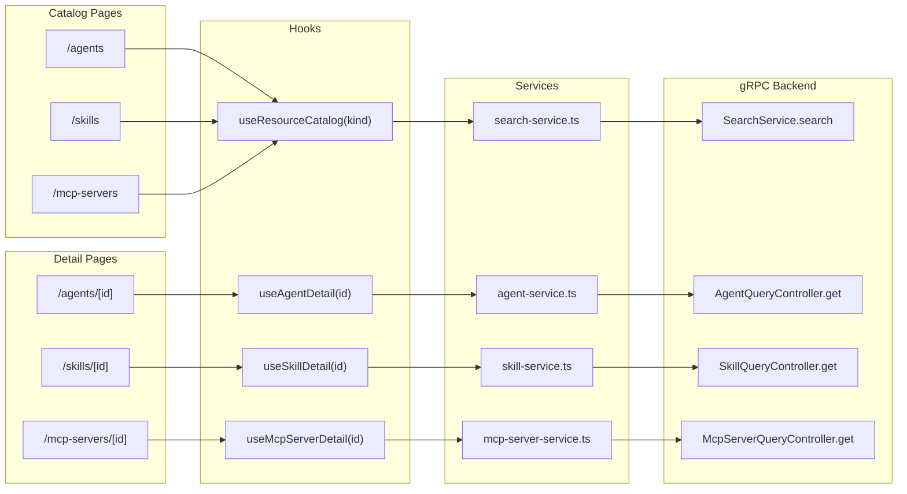

# T05: Resource Catalog (Agents, Skills, MCP Servers)

## Architectural Surprise: No List RPCs

The individual query controllers (AgentQueryController, SkillQueryController, McpServerQueryController) **only expose `get` and `getByReference`** — there are no list or search RPCs. The `SearchService` is the only way to discover resources.

This is architecturally clean: search is a cross-cutting concern, not a domain concern. But it means:

- All catalog pages depend entirely on SearchService for listing/searching
- The `SearchResult` projection is what catalog cards display (not the full resource)
- For full resource data, we use the kind-specific `get(id)` RPC on the detail page

**SearchResult fields available for cards**: kind, id, name, slug, qualifiedSlug, org, description, visibility, tags, createdAt, updatedAt, score. Plus `counts_by_kind` on the response for potential filter badges.

This is sufficient for meaningful catalog cards without needing full resource fetches.

---

## Two Design Challenges to the Original Plan

### 1. Cards, Not Tables

The revised plan specifies `ResourceTable.tsx` (data table with pagination). I recommend **cards instead**, for these reasons:

- Catalog data is qualitative (name, description, tags), not quantitative — there are no numeric columns to sort
- Cards handle variable-length descriptions and tag lists better than table cells
- The existing codebase pattern (`SessionCard`) uses cards
- The UX role mandates "progressive disclosure: summary first, details on expand" — a card with description + tags is a genuine summary; a table row is not

A `ResourceCard` that shows name, qualified slug, description snippet, visibility badge, and tags gives power users the density they need while remaining scannable.

### 2. Structured Detail Views, Not Raw YAML

The plan mentions `ResourceDetail.tsx — YAML/JSON viewer`. For the MVP catalog, I recommend **structured rendering** instead:

- This is a read-only catalog, not an editor. Users want to understand what an agent does, not parse YAML
- Each resource type has very different spec structures (Agent has sub-agents and MCP server usages; Skill has markdown content; McpServer has discovered tools). A generic YAML viewer treats them all the same and loses domain meaning
- Structured detail components can highlight what matters: an Agent's MCP servers and skills, a Skill's rendered SKILL.md, an McpServer's discovered tools

Raw YAML can be added later as a secondary view for power users.

---

## Data Flow

---

## Implementation Plan

### Phase 1: Service Layer (data plumbing)

**Extend [search-service.ts](client-apps/web-console/src/services/search-service.ts)**

Add a generic `searchResources(kind, query, options)` function that accepts any `ApiResourceKind`. The existing `searchAgents` becomes a thin wrapper. Add `searchSkills` and `searchMcpServers` wrappers for clarity. The `SearchResponse.counts_by_kind` field is preserved for potential future multi-kind search views.

**Create [agent-service.ts](client-apps/web-console/src/services/agent-service.ts)**

AgentQueryController client with `getAgent(id): Promise<Agent>`. Same pattern as session-service.ts — `createClient` with `any` cast, typed wrapper function using `create(AgentIdSchema, { value: id })`.

**Create [skill-service.ts](client-apps/web-console/src/services/skill-service.ts)**

SkillQueryController client with `getSkill(id): Promise<Skill>`. Same pattern.

**Create [mcp-server-service.ts](client-apps/web-console/src/services/mcp-server-service.ts)**

McpServerQueryController client with `getMcpServer(id): Promise<McpServer>`. Same pattern.

### Phase 2: Hooks Layer

**Create [useResourceCatalog.ts](client-apps/web-console/src/hooks/useResourceCatalog.ts)**

Generic catalog hook parameterized by `ApiResourceKind`. Returns `{ results, query, setQuery, isLoading, error, totalCount, totalPages, page, setPage }`. Internally uses the generic `searchResources` function. Follows the established pattern: `requestIdRef` for stale-response handling, debounced search on query change, fetch on mount.

**Create [useAgentDetail.ts](client-apps/web-console/src/hooks/useAgentDetail.ts)**

Fetches full Agent by ID. Returns `{ agent, isLoading, error, refresh }`. Same pattern as `useSessionDetail` but simpler (single fetch, no parallel loading).

**Create [useSkillDetail.ts](client-apps/web-console/src/hooks/useSkillDetail.ts)** and **[useMcpServerDetail.ts](client-apps/web-console/src/hooks/useMcpServerDetail.ts)**

Same pattern as `useAgentDetail`, fetching the respective resource type.

### Phase 3: Shared Catalog Components

**Create [ResourceCard.tsx](client-apps/web-console/src/components/catalog/ResourceCard.tsx)**

Generic card for `SearchResult`. Displays: kind icon (Bot/FileCode2/Server), name, qualified slug, truncated description (2-line clamp), visibility badge (public/private), tags (as small pills), relative timestamp. Links to the detail page based on kind. Follows `SessionCard` patterns: `Card` with `CardHeader`, `CardTitle`, `CardDescription`, `CardAction` from shadcn/ui.

**Create [ResourceList.tsx](client-apps/web-console/src/components/catalog/ResourceList.tsx)**

Composed component that takes the `useResourceCatalog` return value and renders: search input at top, result count, card grid/list, loading skeletons, empty state, error banner, simple pagination controls (prev/next with page indicator). The search input is inline in the page header area, not a standalone component.

**Create [CatalogEmptyState.tsx](client-apps/web-console/src/components/catalog/CatalogEmptyState.tsx)**

Kind-aware empty state with appropriate icon and messaging. For agents: "No agents found" with link to docs. Consistent with the session list's empty state pattern.

### Phase 4: List Pages

**Replace [app/agents/page.tsx](client-apps/web-console/src/app/agents/page.tsx)**

Wire `useResourceCatalog(ApiResourceKind.agent)` to `ResourceList`. TopBar with title "Agents" and description. The Agent list page also gets a "Run Agent" action button in the TopBar (links to `/run`).

**Replace [app/skills/page.tsx](client-apps/web-console/src/app/skills/page.tsx)**

Same pattern with `ApiResourceKind.skill`.

**Replace [app/mcp-servers/page.tsx](client-apps/web-console/src/app/mcp-servers/page.tsx)**

Same pattern with `ApiResourceKind.mcp_server`.

### Phase 5: Detail Components

**Create [AgentDetailView.tsx](client-apps/web-console/src/components/agent/AgentDetailView.tsx)**

Structured rendering of the full Agent resource:

- **Header section**: Name, org/slug, description, icon (if `icon_url`), visibility badge
- **Instructions section**: The agent's system prompt. Collapsible if long (>300 chars), since instructions can be very long
- **MCP Servers section**: List of referenced MCP servers with qualified slug, enabled tools, tool approval overrides
- **Skills section**: List of referenced skills with qualified slug
- **Sub-Agents section**: If any, cards with name, description, model override
- **Action**: Prominent "Run this agent" button that navigates to `/run?agentId={id}`

**Create [SkillDetailView.tsx](client-apps/web-console/src/components/skill/SkillDetailView.tsx)**

Structured rendering of the full Skill resource:

- **Header section**: Name, org/slug, description, version tag, state badge (READY/UPLOADING/FAILED)
- **Content section**: Rendered `skill_md` using `ReactMarkdown` + `remarkGfm` (same stack as `OutputBlock.tsx`)
- **Provenance section**: Git remote URL, ref, commit (if `git_provenance` is populated)
- **Metadata**: Version hash, artifact storage key

**Create [McpServerDetailView.tsx](client-apps/web-console/src/components/mcp-server/McpServerDetailView.tsx)**

Structured rendering of the full McpServer resource:

- **Header section**: Name, org/slug, description, icon, tags, validation state badge
- **Server Config section**: Transport type (stdio or HTTP) with config details — command/args for stdio, URL for HTTP
- **Discovered Tools section**: Table/list of tools with name, description, collapsible input schema (JSON)
- **Tool Approvals section**: Default approval policies (tool name + approval message)
- **Resource Templates section**: If any, list with URI template, name, description, MIME type

### Phase 6: Detail Pages

**Create [app/agents/[id]/page.tsx**](client-apps/web-console/src/app/agents/[id]/page.tsx)

Wire `useAgentDetail(id)` to `AgentDetailView`. TopBar with agent name, breadcrumb back to `/agents`.

**Create [app/skills/[id]/page.tsx**](client-apps/web-console/src/app/skills/[id]/page.tsx)

Wire `useSkillDetail(id)` to `SkillDetailView`. TopBar with skill name, breadcrumb back to `/skills`.

**Create [app/mcp-servers/[id]/page.tsx**](client-apps/web-console/src/app/mcp-servers/[id]/page.tsx)

Wire `useMcpServerDetail(id)` to `McpServerDetailView`. TopBar with server name, breadcrumb back to `/mcp-servers`.

### Phase 7: Build Verification

Run `yarn build` to confirm zero TypeScript/lint errors across all new and modified files.

---

## File Inventory

**New files (17)**:

- `services/agent-service.ts`, `services/skill-service.ts`, `services/mcp-server-service.ts`
- `hooks/useResourceCatalog.ts`, `hooks/useAgentDetail.ts`, `hooks/useSkillDetail.ts`, `hooks/useMcpServerDetail.ts`
- `components/catalog/ResourceCard.tsx`, `components/catalog/ResourceList.tsx`, `components/catalog/CatalogEmptyState.tsx`, `components/catalog/index.ts`
- `components/agent/AgentDetailView.tsx`, `components/skill/SkillDetailView.tsx`, `components/mcp-server/McpServerDetailView.tsx`
- `app/agents/[id]/page.tsx`, `app/skills/[id]/page.tsx`, `app/mcp-servers/[id]/page.tsx`

**Modified files (4)**:

- `services/search-service.ts` (add generic search + skill/mcpserver wrappers)
- `app/agents/page.tsx` (replace PageStub)
- `app/skills/page.tsx` (replace PageStub)
- `app/mcp-servers/page.tsx` (replace PageStub)

---

## Patterns to Follow (from existing codebase)

- **Service layer**: `createClient(Controller, transport)` with `any` cast + typed wrappers. Use `create(Schema, {...})` for request construction. See [session-service.ts](client-apps/web-console/src/services/session-service.ts).
- **Hooks**: `requestIdRef` for stale-response handling, `isLoading`/`error`/`refresh` return pattern, `useCallback` for fetchers, `useEffect` for mount. See [useSessions.ts](client-apps/web-console/src/hooks/useSessions.ts).
- **Cards**: shadcn/ui `Card`/`CardHeader`/`CardTitle`/`CardDescription`/`CardAction`. See [SessionCard.tsx](client-apps/web-console/src/components/session/SessionCard.tsx).
- **Pages**: `TopBar` for page header, loading skeletons for initial state, error banners, empty states with CTAs.
- **Markdown**: `ReactMarkdown` with `remarkGfm` plugin, same prose classes as [OutputBlock.tsx](client-apps/web-console/src/components/execution/OutputBlock.tsx).
- **No `asChild`** on Button — use inline Link styling when needed.

