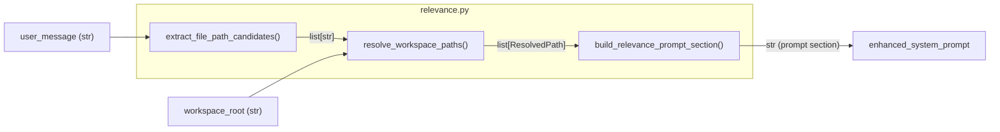

# T06: Task-Aware Relevance Signaling (Phase A)

## Architecture

New module `worker/activities/relevance.py` follows the established pattern where prompt-building utilities live alongside `execute_graphton.py` (cf. `worker/workspace/tree.py` was extracted from the monolith). Three pure-ish functions with clean separation of concerns:




## Module: `worker/activities/relevance.py`

### Value Object

```python
@dataclass(frozen=True)
class ResolvedPath:
    path: str           # workspace-relative
    is_directory: bool
    size_bytes: int | None = None
```

### Functions

**1. `extract_file_path_candidates(message: str) -> list[str]`**

Pure text extraction. Tokenize the message, identify tokens that look like file paths:

- Contains `/` but not `://` (exclude URLs)
- OR has a recognized source-code file extension (`.py`, `.go`, `.ts`, `.rs`, `.java`, `.md`, `.yaml`, `.json`, `.toml`, `.proto`, etc.)
- Strip surrounding backticks, quotes, parentheses, commas, trailing punctuation
- Exclude `@`-prefixed tokens (email addresses)
- Deduplicate, preserve order
- No regex acrobatics needed -- simple token-based heuristic

**2. `resolve_workspace_paths(candidates: list[str], workspace_root: str) -> list[ResolvedPath]`**

For each candidate, `os.path.join(workspace_root, candidate)` then `os.path.exists()`. This is the same approach used by the existing [build_referenced_files_prompt_section](backend/services/agent-runner/worker/activities/execute_graphton.py) (line 681). Collect file size for files, flag directories. Silently drop non-existent paths (false positives are expected).

**3. `build_relevance_prompt_section(user_message: str, workspace_root: str, *, max_results: int = 15) -> str`**

Public API. Orchestrates extract -> resolve -> format. Returns the prompt section string or empty string if nothing resolved.

Output format:

```
## Potentially Relevant Files

Based on your message, these workspace files may be relevant:

- `src/auth/login.go` (2.3 KB)
- `backend/api/v1/` (directory)
```

Uses `human_size()` from [worker/workspace/tree.py](backend/services/agent-runner/worker/workspace/tree.py) for consistent formatting.

## Integration Point

In [execute_graphton.py](backend/services/agent-runner/worker/activities/execute_graphton.py) at line ~1775, after `workspace_section` and before `skills_prompt_section`:

```python
from worker.activities.relevance import build_relevance_prompt_section

relevance_section = build_relevance_prompt_section(
    user_message, provision_result.root_dir,
)
if relevance_section:
    enhanced_system_prompt += relevance_section
    activity_logger.info("Enhanced system prompt with relevance signals")
```

This follows the exact same pattern as the existing `build_workspace_prompt_section()` and `build_referenced_files_prompt_section()` integrations at lines 1772-1793.

## Testing: `tests/test_relevance.py`

Comprehensive unit tests covering:

- **Extraction**: paths with slashes, filenames with extensions, paths inside backticks/quotes, URL exclusion, email exclusion, deduplication, empty message, message with no paths
- **Resolution**: existing file, existing directory, non-existent path, mixed valid/invalid, stat failure handling
- **End-to-end**: full `build_relevance_prompt_section` with tmp_path workspace fixture
- **Cap enforcement**: more than 15 candidates resolves to at most 15 results
- **Prompt format**: verify section header, file sizes, directory labels

## Files Changed

- **New**: [worker/activities/relevance.py](backend/services/agent-runner/worker/activities/relevance.py)
- **New**: [tests/test_relevance.py](backend/services/agent-runner/tests/test_relevance.py)
- **Modified**: [execute_graphton.py](backend/services/agent-runner/worker/activities/execute_graphton.py) (3-line integration)

## What This Does NOT Do (by design)

- No identifier extraction or grep searching (deferred to Phase B, separate task)
- No dependency on T03's FilesystemBackend cache (that's agent runtime; this is pre-agent setup)
- No file content snippets in the prompt section (agent reads files itself)
- No modification to graphton library (this is an agent-runner concern)

