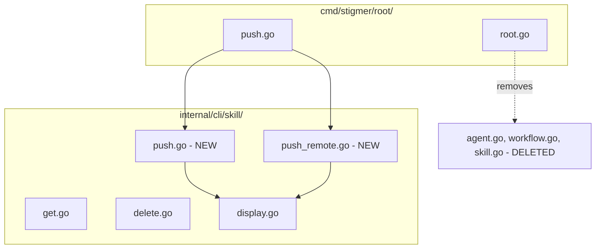

# T07: Migration Cleanup - Remove Deprecated Commands

## Context

Tasks T02-T06 established a pure verb-first CLI architecture. The deprecated noun-first commands (`agent`, `workflow`, `skill`) now only show migration guidance. However, `skill.go` contains active business logic that must be properly extracted before deletion.

## Current State


| File                                                        | Lines | Contents                            | Dependency                    |
| ----------------------------------------------------------- | ----- | ----------------------------------- | ----------------------------- |
| [agent.go](client-apps/cli/cmd/stigmer/root/agent.go)       | 49    | Deprecation notice only             | None                          |
| [workflow.go](client-apps/cli/cmd/stigmer/root/workflow.go) | 49    | Deprecation notice only             | None                          |
| [skill.go](client-apps/cli/cmd/stigmer/root/skill.go)       | 417   | Deprecation (51) + Push logic (366) | `push.go` calls its functions |


The [push.go](client-apps/cli/cmd/stigmer/root/push.go) command depends on functions in `skill.go`:

- `executeSkillPush()` - local directory push
- `executeRemoteSkillPush()` - git clone and push
- `displaySkillPushResult()` - result formatting
- Structs: `skillPushOptions`, `remotePushOptions`

## Architecture After T07




## Implementation Steps

### Phase 1: Extract Skill Push Logic

**Step 1.1: Create `internal/cli/skill/push.go**`

Extract from `skill.go` (lines 53-63, 246-383):

- `skillPushOptions` struct
- `executeSkillPush()` function → rename to `Push()`
- `displaySkillPushResult()` function
- `formatSkillBytes()` helper

Estimated size: ~150 lines

**Step 1.2: Create `internal/cli/skill/push_remote.go**`

Extract from `skill.go` (lines 65-77, 79-244):

- `remotePushOptions` struct → rename to `RemotePushOptions`
- `executeRemoteSkillPush()` function → rename to `PushRemote()`

Estimated size: ~170 lines

**Step 1.3: Update `internal/cli/skill/BUILD.bazel**`

Add new files and dependencies:

- `push.go`, `push_remote.go`
- Dependencies: `artifact`, `backend`, `cliprint`, `config`, `daemon`

### Phase 2: Update Push Command

**Step 2.1: Update `push.go**`

Change imports and function calls:

```go
// Before
result, err = executeSkillPush(skillPushOptions{...})
result, err = executeRemoteSkillPush(remotePushOptions{...})
displaySkillPushResult(result)

// After
result, err = skill.Push(skill.PushOptions{...})
result, err = skill.PushRemote(skill.RemotePushOptions{...})
skill.DisplayPushResult(result)
```

### Phase 3: Delete Deprecated Commands

**Step 3.1: Delete files**

- Delete `agent.go`
- Delete `workflow.go`
- Delete `skill.go` (now safe - logic extracted)

**Step 3.2: Update `root.go**`

Remove command registration:

```go
// Remove these lines
rootCmd.AddCommand(NewAgentCommand())
rootCmd.AddCommand(NewWorkflowCommand())
rootCmd.AddCommand(NewSkillCommand())
```

**Step 3.3: Update `BUILD.bazel**`

Remove deleted files from `srcs` list.

## Verification

1. `go build ./client-apps/cli/...` succeeds
2. All new files under 250 lines
3. `stigmer --help` shows no deprecated commands
4. `stigmer push skill --dry-run` works (requires manual test)

## Files Changed Summary


| Action | File                                | Lines |
| ------ | ----------------------------------- | ----- |
| Create | `internal/cli/skill/push.go`        | ~150  |
| Create | `internal/cli/skill/push_remote.go` | ~170  |
| Modify | `internal/cli/skill/BUILD.bazel`    | +10   |
| Modify | `cmd/stigmer/root/push.go`          | ~-10  |
| Modify | `cmd/stigmer/root/root.go`          | -3    |
| Modify | `cmd/stigmer/root/BUILD.bazel`      | -3    |
| Delete | `cmd/stigmer/root/agent.go`         | -49   |
| Delete | `cmd/stigmer/root/workflow.go`      | -49   |
| Delete | `cmd/stigmer/root/skill.go`         | -417  |


**Net change**: ~-200 lines (cleaner separation, better organization)