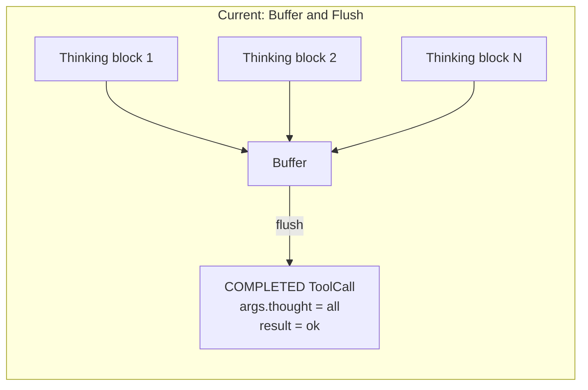
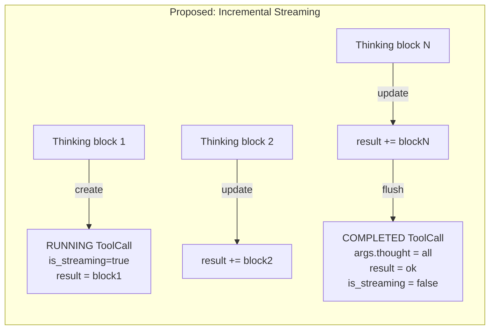

# Think Tool Streaming UX

## Problem

Currently, the StatusBuilder buffers ALL native thinking blocks and creates a single COMPLETED ToolCall at flush time. The CLI only ever sees the finished result — there is no live display of thinking content as the LLM generates it.

Native thinking is the genuine streaming opportunity here: thinking tokens arrive incrementally via `on_chat_model_stream` over several seconds. This is fundamentally different from the Write tool's "streaming" (cosmetic typewriter of already-generated content). The explicit think tool (non-native-thinking models) has no streaming opportunity — tool call args are published complete at `on_chat_model_end`.

## Current vs Proposed Flow







## Why This Works Without CLI Changes

The CLI's streaming pipeline is already wired up. Three existing mechanisms combine to handle this:

1. `**emitToolCallStateEvents**` in [run_stream_events.go](client-apps/cli/cmd/stigmer/root/run_stream_events.go) line 343: detects `tc.IsStreaming && tc.Result != prevResults[tc.Id]` and emits `ToolStreamDeltaEvent`
2. `**renderStreamingTool**` in [render_blocks.go](client-apps/cli/pkg/executiontui/render_blocks.go) line 115: renders the last 8 lines of streaming content with a `▍` cursor
3. `**ToolCompletedEvent**` handler in [handle_events.go](client-apps/cli/pkg/executiontui/handle_events.go) line 68: replaces the running block with a stateful expandable block

During streaming, content flows via `tc.Result` (rendered by `renderStreamingTool`). After completion, content is in `args.thought` (rendered by `resolveDisplayContent` with `contentSourceInput`). The transition is natural because `ToolCompletedEvent` rebuilds the block from scratch.

**The `toolDisplayMap` entry for "think" was already added to [render.go](client-apps/cli/pkg/toolrender/render.go) earlier in this conversation.**

## gRPC Update Frequency

The `StreamingUpdateScheduler` ([update_scheduler.py](backend/services/agent-runner/worker/streaming/update_scheduler.py)) pushes updates every ~500ms. For a 10,000-token thinking budget that may run for 5-15 seconds, the CLI would receive 10-30 incremental updates — producing a visible live streaming effect.

## Scope: Native Thinking Only

The explicit think tool (used by non-native-thinking models) will NOT have streaming. Tool call args are published complete at `on_chat_model_end` — there are no incremental tokens to stream. This is fine: the explicit think tool is a fallback for older models, and its thoughts are typically short. It will appear as a completed block.

## Changes

### 1. StatusBuilder: Add streaming think ToolCall state

**File**: [status_builder.py](backend/services/agent-runner/worker/activities/graphton/status_builder.py)

Add one new tracking dict to `__init`__ (alongside existing `_thinking_buffers` and `_thinking_started_at`):

```python
self._thinking_tool_call_ids: dict[str, str] = {}
```

Maps namespace key to the ToolCall ID of the in-progress streaming think ToolCall. Populated on first thinking block, cleared on flush.

### 2. StatusBuilder: New method `_start_thinking_stream`

Creates a RUNNING ToolCall when the first thinking block arrives for a namespace:

- `id`: `f"think-native-{uuid4()}"`
- `name`: `"think"`
- `args`: empty `Struct()` (populated at completion)
- `result`: initial thinking text (used for streaming content)
- `status`: `TOOL_CALL_RUNNING`
- `is_streaming`: `True`
- `started_at`: current timestamp

Appends to the correct `tool_calls` list via `_get_execution_context`. Stores the ID in `_thinking_tool_call_ids[ns_key]`.

### 3. StatusBuilder: New method `_update_thinking_stream`

Finds the existing streaming think ToolCall by ID (using `_find_tool_call_by_id`) and updates `result` with the latest accumulated thinking buffer. Called on each subsequent thinking block after the first.

### 4. StatusBuilder: Modify thinking detection in `_handle_chat_model_stream_event`

**Current code** (lines 614-622):

```python
if thinking_text:
    if ns_key not in self._thinking_started_at:
        self._thinking_started_at[ns_key] = datetime.utcnow()
    self._thinking_buffers[ns_key] = (
        self._thinking_buffers.get(ns_key, "") + thinking_text
    )
    return
```

**Change to**:

```python
if thinking_text:
    self._thinking_buffers[ns_key] = (
        self._thinking_buffers.get(ns_key, "") + thinking_text
    )
    if ns_key not in self._thinking_tool_call_ids:
        self._start_thinking_stream(ns_key, namespace, self._thinking_buffers[ns_key])
    else:
        self._update_thinking_stream(ns_key, namespace)
    return
```

### 5. StatusBuilder: Modify `_flush_thinking_buffer`

**Current behavior**: Creates a new COMPLETED ToolCall from scratch.

**New behavior**: If a streaming ToolCall exists (`_thinking_tool_call_ids[ns_key]`), transition it from RUNNING to COMPLETED in place:

- Set `args.thought` = full accumulated thinking text
- Set `result` = `"ok"`
- Set `status` = `TOOL_CALL_COMPLETED`
- Set `is_streaming` = `False`
- Set `completed_at` = current timestamp

Falls back to creating a new COMPLETED ToolCall if no streaming ToolCall exists (defensive, should not happen in normal flow).

Clean up all tracking state: `_thinking_buffers`, `_thinking_started_at`, `_thinking_tool_call_ids`.

### 6. Tests: Update existing, add new

**File**: [test_status_builder.py](backend/services/agent-runner/tests/test_status_builder.py)

Update existing `TestNativeThinkingTranslation` tests to verify the streaming lifecycle:

- Tests that previously checked for a single COMPLETED ToolCall after flush need to also verify the RUNNING state was created during thinking
- `test_thinking_content_creates_synthetic_tool_call` -> verify RUNNING ToolCall exists before flush, transitions to COMPLETED after flush
- `test_thinking_buffer_accumulated_across_chunks` -> verify `result` grows with each chunk (streaming content)
- `test_thinking_buffer_flushed_on_text_transition` -> verify transition from RUNNING (is_streaming=True) to COMPLETED (is_streaming=False)

New tests:

- **Streaming lifecycle**: first block creates RUNNING ToolCall with `is_streaming=True`, subsequent blocks update `result`, flush transitions to COMPLETED with `args.thought`
- **Result content during streaming**: `result` contains accumulated thinking text (not "ok") while streaming
- **Result content after completion**: `result` is "ok" and `args.thought` has full text after flush
- **Empty thinking block**: does not create streaming ToolCall (existing test, verify still passes)
- **Sub-agent streaming**: streaming works correctly with namespace-routed thinking

## Risk: Write Tool Streaming

You mentioned Write tool streaming is not working. The native thinking streaming uses the same pipeline (`is_streaming` + `result` changes -> `ToolStreamDeltaEvent` -> `renderStreamingTool`). If there is a bug in the pipeline, it would affect both. During implementation, if I discover the streaming pipeline has issues, I will pause and present the findings rather than working around them.

## What Is NOT Changed

- CLI code (already complete: `toolDisplayMap` entry + existing streaming infrastructure)
- Explicit think tool behavior (no streaming opportunity)
- Proto definitions (existing `is_streaming` field on ToolCall is sufficient)
- gRPC subscription mechanism (works as-is)
- `StreamingUpdateScheduler` timing (500ms interval is appropriate for thinking)

