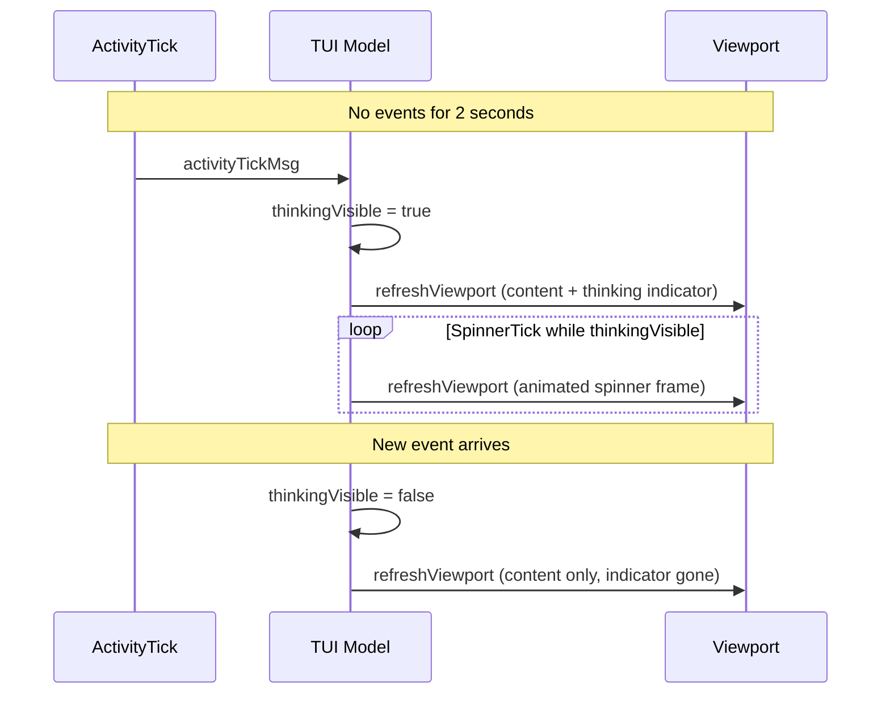

# Add Viewport-Level Thinking Indicator to Execution TUI

## Problem

When the agent enters a long thinking/planning phase (e.g., generating a full skill file before requesting approval), the TUI viewport shows no new content. The only signal is a subtle spinner swap in the header bar, which is easy to miss. Users perceive the execution as "stuck."

## Current Architecture

The existing idle detection is already solid:

- `activityTickMsg` fires every 1 second (`[update.go:194](client-apps/cli/pkg/executiontui/update.go)`)
- After 2 seconds of no events, `thinkingVisible` is set to `true` and the header spinner reactivates (`[update.go:216-233](client-apps/cli/pkg/executiontui/update.go)`)
- When the next event arrives, `thinkingVisible` resets to `false` (`[handle_events.go:18-19](client-apps/cli/pkg/executiontui/handle_events.go)`)

The gap: `thinkingVisible` only affects the header via `renderHeader()`. The viewport content (`rebuildViewportContent()`) is unaware of thinking state.

## Approach

**Ephemeral viewport indicator** -- NOT a persistent content block. The thinking indicator is rendered by `refreshViewport()` as an appendage to the viewport content string, controlled entirely by the existing `thinkingVisible` flag. Zero changes to the block data model, zero changes to event types, zero backend changes.




## Changes

### 1. Add thinking indicator renderer -- `[render_blocks.go](client-apps/cli/pkg/executiontui/render_blocks.go)`

Add a `renderThinkingIndicator(spinnerView string) string` function and a `thinkingStyle` lipgloss style. The indicator renders as:

```
⠋ Thinking...
```

- Uses the spinner frame passed in (animated by Bubbletea's spinner tick)
- Styled with a muted foreground (e.g., lipgloss color `"243"`) to distinguish it from actual content
- Standalone function (not a Model method) -- takes spinner view string as parameter to stay consistent with the other render functions in this file

### 2. Modify `refreshViewport()` -- `[handle_events.go](client-apps/cli/pkg/executiontui/handle_events.go)`

After building the main content from blocks, conditionally append the thinking indicator:

```go
func (m *Model) refreshViewport() {
    if !m.ready {
        return
    }
    content := rebuildViewportContent(m.blocks, m.focusedBlockIndex)
    if m.thinkingVisible {
        indicator := renderThinkingIndicator(m.spinner.View())
        if content != "" {
            content += "\n\n" + indicator
        } else {
            content = indicator
        }
    }
    m.viewport.SetContent(content)
    if m.autoScroll {
        m.viewport.GotoBottom()
    }
}
```

This ensures the indicator appears/disappears naturally with the `thinkingVisible` flag, with no block state management needed.

### 3. Animate during thinking -- `[update.go](client-apps/cli/pkg/executiontui/update.go)`

In the `spinner.TickMsg` handler, refresh the viewport when `thinkingVisible` is true so the spinner frame in the viewport indicator animates:

```go
case spinner.TickMsg:
    if m.phase == "pending" || m.thinkingVisible {
        var cmd tea.Cmd
        m.spinner, cmd = m.spinner.Update(msg)
        if m.thinkingVisible {
            m.refreshViewport()
        }
        return m, cmd
    }
    return m, nil
```

### 4. Show indicator immediately on idle detection -- `[update.go](client-apps/cli/pkg/executiontui/update.go)`

In `handleActivityTick()`, call `refreshViewport()` when transitioning to thinking state so the indicator appears immediately (not waiting for the next spinner tick):

```go
if !m.thinkingVisible {
    m.thinkingVisible = true
    m.refreshViewport() // <-- add this line
    return m, tea.Batch(m.spinner.Tick, scheduleActivityTick())
}
```

### 5. Unify viewport rebuild in `handleWindowSize` -- `[update.go](client-apps/cli/pkg/executiontui/update.go)`

Currently `handleWindowSize()` has its own inline viewport rebuild that bypasses `refreshViewport()`. Refactor it to call `refreshViewport()` instead, so the thinking indicator is consistently included during terminal resizes.

## What This Does NOT Change

- **No new event types** -- the existing `thinkingVisible` flag is sufficient
- **No new block types** -- the indicator is ephemeral viewport content, not a data block
- **No backend changes** -- client-side idle detection at 2 seconds is accurate enough
- **No model state additions** -- no new fields on `Model`
- **No proto changes** -- purely a CLI TUI rendering concern

## Edge Cases

- **Rapid thinking start/end**: Flag toggles cleanly; viewport refreshes on both transitions
- **User scrolled up**: Indicator still appended but doesn't force scroll (autoScroll is false)
- **No blocks yet**: Indicator shows as the only viewport content (handled by the `content != ""` check)
- **Terminal resize during thinking**: Handled by the unified `refreshViewport()` path

