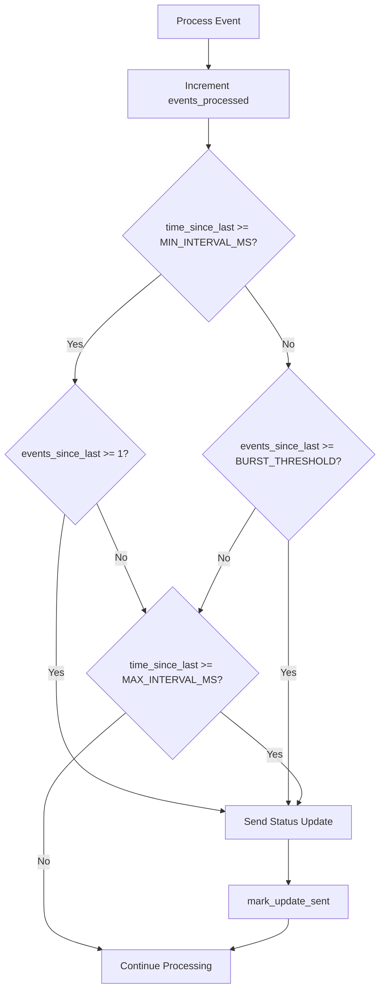

# Phase 1.2: Time-Based Streaming Updates

## Problem Statement

The current implementation in `execute_graphton.py` (lines 551-614) uses a naive event-count based approach:

```551:556:backend/services/agent-runner/worker/activities/execute_graphton.py
        events_processed = 0
        last_update_sent = 0
        last_heartbeat_sent = 0
        update_interval = 10  # Send status update every N events
        heartbeat_interval = 5  # Send heartbeat every N events (more frequent than status updates)
```

**Critical UX Problems:**

- Slow operations (30s tool execution): No update for 30 seconds - user thinks the system is stuck
- Fast operations (100 events/sec): 10 updates/sec - wasteful network traffic and database writes
- No adaptability to operation characteristics

---

## Architecture Decision: Hybrid Time + Event Scheduler

Instead of a simple inline fix, we will create a dedicated `StreamingUpdateScheduler` class that:

1. **Encapsulates complexity**: Clean separation of scheduling logic from event processing
2. **Is testable**: Can be unit tested in isolation with deterministic time control
3. **Is reusable**: Could be used by future streaming components
4. **Is configurable**: Environment-variable driven with sensible defaults

### Scheduling Algorithm

```
should_send_update = (
    # Primary: Time-based with minimum event guard
    (time_since_last >= MIN_INTERVAL_MS AND events_since_last >= 1)
    OR
    # Secondary: Burst protection
    (events_since_last >= BURST_THRESHOLD)
    OR
    # Tertiary: Keepalive for long operations
    (time_since_last >= MAX_INTERVAL_MS)
)
```

This hybrid approach ensures:

- **Rate limiting**: Never more than 2 updates/second (500ms minimum)
- **Responsiveness**: Always shows new activity within 500ms
- **Burst protection**: Prevents memory buildup during rapid event streams
- **Keepalive**: Shows "still alive" even during long tool executions

---

## Files to Create/Modify

### 1. New File: `worker/streaming/update_scheduler.py`

Creates a dedicated module for streaming update scheduling logic.

**Key Components:**

```python
@dataclass
class StreamingConfig:
    """Configuration for streaming status updates.
    
    Environment Variables:
        STREAMING_MIN_INTERVAL_MS: Minimum time between updates (default: 500)
        STREAMING_MAX_INTERVAL_MS: Maximum time before forced update (default: 5000)
        STREAMING_BURST_THRESHOLD: Events before forced update (default: 50)
    """
    min_interval_ms: int = 500      # Rate limiting
    max_interval_ms: int = 5000     # Keepalive for long operations
    burst_threshold: int = 50        # Burst protection
    
    @classmethod
    def load_from_env(cls) -> "StreamingConfig": ...

class StreamingUpdateScheduler:
    """Manages timing for streaming status updates.
    
    Uses monotonic time for reliability (immune to clock adjustments).
    """
    def __init__(self, config: StreamingConfig): ...
    def should_send_update(self, events_processed: int) -> bool: ...
    def mark_update_sent(self, events_processed: int) -> None: ...
    def get_update_reason(self) -> str: ...  # For logging
```

### 2. Modify: `worker/activities/execute_graphton.py`

Replace the inline event-count logic with the new scheduler.

**Before (current):**

```python
update_interval = 10  # Send status update every N events
if events_processed - last_update_sent >= update_interval:
    await send_update()
```

**After (proposed):**

```python
from worker.streaming.update_scheduler import StreamingUpdateScheduler, StreamingConfig

streaming_config = StreamingConfig.load_from_env()
update_scheduler = StreamingUpdateScheduler(streaming_config)

async for event in agent_graph.astream_events(...):
    await status_builder.process_event(event)
    events_processed += 1
    
    if update_scheduler.should_send_update(events_processed):
        reason = update_scheduler.get_update_reason()
        activity_logger.debug(f"[STREAM] Sending update: {reason}")
        
        await execution_client.update_status(execution_id, status_builder.current_status)
        update_scheduler.mark_update_sent(events_processed)
```

### 3. New File: `tests/test_streaming_update_scheduler.py`

Comprehensive test suite covering:

- Time-based update triggers
- Event-based burst protection
- Keepalive behavior
- Configuration loading from environment
- Edge cases (first event, rapid events, long pauses)

---

## Implementation Details

### Time Tracking

Use `time.monotonic()` instead of `time.time()`:

- Immune to system clock changes (NTP sync, DST, manual changes)
- Higher precision on most platforms
- Appropriate for measuring elapsed durations

### Heartbeat Integration

Keep heartbeat logic separate but coordinated:

- Heartbeat: Every 2 seconds or 10 events (whichever comes first)
- Status Update: Uses the new scheduler (500ms minimum)

Heartbeats serve a different purpose (Temporal activity timeout prevention) and should remain independent.

### Structured Logging

Add observability with structured log messages:

```python
activity_logger.info(
    f"[STREAM] execution={execution_id} "
    f"update_sent=true "
    f"reason={reason} "
    f"events_since_last={events_since_last} "
    f"time_since_last_ms={time_since_last_ms}"
)
```

---

## Configuration Defaults

| Variable | Default | Rationale |

|----------|---------|-----------|

| `STREAMING_MIN_INTERVAL_MS` | 500 | 2 updates/sec max - responsive without being wasteful |

| `STREAMING_MAX_INTERVAL_MS` | 5000 | 5 second keepalive - reassures user during long tools |

| `STREAMING_BURST_THRESHOLD` | 50 | Memory protection - prevent unbounded event accumulation |

---

## Test Strategy

### Unit Tests (test_streaming_update_scheduler.py)

```python
class TestStreamingConfig:
    def test_default_values()
    def test_load_from_env_overrides()
    def test_validates_positive_values()

class TestStreamingUpdateScheduler:
    # Time-based tests
    def test_does_not_update_before_min_interval()
    def test_updates_after_min_interval_with_events()
    def test_does_not_update_at_min_interval_without_events()
    
    # Burst protection tests
    def test_updates_at_burst_threshold_regardless_of_time()
    
    # Keepalive tests
    def test_updates_at_max_interval_regardless_of_events()
    
    # Integration tests
    def test_mark_update_sent_resets_tracking()
    def test_get_update_reason_returns_correct_reason()
    
    # Edge cases
    def test_first_event_triggers_update()
    def test_rapid_events_respect_min_interval()
```

### Integration Testing

Manual verification with:

1. **Slow tool**: File read that takes 10+ seconds - should see keepalive updates
2. **Fast stream**: Rapid token generation - should see rate-limited updates
3. **Mixed**: Tool calls interspersed with streaming - should see appropriate updates

---

## Mermaid Diagram: Update Decision Flow



---

## Risk Mitigation

| Risk | Mitigation |

|------|------------|

| Monotonic time not available | Python's `time.monotonic()` is always available since Python 3.3 |

| Config parsing errors | Validate and fallback to defaults; log warnings |

| Scheduler state corruption | Immutable config, simple state (two numbers) |

| Breaking existing behavior | Feature flag via environment variable for gradual rollout |

---

## Success Criteria

- [ ] Status updates occur within 500ms of new events (time-based)
- [ ] No more than 2 status updates per second during rapid streaming (rate limiting)
- [ ] Long-running tools show keepalive updates every 5 seconds (max interval)
- [ ] Burst of 50+ events triggers immediate update (burst protection)
- [ ] All configuration loadable from environment variables
- [ ] Comprehensive unit test coverage (>90%)
- [ ] Structured logging for observability
- [ ] No regression in existing functionality