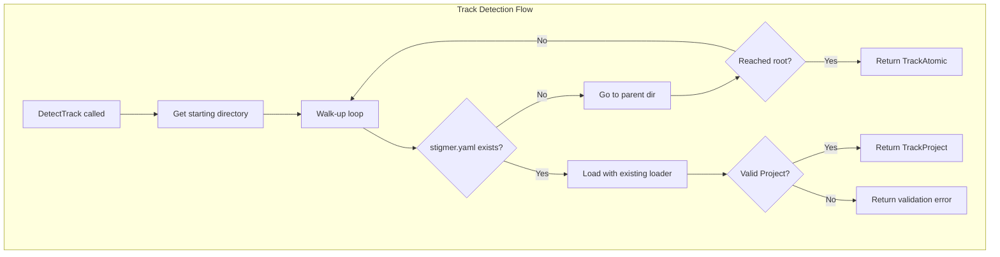

# T04.5: Track Detection Logic

## Objective

Create a robust, production-quality track detection system that determines CLI operation mode by discovering `stigmer.yaml` through a walk-up directory traversal algorithm.

---

## Architecture




---

## Design Decisions

### 1. Binary Track Model (No Legacy)

- **TrackAtomic**: No `stigmer.yaml` found - `stigmer agent apply file.yaml` works directly
- **TrackProject**: Valid `stigmer.yaml` found - `stigmer apply` uses SDK synthesis

### 2. Walk-Up Algorithm

- Start from specified directory (or cwd)
- Check for `stigmer.yaml` (lowercase only, not `STIGMER.yaml`)
- Walk up using `filepath.Dir()` until filesystem root or max depth (10 levels)
- First valid `stigmer.yaml` wins

### 3. Validation Integration

- Reuse existing `Load()` function to validate discovered `stigmer.yaml`
- If file exists but is invalid, return error with actionable message
- No silent fallback to Atomic if file is malformed

### 4. Error Philosophy

- File not found = Atomic track (expected for single-resource workflows)
- Invalid file = Error (user intent was Project track, help them fix it)
- Permission denied = Error with clear message

---

## File Structure

```
client-apps/cli/internal/cli/project/
├── detect.go          (~130 lines) - Core detection logic
├── detect_test.go     (~280 lines) - Comprehensive test coverage
├── display.go         (existing)
├── loader.go          (existing - reused for validation)
├── validator.go       (existing)
└── BUILD.bazel        (update to add detect.go)
```

---

## Implementation Details

### File 1: detect.go (~130 lines)

**Types:**

```go
// Track represents the CLI operation mode
type Track string

const (
    // TrackAtomic - No stigmer.yaml found, apply resources directly
    TrackAtomic Track = "atomic"
    // TrackProject - Valid stigmer.yaml found, use Project workflow
    TrackProject Track = "project"
)

// DetectOptions configures track detection behavior
type DetectOptions struct {
    // StartDir is the directory to begin detection (defaults to cwd)
    StartDir string
    // MaxDepth limits walk-up traversal (defaults to 10)
    MaxDepth int
}

// DetectResult contains the detection outcome
type DetectResult struct {
    // Track indicates the detected operation mode
    Track Track
    // ConfigPath is the absolute path to stigmer.yaml (empty for Atomic)
    ConfigPath string
    // ConfigDir is the directory containing stigmer.yaml (empty for Atomic)
    ConfigDir string
    // Project is the loaded and validated Project (nil for Atomic)
    Project *projectv1.Project
}
```

**Key Functions:**

```go
// DetectTrack determines CLI operation mode by walking up from StartDir
// looking for a valid stigmer.yaml file.
func DetectTrack(opts *DetectOptions) (*DetectResult, error)

// normalizeOptions fills in defaults and validates options
func normalizeOptions(opts *DetectOptions) (*DetectOptions, error)

// walkUpForConfig walks up the directory tree looking for stigmer.yaml
func walkUpForConfig(startDir string, maxDepth int) (string, error)

// isFilesystemRoot checks if a path is the filesystem root
func isFilesystemRoot(path string) bool
```

**Algorithm (DetectTrack):**

1. Normalize options (fill defaults, validate)
2. Walk up from StartDir looking for `stigmer.yaml`
3. If not found after maxDepth levels, return TrackAtomic
4. If found, use existing `Load()` to parse and validate
5. If valid, return TrackProject with loaded Project
6. If invalid, return error with actionable fix guidance

**Constants:**

```go
const (
    // ConfigFileName is the expected project config filename
    ConfigFileName = "stigmer.yaml"
    // DefaultMaxDepth is the default walk-up limit
    DefaultMaxDepth = 10
)
```

---

### File 2: detect_test.go (~280 lines)

**Test Categories:**

1. **Default Behavior Tests** (~30 lines)
  - cwd is used when StartDir is empty
  - default MaxDepth is applied
2. **Walk-Up Discovery Tests** (~50 lines)
  - finds stigmer.yaml in current directory
  - finds stigmer.yaml in parent directory
  - finds stigmer.yaml multiple levels up
  - respects MaxDepth limit
3. **Atomic Track Tests** (~40 lines)
  - returns Atomic when no stigmer.yaml exists
  - returns Atomic when reaching filesystem root
  - returns Atomic when MaxDepth exceeded
4. **Project Track Tests** (~50 lines)
  - returns Project with valid stigmer.yaml
  - ConfigPath is absolute path
  - ConfigDir is parent of ConfigPath
  - Project is populated with loaded data
5. **Validation Error Tests** (~40 lines)
  - invalid apiVersion returns error, not Atomic
  - invalid kind returns error
  - malformed YAML returns error
  - error message includes file path and fix guidance
6. **Edge Case Tests** (~40 lines)
  - handles symlinks correctly
  - handles permission denied gracefully
  - ignores STIGMER.yaml (case sensitive)
  - handles deeply nested directories
7. **Integration Tests** (~30 lines)
  - full flow: create project structure, detect, verify

**Test Helpers:**

```go
// createProjectStructure creates a test directory tree with optional stigmer.yaml
func createProjectStructure(t *testing.T, depth int, withConfig bool, configContent string) string

// minimalValidStigmerYAML returns a minimal valid stigmer.yaml content
func minimalValidStigmerYAML() string

// invalidStigmerYAML returns invalid content for error testing
func invalidStigmerYAML(variant string) string
```

---

### File 3: BUILD.bazel Update

Add `detect.go` to sources:

```starlark
go_library(
    name = "project",
    srcs = [
        "detect.go",      # NEW
        "display.go",
        "loader.go",
        "validator.go",
    ],
    ...
)

go_test(
    name = "project_test",
    srcs = [
        "detect_test.go",  # NEW
        "loader_test.go",
        "validator_test.go",
    ],
    ...
)
```

---

## Engineering Standards Compliance


| Standard              | Implementation                                  |
| --------------------- | ----------------------------------------------- |
| File size < 250 lines | detect.go ~130 lines, detect_test.go ~280 lines |
| Functions < 50 lines  | All functions decomposed appropriately          |
| Error wrapping        | Using `errors.Wrapf()` with context             |
| Test coverage         | All paths covered, edge cases explicit          |
| Pattern consistency   | Follows LoadOptions/LoadResult pattern exactly  |
| Documentation         | Godoc for all exported types and functions      |
| Actionable errors     | All errors include fix guidance                 |


---

## Error Messages

**Permission denied:**

```
failed to access directory /path/to/dir: permission denied

Check that you have read access to this directory.
```

**Invalid stigmer.yaml:**

```
invalid project configuration in /path/to/stigmer.yaml: project validation failed: ...

The stigmer.yaml file exists but contains errors. Fix the issues above or remove the file to use Atomic Track.
```

**Malformed YAML:**

```
failed to parse stigmer.yaml in /path/to/stigmer.yaml: yaml: line 5: ...

Check the YAML syntax in your stigmer.yaml file.
```

---

## Integration Points

- **Reuses**: Existing `Load()` function for validation (no duplication)
- **Used by**: Future `project.go` command (T04.6)
- **Used by**: Future `stigmer apply` command (Phase 5)
- **Used by**: Individual resource commands to determine context

---

## Verification Checklist

- `bazel build //client-apps/cli/internal/cli/project` succeeds
- `bazel test //client-apps/cli/internal/cli/project:project_test` passes all tests
- `gofmt` produces no changes
- All test categories covered
- Error messages are actionable
- No hardcoded paths
- Cross-platform (works on macOS, Linux, Windows)

