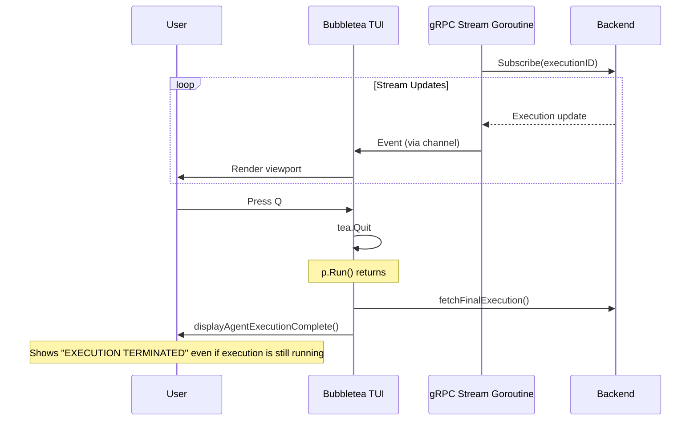

# TUI Quit vs Cancel UX Improvement

## Problem Analysis

Three distinct issues:

1. **Misleading post-quit summary**: When user presses `q` while execution is still running (phase `IN_PROGRESS`), `agentSummaryTitleAndStyle()` in `[run_display_summary.go](client-apps/cli/cmd/stigmer/root/run_display_summary.go)` hits the `default` case and renders "EXECUTION TERMINATED" -- but the execution is still running on the backend.
2. **No semantic separation between "detach" and "quit"**: Pressing `q` always exits the TUI. The footer labels it "quit" regardless of whether the execution is done or still running, implying the user is stopping the execution.
3. **No cancel option inside the TUI**: The user must exit the TUI and run `stigmer delete execution <id>` separately. The TUI already handles inline approval prompts via channels -- cancel should have the same first-class treatment.

## Current Architecture




## Design Decisions

### Decision 1: `q` = "detach from viewer" (never implies termination)

- `q`/`Ctrl+C` always exits the TUI viewer. The execution is **not** affected.
- Footer label changes from "quit" to "detach" when execution is still running, remains "exit" when execution is done.
- The post-quit summary panel distinguishes between detach and completion.

### Decision 2: `c` = "cancel execution" (with confirmation)

- New `c` keybinding triggers a lightweight confirmation in the footer: `Cancel execution? [y] yes  [n] no`
- On confirm, sends cancel request to the backend via a callback (`CancelFn`) injected through the Config.
- TUI stays open -- the stream will deliver the phase change to CANCELLED, and the TUI transitions to the `done` state naturally.
- If cancel fails (API error), an error block is appended and the `cancelling` state is cleared.

### Decision 3: Cancel unavailable during approval prompts

- During approval mode, the footer already captures keys (a/s/r). Adding `c` there makes the footer too busy and creates ambiguity (should rejecting a tool call vs cancelling the whole execution be conflated?).
- The user can still press `q` to detach, then cancel from the command line if needed.

## Changes by File

### 1. `[executiontui/model.go](client-apps/cli/pkg/executiontui/model.go)` -- Add cancel state

- Add `CancelFn func() error` to `Config` struct
- Add two fields to `Model`:
  - `cancelConfirm bool` -- true when showing the y/n confirmation
  - `cancelling bool` -- true after sending the cancel request, before phase changes

### 2. `[executiontui/messages.go](client-apps/cli/pkg/executiontui/messages.go)` -- Add cancel result message

- Add `cancelResultMsg` struct with an `err error` field
- This is the tea.Msg returned by the async cancel command

### 3. `[executiontui/update.go](client-apps/cli/pkg/executiontui/update.go)` -- Handle cancel keys and result

- In `Update()`: add case for `cancelResultMsg` -- on error, clear `cancelling`, append error block; on success, append info block ("Cancel requested, waiting for agent to stop...")
- In `handleKeyPress()`:
  - Add `c` key: when `!m.done && m.approval == nil && !m.cancelling && !m.cancelConfirm`, set `m.cancelConfirm = true`
  - When `m.cancelConfirm` is true, route to a new `handleCancelConfirmKey()` method:
    - `y`: set `m.cancelling = true`, `m.cancelConfirm = false`, return async cancel command
    - `n`/`esc`: set `m.cancelConfirm = false`, return to normal
  - Cancel confirm takes priority between approval check and focus/toggle keys

### 4. `[executiontui/view.go](client-apps/cli/pkg/executiontui/view.go)` -- Update footer hints

Update `renderFooter()` with new states (priority order):


| State          | Footer Text                                                            |
| -------------- | ---------------------------------------------------------------------- |
| Done           | `"<phase icon> <phase> -- up/down scroll [tab...] q exit"` (unchanged) |
| Cancel confirm | `"Cancel execution? [y] yes [n] no"`                                   |
| Cancelling     | `"Cancelling... up/down scroll q detach"`                              |
| Approval       | `"[a] Approve [s] Skip [r] Reject [q] Detach"` (label change)          |
| Scroll paused  | `"Paused -- G resume c cancel ? help q detach"`                        |
| Normal         | `"up/down scroll c cancel ? help q detach"`                            |


Key label change: "quit" becomes "detach" for all non-done states.

### 5. `[executiontui/help.go](client-apps/cli/pkg/executiontui/help.go)` -- Document cancel key

- Add a new "Execution Control" section to `helpSections()`:
  - `c` -- "Cancel execution (with confirmation)"
- Update the "General" section:
  - Change `"q / Ctrl+C", "Quit"` to `"q / Ctrl+C", "Detach (execution continues)"` for clarity

### 6. `[run_stream.go](client-apps/cli/cmd/stigmer/root/run_stream.go)` -- Wire CancelFn, distinguish detach vs done

In `streamAgentExecution()`:

- Create and inject `CancelFn` into Config:

```go
cancelFn := func() error {
    _, err := execution.Cancel(conn, executionID)
    return err
}
model := executiontui.New(executiontui.Config{
    ExecutionID:       executionID,
    Events:            events,
    ApprovalResponses: approvalResponses,
    CancelFn:          cancelFn,
})
```

- After `p.Run()` returns, branch on `result.Done()`:
  - `Done() == true`: execution reached terminal state -- call `displayAgentExecutionComplete(finalExec)` (existing behavior)
  - `Done() == false`: user detached while execution is running -- call new `displayAgentExecutionDetached(finalExec)` function

### 7. `[run_display_summary.go](client-apps/cli/cmd/stigmer/root/run_display_summary.go)` -- Add detach panel, fix default case

- **Fix `agentSummaryTitleAndStyle` default**: Add explicit cases for `EXECUTION_IN_PROGRESS`, `EXECUTION_PENDING`, `EXECUTION_WAITING_FOR_APPROVAL`, `EXECUTION_PAUSED`. The `default` case should return `"EXECUTION STATUS UNKNOWN"` as a true catch-all rather than incorrectly labeling running executions as terminated.
- **Add `displayAgentExecutionDetached()**`: Renders a distinct panel when the user detaches while execution is running:

```
+-- DETACHED FROM EXECUTION -------------------------+
|                                                     |
|  Execution:  aex-01khgcwb6thb3azb6jj1bzfte8        |
|  Status:     running                                |
|  Messages:   13                                     |
|  Tool calls: 12                                     |
|                                                     |
|  The execution continues in the background.         |
|                                                     |
|  Check status:                                      |
|    stigmer get execution aex-01khgcwb6...           |
|                                                     |
|  Cancel:                                            |
|    stigmer delete execution aex-01khgcwb6...        |
|                                                     |
+-----------------------------------------------------+
```

Panel uses `StyleInfo` (neutral/blue) rather than warning/error since detaching is a normal, non-destructive action.

## Out of Scope (noted for follow-up)

- **goroutine leak on detach**: When the user quits, the `streamToEvents` goroutine may block forever on `cfg.events <- ...` or `<-cfg.approvalResponses`. A context-based cancellation should be added, but this is a pre-existing issue and orthogonal to the UX changes.
- **Reattach command** (`stigmer get execution <id> --follow`): Would let users reconnect to a running execution. Valuable follow-up but not needed for this change.
- **Cancel during approval**: Currently excluded for UX simplicity. Could be revisited if users request it.

