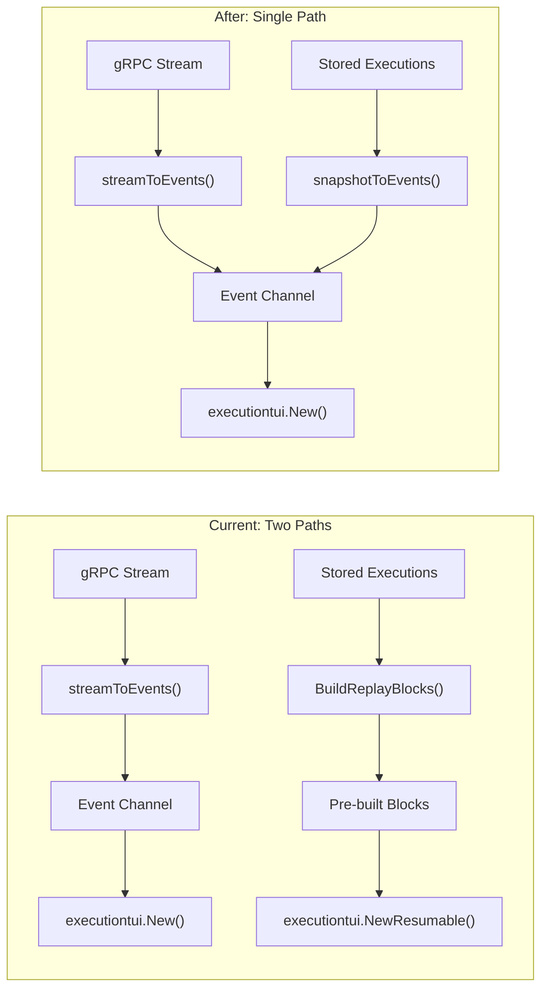

# Unify Session Resume to Single Event-Driven Path

## Problem

Two separate rendering paths exist for the same data:

1. **Live path** (`streamToEvents` in `[run_stream_events.go](client-apps/cli/cmd/stigmer/root/run_stream_events.go)`) -- gRPC stream updates are diffed and emitted as typed events (`ToolRunningEvent`, `ToolCompletedEvent`, etc.) that `executiontui.New()` processes into stateful blocks with lifecycle badges, noise filtering, and duplicate suppression.
2. **Replay path** (`BuildReplayBlocks` in `[replay.go](client-apps/cli/pkg/executiontui/replay.go)`) -- stored execution data is directly converted to content blocks using a completely separate rendering implementation. This path lacks noise filtering, lifecycle badges, and `isTrackedToolMessage` duplicate suppression.

Any rendering improvement to the live path (like the approval noise suppression added in the 2026-02-16 changelog) must be manually duplicated into the replay path. This drift caused the bug the user observed.

## Design

Eliminate the replay rendering path entirely. Instead, convert stored execution snapshots into the same event stream that the live path produces:




The existing event emission functions (`emitToolCallStateEvents`, `emitMessageEvents`, `emitSubAgentEvents`) already accept their tracking state as parameters and return updated state. They are fully reusable -- the only thing binding them to the gRPC stream is the `streamToEvents` loop. For stored data, we call them once per execution, diffing from empty state (= everything is new).

## Multi-Execution Sequencing

A session may contain multiple executions (original + follow-ups). The critical constraint: when the TUI receives `DoneEvent` and `FollowUpFn` is set, it activates `inputActive = true` and **stops listening for events** (line 168-171 of `[handle_events.go](client-apps/cli/pkg/executiontui/handle_events.go)`):

```go
if m.done || m.inputActive {
    return m, nil  // stops calling listenForEvents
}
```

Solution: for intermediate executions (all except the last), skip the `DoneEvent`. The TUI sees a continuous event stream across all executions -- a seamless conversation. Only the last execution emits `DoneEvent`, which activates the input composer.

## Changes

### 1. New file: `run_stream_snapshot.go`

**Location**: `[client-apps/cli/cmd/stigmer/root/run_stream_snapshot.go](client-apps/cli/cmd/stigmer/root/run_stream_snapshot.go)`

Contains two functions:

- `**snapshotToEvents(executions, events)`** -- goroutine that iterates chronological executions and calls `emitSnapshotEvents` for each. Calls `defer close(events)`.
- `**emitSnapshotEvents(exec, events, isLast)`** -- converts a single stored execution into events by calling the SAME functions `streamToEvents` uses:
  - `emitToolCallStateEvents(events, status.ToolCalls, emptyMap, emptyMap)` -- all tool calls appear as "new", emitting `ToolRunningEvent`/`ToolCompletedEvent` as appropriate. For completed executions, tools are in terminal states, so they hit the "first seen + terminal" branch (lines 306-319 of `[run_stream_events.go](client-apps/cli/cmd/stigmer/root/run_stream_events.go)`) which emits `ToolCompletedEvent` directly -- correct behavior.
  - `emitMessageEvents(events, messages, 0, false, toolCallStates)` -- processes all messages with noise filtering (`isApprovalNoiseMessage`) and duplicate suppression (`isTrackedToolMessage`).
  - `emitSubAgentEvents(events, subAgents, emptyTrackers)` -- processes sub-agent activity.
  - If `isLast`: emit `DoneEvent` with the execution's final phase and error.

### 2. Update `resumeSession` in `run_session.go`

**File**: `[client-apps/cli/cmd/stigmer/root/run_session.go](client-apps/cli/cmd/stigmer/root/run_session.go)`

Replace the current implementation:

```go
// Current (lines 101-115):
blocks := executiontui.BuildSessionReplayBlocks(chronological, display.GetTerminalWidth())
model := executiontui.NewResumable(executiontui.ResumableConfig{...})
```

With:

```go
// After:
events := make(chan executiontui.Event, 256)
approvalResponses := make(chan executiontui.ApprovalResponse, 1)
go snapshotToEvents(chronological, events)

model := executiontui.New(executiontui.Config{
    SessionID:         sessionID,
    ExecutionID:       latestExecID,
    Events:            events,
    ApprovalResponses: approvalResponses,
    FollowUpFn:        followUpFn,
    Verbose:           verbose,
})
```

The rest of the function (TUI run, final state fetch, summary display) stays the same.

### 3. Clean up `replay.go`

**File**: `[client-apps/cli/pkg/executiontui/replay.go](client-apps/cli/pkg/executiontui/replay.go)`

Remove:

- `NewResumable` and `ResumableConfig` -- replaced by `executiontui.New()`
- `BuildSessionReplayBlocks` and `BuildReplayBlocks` -- replaced by `snapshotToEvents`
- `buildToolCallBlocks`, `replayConvertToolCalls`, `replayConvertToolCall`, `replayMapToolCallStatus`, `replayComputeDuration` -- all helper functions for the replay rendering path
- `NewReplay` and `ReplayConfig` -- dead code (never called outside the file)

Keep:

- `isReplayMode()` -- still used by `handleWindowSize` for viewport init branching
- `replayViewportInit()` -- still used by `isReplayMode()` path

Actually, with `NewReplay` removed, `isReplayMode()` can never return true (it checks `m.cfg.Events == nil && m.done`, but all remaining constructors set `Events`). So both `isReplayMode()` and `replayViewportInit()` become dead code and should also be removed. The `handleWindowSize` in `[update.go](client-apps/cli/pkg/executiontui/update.go)` simplifies:

```go
// Before (lines 312-317):
if m.isReplayMode() {
    m.viewport = m.replayViewportInit(m.width, m.height)
} else {
    m.viewport = newViewport(m.width, viewportHeight)
}

// After:
m.viewport = newViewport(m.width, viewportHeight)
```

### 4. Tests

- **New**: Test `emitSnapshotEvents` in `run_stream_snapshot_test.go` -- verify that a stored execution with messages, tool calls, and system messages emits the correct events (including noise suppression)
- **Existing**: `[run_stream_events_test.go](client-apps/cli/cmd/stigmer/root/run_stream_events_test.go)` tests for `isApprovalNoiseMessage` remain unchanged
- **Existing**: `[update_test.go](client-apps/cli/pkg/executiontui/update_test.go)` tests all use `executiontui.New()` which is the unified path -- no changes needed
- **Remove imports**: Remove `display` package import from `run_session.go` (no longer needs `GetTerminalWidth()`)

## Why This Works

- **Event emission functions are already stateless**: `emitToolCallStateEvents` accepts `prevStates` as a parameter and returns new state. Starting from empty maps makes all tool calls "new" -- the diff logic correctly emits `ToolCompletedEvent` for already-completed tools (line 306-319 of `run_stream_events.go`).
- **Noise suppression is automatic**: `emitCompleteMessage` already filters "Approval received" messages. `isTrackedToolMessage` already suppresses duplicate tool result blocks. No new filtering code needed.
- **Bubbletea handles rapid events**: The Bubbletea framework coalesces rapid renders via its frame timer. Processing 100+ events from a buffered channel produces visually seamless output.
- **Channel lifecycle is correct**: `snapshotToEvents` sends `DoneEvent` (for last execution) then closes the channel. The TUI receives `DoneEvent` first, sets `inputActive = true`, stops listening. The channel close is never observed. If the user sends a follow-up, `handleFollowUpStarted` swaps to a new live channel.

## Risk Mitigation

- The live path event emission functions (`emitToolCallStateEvents`, `emitMessageEvents`, etc.) are NOT modified -- zero risk to live streaming behavior
- The change is confined to `run_session.go` (caller), `run_stream_snapshot.go` (new), and `replay.go` (deletion)
- Tests for the event emission functions remain untouched

