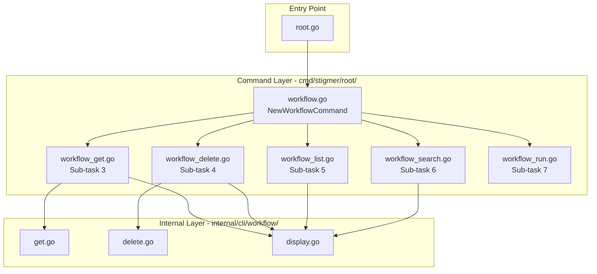

# Phase 2 Sub-task 2: Workflow Command Group

## Objective

Create the `stigmer workflow` command group as a first-class CLI citizen, following the established patterns from `agent.go` and `mcpserver.go`. This provides the structural foundation for all workflow subcommands.

## Prerequisites Verified

Sub-task 1 is **COMPLETE**. The `internal/cli/workflow/` package already exists with:

- [get.go](client-apps/cli/internal/cli/workflow/get.go) - `GetFromBackend()`, `Get()` functions
- [delete.go](client-apps/cli/internal/cli/workflow/delete.go) - `Delete()`, `DeleteFromBackend()` functions  
- [display.go](client-apps/cli/internal/cli/workflow/display.go) - `DisplayGetResult()`, `DisplayDeleteResult()`, `DisplaySearchResult()`, `DisplayListResult()` functions
- [BUILD.bazel](client-apps/cli/internal/cli/workflow/BUILD.bazel) - Bazel build configuration

## Architecture




## Implementation Details

### 1. Create `cmd/stigmer/root/workflow.go`

**Purpose**: Command group factory with comprehensive documentation.

**Structure** (~60-70 lines):

```go
package root

import "github.com/spf13/cobra"

// NewWorkflowCommand creates the workflow management command group.
func NewWorkflowCommand() *cobra.Command {
    cmd := &cobra.Command{
        Use:     "workflow",
        Aliases: []string{"wf"},
        Short:   "Manage workflows",
        Long:    `...comprehensive description...`,
        Example: `...usage examples...`,
    }
    
    // Subcommands registered as implemented in sub-tasks 3-7
    return cmd
}
```

**Key content for Long description**:

- Explain workflows are SDK-synthesized (not YAML-first like agents)
- Clarify the workflow lifecycle: define (SDK) → deploy (apply) → execute (run)
- Explain WHY SDK-based: complex orchestration, dependency tracking, programmatic generation
- Differentiate from agents which are declarative YAML

**Examples to include**:

- `stigmer workflow get my-workflow`
- `stigmer workflow run my-workflow`
- `stigmer workflow delete my-workflow`
- `stigmer workflow search "deploy"`
- `stigmer wf get my-workflow` (alias usage)

### 2. Modify `cmd/stigmer/root.go`

**Current state** (line 49):

```go
rootCmd.AddCommand(root.NewAgentCommand())
```

**Change**: Add after `NewAgentCommand()`:

```go
rootCmd.AddCommand(root.NewWorkflowCommand())
```

This registers the workflow command group in the root CLI.

### 3. Modify `cmd/stigmer/root/BUILD.bazel`

**Current sources** (lines 5-30):

```bazel
srcs = [
    "agent.go",
    "agent_delete.go",
    ...
]
```

**Change**: Add `"workflow.go"` to the srcs list, maintaining alphabetical order after the agent files.

## Code Quality Standards

Following [coding-guidelines.mdc](client-apps/cli/.cursor/rules/coding-guidelines.mdc):

- **Single Responsibility**: workflow.go only contains command group definition
- **File Size**: Target 60-70 lines (well under 250-line limit)
- **No Business Logic**: Pure command configuration, no orchestration
- **Pattern Consistency**: Mirror agent.go structure exactly
- **Error Handling**: N/A for command group (errors handled in subcommands)

## Design Decisions

**Why no subcommands initially?**

The command group is created empty because:

1. Subcommands are defined in separate files (workflow_get.go, etc.)
2. Each sub-task (3-7) adds one subcommand
3. This enables incremental, testable development
4. Matches how agent.go evolved

**Why alias "wf"?**

- Consistent with agent alias "agt" (abbreviated resource name)
- Commonly used shorthand (workflow → wf)
- Matches the ID prefix pattern (wfl_ for workflow IDs)

## Testing Strategy

After implementation:

```bash
# Verify command group registered
stigmer --help | grep workflow

# Verify alias works
stigmer wf --help

# Verify help content displays
stigmer workflow --help
```

## Files Summary


| File                           | Action | Lines |
| ------------------------------ | ------ | ----- |
| `cmd/stigmer/root/workflow.go` | CREATE | ~65   |
| `cmd/stigmer/root.go`          | MODIFY | +1    |
| `cmd/stigmer/root/BUILD.bazel` | MODIFY | +1    |


## Success Criteria

- `stigmer workflow --help` displays comprehensive help text
- `stigmer wf --help` works (alias)
- Bazel build succeeds: `bazel build //client-apps/cli/cmd/stigmer/root:root`
- Follows coding guidelines (file size, structure, no business logic)
- Documentation explains SDK-synthesis model clearly

