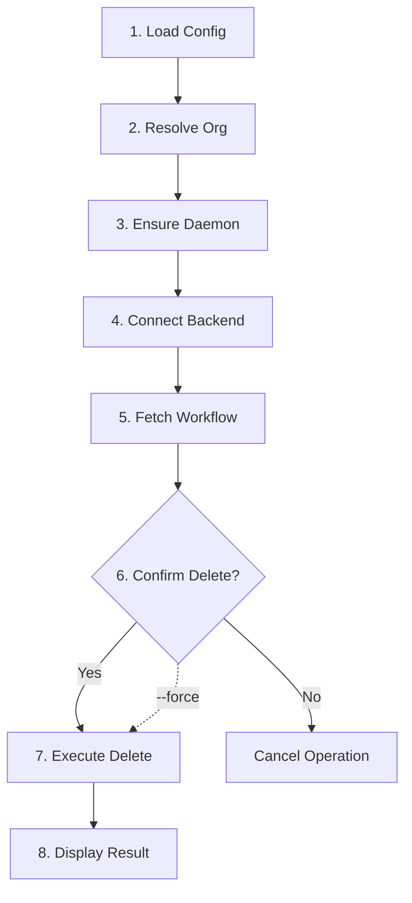

# Workflow Delete Command Implementation

## Goal

Implement `stigmer workflow delete <ref>` with interactive confirmation using the survey library. This command enables users to safely delete workflows with a confirmation prompt (bypassable via `--force`) and follows the exact patterns established in `agent_delete.go`.

## Existing Infrastructure (Ready to Use)

The internal workflow package already provides all necessary operations:

**[internal/cli/workflow/delete.go](client-apps/cli/internal/cli/workflow/delete.go)** (77 lines):

- `Delete(opts *DeleteOptions) (*DeleteResult, error)` - High-level delete orchestration
- `DeleteFromBackend(conn, workflowID) (*Workflow, error)` - gRPC delete call

**[internal/cli/workflow/display.go](client-apps/cli/internal/cli/workflow/display.go)** (195 lines):

- `DisplayDeleteResult(result *DeleteResult)` - Success message with deleted workflow details
- `DisplayDeleteConfirmation(workflow *Workflow)` - Pre-deletion warning display

**[internal/cli/workflow/get.go](client-apps/cli/internal/cli/workflow/get.go)** (85 lines):

- `GetFromBackend(conn, orgID, ref) (*Workflow, error)` - Fetch workflow for confirmation

**[cmd/stigmer/root/workflow.go](client-apps/cli/cmd/stigmer/root/workflow.go)** (111 lines):

- `resolveWorkflowOrganization(cfg, orgOverride) (string, error)` - Organization resolution helper

## Implementation Pattern

Following the 8-step orchestration from [agent_delete.go](client-apps/cli/cmd/stigmer/root/agent_delete.go):




## File to Create

### 1. `cmd/stigmer/root/workflow_delete.go` (~130 lines)

**Structure:**

```go
package root

import (
    "fmt"

    "github.com/AlecAivazis/survey/v2"
    "github.com/spf13/cobra"
    "github.com/stigmer/stigmer/client-apps/cli/internal/cli/backend"
    "github.com/stigmer/stigmer/client-apps/cli/internal/cli/clierr"
    "github.com/stigmer/stigmer/client-apps/cli/internal/cli/config"
    "github.com/stigmer/stigmer/client-apps/cli/internal/cli/daemon"
    "github.com/stigmer/stigmer/client-apps/cli/internal/cli/workflow"
)

// newWorkflowDeleteCommand creates the workflow delete subcommand.
func newWorkflowDeleteCommand() *cobra.Command { ... }

// workflowDeleteOptions contains options for the delete operation.
type workflowDeleteOptions struct {
    Reference   string
    OrgOverride string
    Force       bool
}

// executeWorkflowDelete handles the 8-step delete orchestration.
func executeWorkflowDelete(opts workflowDeleteOptions) error { ... }

// confirmWorkflowDeletion prompts user for confirmation.
func confirmWorkflowDeletion(workflowName string) (bool, error) { ... }
```

**Key Implementation Details:**

- **Command Definition**: Mirrors `agent_delete.go` command structure exactly
  - Use: `delete <name-or-id>`
  - Flags: `--force, -f` (skip confirmation), `--org` (organization override)
  - Args: `cobra.ExactArgs(1)`
- **8-Step Orchestration in `executeWorkflowDelete()**`:
  1. Load backend config via `config.Load()`
  2. Resolve organization via `resolveWorkflowOrganization()`
  3. Ensure daemon running (local mode) via `daemon.EnsureRunning()`
  4. Connect to backend via `backend.NewConnection()`
  5. Fetch workflow via `workflow.GetFromBackend()` for confirmation display
  6. Interactive confirmation via `confirmWorkflowDeletion()` (skip if `--force`)
  7. Delete workflow via `workflow.Delete()`
  8. Display result via `workflow.DisplayDeleteResult()`
- **Interactive Confirmation**: Uses `survey.Confirm` (already in BUILD.bazel deps)

**Examples in Help Text:**

```
# Delete by name (with confirmation)
stigmer workflow delete my-workflow

# Delete by org/slug (with confirmation)
stigmer workflow delete stigmer/deploy-pipeline

# Delete by resource ID (with confirmation)
stigmer workflow delete wfl_abc123

# Force delete (skip confirmation)
stigmer workflow delete my-workflow --force

# Delete from specific organization
stigmer workflow delete my-workflow --org acme-corp
```

## Files to Modify

### 2. `cmd/stigmer/root/workflow.go`

Register the delete command:

```go
// Line 75-76 (after newWorkflowGetCommand registration)
cmd.AddCommand(newWorkflowGetCommand())
cmd.AddCommand(newWorkflowDeleteCommand())  // ADD THIS
```

Remove the placeholder comment for Sub-task 4.

### 3. `cmd/stigmer/root/BUILD.bazel`

Add `workflow_delete.go` to sources:

```starlark
srcs = [
    ...
    "workflow.go",
    "workflow_delete.go",  // ADD THIS
    "workflow_get.go",
],
```

Note: `@com_github_alecaivazis_survey_v2//:survey` is already in deps (line 65).

## Quality Assurance

**Coding Guidelines Compliance:**

- File size: Target ~130 lines (under 250 limit)
- Function sizes: All under 50 lines
- Error wrapping: Every error wrapped with specific context
- Command handler: Thin orchestration only, no business logic
- Consistent naming: Mirrors `agent_delete.go` patterns exactly

**Consistency Checks:**

- Help text follows workflow command style from `workflow_get.go`
- Error messages match existing workflow patterns
- Flag names identical to agent commands (user muscle memory)
- Survey prompt style matches `agent_delete.go`

## Testing Strategy

1. **Build Verification**: `bazel build //client-apps/cli/cmd/stigmer/root:root`
2. **Help Text**: `stigmer workflow delete --help`
3. **Interactive Flow**: Delete with confirmation prompt
4. **Force Flow**: Delete with `--force` bypassing confirmation
5. **Error Handling**: Invalid reference, workflow not found

## Deliverables


| File                 | Lines     | Purpose                                      |
| -------------------- | --------- | -------------------------------------------- |
| `workflow_delete.go` | ~130      | Delete command with interactive confirmation |
| `workflow.go`        | +1 line   | Register delete command                      |
| `BUILD.bazel`        | +1 line   | Add source file                              |
| Changelog            | ~30 lines | Document the change                          |


## Why This Approach

1. **Zero Code Duplication**: Reuses 100% of workflow internal package (277 lines)
2. **Pattern Consistency**: Identical structure to `agent_delete.go` (user familiarity)
3. **Infrastructure Leverage**: Uses existing survey, backend, config, daemon infrastructure
4. **Future-Proof**: Same 8-step pattern scales to all resource types
5. **Minimal Surface Area**: Single new file (130 lines) vs. scattered changes

---

*This implementation represents the foundation of a world-class platform - clean, maintainable, and following established patterns without compromise.*