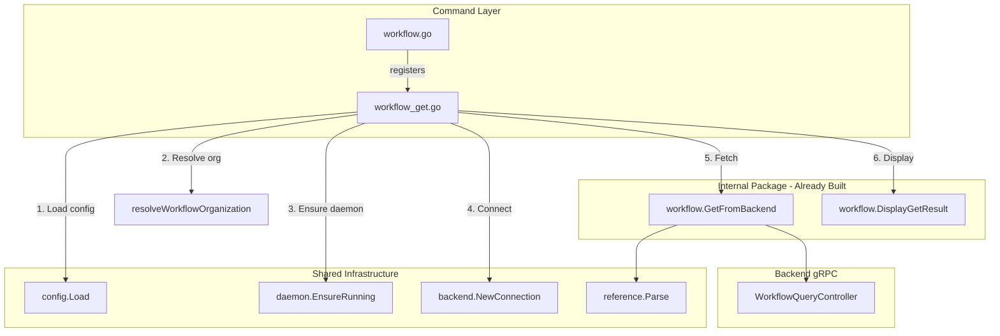

# Workflow Get Command Implementation

## Objective

Implement `stigmer workflow get <name-or-id>` with support for table, yaml, and json output formats. This command enables users to retrieve workflow configurations by name (slug), org/slug, or resource ID.

## Architecture




## Files to Create/Modify

### 1. NEW: `cmd/stigmer/root/workflow_get.go` (~115 lines)

This is the primary file to create. It mirrors `[agent_get.go](client-apps/cli/cmd/stigmer/root/agent_get.go)` exactly.

**Structure:**

```go
package root

// newWorkflowGetCommand creates the workflow get subcommand.
func newWorkflowGetCommand() *cobra.Command {
    // Flags: --output (table/yaml/json), --org
    // Args: cobra.ExactArgs(1) for <name-or-id>
    // Run: call executeWorkflowGet() then workflow.DisplayGetResult()
}

// workflowGetOptions contains options for the get operation.
type workflowGetOptions struct {
    Reference    string
    OrgOverride  string
    OutputFormat string
}

// executeWorkflowGet handles the workflow get operation.
// 5-step orchestration:
// 1. Load backend configuration
// 2. Resolve organization
// 3. Ensure daemon running (local mode)
// 4. Connect to backend
// 5. Fetch workflow from backend
func executeWorkflowGet(opts workflowGetOptions) (*workflowv1.Workflow, error) {
    // ...
}
```

**Key differences from agent_get.go:**

- Imports `workflowv1` instead of `agentv1`
- Imports `"github.com/stigmer/stigmer/client-apps/cli/internal/cli/workflow"` instead of `agent`
- Calls `workflow.GetFromBackend()` instead of `agent.GetFromBackend()`
- Calls `workflow.DisplayGetResult()` instead of `agent.DisplayGetResult()`
- Uses `resolveWorkflowOrganization()` (to be added to workflow.go)

**Help text examples:**

```
# Get by name (slug)
stigmer workflow get my-workflow

# Get by org/slug
stigmer workflow get stigmer/deploy-pipeline

# Get by resource ID
stigmer workflow get wfl_abc123

# Output as YAML
stigmer workflow get my-workflow --output yaml

# Output as JSON
stigmer workflow get my-workflow --output json

# Get from specific organization
stigmer workflow get my-workflow --org acme-corp
```

### 2. MODIFY: `cmd/stigmer/root/workflow.go` (~25 lines added)

Add organization resolver and register get command.

**Add `resolveWorkflowOrganization` function** (mirrors `resolveAgentOrganization` from agent.go lines 237-261):

```go
// resolveWorkflowOrganization determines the organization ID based on backend type and overrides.
func resolveWorkflowOrganization(cfg *config.Config, orgOverride string) (string, error) {
    switch cfg.Backend.Type {
    case config.BackendTypeLocal:
        orgID := "local"
        cliprint.PrintInfo("Using local backend (organization: %s)", orgID)
        return orgID, nil

    case config.BackendTypeCloud:
        if orgOverride != "" {
            cliprint.PrintInfo("Using organization from flag: %s", orgOverride)
            return orgOverride, nil
        }

        if cfg.Backend.Cloud != nil && cfg.Backend.Cloud.OrgID != "" {
            cliprint.PrintInfo("Using organization from context: %s", cfg.Backend.Cloud.OrgID)
            return cfg.Backend.Cloud.OrgID, nil
        }

        return "", fmt.Errorf("organization not set for cloud mode\n\nUse --org flag or run: stigmer context set --org <org-id>")

    default:
        return "", fmt.Errorf("unknown backend type: %s", cfg.Backend.Type)
    }
}
```

**Register get command** in `NewWorkflowCommand()`:

```go
cmd.AddCommand(newWorkflowGetCommand())
```

**Add required imports:**

```go
import (
    "fmt"

    "github.com/spf13/cobra"
    "github.com/stigmer/stigmer/client-apps/cli/internal/cli/cliprint"
    "github.com/stigmer/stigmer/client-apps/cli/internal/cli/config"
)
```

### 3. MODIFY: `cmd/stigmer/root/BUILD.bazel`

Add `workflow_get.go` to sources (line ~32, after `workflow.go`):

```starlark
srcs = [
    # ... existing files ...
    "workflow.go",
    "workflow_get.go",  # ADD THIS LINE
],
```

**No new dependencies required** - the BUILD.bazel already has:

- `//apis/stubs/go/ai/stigmer/agentic/workflow/v1:workflow`
- `//client-apps/cli/internal/cli/workflow` (needs to be added)

**Add workflow internal package dependency** if not present:

```starlark
deps = [
    # ... existing deps ...
    "//client-apps/cli/internal/cli/workflow",  # ADD IF MISSING
],
```

## Implementation Details

### Command Flags


| Flag       | Short | Default | Description                         |
| ---------- | ----- | ------- | ----------------------------------- |
| `--output` | `-o`  | `table` | Output format: table, yaml, json    |
| `--org`    |       |         | Organization ID (overrides context) |


### Reference Resolution

The command accepts three reference formats (handled by existing `workflow.GetFromBackend`):

1. **Slug only**: `my-workflow` - Uses org from context/flag
2. **Org/slug**: `stigmer/deploy-pipeline` - Explicit org
3. **Resource ID**: `wfl_abc123` - Direct lookup

### Output Formats

Already implemented in `[workflow/display.go](client-apps/cli/internal/cli/workflow/display.go)`:

- **table**: Human-readable summary with metadata and spec
- **yaml**: Full proto as YAML (for editing/scripting)
- **json**: Full proto as JSON (for automation)

### Error Handling

Follow the established pattern:

- All errors wrapped with `errors.Wrap()` or `fmt.Errorf()`
- Use `clierr.Handle(err)` in command Run function
- Specific error messages for each failure point

## Coding Guidelines Compliance

Checklist from [coding-guidelines.mdc](client-apps/cli/.cursor/rules/coding-guidelines.mdc):

- File under 250 lines (target: ~115 lines)
- Functions under 50 lines
- Every error wrapped with specific context
- No business logic in command handler (only orchestration)
- Thin command layer: Parse -> Delegate -> Handle Error -> Display
- Import organization with blank line separators

## Testing Strategy

1. **Build verification**: `bazel build //client-apps/cli/cmd/stigmer/root:root`
2. **Linter check**: Run `ReadLints` on modified files
3. **Manual testing** (if SDK templates issue resolved):
  - `stigmer workflow get --help` shows correct usage
  - `stigmer workflow get <name>` with table output
  - `stigmer workflow get <name> --output yaml`
  - `stigmer workflow get <name> --output json`
  - `stigmer wf get <name>` alias works

## Success Criteria

- `stigmer workflow get <ref>` retrieves workflow by name/ID
- Table/yaml/json output formats work correctly
- Organization resolution works for local and cloud backends
- Code follows established patterns from agent_get.go
- All coding guidelines met (file size, error handling, etc.)
- Bazel build succeeds
- No linter errors introduced

