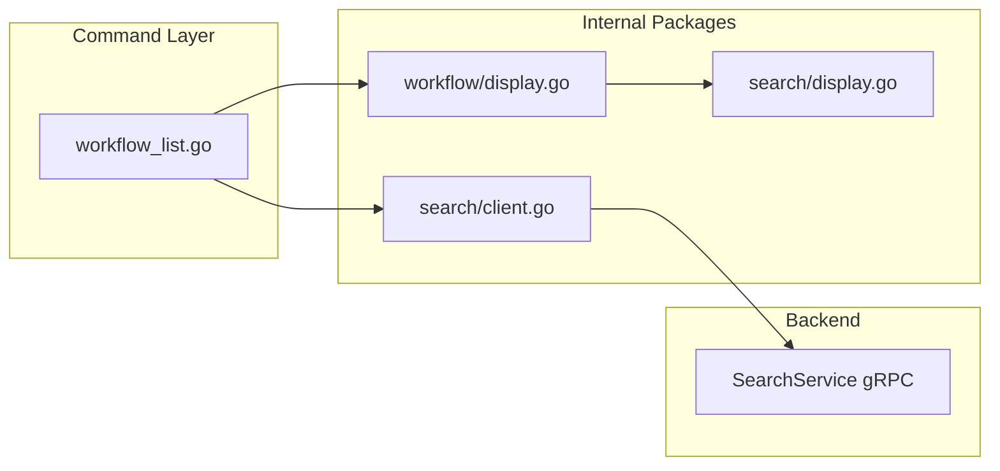

# Workflow List Command Implementation

## Context

Sub-task 5 requires implementing `stigmer workflow list` command. While the original plan described this as a "placeholder", the codebase has evolved - `agent_list.go` is now a **fully functional list command** using the search infrastructure. For consistency and quality, `workflow_list.go` should follow the same pattern.

**Key Discovery**: All required infrastructure already exists:

- `internal/cli/workflow/display.go` has `DisplayListResult()` (lines 152-169)
- `internal/cli/search/client.go` provides `Search()` function
- `workflow.go` command group exists (needs subcommand registration)

## Architecture




## Implementation Details

### Step 1: Add Organization Resolver to workflow.go

Add `resolveWorkflowOrganization()` helper to [workflow.go](client-apps/cli/cmd/stigmer/root/workflow.go) following the exact pattern from [agent.go](client-apps/cli/cmd/stigmer/root/agent.go) lines 238-261.

```go
func resolveWorkflowOrganization(cfg *config.Config, orgOverride string) (string, error) {
    switch cfg.Backend.Type {
    case config.BackendTypeLocal:
        orgID := "local"
        cliprint.PrintInfo("Using local backend (organization: %s)", orgID)
        return orgID, nil

    case config.BackendTypeCloud:
        if orgOverride != "" {
            cliprint.PrintInfo("Using organization from flag: %s", orgOverride)
            return orgOverride, nil
        }
        if cfg.Backend.Cloud != nil && cfg.Backend.Cloud.OrgID != "" {
            cliprint.PrintInfo("Using organization from context: %s", cfg.Backend.Cloud.OrgID)
            return cfg.Backend.Cloud.OrgID, nil
        }
        return "", fmt.Errorf("organization not set for cloud mode...")
    default:
        return "", fmt.Errorf("unknown backend type: %s", cfg.Backend.Type)
    }
}
```

**Note**: This duplication follows the established pattern (agent, skill, mcpserver all have their own resolvers). A future refactoring could consolidate these, but maintaining consistency is more important now.

### Step 2: Create workflow_list.go (~130 lines)

Create [workflow_list.go](client-apps/cli/cmd/stigmer/root/workflow_list.go) mirroring [agent_list.go](client-apps/cli/cmd/stigmer/root/agent_list.go).

**Structure**:

- `newWorkflowListCommand()` - Cobra command with flags
- `workflowListOptions` - Options struct
- `executeWorkflowList()` - 5-step orchestration:
  1. Load backend configuration
  2. Resolve organization (unless --all-orgs)
  3. Ensure daemon running (local mode)
  4. Connect to backend
  5. Search with empty query (list mode)

**Flags**:

- `--output, -o` - Output format: table, yaml, json (default: table)
- `--org` - Organization to list from
- `--all-orgs` - List from all accessible organizations
- `--page` - Page number (1-indexed, default: 1)
- `--page-size` - Results per page (default: 20, max: 100)

**Key difference from agent_list.go**: Uses `apiresourcekind.ApiResourceKind_workflow`

### Step 3: Register Command in workflow.go

Update the `NewWorkflowCommand()` function to register the list subcommand:

```go
func NewWorkflowCommand() *cobra.Command {
    cmd := &cobra.Command{
        // ... existing config
    }
    
    cmd.AddCommand(newWorkflowListCommand())
    
    return cmd
}
```

### Step 4: Update BUILD.bazel

Add `workflow_list.go` to [BUILD.bazel](client-apps/cli/cmd/stigmer/root/BUILD.bazel) sources array.

### Step 5: Update workflow.go Imports

Add required imports to workflow.go:

- `"fmt"`
- `"github.com/stigmer/stigmer/client-apps/cli/internal/cli/cliprint"`
- `"github.com/stigmer/stigmer/client-apps/cli/internal/cli/config"`

## Files Summary


| File                                                                  | Action | Lines                                       |
| --------------------------------------------------------------------- | ------ | ------------------------------------------- |
| [workflow.go](client-apps/cli/cmd/stigmer/root/workflow.go)           | Modify | +30 (org resolver + imports + registration) |
| [workflow_list.go](client-apps/cli/cmd/stigmer/root/workflow_list.go) | Create | ~130 lines                                  |
| [BUILD.bazel](client-apps/cli/cmd/stigmer/root/BUILD.bazel)           | Modify | +1 (add source)                             |


## Existing Infrastructure (No Changes Needed)

- [internal/cli/workflow/display.go](client-apps/cli/internal/cli/workflow/display.go) - `DisplayListResult()` ready at lines 152-169
- [internal/cli/search/client.go](client-apps/cli/internal/cli/search/client.go) - `Search()` function ready
- [internal/cli/search/display.go](client-apps/cli/internal/cli/search/display.go) - Display infrastructure ready

## Quality Checklist

- All files under 250 lines
- All functions under 50 lines
- Mirror agent_list.go pattern exactly for consistency
- Comprehensive examples in help text
- Proper error handling with `clierr.Handle()`
- Support for all output formats (table/yaml/json)
- Full pagination support
- Organization filtering (--org, --all-orgs)

## Testing Strategy

1. **Build verification**: `bazel build //client-apps/cli/cmd/stigmer:stigmer`
2. **Command help**: `stigmer workflow list --help`
3. **Functional tests** (if backend available):
  - `stigmer workflow list`
  - `stigmer workflow list --output yaml`
  - `stigmer workflow list --all-orgs`
  - `stigmer workflow list --page 2 --page-size 10`

## Success Criteria

- `stigmer workflow list` displays workflows in table format
- All flags work correctly (--output, --org, --all-orgs, --page, --page-size)
- Help text is comprehensive with realistic examples
- Code follows all established patterns from agent_list.go
- Bazel build succeeds
- No linter errors

