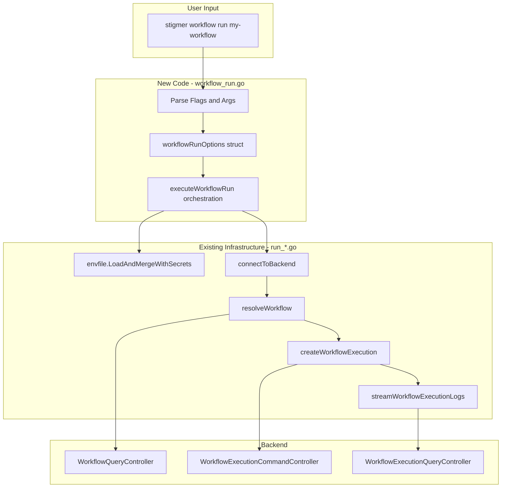

# Workflow Run Command Implementation

## Goal

Implement `stigmer workflow run <ref>` that executes workflows by name/ID with full environment variable support and real-time log streaming. This command mirrors `agent_run.go` while leveraging existing infrastructure to achieve **zero code duplication**.

## Architecture




## Existing Infrastructure (Zero Duplication)

The following functions from `run_*.go` are reused directly:


| Function                            | Source File        | Purpose                                   |
| ----------------------------------- | ------------------ | ----------------------------------------- |
| `envfile.LoadAndMergeWithSecrets()` | envfile package    | Merge env files and flags                 |
| `connectToBackend(orgOverride)`     | run_resolve.go:22  | Config + org resolution + gRPC connection |
| `resolveWorkflow(ref, orgID, conn)` | run_resolve.go:118 | ID/slug/org-slug reference resolution     |
| `createWorkflowExecution()`         | run_create.go:52   | Create WorkflowExecution via gRPC         |
| `streamWorkflowExecutionLogs()`     | run_stream.go:90   | Subscribe and display real-time logs      |


## Files to Create/Modify

### 1. NEW: `cmd/stigmer/root/workflow_run.go` (~185-190 lines)

**Structure** (mirroring [agent_run.go](client-apps/cli/cmd/stigmer/root/agent_run.go)):

```go
// newWorkflowRunCommand creates the workflow run subcommand.
func newWorkflowRunCommand() *cobra.Command {
    // Flag variables: message, envFlags, envFileFlags, secretFlags, secretFileFlags, follow, orgOverride
    // Cobra command with Use, Short, Long, Example, Args, Run
    // Flag definitions
}

// workflowRunOptions contains options for the run operation.
type workflowRunOptions struct {
    Reference       string
    Message         string
    EnvFlags        []string
    EnvFileFlags    []string
    SecretFlags     []string
    SecretFileFlags []string
    Follow          bool
    OrgOverride     string
}

// executeWorkflowRun orchestrates workflow execution.
func executeWorkflowRun(opts workflowRunOptions) error {
    // Step 1: Load and merge environment variables
    // Step 2: Connect to backend
    // Step 3: Resolve workflow by reference
    // Step 4: Create workflow execution
    // Step 5: Display execution started
    // Step 6: Stream logs if follow is enabled
}
```

**Key Characteristics**:

- **Thin orchestration**: No business logic, only coordination
- **Full flag parity** with root `run` and `agent run`
- **Helpful error messages** with troubleshooting guidance
- **Comprehensive examples** in help text

### 2. MODIFY: `cmd/stigmer/root/workflow.go`

**Changes**:

- Add `cmd.AddCommand(newWorkflowRunCommand())` at line ~79
- Remove `// - Sub-task 7: newWorkflowRunCommand()` placeholder comment

### 3. MODIFY: `cmd/stigmer/root/BUILD.bazel`

**Change**: Add `"workflow_run.go",` to srcs list (alphabetically after `workflow_search.go`)

## Command Specification

```
stigmer workflow run <name-or-id> [flags]

Flags:
  -m, --message string       Initial message/prompt for execution
      --env stringArray      Runtime environment variable (KEY=VALUE)
      --env-file stringArray Load environment from file
      --secret stringArray   Secret environment variable (encrypted)
      --secret-file stringArray Load secrets from file (encrypted)
      --follow               Stream execution logs (default true)
      --org string           Organization ID override

Reference formats supported:
  - wf_01abc123xyz456        Workflow ID (direct lookup)
  - my-workflow              Slug (uses context org)
  - acme-corp/my-workflow    Org/slug (explicit org)
```

## Implementation Strategy

### Step 1: Create workflow_run.go

Pattern-match from `agent_run.go` with these substitutions:


| agent_run.go                 | workflow_run.go                 |
| ---------------------------- | ------------------------------- |
| `resolveAgent()`             | `resolveWorkflow()`             |
| `createAgentExecution()`     | `createWorkflowExecution()`     |
| `streamAgentExecutionLogs()` | `streamWorkflowExecutionLogs()` |
| "agent" in strings           | "workflow" in strings           |
| `agt_xxx` examples           | `wf_xxx` examples               |


### Step 2: Register in workflow.go

```go
cmd.AddCommand(newWorkflowGetCommand())
cmd.AddCommand(newWorkflowDeleteCommand())
cmd.AddCommand(newWorkflowListCommand())
cmd.AddCommand(newWorkflowSearchCommand())
cmd.AddCommand(newWorkflowRunCommand())  // NEW

// Remove placeholder comment
```

### Step 3: Update BUILD.bazel

```python
srcs = [
    # ... existing ...
    "workflow_run.go",
    # ... existing ...
]
```

## Quality Criteria

Per [coding-guidelines.mdc](client-apps/cli/coding-guidelines.mdc):

- File size: Target ~185-190 lines (under 250 limit)
- Function size: Each function under 50 lines
- Error handling: All errors wrapped with `errors.Wrap` and specific context
- Orchestration only: No business logic in command handler
- Pattern consistency: Mirrors agent_run.go exactly

## Verification Steps

1. **Build verification**: `bazel build //client-apps/cli/cmd/stigmer/root:root`
2. **Go syntax**: `gofmt -d workflow_run.go` (no changes expected)
3. **Help text**: `stigmer workflow run --help` displays correctly
4. **Integration** (if backend available):
  - `stigmer workflow run my-workflow`
  - `stigmer workflow run wf_xxx --no-follow`
  - `stigmer workflow run my-workflow --env KEY=val`

## Risks and Mitigations


| Risk                                   | Mitigation                                                                    |
| -------------------------------------- | ----------------------------------------------------------------------------- |
| Pre-existing Bazel SDK templates issue | Agent internal package builds; workflow_run.go uses same dependencies         |
| Inconsistent error messages            | Pattern-match exactly from agent_run.go, substituting "workflow"              |
| Missing imports                        | BUILD.bazel already has all required deps (workflow, workflowexecution stubs) |


