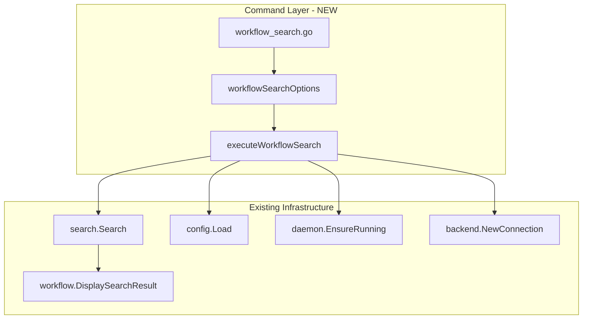

# Workflow Search Command Implementation

## Context

Sub-task 6 of Phase 2 implements `stigmer workflow search <query>` - a text search command for workflows. The excellent news is that the foundation is already solid:

- `workflow/display.go` already has `DisplaySearchResult()` (lines 173-194)
- `workflow_list.go` demonstrates the exact pattern we need (139 lines)
- `agent_search.go` provides the reference implementation (151 lines)
- The search infrastructure (`internal/cli/search/`) is fully operational

This is a focused, clean implementation that follows established patterns.

## Architecture



## Implementation Details

### File 1: `cmd/stigmer/root/workflow_search.go` (~135 lines)

**Structure** (mirroring `agent_search.go` exactly):

```go
// newWorkflowSearchCommand creates the workflow search subcommand.
func newWorkflowSearchCommand() *cobra.Command
```

**Options struct**:

```go
type workflowSearchOptions struct {
    Query         string   // Required: search query
    OrgOverride   string   // --org flag
    ExcludePublic bool     // --exclude-public flag
    OutputFormat  string   // --output flag (table/yaml/json)
    Page          int32    // --page flag
    PageSize      int32    // --page-size flag
}
```

**Orchestration** (5 steps, ~50 lines):

1. Validate query (non-empty)
2. Load backend configuration
3. Resolve organization if specified
4. Ensure daemon running (local mode)
5. Connect to backend
6. Execute search with `apiresourcekind.ApiResourceKind_workflow`

**Flags** (matching `agent_search.go`):

- `--output, -o` - Output format: table (default), yaml, json
- `--org` - Search within specific organization
- `--exclude-public` - Exclude public/platform workflows
- `--page` - Page number (1-indexed, default: 1)
- `--page-size` - Results per page (default: 20, max: 100)

**Reference patterns**:

- [agent_search.go](client-apps/cli/cmd/stigmer/root/agent_search.go) lines 16-82 for command structure
- [workflow_list.go](client-apps/cli/cmd/stigmer/root/workflow_list.go) lines 88-138 for workflow-specific orchestration

### File 2: `cmd/stigmer/root/workflow.go` (modify)

Add command registration and remove placeholder comment:

```go
cmd.AddCommand(newWorkflowSearchCommand())
// Remove: "// - Sub-task 6: newWorkflowSearchCommand()"
```

### File 3: `cmd/stigmer/root/BUILD.bazel` (modify)

Add source file:

```
"workflow_search.go",
```

## Key Differences from agent_search.go

1. **Resource kind**: `apiresourcekind.ApiResourceKind_workflow` instead of `agent`
2. **Display function**: `workflow.DisplaySearchResult()` instead of `agent.DisplaySearchResult()`
3. **Organization resolver**: `resolveWorkflowOrganization()` instead of `resolveAgentOrganization()`
4. **Help text**: Workflow-specific descriptions and examples

## Quality Criteria

Following the established coding guidelines:

- File length: Target ~135 lines (within 250 line limit)
- Function length: All functions under 50 lines
- Zero code duplication: Reuses 100% of search and display infrastructure
- Pattern consistency: Mirrors `agent_search.go` structure exactly
- Comprehensive help: Clear long description and practical examples
- Test coverage: Command registration verified via Bazel build

## Command Examples (for help text)

```bash
# Search for workflows related to deployment
stigmer workflow search "deploy"

# Search for CI/CD workflows
stigmer workflow search "ci cd"

# Search within a specific organization
stigmer workflow search "kubernetes" --org acme-corp

# Exclude public/platform workflows
stigmer workflow search "api" --exclude-public

# Output as JSON for scripting
stigmer workflow search "data" --output json

# Paginate results
stigmer workflow search "test" --page 2 --page-size 50

# Use the 'wf' alias for brevity
stigmer wf search "deploy"
```

## Success Criteria

- `stigmer workflow search "query"` returns relevant workflows
- All output formats work: table (human-readable), yaml, json
- Pagination works with `--page` and `--page-size`
- `--org` scopes search to specific organization
- `--exclude-public` filters out public workflows
- Help text is comprehensive with practical examples
- Bazel build succeeds
- All existing tests continue to pass
