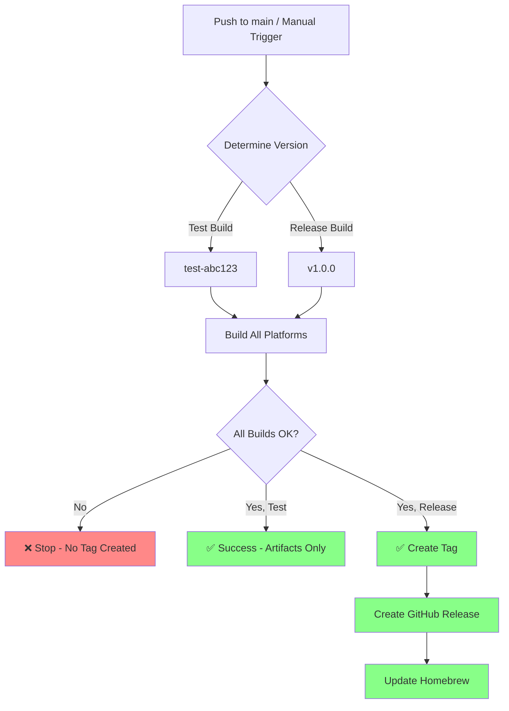

# Release Workflow Guide

This document explains how the release workflow works and how to use it properly.

## The Problem We Solved

**Before:** The workflow required creating a git tag before building, which caused issues:
- ❌ Failed builds created useless tags (e.g., `v0.1.5`, `v0.1.6` with no releases)
- ❌ Tags accumulated in the repository without corresponding working releases
- ❌ Impossible to test builds without creating permanent tags
- ❌ No way to verify a build works before releasing it

**After:** The workflow builds first, then creates tags/releases only on success:
- ✅ Test builds run without creating any tags
- ✅ Tags are only created after ALL platforms build successfully
- ✅ Failed builds don't pollute the tag/release history
- ✅ Clean, working releases only

## How It Works



## Usage

### 1. Test Builds (No Release)

**Push to main branch:**
```bash
git push origin main
```

**Result:**
- Builds all platforms (macOS ARM, macOS Intel, Linux)
- Version: `test-<commit-hash>` (e.g., `test-a1b2c3d`)
- Artifacts uploaded to GitHub Actions (downloadable for 90 days)
- **No tag created**
- **No release created**

**Use this to:**
- Test if your code compiles on all platforms
- Verify PyInstaller works correctly
- Check binary sizes
- Download and manually test binaries before releasing

### 2. Create a Release (Manual Trigger)

Go to GitHub Actions → "Release with Embedded Binaries" → "Run workflow"

**Option A: Just build and test (no release)**
- Leave version empty
- Set "Create a release" to `false`
- Click "Run workflow"

**Option B: Build and release**
- Enter version: `1.0.0` (without the `v` prefix)
- Set "Create a release" to `true`
- Click "Run workflow"

**Result:**
1. Builds all platforms
2. If ANY build fails → stops, no tag, no release
3. If ALL builds succeed:
   - Creates git tag `v1.0.0`
   - Pushes tag to GitHub
   - Creates GitHub release with binaries
   - Updates Homebrew formula

## Workflow Stages

### Stage 1: Determine Version
- **On push to main:** `test-<commit>`
- **On manual trigger (no version):** `test-<commit>`
- **On manual trigger (with version):** `v<version>`

### Stage 2: Build All Platforms
Runs in parallel:
- `build-darwin-arm64` (macOS Apple Silicon)
- `build-darwin-amd64` (macOS Intel, cross-compiled)
- `build-linux-amd64` (Linux x86_64)

Each job:
1. Sets up Python, Poetry, Go, Buf
2. Generates proto stubs
3. Builds `agent-runner` with PyInstaller
4. Embeds `agent-runner` in CLI binary
5. Compiles CLI with embedded version
6. Creates tarballs with checksums
7. Uploads artifacts

### Stage 3: Release (Conditional)
Only runs if `should_release == true`:
1. **Create and push tag** (after successful builds!)
2. Download all artifacts
3. Generate changelog from git history
4. Create GitHub release with all binaries
5. Update Homebrew formula

## Files Created

### For Test Builds
Artifacts (temporary, 90 days):
- `stigmer-test-abc123-darwin-arm64.tar.gz`
- `stigmer-test-abc123-darwin-amd64.tar.gz`
- `stigmer-test-abc123-linux-amd64.tar.gz`
- Checksums (`.sha256` files)
- Standalone `agent-runner` binaries

### For Releases
Git tag:
- `v1.0.0`

GitHub Release assets:
- `stigmer-v1.0.0-darwin-arm64.tar.gz`
- `stigmer-v1.0.0-darwin-amd64.tar.gz`
- `stigmer-v1.0.0-linux-amd64.tar.gz`
- Checksums (`.sha256` files)
- Standalone `agent-runner` binaries

Homebrew formula:
- Updated `Formula/stigmer.rb` with new version and checksums

## Version Numbering Strategy

### Semantic Versioning
Use semantic versioning: `MAJOR.MINOR.PATCH`

- **MAJOR:** Breaking changes (e.g., `1.0.0` → `2.0.0`)
- **MINOR:** New features, backward compatible (e.g., `1.0.0` → `1.1.0`)
- **PATCH:** Bug fixes (e.g., `1.0.0` → `1.0.1`)

### Pre-releases (Optional)
For alpha/beta releases:
- `1.0.0-alpha.1`
- `1.0.0-beta.1`
- `1.0.0-rc.1`

Mark as pre-release in GitHub Actions or manually edit the release.

### Test Builds
- Format: `test-<commit-hash>`
- Automatically generated
- Not meant for distribution
- Good for internal testing

## Best Practices

### Before Releasing

1. **Test locally first**
   ```bash
   make protos
   cd backend/services/agent-runner
   poetry install
   poetry run pyinstaller agent-runner.spec
   cd ../../../client-apps/cli
   go build -o stigmer .
   ./stigmer --version
   ```

2. **Push to main and verify test build**
   ```bash
   git push origin main
   # Wait for workflow to complete
   # Download artifacts and test
   ```

3. **If test build works, create release**
   - Go to GitHub Actions
   - Run workflow with version number
   - Set "Create a release" to `true`

### Release Checklist

- [ ] Code compiles locally
- [ ] Tests pass (if you have tests)
- [ ] Test build succeeded on all platforms
- [ ] Downloaded and verified test binaries work
- [ ] Decided on version number (e.g., `1.0.1`)
- [ ] Ready to create git tag and release

### After Release

- [ ] Verify release appears on GitHub releases page
- [ ] Check that Homebrew formula updated
- [ ] Test installation: `brew update && brew upgrade stigmer`
- [ ] Announce release (if applicable)

## Troubleshooting

### Build Fails

**Problem:** One of the build jobs fails

**Solution:**
- Check the failed job logs
- Fix the code
- Push to main (creates new test build)
- No tags were created, nothing to clean up

### PyInstaller Error

**Problem:** PyInstaller fails with "option(s) not allowed"

**Solution:**
- The workflow automatically modifies the spec file for cross-compilation
- If you see this error, it means the `sed` command failed
- Check that `agent-runner.spec` has `target_arch=None` on the right line

### Tag Already Exists

**Problem:** Workflow fails at "Create and push tag" step

**Solution:**
- You tried to release a version that already has a tag
- Choose a new version number
- Or delete the old tag if it was a mistake:
  ```bash
  git tag -d v1.0.0
  git push origin :refs/tags/v1.0.0
  ```

### Homebrew Update Fails

**Problem:** Homebrew formula update fails to download checksums

**Solution:**
- The release assets might not be available yet (race condition)
- The workflow includes a 10-second wait, but might need more
- Manually update the Homebrew formula if needed

## Comparison: Before vs After

| Aspect | Before (Tag-First) | After (Build-First) |
|--------|-------------------|-------------------|
| **Failed builds** | Create useless tags | No tags created |
| **Testing** | Must create tags | Test builds without tags |
| **Tag history** | Polluted with failures | Clean, working releases only |
| **Process** | Tag → Build → Fail ❌ | Build → Pass → Tag ✅ |
| **Cleanup needed** | Delete bad tags manually | No cleanup needed |
| **Confidence** | Unknown if it works | Know it works before tagging |

## Examples

### Example 1: Feature Development

```bash
# Day 1: Working on new feature
git commit -m "feat: add new workflow feature"
git push origin main
# → Creates test-a1b2c3d build
# → Download and test locally

# Day 2: Bug fixes
git commit -m "fix: resolve edge case"
git push origin main  
# → Creates test-b2c3d4e build
# → Download and test locally

# Day 3: Ready to release
# GitHub Actions → Run workflow
# Version: 1.1.0
# Create release: true
# → Creates v1.1.0 tag and release
```

### Example 2: Hotfix Release

```bash
# Bug discovered in production
git commit -m "fix: critical security issue"
git push origin main
# → Creates test-c3d4e5f build
# → Verify fix works

# Immediately release hotfix
# GitHub Actions → Run workflow  
# Version: 1.0.1
# Create release: true
# → Creates v1.0.1 tag and release
```

## Common Questions

### Q: Can I still create tags manually?

**A:** Yes, but don't. Let the workflow create tags after successful builds. Manual tags won't trigger releases.

### Q: What if I need to rebuild the same version?

**A:** You can't. Each version should be unique. If a release is broken, create a new patch version (e.g., `1.0.1` → `1.0.2`).

### Q: Can I delete a bad release?

**A:** Yes, you can delete GitHub releases and tags, but it's messy. Better to just create a new fixed version.

### Q: How do I test a specific branch?

**A:** The workflow only runs on `main`. For branch testing, temporarily change the workflow trigger or merge to main as a test build.

### Q: What happens to old artifacts?

**A:** GitHub artifacts are automatically deleted after 90 days. Releases are permanent until manually deleted.

## Summary

The new workflow follows a **build → verify → tag → release** pattern:

1. ✅ **Build first** - Compile on all platforms
2. ✅ **Verify** - All builds must succeed  
3. ✅ **Tag** - Create git tag only after success
4. ✅ **Release** - Publish binaries to GitHub

This ensures:
- Clean git history (no failed release tags)
- Confidence (only working versions get released)
- Testability (can test builds before releasing)
- Flexibility (test builds vs release builds)
