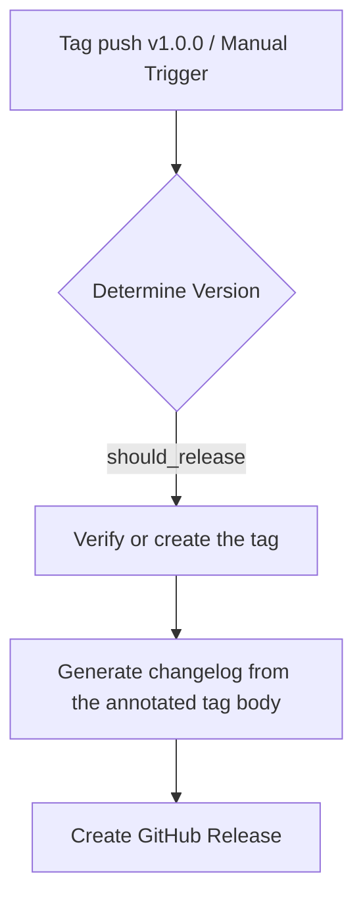

# Release Workflow Guide

This document explains how `release.cli.yaml` works and how to use it.

## What ships where

Every product artifact is an npm package, published by `release.npm-libs.yaml` on version tags:

- `@stigmer/cli` — the `stigmer` command itself.
- `@stigmer/server-slim` (+ its per-platform native packages) — the server the CLI acquires into `~/.stigmer/runtimes/<version>/` on first `stigmer up`.
- The runner and library packages.

`release.cli.yaml` no longer builds or attaches any binaries: the Go `stigmer-server` tarballs it used to cross-compile for three platforms retired with the Go server (go-server-retirement, D4 #25). What remains is the GitHub Release itself.

## What release.cli.yaml does

1. **Determine version** — a `v*` tag push releases that tag; a manual dispatch with a version + "Create a release" does the same; anything else is a no-op.
2. **Verify tag exists** — tag pushes already have it; manual dispatch creates and pushes the annotated tag.
3. **Generate changelog** — the annotated tag body (curated by `@release-stigmer-oss`) becomes the release notes, prefixed with install instructions; falls back to `git log` when the tag carries no body.
4. **Create GitHub Release** — notes only, no assets.

## Creating a release

Use the repo's `@release-stigmer-oss` action rule: it curates the annotated tag with rich release notes and pushes it, which triggers this workflow. Manual path: GitHub Actions → "release.cli" → "Run workflow" with a version and "Create a release" = `true`.

## Version numbering

Semantic versioning, `MAJOR.MINOR.PATCH`. The CLI, server-slim, runner, and proto packages all publish the same version per release — the CLI pins its runtime acquisitions to its own version, so the stack stays in lockstep.

## Homebrew

The Homebrew tap (`stigmer/tap/stigmer`) is deliberately NOT bumped by this workflow: Homebrew runs formula npm installs with `--min-release-age=1`, which rejects same-day `@stigmer/*` versions for ~24h (stigmer/stigmer#210). `reconcile-homebrew.yaml` bumps the tap on a schedule once the packages are old enough.
