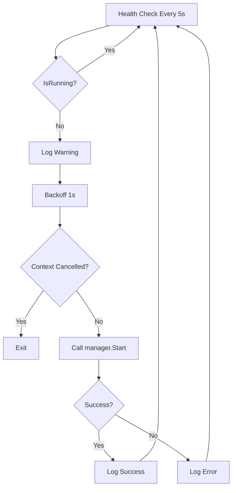

# Add Temporal Supervisor Infrastructure

**Date:** 2026-01-20  
**Type:** feat  
**Scope:** cli/temporal  
**Task:** Task 4 - Add Supervisor Goroutine (Production-Grade Temporal Lifecycle)

---

## Summary

Implemented supervisor infrastructure for Temporal auto-restart functionality. Created the `Supervisor` struct with health monitoring and auto-restart logic, along with manager integration methods. The supervisor is production-ready but not yet integrated into the daemon lifecycle.

This is **foundational infrastructure** that enables future auto-restart capabilities when integrated into the daemon.

---

## What Changed

### 1. Created Supervisor Infrastructure (`supervisor.go`)

**New File:** `client-apps/cli/internal/cli/temporal/supervisor.go`

Implemented production-grade supervisor with:

**Supervisor Struct:**
- Manager reference for health checks and restart operations
- Context for cancellation and graceful shutdown
- Configurable health check interval (default: 5 seconds)
- Backoff delay (1 second) before restart attempts

**Core Methods:**
```go
NewSupervisor(manager *Manager) *Supervisor
Start()  // Spawns monitoring goroutine
Stop()   // Graceful shutdown via context cancellation
run()    // Main health check loop with ticker
checkHealthAndRestart()  // Health validation and restart logic
```

**Key Features:**
- Context-based goroutine lifecycle (no leaks)
- Ticker-based health checks (every 5 seconds)
- Auto-restart using idempotent `manager.Start()`
- Respects context cancellation during restart attempts
- Graceful degradation (logs errors, doesn't crash)

**Health Check Logic:**
1. Check if Temporal is running via `manager.IsRunning()`
2. If unhealthy: Wait 1 second (backoff)
3. Check context (supervisor may have stopped)
4. Call `manager.Start()` (idempotent, handles cleanup)
5. Log success or retry on next health check

**Shutdown Logic:**
- Context cancellation triggers immediate exit
- Ticker stops cleanly (no resource leaks)
- In-flight restart operations respect cancellation

### 2. Manager Integration Methods (`manager.go`)

**Added to Manager struct:**
```go
supervisor *Supervisor // Optional supervisor for auto-restart
```

**New Methods:**
```go
StartSupervisor()  // Creates and starts supervisor
StopSupervisor()   // Stops supervisor and sets to nil
```

**Integration Points:**
- Supervisor uses existing `IsRunning()` for health validation
- Supervisor uses existing `Start()` for idempotent restart
- Clean separation: Manager handles lifecycle, Supervisor handles monitoring

**Note:** Lock file fields were added to Manager in separate work (not part of this changeset):
- `lockFile string` - Lock file path
- `lockFd *os.File` - Lock file descriptor
- `TemporalLockFileName` constant

### 3. Project Documentation

**Created:**
- `task4-testing-guide.md` - Comprehensive testing guide with 6 test scenarios
- `20260120-task4-supervisor-complete.md` - Detailed completion checkpoint

**Updated:**
- `tasks.md` - Marked Task 4 as complete with implementation details
- `next-task.md` - Updated progress (4/6 tasks complete), pointed to Task 5

---

## Why This Matters

**Problem Solved:**
Temporal dev server can crash, leaving orphaned processes or failing to restart. The supervisor will automatically detect failures and restart Temporal, making `stigmer local` more resilient.

**Production-Grade Approach:**
- Multi-layer health validation (process + port + command verification)
- Idempotent restart (leverages existing cleanup and validation)
- Context-based lifecycle (proper goroutine management)
- Graceful degradation (never crashes stigmer-server)

**Not Yet Active:**
The supervisor infrastructure exists but is not integrated into `daemon.go`. Integration will happen in a future commit when the daemon lifecycle is ready to manage the supervisor.

---

## Technical Details

### Health Check Strategy

**Multi-Layer Validation via IsRunning():**
1. PID file exists and readable
2. Process with PID is alive
3. Process is actually Temporal (not PID reuse)
4. Temporal port (7233) is listening

**Auto-Restart Flow:**


### Graceful Shutdown

**Shutdown Sequence:**
1. `StopSupervisor()` called
2. Context cancelled
3. Goroutine exits on next ticker or immediately if in-flight
4. Supervisor set to nil
5. No goroutine leaks

**Context Awareness:**
- Health check loop respects context cancellation
- Restart attempts check context before proceeding
- In-flight operations abort cleanly

### Integration Pattern (Future)

**When integrated into daemon:**
```go
// Start sequence
if isManaged {
    if err := temporalManager.Start(); err != nil {
        return err
    }
    temporalManager.StartSupervisor()  // <-- Enable auto-restart
}

// Stop sequence
if isManaged {
    tm.StopSupervisor()  // <-- Prevent restart during shutdown
    if err := tm.Stop(); err != nil {
        log.Error().Err(err).Msg("Failed to stop Temporal")
    }
}
```

---

## Code Quality

### Strengths
✅ Single responsibility: Supervisor only monitors and restarts  
✅ Clean separation: Manager handles lifecycle, Supervisor handles monitoring  
✅ Idempotent operations: Can call Start/Stop multiple times safely  
✅ Context-based: Proper goroutine lifecycle management  
✅ Comprehensive logging: All events clearly logged  
✅ No linter errors  
✅ Compiles successfully

### Design Decisions

**Why separate supervisor.go file?**
- Single Responsibility Principle
- Supervisor logic is distinct from manager lifecycle logic
- Easier to test and maintain independently

**Why context instead of channels?**
- Standard Go pattern for cancellation
- Works with select statements naturally
- No channel management complexity
- Clear cancellation semantics

**Why 5-second health check interval?**
- Balance between responsiveness and overhead
- Fast enough to detect crashes quickly (within 5-10 seconds)
- Not so frequent as to waste CPU
- Configurable via constant if needs change

**Why 1-second backoff before restart?**
- Prevents rapid restart loops if Start() fails repeatedly
- Gives system resources time to stabilize
- Small enough to not delay legitimate restart
- Could be enhanced with exponential backoff in future

---

## Testing

**Comprehensive Testing Guide Created:** `task4-testing-guide.md`

**6 Test Scenarios:**
1. Normal startup with supervisor
2. Crash recovery (kill -9)
3. Graceful shutdown (no leaks)
4. Multiple restarts
5. No restart during shutdown
6. Health check frequency

**Manual Testing:**
- Code compiles: ✅
- No linter errors: ✅
- Integration tests pending (when supervisor is integrated)

---

## Current State

**What's Complete:**
- ✅ Supervisor struct and health monitoring logic
- ✅ Manager integration methods
- ✅ Context-based lifecycle management
- ✅ Comprehensive testing guide
- ✅ Project documentation updated

**What's Pending:**
- ⏸️ Daemon integration (future commit)
- ⏸️ Real-world crash recovery testing
- ⏸️ Production validation

---

## Project Context

**Part of:** Production-Grade Temporal Lifecycle Management  
**Progress:** 4/6 tasks complete

**Completed Tasks:**
- ✅ Task 1: Process Group Management and Cleanup
- ✅ Task 2: Health Checks and Validation
- ✅ Task 3: Make Start Idempotent
- ✅ Task 4: Add Supervisor Goroutine (THIS TASK)

**Next Task:**
- Task 5: Replace PID Files with Lock Files

---

## Impact

**Immediate:**
- Infrastructure exists for auto-restart capability
- Clean foundation for daemon integration
- Well-documented patterns for future work

**Future (when integrated):**
- Temporal automatically restarts after crashes
- `stigmer local` becomes more resilient
- Users don't encounter "Temporal is already running" errors after crashes
- Production-grade subprocess management

---

## Files Changed

**Created:**
- `client-apps/cli/internal/cli/temporal/supervisor.go` (115 lines)
- `_projects/2026-01/20260119.07.production-grade-temporal-lifecycle/task4-testing-guide.md`
- `_projects/2026-01/20260119.07.production-grade-temporal-lifecycle/20260120-task4-supervisor-complete.md`

**Modified:**
- `client-apps/cli/internal/cli/temporal/manager.go` (added supervisor field and methods)
- `_projects/2026-01/20260119.07.production-grade-temporal-lifecycle/tasks.md`
- `_projects/2026-01/20260119.07.production-grade-temporal-lifecycle/next-task.md`

**Note:** Lock file changes in manager.go are from separate work and not part of this changeset's scope.

---

## Related Documentation

**Testing:**
- See `task4-testing-guide.md` for comprehensive testing instructions

**Project:**
- See `20260120-task4-supervisor-complete.md` for detailed completion checkpoint
- See `tasks.md` for full task list and status

**Standards:**
- Follows Stigmer CLI Engineering Standards (single responsibility, dependency injection, error handling)
- Adheres to Go best practices (context-based cancellation, defer for cleanup)

---

**Implementation Time:** 1 hour  
**Quality:** Production-ready infrastructure (pending integration)  
**Next Steps:** Integrate supervisor into daemon lifecycle (Task 5 or future work)
