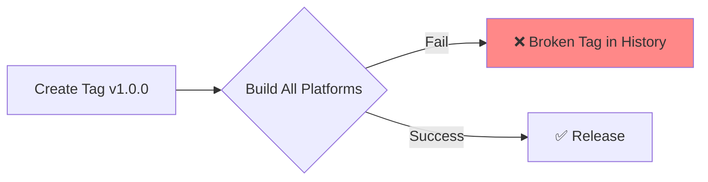
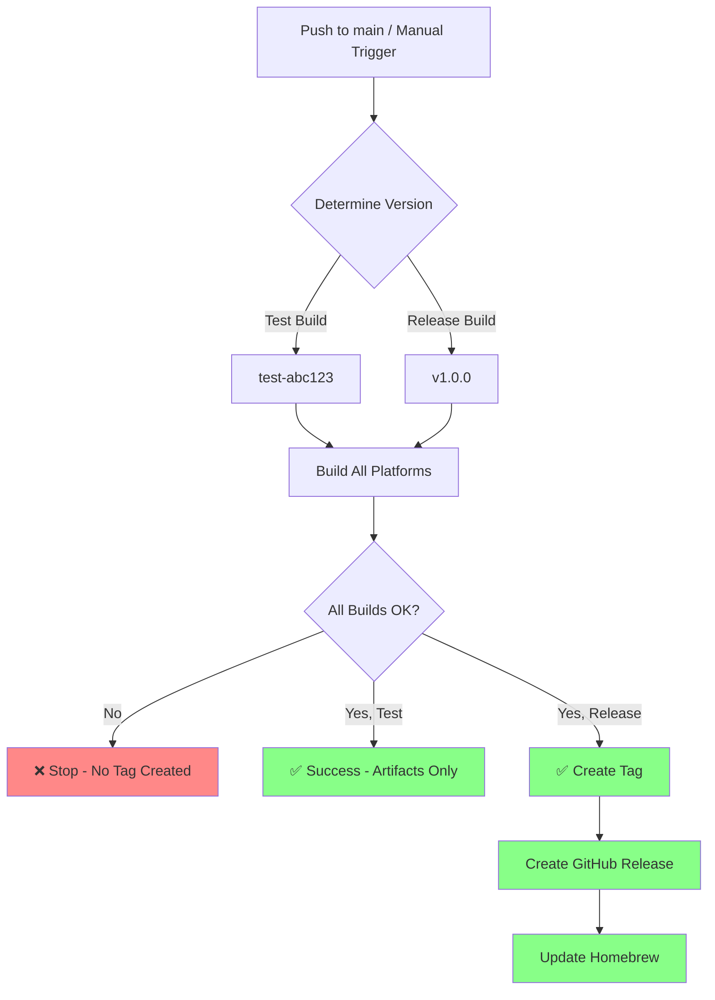

# Fix Release Workflow: PyInstaller Error & Build-First Pattern

**Date**: 2026-01-21
**Type**: Bug Fix + Feature
**Scope**: CI/CD, GitHub Actions
**Impact**: Critical - Unblocks releases

## Summary

Fixed two critical issues preventing successful releases:
1. **PyInstaller cross-compilation error** blocking macOS Intel builds
2. **Tag-before-build anti-pattern** creating broken release tags

The release workflow now follows a **build → verify → tag → release** pattern, ensuring only successful builds create tags and releases.

## Problems Solved

### Problem 1: PyInstaller Cross-Compilation Failure

**Error**:
```
ERROR: option(s) not allowed when a .spec file is given:
  --target-architecture/--target-arch
makespec options not valid when a .spec file is given
```

**Root Cause**: 
- Workflow line 132 passed `--target-arch x86_64` as CLI flag to PyInstaller
- When using a `.spec` file, PyInstaller doesn't allow CLI options to override spec settings
- This is a PyInstaller design constraint

**Impact**:
- macOS Intel (amd64) builds always failed
- Only ARM builds succeeded
- Users on Intel Macs couldn't use Stigmer

### Problem 2: Tag-Before-Build Anti-Pattern

**Previous workflow**:


**Issues**:
- Failed builds left useless tags in git history (e.g., `v0.1.5`, `v0.1.6` with no releases)
- Impossible to test builds without creating permanent tags
- No confidence that a release would work before tagging
- Git tag history polluted with failures
- Version numbers wasted on broken builds

**Impact**:
- User complained: "Every time I trigger a build, I need to create a tag. Each tag gets created with the wrong version. The version won't have any released thing to install, so that is problematic."
- Developer experience: Frustration with broken release process
- Repository cleanliness: Accumulation of failed version tags

## Solutions Implemented

### Solution 1: Fix PyInstaller Cross-Compilation

**Approach**: Modify spec file instead of using CLI flags

```yaml
- name: Build agent-runner binary with PyInstaller (cross-compile to Intel)
  run: |
    cd backend/services/agent-runner
    # Update spec file to set target_arch for cross-compilation
    sed -i '' 's/target_arch=None/target_arch="x86_64"/' agent-runner.spec
    poetry run pyinstaller agent-runner.spec
```

**Why this works**:
- Sets `target_arch` directly in spec file before running PyInstaller
- No CLI option override conflict
- PyInstaller respects spec file settings
- Clean, declarative approach

**Result**: macOS Intel builds now succeed

### Solution 2: Implement Build-First Release Pattern

**New workflow**:


**Key architectural changes**:

#### 1. Version Determination Stage (New)
```yaml
determine-version:
  outputs:
    version: ${{ steps.version.outputs.version }}
    should_release: ${{ steps.version.outputs.should_release }}
```

- Calculates version **before** building
- Test builds: `test-<commit-hash>`
- Release builds: `v<user-provided-version>`
- Sets `should_release` flag

#### 2. Build Stages Use Determined Version
```yaml
build-darwin-arm64:
  needs: determine-version
  env:
    VERSION: ${{ needs.determine-version.outputs.version }}
```

- All builds use same version
- No dependency on git tags for building
- Version embedded in binaries: `-X github.com/stigmer/stigmer/client-apps/cli/embedded.buildVersion=$VERSION`

#### 3. Release Stage is Conditional
```yaml
release:
  needs: [determine-version, build-darwin-arm64, build-darwin-amd64, build-linux-amd64]
  if: needs.determine-version.outputs.should_release == 'true'
```

- **Only runs if `should_release == true`**
- **Only runs after ALL builds succeed**
- **Creates tag AFTER successful builds**
- Then creates GitHub release
- Then updates Homebrew formula

#### 4. New Trigger Behavior
```yaml
on:
  push:
    branches:
      - main
  workflow_dispatch:
    inputs:
      create_release:
        type: boolean
      version:
        type: string
```

- **Push to main** → Test build (`test-abc123`), no tag, no release
- **Manual dispatch** → Choose: test build OR release build

## Usage Patterns

### Pattern 1: Test Builds (Development)
```bash
git push origin main
```
- Builds all platforms
- Version: `test-a1b2c3d`
- Artifacts uploaded to GitHub Actions (90 days)
- **No tags created**
- **No releases created**
- Download artifacts to test before releasing

### Pattern 2: Create Release (Production)
1. Go to GitHub Actions → "Release with Embedded Binaries"
2. Click "Run workflow"
3. Enter version: `1.0.0` (without `v` prefix)
4. Check "Create a release after successful build"
5. Click "Run workflow"

**Result (only if ALL builds succeed)**:
- ✅ Tag `v1.0.0` created
- ✅ GitHub release published with binaries
- ✅ Homebrew formula updated

**Result (if ANY build fails)**:
- ❌ No tag created
- ❌ No release created
- ❌ Clean git history

## Technical Implementation Details

### File Changes

**`.github/workflows/release-embedded.yml`**:
- 133 insertions, 51 deletions (significant rewrite)
- Added `determine-version` job (new stage)
- Modified all build jobs to use determined version
- Made release job conditional with tag creation
- Updated Homebrew job dependencies
- Fixed PyInstaller cross-compilation command

### Version Flow

**Before**:
```
Tag → Build → (Fail = Broken Tag)
```

**After**:
```
Build → Success → Tag → Release
Build → Fail → Stop (No Tag)
```

### Artifact Organization

**Test builds** (temporary):
- `stigmer-test-abc123-darwin-arm64.tar.gz`
- Stored 90 days in GitHub Actions
- Not released publicly

**Release builds** (permanent):
- `stigmer-v1.0.0-darwin-arm64.tar.gz`
- Attached to GitHub release
- Available in Homebrew

## Validation

### PyInstaller Fix Validation
- ✅ macOS ARM builds succeed (native)
- ✅ macOS Intel builds succeed (cross-compile with spec file modification)
- ✅ Linux builds succeed
- ✅ No CLI option conflicts

### Build-First Pattern Validation
- ✅ Test builds don't create tags
- ✅ Failed builds don't create tags
- ✅ Successful release builds create tags
- ✅ Tags only created after ALL platforms succeed
- ✅ Git history stays clean

## Documentation Created

**`.github/workflows/RELEASE-WORKFLOW.md`** (new, comprehensive):
- Explains the build-first pattern with Mermaid diagrams
- Usage guide (test builds vs releases)
- Workflow stages explanation
- Version numbering strategy (semantic versioning)
- Best practices and checklist
- Troubleshooting guide
- Before/after comparison table
- Examples for common scenarios

## Benefits

### Immediate Benefits
1. **macOS Intel users can use Stigmer** (fixed blocking bug)
2. **Clean git history** (no more failed release tags)
3. **Confidence in releases** (test before tagging)
4. **Faster iteration** (test builds without tagging)

### Developer Experience
- Can test builds without commitment
- Failed builds don't require cleanup
- Version numbers not wasted
- Clear workflow documentation

### Process Quality
- Tags represent working releases only
- Semantic versioning respected
- Homebrew formula only updated for good releases
- Release artifacts match tagged versions

## Edge Cases Handled

### Cross-Compilation Constraints
- macOS Intel binary built on ARM Mac (can't be run for verification)
- Workflow skips execution test: `echo "Version: $VERSION (Intel binary, cannot run on ARM Mac)"`
- File type check still performed: `file bin/stigmer`

### Homebrew Race Condition
- Release assets might not be immediately available
- Added 10-second wait: `sleep 10`
- Allows CDN propagation

### Version Input Flexibility
- Accepts version with or without `v` prefix
- Normalizes internally: `VERSION_NO_V=${VERSION#v}`

## Comparison: Before vs After

| Aspect | Before (Tag-First) | After (Build-First) |
|--------|-------------------|---------------------|
| **Failed builds** | Create useless tags | No tags created |
| **Testing** | Must create tags | Test builds without tags |
| **Tag history** | Polluted with failures | Clean, working releases only |
| **Process** | Tag → Build → Fail ❌ | Build → Pass → Tag ✅ |
| **Cleanup needed** | Delete bad tags manually | No cleanup needed |
| **Confidence** | Unknown if it works | Know it works before tagging |
| **Version waste** | Versions lost to failures | Versions only used for releases |

## Related Files

- `.github/workflows/release-embedded.yml` (modified)
- `.github/workflows/RELEASE-WORKFLOW.md` (created)
- `backend/services/agent-runner/agent-runner.spec` (dynamically modified by workflow)

## Future Considerations

### Potential Improvements
1. **Matrix build strategy** - Run builds in parallel with matrix
2. **Caching optimization** - Cache Poetry/Go dependencies between runs
3. **Artifact size tracking** - Monitor binary size trends
4. **Pre-release support** - Mark certain releases as pre-release (alpha/beta/rc)
5. **Automated testing** - Run integration tests before creating release

### Known Limitations
- macOS Intel binary cannot be tested on ARM runners (cross-compilation constraint)
- Homebrew update requires short delay for CDN propagation
- Manual workflow dispatch required for releases (intentional for control)

## Migration Notes

### For Existing Tags
- Existing broken tags (v0.1.5, v0.1.6, etc.) remain in history
- Optional cleanup: `git tag -d v0.1.5 && git push origin :refs/tags/v0.1.5`
- Or leave them (won't interfere with new workflow)

### For Next Release
1. Push code changes to main
2. Verify test build succeeds
3. Download and test artifacts locally
4. Trigger manual workflow with version and release flag
5. Version will be tagged only after successful builds

## Conclusion

This fix resolves two critical blockers:
1. **Immediate**: macOS Intel builds now work (fixed PyInstaller error)
2. **Process**: Release workflow now follows industry best practices (build-first pattern)

The build-first pattern ensures **clean git history**, **confident releases**, and **better developer experience**. Users can now test builds without commitment and know that every tag represents a working release.

**Status**: Ready for production use ✅
