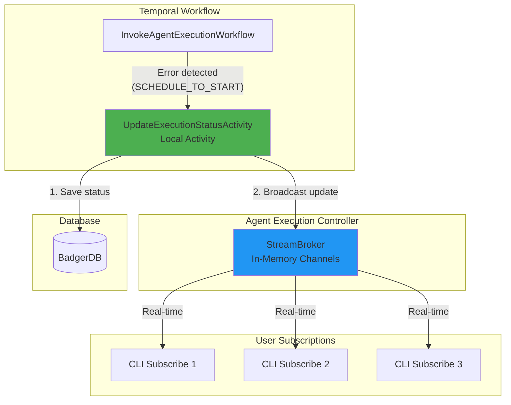

# Fix: Error propagation missing StreamBroker broadcast in both Agent and Workflow Execution

**Date:** 2026-01-21  
**Type:** Bug Fix  
**Component:** Agent Execution, Workflow Execution, Temporal Workflows  
**Impact:** Critical - All execution errors now immediately visible to users

## Problem

When execution workflows failed early (before the runner could start executing), the error was only saved to the database but **not broadcast to active subscribers**. Users watching the execution would see nothing until they manually checked server logs.

**This issue affected BOTH:**
1. **Agent Execution** - When agent-runner failed to start
2. **Workflow Execution** - When workflow-runner failed or workflows had errors

### Example Failure Scenario

```
1. User starts agent execution → CLI subscribes to updates
2. agent-runner fails to start (e.g., import error, missing dependency)
3. Workflow detects SCHEDULE_TO_START timeout after 1 minute
4. Workflow calls updateStatusOnFailure() → UpdateExecutionStatusActivity
5. Activity updates database: phase=FAILED, error="No worker available..."
6. ❌ Activity does NOT broadcast to StreamBroker
7. User's CLI is still waiting on the Go channel (no update received)
8. User sees nothing (hangs indefinitely or until they cancel)
9. Error only visible in stigmer-server logs after checking manually
```

### Root Cause

**Both** `UpdateExecutionStatusActivityImpl` classes (one for agent execution, one for workflow execution) only performed database operations:

```go
// OLD CODE - Missing broadcast (both domains had this)
func (a *UpdateExecutionStatusActivityImpl) UpdateExecutionStatus(...) error {
    // 1. Load execution from BadgerDB
    // 2. Merge status updates
    // 3. Save to BadgerDB
    // 4. Return
    // ❌ NO BROADCAST TO STREAMBROKER!
}
```

The `StreamBroker.Broadcast()` was only called in the `BroadcastToStreamsStep` of the `UpdateStatus` RPC pipeline. But when Temporal workflows failed early, they bypassed the RPC and went straight to the local activity.

**Two separate code paths (same pattern in both domains):**

1. **Normal execution** (runner sends updates):
   - runner → `UpdateStatus` RPC → `BroadcastToStreamsStep` → StreamBroker ✅
   
2. **Temporal workflow error recovery** (workflow detects failure):
   - Workflow → `updateStatusOnFailure()` → `UpdateExecutionStatusActivity` → Database only ❌

## Solution

Inject the `StreamBroker` into **both** `UpdateExecutionStatusActivityImpl` classes so they can broadcast after every database write, regardless of which code path triggered the update.

### Architecture Changes



### Implementation

Applied identical fixes to both domains:

#### 1. Updated `UpdateExecutionStatusActivityImpl` (Agent Execution)

**File:** `backend/services/stigmer-server/pkg/domain/agentexecution/temporal/activities/update_status_impl.go`

```go
type UpdateExecutionStatusActivityImpl struct {
    store        *badger.Store
    streamBroker StreamBroker  // NEW: Injected dependency
}

// StreamBroker interface for broadcasting execution updates
type StreamBroker interface {
    Broadcast(execution *agentexecutionv1.AgentExecution)
}

func NewUpdateExecutionStatusActivityImpl(
    store *badger.Store, 
    streamBroker StreamBroker,  // NEW: Required parameter
) *UpdateExecutionStatusActivityImpl {
    return &UpdateExecutionStatusActivityImpl{
        store:        store,
        streamBroker: streamBroker,
    }
}

func (a *UpdateExecutionStatusActivityImpl) UpdateExecutionStatus(...) error {
    // ... existing database operations ...
    
    // NEW: Broadcast to active subscribers (ADR 011: real-time streaming)
    // This ensures that errors from workflow failures are immediately visible to users
    if a.streamBroker != nil {
        a.streamBroker.Broadcast(existing)
        log.Debug().
            Str("execution_id", executionID).
            Msg("Broadcasted status update to subscribers")
    }
    
    return nil
}
```

#### 1b. Updated `UpdateWorkflowExecutionStatusActivityImpl` (Workflow Execution)

**File:** `backend/services/stigmer-server/pkg/domain/workflowexecution/temporal/activities/update_status_impl.go`

Same changes as agent execution - added StreamBroker dependency and broadcast call.

#### 2. Updated `WorkerConfig` to Accept StreamBroker (Both Domains)

**Agent Execution:** `backend/services/stigmer-server/pkg/domain/agentexecution/temporal/worker_config.go`  
**Workflow Execution:** `backend/services/stigmer-server/pkg/domain/workflowexecution/temporal/worker_config.go`

```go
func NewWorkerConfig(
    config *Config,
    store *badger.Store,
    streamBroker activities.StreamBroker,  // NEW: Required parameter
) *WorkerConfig {
    return &WorkerConfig{
        config:                   config,
        store:                    store,
        updateStatusActivityImpl: activities.NewUpdateExecutionStatusActivityImpl(
            store, 
            streamBroker,  // NEW: Pass to activity
        ),
    }
}
```

#### 3. Added StreamBroker Getter to Controllers (Both Domains)

**Agent Execution:** `backend/services/stigmer-server/pkg/domain/agentexecution/controller/agentexecution_controller.go`  
**Workflow Execution:** `backend/services/stigmer-server/pkg/domain/workflowexecution/controller/workflowexecution_controller.go`

```go
// GetStreamBroker returns the stream broker for use by Temporal activities
// This allows workflow error recovery to broadcast status updates to subscribers
func (c *AgentExecutionController) GetStreamBroker() *StreamBroker {
    return c.streamBroker
}
```

#### 4. Updated Server Startup Order (Both Domains)

**File:** `backend/services/stigmer-server/pkg/server/server.go`

Reorganized initialization to create **both controllers** before Temporal workers:

```go
// Create controllers early (needed for Temporal worker setup)
agentExecutionController := agentexecutioncontroller.NewAgentExecutionController(...)
workflowExecutionController := workflowexecutioncontroller.NewWorkflowExecutionController(...)

// ... later ...

// Create Temporal workers with StreamBrokers from controllers
agentExecutionWorkerConfig := agentexecutiontemporal.NewWorkerConfig(
    agentExecutionTemporalConfig,
    store,
    agentExecutionController.GetStreamBroker(),  // NEW: Inject StreamBroker
)

workflowExecutionWorkerConfig := workflowexecutiontemporal.NewWorkerConfig(
    workflowExecutionTemporalConfig,
    store,
    workflowExecutionController.GetStreamBroker(),  // NEW: Inject StreamBroker
)
```

## Error Flow (After Fix)

### Startup Failure (SCHEDULE_TO_START Timeout):

```
1. User starts agent execution → CLI subscribes to updates
2. agent-runner fails to start (e.g., import error)
3. Workflow detects SCHEDULE_TO_START timeout after 1 minute
4. Workflow calls updateStatusOnFailure()
5. UpdateExecutionStatusActivity executes:
   a. Loads execution from database
   b. Updates status: phase=FAILED, error="No worker available..."
   c. Saves to database
   d. ✅ Broadcasts to StreamBroker (NEW!)
6. StreamBroker pushes update to all active subscribers
7. ✅ User's CLI receives update immediately
8. ✅ CLI displays error: "No worker available. Check agent-runner logs for startup errors"
9. Subscription ends (terminal state reached)
```

### Worker Crash (HEARTBEAT Timeout):

```
1. Execution starts successfully
2. Activity sends heartbeats every 5 events
3. Worker crashes (e.g., out of memory)
4. Workflow detects heartbeat timeout (30 seconds)
5. UpdateExecutionStatusActivity executes with error status
6. ✅ Database updated AND broadcast to subscribers
7. ✅ User sees: "Activity stopped sending heartbeat (worker crashed)"
```

## Files Modified

### Agent Execution
```
backend/services/stigmer-server/pkg/domain/agentexecution/temporal/activities/update_status_impl.go
backend/services/stigmer-server/pkg/domain/agentexecution/temporal/worker_config.go
backend/services/stigmer-server/pkg/domain/agentexecution/controller/agentexecution_controller.go
```

### Workflow Execution
```
backend/services/stigmer-server/pkg/domain/workflowexecution/temporal/activities/update_status_impl.go
backend/services/stigmer-server/pkg/domain/workflowexecution/temporal/worker_config.go
backend/services/stigmer-server/pkg/domain/workflowexecution/controller/workflowexecution_controller.go
```

### Server Bootstrap
```
backend/services/stigmer-server/pkg/server/server.go
```

## Benefits

**Before:**
- ❌ Execution errors only in database
- ❌ Users see nothing (hanging CLI)
- ❌ Must manually check server logs
- ❌ No distinction between "waiting" and "failed"
- ❌ Poor user experience during failures
- ❌ **Affected both agent AND workflow execution**

**After:**
- ✅ All errors broadcast to subscribers
- ✅ Users see error messages immediately
- ✅ No need to check server logs
- ✅ Terminal states end subscriptions cleanly
- ✅ Consistent error propagation across all failure modes
- ✅ **Fixed for both agent AND workflow execution**

## Testing

### Manual Test: Agent Execution - Worker Startup Failure

1. Start stigmer-server
2. Break agent-runner (simulate import error)
3. Start agent execution: `stigmer agent-execution create --agent-id=...`
4. **Expected:** Within 1 minute, CLI shows clear error:
   ```
   ❌ Error: No worker available to execute activity.
   This usually means:
   1. agent-runner service is not running
   2. agent-runner failed to start (check agent-runner logs for startup errors)
   3. agent-runner is not connected to Temporal
   ```

### Manual Test: Agent Execution - Worker Crash During Execution

1. Start stigmer-server and agent-runner
2. Modify agent-runner to crash after 10 events
3. Start agent execution
4. **Expected:** Within 30 seconds of crash, CLI shows:
   ```
   ❌ Error: Activity stopped sending heartbeat (worker may have crashed).
   Check agent-runner logs for errors.
   ```

### Manual Test: Workflow Execution - Worker Startup Failure

1. Start stigmer-server
2. Break workflow-runner (or don't start it)
3. Start workflow execution: `stigmer workflow-execution create --workflow-instance-id=...`
4. **Expected:** Within 1 minute, CLI shows clear error about worker unavailability

### Manual Test: Workflow Execution - Workflow Definition Error

1. Start stigmer-server and workflow-runner
2. Create workflow with invalid syntax
3. Start workflow execution
4. **Expected:** Error immediately visible to user via subscription

## Related Issues

- Fixes the visibility issue from multipart import error (previous PR)
- Completes the error propagation strategy from previous PR
- Ensures ADR 011 (streaming architecture) works for all error scenarios

## Design Principles Applied

1. **Single Source of Truth:** StreamBroker is the canonical source for real-time updates
2. **Dependency Injection:** StreamBroker injected into activity (testable, flexible)
3. **Fail-Safe:** Nil check on streamBroker (graceful degradation)
4. **Consistency:** Same broadcast mechanism for normal updates and error recovery
5. **Interface Segregation:** StreamBroker interface decouples activity from controller

## Pattern Consistency

This fix establishes a **consistent error propagation pattern** across both execution domains:

```
UpdateExecutionStatusActivity (Local Activity)
  ↓
1. Load from BadgerDB
  ↓
2. Merge status updates
  ↓
3. Save to BadgerDB
  ↓
4. Broadcast to StreamBroker ← Ensures ALL updates reach users
  ↓
5. Return
```

**Result:** Whether updates come from normal execution or workflow error recovery, they **always** broadcast to subscribers.

---

*This fix ensures that users are never left wondering "is it working or broken?" - all errors are immediately visible through the same streaming mechanism used for progress updates, regardless of whether they're executing agents or workflows.*
