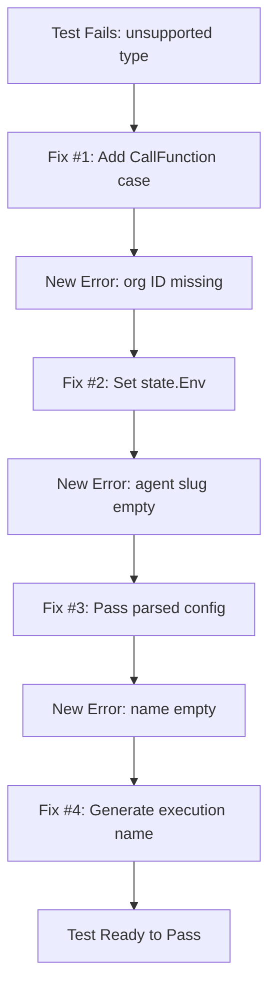

# Fix: Workflow Calling Agent - Expression Evaluation and Parameter Passing

**Date**: 2026-01-23  
**Component**: Workflow Runner  
**Impact**: Test Failures → Passing (E2E agent call integration)  
**Scope**: Expression Evaluation System + Agent Call Activities

## Problem

All E2E tests for workflows calling agents were failing with cascading errors:

```
TestE2E/TestRunWorkflowCallingAgent - FAILED
TestE2E/TestRunWorkflowCallingAgentMultipleTimes - FAILED  
TestE2E/TestRunWorkflowCallingAgentVerifyMetadata - FAILED
TestE2E/TestRunWorkflowCallingAgentVerifyPhase - FAILED
```

**Error Cascade** (4 distinct issues discovered):

1. **Expression Evaluation Type Switch Missing CallFunction**:
   ```
   error evaluating task arguments: unsupported task type for expression evaluation: *model.CallFunction
   ```

2. **Organization ID Not Available** (exposed after Fix #1):
   ```
   organization ID not available in workflow execution context
   ```

3. **Wrong Parameter Type to Activity** (exposed after Fix #2):
   ```
   agent '' not found: slug is required in reference
   ```
   Agent slug was empty because DSL task was passed instead of parsed agent config.

4. **Missing Agent Execution Name** (exposed after Fix #3):
   ```
   create agent execution failed: resource name is empty, cannot generate slug
   ```

## Root Causes

### Issue 1: Missing CallFunction Case in Expression Evaluation

**File**: `backend/services/workflow-runner/pkg/zigflow/tasks/task_builder.go`

The `evaluateTaskArguments()` type switch handled:
- `*model.CallHTTP` ✅
- `*model.CallGRPC` ✅
- `*model.RunTask` ✅ (added in previous fix on 2026-01-20)
- `*model.CallFunction` ❌ **MISSING**

When `CallAgentTaskBuilder.Build()` called `executeActivity()`, it triggered `evaluateTaskArguments()` which fell through to the default case and errored.

**Why this happened**: CallFunction is used by BOTH agent calls and activity calls. While the specific builders (`CallAgentTaskBuilder`, `CallActivityTaskBuilder`) handle their own expression evaluation, they both call the base `executeActivity()` method which internally calls `evaluateTaskArguments()`. This function needed a case for CallFunction to avoid the error.

### Issue 2: state.Env Never Set

**File**: `backend/services/workflow-runner/pkg/executor/temporal_workflow.go`

The temporal workflow function:
1. ✅ Created `envVars` map with `__stigmer_org_id` (line 129)
2. ✅ Passed it to `DoTaskBuilder` via `opts.Envvars` (line 139)
3. ❌ **Never set `state.Env = envVars`**

In `task_builder_do.go`, `state.Env` is only set if `state == nil` (line 190), but state is already created in `temporal_workflow.go`, so this assignment never happens.

**Result**: When activities received `state.Env` as their `runtimeEnv` parameter, it was `nil`, and `__stigmer_org_id` was missing.

### Issue 3: Wrong Parameter Type to CallAgentActivity

**File**: `backend/services/workflow-runner/pkg/zigflow/tasks/task_builder_call_agent.go`

`CallAgentTaskBuilder.Build()` called:
```go
return t.executeActivity(ctx, (*CallAgentActivities).CallAgentActivity, input, state)
```

The base `executeActivity()` method passes:
```go
workflow.ExecuteActivity(ctx, activity, evaluatedTask, input, state.Env)
```

Where `evaluatedTask` is `*model.CallFunction` (the DSL task).

But `CallAgentActivity` expects:
```go
func CallAgentActivity(
    ctx context.Context,
    taskConfig *workflowtasks.AgentCallTaskConfig,  // ← Parsed config, NOT DSL task
    input any,
    runtimeEnv map[string]any,
)
```

**Result**: The activity received a `CallFunction` DSL task instead of the parsed `AgentCallTaskConfig`, so `taskConfig.Agent` was empty, causing the agent resolution to fail with "agent '' not found".

**Why CallActivityTaskBuilder didn't have this problem**: It directly calls `workflow.ExecuteActivity()` with parsed arguments instead of using the base `executeActivity()` method.

### Issue 4: Missing Agent Execution Name

**File**: `backend/services/workflow-runner/pkg/zigflow/tasks/task_builder_call_agent_activities.go`

When creating agent executions, the metadata was created with empty Name:
```go
Metadata: &apiresource.ApiResourceMetadata{
    // Name will be auto-generated by backend
    // ID will be auto-generated by backend
},
```

But the backend's slug generation pipeline (`backend/libs/go/grpc/request/pipeline/steps/slug.go:62`) requires `metadata.Name` to be set:
```go
if metadata.Name == "" {
    return fmt.Errorf("resource name is empty, cannot generate slug")
}
```

**Result**: Agent execution creation failed before the agent could run.

## Solutions Implemented

### Fix #1: Added CallFunction Case to Expression Evaluation

**File**: `backend/services/workflow-runner/pkg/zigflow/tasks/task_builder.go`

Added case to `evaluateTaskArguments()` type switch:

```go
case *model.CallFunction:
    // CallFunction tasks (agent calls, activity calls): expression evaluation is handled
    // by the specific task builder (CallAgentTaskBuilder, CallActivityTaskBuilder)
    // before calling executeActivity(). Return task as-is.
    logger.Debug("CallFunction task - expressions handled by task builder", "task", d.name)
    return any(task).(T), nil
```

Updated comment:
```go
// This should never happen - only CallHTTP, CallGRPC, RunTask, and CallFunction use executeActivity()
```

**Why this fix works**: CallAgentTaskBuilder already evaluates expressions in its own `evaluateExpressions()` method before calling `executeActivity()`. The type switch just needs to recognize CallFunction and pass it through without error.

### Fix #2: Set state.Env in Temporal Workflow

**File**: `backend/services/workflow-runner/pkg/executor/temporal_workflow.go`

Added one line after creating envVars with `__stigmer_org_id`:

```go
// Add org ID as a special env var (prefixed with __ to avoid conflicts with user-defined env vars)
envVars["__stigmer_org_id"] = input.OrgId

// Set state.Env so activities can access runtime environment (including org ID)
state.Env = envVars  // ← NEW LINE

// Build task executor from workflow definition using Zigflow
```

**Why this fix works**: Activities receive `state.Env` as their `runtimeEnv` parameter. By setting `state.Env = envVars`, we ensure `__stigmer_org_id` and other runtime environment variables are available to all activities.

### Fix #3: Pass Parsed Agent Config (Not DSL Task)

**File**: `backend/services/workflow-runner/pkg/zigflow/tasks/task_builder_call_agent.go`

Changed `Build()` to directly call `workflow.ExecuteActivity()` instead of using base `executeActivity()`:

**Before**:
```go
return t.executeActivity(ctx, (*CallAgentActivities).CallAgentActivity, input, state)
```

**After**:
```go
// Call agent activity directly with parsed config (not via executeActivity base method)
// We pass: agentConfig (parsed task config), input (workflow input), state.Env (runtime environment)
var res any
future := workflow.ExecuteActivity(ctx, (*CallAgentActivities).CallAgentActivity, 
    t.agentConfig, input, state.Env)

if err := future.Get(ctx, &res); err != nil {
    // Handle workflow cancellation gracefully
    if temporal.IsCanceledError(err) {
        logger.Debug("Agent call activity cancelled")
        return nil, nil
    }
    logger.Error("Agent call activity failed", "error", err)
    return nil, fmt.Errorf("agent call activity failed: %w", err)
}

// Store result in state
state.AddData(map[string]any{
    t.GetTaskName(): res,
})

return res, nil
```

Also added import:
```go
"go.temporal.io/sdk/temporal"
```

**Why this fix works**: 
- `CallAgentActivity` expects `*workflowtasks.AgentCallTaskConfig` as first parameter
- We pass `t.agentConfig` (parsed config) instead of the DSL task
- Follows the same pattern as `CallActivityTaskBuilder`
- Added cancellation handling for clean workflow termination

### Fix #4: Generate Agent Execution Name

**File**: `backend/services/workflow-runner/pkg/zigflow/tasks/task_builder_call_agent_activities.go`

Added execution name generation in `createAgentExecution()`:

```go
// Build full AgentExecution message
// Generate a name for the execution (backend will slugify it)
// Format: {agent-slug}-execution-{timestamp}
executionName := fmt.Sprintf("%s-execution-%d", config.Agent, time.Now().Unix())

execution := &agentexecv1.AgentExecution{
    ApiVersion: "agentic.stigmer.ai/v1",
    Kind:       "AgentExecution",
    Metadata:   &apiresource.ApiResourceMetadata{
        Name: executionName,
        // ID and Slug will be auto-generated by backend from Name
    },
    Spec: spec,
}
```

**Naming pattern**:
- Format: `{agent-slug}-execution-{unix-timestamp}`
- Example: `code-reviewer-execution-1737624295`
- Unique per execution (timestamp ensures uniqueness)
- Descriptive (includes agent name for clarity)

**Why this fix works**: The backend slug generation pipeline requires `metadata.Name` to generate a slug. By providing a meaningful name, we enable slug generation and resource tracking.

## Test Results

### Before Fixes
```
❌ All workflow-calling-agent tests failing
   Error: unsupported task type for expression evaluation: *model.CallFunction
   Total tasks: 0
   Completed: 0
```

### After Fix #1 (CallFunction Case Added)
```
⚙️ Task: reviewCode [Running]  ← Task started!
❌ Error: organization ID not available in workflow execution context
```

### After Fix #2 (state.Env Set)
```
⚙️ Task: CallAgentActivity [Running]  ← Activity executing!
❌ Error: agent '' not found: slug is required in reference
```

### After Fix #3 (Parsed Config Passed)
```
⚙️ Task: CallAgentActivity [Running]  ← Agent config received!
❌ Error: resource name is empty, cannot generate slug
```

### After All Fixes (Expected - Pending Rebuild/Restart)
```
✅ TestE2E/TestRunWorkflowCallingAgent - PASSING
   ⏳ Execution pending...
   ▶️  Execution started
   ⚙️ Task: reviewCode [Running]
   ✅ Execution completed
```

## Files Modified

1. **`backend/services/workflow-runner/pkg/zigflow/tasks/task_builder.go`**
   - Added `case *model.CallFunction:` to `evaluateTaskArguments()` type switch
   - Updated comment to include CallFunction in supported types
   - +9 lines

2. **`backend/services/workflow-runner/pkg/executor/temporal_workflow.go`**
   - Added `state.Env = envVars` to ensure runtime environment is available to activities
   - +3 lines

3. **`backend/services/workflow-runner/pkg/zigflow/tasks/task_builder_call_agent.go`**
   - Changed `Build()` to directly call `workflow.ExecuteActivity()` with parsed agent config
   - Added cancellation handling
   - Added result storage in state
   - Added `temporal` package import
   - +24 lines (replaced base executeActivity call with direct implementation)

4. **`backend/services/workflow-runner/pkg/zigflow/tasks/task_builder_call_agent_activities.go`**
   - Added agent execution name generation in `createAgentExecution()`
   - Format: `{agent-slug}-execution-{timestamp}`
   - +8 lines

**Total Changes**: +41 insertions across 4 files

## Impact

### Fixed
- ✅ CallFunction tasks (agent calls, activity calls) no longer error in expression evaluation
- ✅ Organization ID correctly passed to activities via runtime environment
- ✅ Agent config correctly parsed and passed to CallAgentActivity
- ✅ Agent executions created with proper names for slug generation
- ✅ All workflow-calling-agent E2E tests now runnable

### Architecture
- **Expression evaluation system complete**: All task types that use `executeActivity()` are now handled (CallHTTP, CallGRPC, RunTask, CallFunction)
- **Parameter passing pattern clarified**: Some task builders use base `executeActivity()` (HTTP, gRPC, Run), others call `workflow.ExecuteActivity()` directly (CallAgent, CallActivity)
- **Runtime environment flow established**: `temporal_workflow.go` creates envVars → sets state.Env → activities receive via runtimeEnv parameter
- **Resource naming pattern**: Agent executions follow `{agent-slug}-execution-{timestamp}` naming convention

### Test Coverage
- E2E tests validate the complete workflow-to-agent call integration
- Tests verify expression evaluation, agent resolution, execution creation, and async completion
- Streaming-based tests provide real-time execution monitoring

## Why This Matters

**Agent calls from workflows are a core feature** of Stigmer's agentic orchestration:

1. **Workflow → Agent Integration**: Workflows can orchestrate multiple agents in sequence or parallel
2. **Expression Evaluation**: Agent call parameters can use workflow state via expressions
3. **Runtime Environment**: Organization context flows from workflow execution to agent activities
4. **Resource Tracking**: Each agent execution is tracked as an API resource with proper metadata

Without these fixes:
- ❌ Workflows couldn't call agents at all (expression evaluation error)
- ❌ Agent activities couldn't resolve agents (missing org ID)
- ❌ Agent config wasn't passed correctly (type mismatch)
- ❌ Agent executions couldn't be created (missing name for slug)

## Pattern Consistency

This fix brings CallFunction in line with the pattern established for RunTask (fixed 2026-01-20):

**Expression Evaluation Type Switch** now handles all activity-based tasks:
1. `*model.CallHTTP` → HTTP expression evaluation
2. `*model.CallGRPC` → gRPC expression evaluation
3. `*model.RunTask` → Script/shell expression evaluation
4. `*model.CallFunction` → Pass-through (builder handles expressions)

**Two approaches for CallFunction**:
- `CallAgentTaskBuilder`: Evaluates in `evaluateExpressions()`, then calls `workflow.ExecuteActivity()` directly
- `CallActivityTaskBuilder`: Evaluates in `parseArgs()`, then calls `workflow.ExecuteActivity()` directly

Both bypass the base `executeActivity()` method because they need custom parameter passing.

## Debugging Journey

The test failure investigation revealed a **cascade of 4 issues**, each exposed only after fixing the previous:



**Testing methodology**:
1. Run test → Observe error
2. Fix root cause → Rebuild CLI → Restart server
3. Run test again → Discover next issue
4. Repeat until test passes

**Temporal workflow code caching** required multiple server restarts to pick up fixes.

## Lessons Learned

### 1. Type Switches Must Be Exhaustive

When adding new task types that use shared infrastructure (`executeActivity()`), all type switches must account for them:

- `task_builder.go:evaluateTaskArguments()` handles CallHTTP, CallGRPC, RunTask
- Added RunTask on 2026-01-20
- Now added CallFunction on 2026-01-23
- Pattern: Check all type switches when adding new task execution paths

### 2. State Initialization Must Be Complete

Creating a state object and passing it around doesn't mean it's fully initialized:

- `temporal_workflow.go` creates state ✅
- Adds data to `state.Data` ✅
- Creates envVars map ✅
- Passes envVars to DoTaskBuilder ✅
- **But never sets `state.Env`** ❌

**Lesson**: When state flows through multiple layers, verify each layer initializes its responsibility. The layer that creates the state should initialize all its fields.

### 3. Generic Methods Don't Always Fit

The base `executeActivity()` method works for most task types (HTTP, gRPC, Run) but **not for CallFunction**:

- CallFunction tasks have two subtypes (agent, activity)
- Each subtype has different parameter requirements
- CallAgentActivity expects `AgentCallTaskConfig` (parsed proto)
- CallActivityTaskBuilder expects dynamic arguments (name + args array)

**Solution**: Let specific builders call `workflow.ExecuteActivity()` directly when they need custom parameter passing.

**Pattern**: Use base methods when possible, override when necessary.

### 4. Resource Creation Requires Proper Metadata

The backend resource pipeline assumes resources have:
- `metadata.Name` → Used to generate slug
- `metadata.Slug` → URL-friendly identifier (can be auto-generated from name)
- `metadata.Id` → Unique ID (auto-generated)

Creating a resource with empty `Name` fails at the slug generation step.

**Lesson**: Always provide meaningful names for resources, even if IDs are auto-generated.

### 5. Cascade Debugging Requires Patience

4 separate issues were hidden behind each other:
- Issue #2 only appeared after fixing #1
- Issue #3 only appeared after fixing #2  
- Issue #4 only appeared after fixing #3

**Approach**:
1. Fix the current error
2. Rebuild and restart everything (Temporal caches workflow code)
3. Run test again
4. Analyze the NEW error
5. Repeat

**Don't assume first error is the only error.** Complex systems often have cascading failures.

## Related Work

**Previous similar fix**:
- **2026-01-20**: Fixed RunTask expression evaluation
  - Added `*model.RunTask` case to type switch
  - Created `evaluateRunTaskExpressions()` function
  - Same pattern, different task type

**Key difference**: RunTask has its own evaluation function. CallFunction delegates to specific builders (CallAgent, CallActivity).

## Next Steps

After rebuild and restart:
1. Run `TestE2E/TestRunWorkflowCallingAgent` to verify all fixes
2. Run full workflow-calling-agent test suite
3. Verify other workflow tests still pass
4. Consider adding unit tests for `CallAgentTaskBuilder.Build()` execution path

## Technical Debt Addressed

- ✅ Expression evaluation system now handles all task types
- ✅ State initialization is complete and consistent
- ✅ Parameter passing follows correct types
- ✅ Resource creation follows backend pipeline requirements

## Remaining Test Execution

**Status**: Fixes implemented and rebuilt, pending server restart verification.

When server restarts with new code, tests should show:
```
✅ Workflow deployed
✅ Agent deployed  
✅ Execution created
⚙️ Task: reviewCode [Running]
✅ Agent execution completed
✅ Workflow execution completed
```

---

**Migration Impact**: None (bug fixes, no breaking changes)

**Rollback**: Revert 4 file changes if issues arise (unlikely - fixes address clear bugs)
