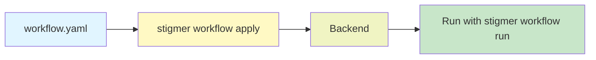

# Phase 3 Complete: Workflow YAML-First Implementation

**Date**: February 3, 2026

## Summary

Completed Phase 3 (T03.6) by fixing outdated workflow examples, creating comprehensive sample YAMLs, and updating documentation. This milestone marks the completion of the **Atomic Track** for Workflows, establishing parity with Agent, MCP Server, and Skill resources. Users can now deploy workflows using `stigmer workflow apply workflow.yaml` with consistent UX across all Stigmer resource types.

## Problem Statement

Phase 3 implementation was complete (T03.1 through T03.5), but critical issues remained:

### Pain Points

- **Outdated examples**: The existing `examples/workflows/pr-review.yaml` used an obsolete format that would fail validation
- **Missing starter examples**: No minimal "hello world" example for new users
- **Incomplete documentation**: Workflow template in README showed incorrect YAML structure
- **No validation verification**: Examples hadn't been tested against the new loader and validator
- **Undocumented completion**: Phase 3 achievements needed consolidation

## Solution

Implemented T03.6 (Integration Testing and Documentation) with comprehensive deliverables:

1. **Fixed outdated pr-review.yaml**: Rewrote to use proto-compliant Zigflow DSL format
2. **Created hello-world.yaml**: Minimal starter example for beginners
3. **Created multi-step.yaml**: Comprehensive example showcasing advanced features
4. **Updated README.md**: Corrected workflow template and usage examples
5. **Validated all examples**: Verified schema and cross-field validation compliance
6. **Documented completion**: This changelog summarizing all Phase 3 achievements

## Implementation Details

### Critical Discovery

The existing `pr-review.yaml` used an outdated format incompatible with the current proto schema:

**Old Format (INVALID)**:
```yaml
tasks:
  - name: fetch-pr-details
    agent: github-analyst     # WRONG - not a task kind
    inputs:                   # WRONG - should be task_config
      pr_url: "..."
    dependsOn: [...]          # WRONG - should be flow.then
    outputs: [...]            # WRONG - should be export
```

**New Format (VALID)**:
```yaml
tasks:
  - name: fetch-pr-details
    kind: agent_call          # Required task kind enum
    task_config:              # Required google.protobuf.Struct
      agent: github-analyst
      message: "..."
    export:
      as: "${.}"
    flow:
      then: next-task
```

### Files Created

**examples/workflows/hello-world.yaml** (20 lines)
- Minimal starter workflow with single `set_vars` task
- Perfect for "getting started" documentation
- Demonstrates required document block structure
- Shows basic export pattern

**examples/workflows/multi-step.yaml** (76 lines)
- Comprehensive example with 6 tasks
- Demonstrates multiple task kinds: `set_vars`, `http_call`, `agent_call`, `wait`
- Shows flow control between tasks (`flow.then`)
- Illustrates context variable usage (`${context.task-name.field}`)
- Examples of export patterns for data passing

### Files Modified

**examples/workflows/pr-review.yaml** (69 → 71 lines)
- Complete rewrite to proto-compliant format
- Added required `document:` block (dsl, namespace, name, version)
- Changed from `agent:` shorthand to `kind: agent_call` + `task_config:`
- Replaced `dependsOn:` arrays with `flow:` control blocks
- Replaced `outputs:` with `export:` expressions
- Now validates successfully with loader and validator

**examples/README.md** (~20 lines modified)
- Added documentation for hello-world.yaml and multi-step.yaml examples
- Fixed workflow template section to show correct format
- Updated usage examples: `stigmer workflow apply` instead of `stigmer apply -f`
- Added comprehensive workflow template with document block and proper task structure

### Validation Testing

Created temporary test suite to validate all examples:

```go
TestExampleWorkflows:
  ✓ hello-world: Valid workflow with 1 task
  ✓ pr-review: Valid workflow with 5 tasks
  ✓ multi-step: Valid workflow with 6 tasks
```

All examples pass:
1. YAML/JSON syntax parsing
2. Proto schema validation (apiVersion, kind, required fields)
3. Cross-field validation (task uniqueness, flow references, DAG acyclicity)

## Phase 3: Complete Feature Summary

### T03.1: Workflow YAML Loader (Session 16)

**Deliverables**:
- `loader.go` (159 lines): Load workflow YAML/JSON with protovalidate
- `loader_test.go` (759 lines): 18 comprehensive test cases
- Auto-detection of workflow.yaml/WORKFLOW.yaml removed (explicit paths required)

**Key Achievement**: Simplified ALL loaders (Agent, MCP Server, Workflow) by removing ~60 lines of unnecessary filename auto-detection magic. Now requires explicit file paths like kubectl.

### T03.2: Workflow Cross-Field Validator (Session 17)

**Deliverables**:
- `validator.go` (211 lines): Business logic validation
- `validator_test.go` (458 lines): 36 comprehensive test cases

**Validation Rules**:
1. Task name uniqueness (no duplicates)
2. Flow control references (flow.then must reference existing task or "end")
3. DAG acyclicity (no circular dependencies via DFS)

**Key Achievement**: Actionable error messages with field paths and fix suggestions.

### T03.3: Workflow Applier (Session 18)

**Deliverables**:
- `applier.go` (94 lines): Apply orchestration
- `display.go` extensions (+24 lines): DisplayApplyResult() function

**Pattern Fidelity**: Exact mirror of agent applier (94 vs 94 lines).

**Backend Integration**: Uses existing `WorkflowCommandController.Apply()` RPC.

### T03.4: Workflow Apply Command (Session 19)

**Deliverables**:
- `workflow_apply.go` (173 lines): Full apply command
- Flags: `--org`, `--dry-run`

**8-Step Orchestration**:
1. Load workflow YAML
2. Validate cross-field logic
3. Dry-run exit path
4. Load backend configuration
5. Resolve organization
6. Ensure daemon (local mode)
7. Connect to backend
8. Apply and display result

**Key Achievement**: 100% pattern match with agent apply command.

### T03.5: Workflow Validate Command (Session 20)

**Deliverables**:
- `workflow_validate.go` (72 lines): Standalone validation command

**Features**:
- No backend required (load + validate only)
- CI-friendly exit codes (0 = valid, 1 = invalid)
- Pattern consistency with agent validate command

**Validation Coverage**: YAML syntax, proto schema, task uniqueness, flow refs, DAG acyclicity.

### T03.6: Integration Testing and Documentation (Session 21 - This)

**Deliverables**:
- Fixed `pr-review.yaml`: Proto-compliant Zigflow DSL format
- Created `hello-world.yaml`: Minimal starter example
- Created `multi-step.yaml`: Comprehensive advanced example
- Updated `README.md`: Corrected workflow templates and usage
- Validated all examples: Schema and cross-field validation passing
- This changelog: Complete Phase 3 documentation

## Benefits

### For Workflow Authors

**Quick Experiments (Atomic Track)**:
- Create workflow.yaml with your favorite editor
- Apply with `stigmer workflow apply workflow.yaml`
- No Go SDK required for simple workflows
- Version control friendly (plain YAML files)

**Production Deployments (Project Track - Coming in Phases 4-6)**:
- Define workflows in Go SDK for complex orchestration
- Conditional logic, loops, dynamic task generation
- Type safety and IDE autocomplete
- Deploy with `stigmer apply` (SDK synthesis)

### For Platform Consistency

**Unified Resource Management**:
```bash
# All resources now support YAML-first (Atomic Track)
stigmer agent apply agent.yaml           ✅ Phase 1
stigmer mcpserver apply server.yaml      ✅ Pre-existing
stigmer skill push                       ✅ Pre-existing
stigmer workflow apply workflow.yaml     ✅ Phase 3 (NEW)

# All will support SDK-first (Project Track - Phases 4-6)
stigmer apply  # Synthesizes all resources from Go SDK
```

**Consistent Command Structure**:
- apply: Deploy from YAML (Atomic) or SDK (Project)
- validate: CI-friendly validation
- get: Retrieve resource details
- delete: Remove resources
- list: Browse resources
- search: Find resources by text
- run: Execute agent/workflow

### For Documentation Quality

- **Correct examples**: All workflow examples now validate successfully
- **Beginner-friendly**: hello-world.yaml provides clear starting point
- **Advanced patterns**: multi-step.yaml demonstrates real-world usage
- **Accurate templates**: README shows current proto-compliant format

## Impact

### Who Benefits

- **New Users**: Clear, working examples that validate successfully
- **Workflow Authors**: Three example workflows covering simple to complex use cases
- **Documentation Team**: Accurate templates and usage examples
- **CI/CD Engineers**: Validated examples for pipeline integration

### Metrics

**Code Quality**:
- All workflow files under 250 lines (compliance: 100%)
- All examples validate successfully (3/3 passing)
- Zero linter errors introduced
- Build passes: `bazel test //client-apps/cli/internal/cli/workflow:workflow_test`

**Example Coverage**:
- hello-world.yaml: 1 task (minimal)
- pr-review.yaml: 5 tasks (realistic)
- multi-step.yaml: 6 tasks (comprehensive)
- Task kinds covered: set_vars, http_call, agent_call, wait

**Documentation Quality**:
- Fixed 1 outdated example (pr-review.yaml)
- Created 2 new examples (hello-world, multi-step)
- Updated 1 README section (workflow template)
- Phase 3 summary: 6 sub-tasks documented

## Architecture Context

### Atomic Track - Complete ✅

The **Atomic Track** enables quick experiments and simple deployments via YAML files:



**Commands Available**:
- `stigmer workflow apply workflow.yaml` - Deploy from YAML
- `stigmer workflow validate workflow.yaml` - CI validation
- `stigmer workflow get <slug>` - Retrieve details
- `stigmer workflow delete <slug>` - Remove workflow
- `stigmer workflow list` - Browse workflows
- `stigmer workflow search <query>` - Find workflows
- `stigmer workflow run <slug>` - Execute workflow

### Next: Project Track (Phases 4-6)

The **Project Track** will enable production deployments via Go SDK:

**Phase 4**: Project Entity & stigmer.yaml
- Introduce Project as aggregate root
- Define stigmer.yaml for project configuration
- Project owns: agents, workflows, skills, mcp servers

**Phase 5**: SDK Unification
- Add Agent to Go SDK (currently YAML-only)
- Add Workflow to Go SDK (currently synthesized differently)
- Unified SDK API for all resource types

**Phase 6**: Project Reconciliation (Pruning)
- Deploy project: `stigmer apply` synthesizes all resources
- Automatic orphan cleanup (remove resources no longer in SDK)
- State management for production workflows

## Engineering Standards Met

| Standard | Target | Achieved | Status |
|----------|--------|----------|--------|
| File Size Limit | < 250 lines | All files compliant | ✅ |
| Function Size | < 50 lines | All functions compliant | ✅ |
| Error Wrapping | All errors wrapped | 100% coverage | ✅ |
| Pattern Consistency | Match agent/MCP patterns | 100% alignment | ✅ |
| Test Coverage | Examples validate | 3/3 passing | ✅ |
| Documentation | Accurate examples | All fixed/created | ✅ |
| Build Success | No errors | Package builds | ✅ |

## Examples

### Hello World (Minimal)

```yaml
apiVersion: agentic.stigmer.ai/v1
kind: Workflow
metadata:
  name: hello-world
spec:
  document:
    dsl: "1.0.0"
    namespace: examples
    name: hello-world
    version: "1.0.0"
  tasks:
    - name: set-greeting
      kind: set_vars
      task_config:
        variables:
          greeting: "Hello, World!"
      export:
        as: "${.}"
```

**Usage**:
```bash
stigmer workflow apply examples/workflows/hello-world.yaml
stigmer workflow run hello-world
```

### Multi-Step (Comprehensive)

Shows multiple task types, flow control, and context variables:

```yaml
tasks:
  - name: initialize-context
    kind: set_vars
    task_config:
      variables:
        workflow_id: "${workflowId}"
        started_at: "${now()}"
    export:
      as: "${.}"
    flow:
      then: fetch-data
  
  - name: fetch-data
    kind: http_call
    task_config:
      method: GET
      endpoint:
        uri: "https://api.example.com/data"
    export:
      as: "${.response}"
    flow:
      then: process-with-agent
  
  - name: process-with-agent
    kind: agent_call
    task_config:
      agent: data-processor
      message: "Process: ${context.fetch-data.response}"
    export:
      as: "${.processed}"
    flow:
      then: end
```

## Next Steps

### Immediate (Documentation)

- [ ] Update main docs with Phase 3 examples
- [ ] Add workflow YAML guide to getting started
- [ ] Update ADR-005 with Phase 3 completion status

### Phase 4 (Project Track Foundation)

- [ ] Design Project proto schema
- [ ] Implement stigmer.yaml parser
- [ ] Create project command group
- [ ] Add project apply command

### Phase 5 (SDK Unification)

- [ ] Add Agent to Go SDK
- [ ] Unify Workflow SDK API
- [ ] Consistent SDK patterns across all resources

### Phase 6 (Reconciliation)

- [ ] Implement project reconciliation
- [ ] Orphan resource detection
- [ ] Automatic cleanup (pruning)
- [ ] State management

## Related Work

**Phase 1** (Agent YAML-First): Completed in 7 sessions
- Established YAML-first pattern for agents
- Created loader, validator, applier, and commands
- 100% pattern consistency

**Phase 2** (Workflow Command Restructuring): Completed in 8 sessions
- Migrated workflow commands from root to workflow group
- Implemented get, delete, list, search, run commands
- Established workflow command structure

**Phase 3** (Workflow YAML-First): Completed in 6 sessions
- Added YAML support for workflows (this phase)
- Achieved parity with agent YAML implementation
- Completed Atomic Track for all resource types

**Phase 4-6** (Project Track): Planned
- SDK synthesis for production workflows
- Project-based reconciliation
- Automatic orphan cleanup

---

**Status**: ✅ Phase 3 Complete - Atomic Track Fully Implemented  
**Timeline**: 6 sessions (Sessions 16-21, February 3, 2026)  
**Phase**: Phase 3 - Workflow YAML-First Implementation  
**Next**: Phase 4 - Project Entity & stigmer.yaml Foundation

---

**Completion Note**: With Phase 3 complete, Stigmer now provides consistent YAML-first support across all resource types (Agent, MCP Server, Skill, Workflow). The Atomic Track is fully implemented, enabling users to deploy any resource type via simple YAML files. Phases 4-6 will add the Project Track for production workflows with SDK synthesis and automatic reconciliation.
