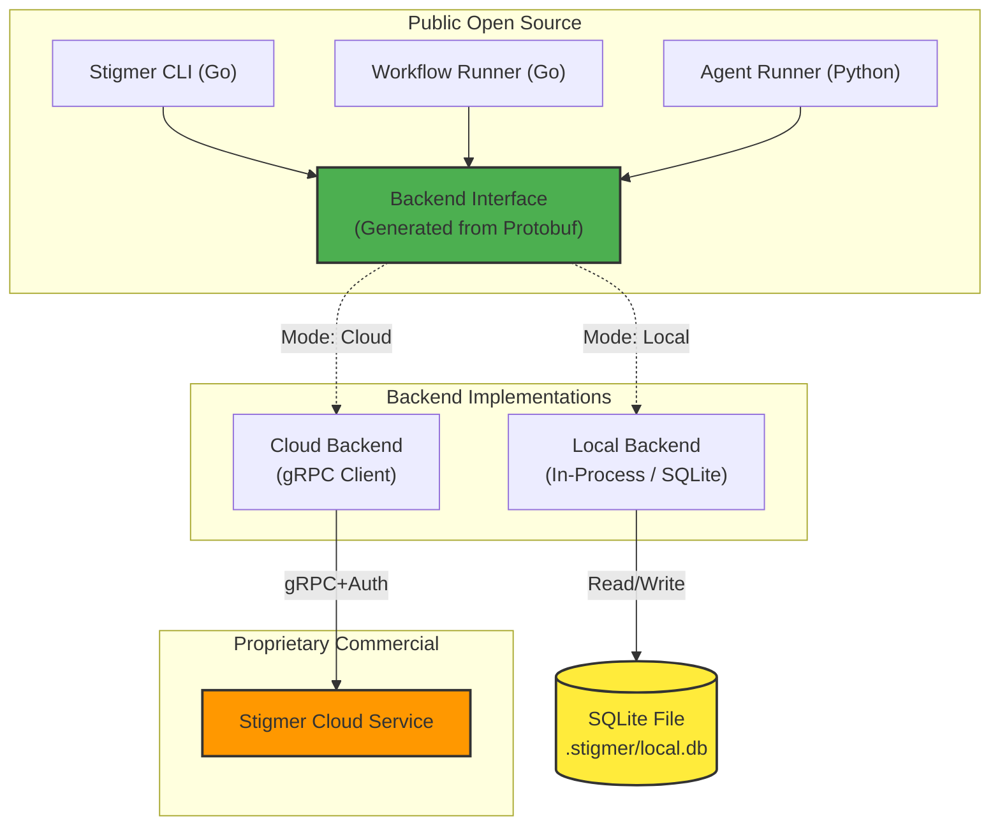

Here is the consolidated **Stigmer Open Source Architecture (v2.0)** document. It integrates your original vision with the critical improvements we discussed regarding Protobuf interfaces, SQLite storage, and security patterns.

You can use this directly to align your team and update your repository documentation.

---

# Stigmer Open Source Architecture: Final Design

**Version**: 2.0
**Date**: January 18, 2026
**Context**: Finalized strategy for open-sourcing execution planes while protecting the commercial control plane.

## 1. Executive Summary

We will adopt an **Open Core** architecture. The "Execution Plane" (CLI, Runners, SDK) will be Apache 2.0 licensed, building developer trust and enabling local development. The "Control Plane" (Stigmer Service, Auth, Governance) remains proprietary.

**Key Architectural Shift**:
Instead of hardcoding dependencies on the proprietary API, we introduce a **Backend Abstraction Layer** defined via **Protocol Buffers**. This ensures strict parity between our Cloud Backend (gRPC to Stigmer Service) and our new Local Backend (SQLite).

## 2. High-Level Architecture

### The "Decoupled" Pattern



## 3. Core Implementation Decisions

### A. Interface Definition (Protobuf)

**Decision**: We will **not** write manual interface code. We will define the Backend contract as a Protobuf Service. This guarantees that Go (CLI/Workflow) and Python (Agent) never drift apart.

**Definition (`backend_api.proto`):**

```protobuf
service BackendService {
  // Core Execution State
  rpc CreateExecution(CreateExecutionRequest) returns (CreateExecutionResponse);
  rpc UpdateExecutionStatus(UpdateStatusRequest) returns (UpdateStatusResponse);
  
  // Secret Management (JIT)
  rpc GetExecutionContext(GetExecutionContextRequest) returns (ExecutionContext);
  
  // Resource Retrieval
  rpc GetAgentInstance(GetResourceRequest) returns (AgentInstance);
}

```

### B. Storage Strategy (SQLite > MongoDB)

**Decision**: Local mode will use **SQLite**, not MongoDB.

* **Why**: Removes the "heavy" Docker requirement for basic testing.
* **Concurrency**: SQLite handles concurrent writes from the CLI and Runners via WAL (Write-Ahead Log) mode, which is sufficient for local development.

### C. Secret Security (The "JIT" Model)

**Decision**: Secrets are never passed through the workflow engine. They are resolved **Just-In-Time** inside the Runner using the "Reference" pattern.

**The Flow**:

1. **User**: `stigmer apply --secret GH_TOKEN=abc`
2. **Storage**:
* *Cloud*: Encrypted in Vault/DB.
* *Local*: Encrypted in SQLite using a local key (stored in OS Keychain or `~/.stigmer/master.key`).


3. **Workflow**: Passes reference `${.secrets.GH_TOKEN}`.
4. **Activity Execution**:
* Runner calls `Backend.GetExecutionContext(id)`.
* Backend decrypts and returns secrets to Runner **memory**.
* Runner swaps `${.secrets.GH_TOKEN}` -> `abc` immediately before API call.


## 4. Local Mode Experience (Tiers)

We will offer two tiers of local execution to satisfy both beginners and power users.

### Tier 1: "Stigmer Lite" (Default)

* **Command**: `stigmer agent execute my-agent "hello"`
* **Infrastructure**: None. Uses embedded SQLite.
* **Behavior**: Runs the agent in-process (or spawns a local runner process).
* **Best for**: Rapid iteration, testing prompts, debugging single agents.

### Tier 2: "Full Stack" (Docker Wrapper)

* **Command**: `stigmer local start`
* **Infrastructure**: Temporal + MongoDB (via Docker Compose).
* **Behavior**: The CLI wraps `docker compose up`. It spins up a real Temporal server.
* **Best for**: Testing complex workflows, retries, and long-running distributed transactions that mimic production 100%.

## 5. Open Source Boundaries

| Component | Status | Rationale |
| --- | --- | --- |
| **Runners (Go/Py)** | ✅ **Open** | Users trust open execution; allows auditing security. |
| **CLI** | ✅ **Open** | Entry point for developer experience. |
| **SDKs** | ✅ **Open** | Necessary for ecosystem adoption. |
| **Local Backend** | ✅ **Open** | Enables "free tier" self-hosting for individuals. |
| **Stigmer Service** | ❌ **Closed** | Contains the "Business Logic" (Billing, RBAC, Multi-tenant). |
| **Auth/Governance** | ❌ **Closed** | Enterprise features (SSO, OpenFGA policies). |
| **Web Console** | ❌ **Closed** | Premium UI experience remains a paid differentiator. |

## 6. Migration & Compatibility

* **Existing Cloud Users**: No changes. The `CloudBackend` implementation is just a wrapper around the existing gRPC calls they already use.
* **New Local Users**: They get a zero-dependency start (SQLite) but can seamlessly `stigmer login` to switch the backend to Cloud when ready to deploy.

## 7. Next Steps

1. **Refactor**: Create `backend_api.proto` and generate stubs.
2. **Build**: Implement `SQLiteBackend` (Go) and `SQLiteBackend` (Python).
3. **Security**: Implement the JIT Secret resolution logic in the Runners.
4. **Launch**: Release the open-source repo with the "Tier 1" SQLite experience working out of the box.