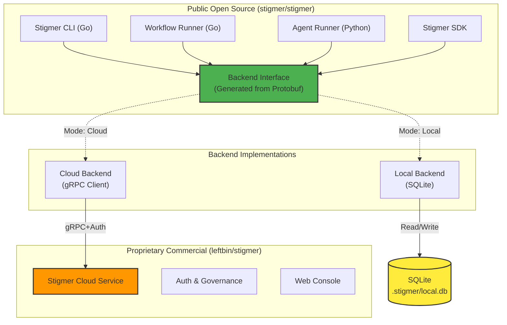

# Task T01: Open Source Stigmer - Phase 1 Foundation & Architecture

**Created**: 2026-01-18
**Status**: PENDING REVIEW ⚠️
**Type**: Architecture Migration + Repository Setup

⚠️ **This plan requires your review before execution**

## Executive Summary

This is the foundation phase for transitioning Stigmer to an Open Core architecture. We will:

1. Set up the new `stigmer/stigmer` repository structure
2. Define the Backend Abstraction Layer via Protobuf
3. Create the architectural blueprint for splitting proprietary vs. open source components
4. Establish the development workflow for the open source project

**Duration Estimate**: 2-3 weeks
**Risk Level**: Low (no production impact, green field setup)

## Background: The Open Core Vision

Based on your Gemini conversation, we're implementing this architecture:



**Key Architectural Decision**: The Backend Interface (defined in Protobuf) ensures strict parity between Local (SQLite) and Cloud (gRPC) backends. This guarantees that Go and Python components never drift apart.

## Task Breakdown

### Phase 1.1: Repository Setup & Structure (Week 1)

**Goal**: Establish the `stigmer/stigmer` repository with proper open source project structure.

#### 1.1.1 Create New Repository Structure

- [ ] **Initialize `stigmer/stigmer` repository**
  - Set up repository on GitHub (if not already done)
  - Add Apache 2.0 LICENSE file
  - Create initial README.md with project vision
  - Set up `.gitignore` for Go/Python projects
  
- [ ] **Define Repository Structure**
  ```
  stigmer/
  ├── LICENSE (Apache 2.0)
  ├── README.md
  ├── CONTRIBUTING.md
  ├── CODE_OF_CONDUCT.md
  ├── docs/
  │   ├── architecture/
  │   ├── getting-started/
  │   └── api/
  ├── proto/
  │   └── stigmer/
  │       └── backend/
  │           └── v1/
  │               └── backend_api.proto
  ├── cmd/
  │   └── stigmer/           # CLI entry point
  ├── internal/
  │   ├── backend/
  │   │   ├── interface.go   # Generated from proto
  │   │   ├── local/         # SQLite implementation
  │   │   └── cloud/         # gRPC client implementation
  │   ├── workflow/          # Workflow engine
  │   └── agent/             # Agent execution
  ├── sdk/
  │   ├── go/                # Go SDK
  │   └── python/            # Python SDK
  ├── runners/
  │   ├── workflow/          # Workflow Runner (Go)
  │   └── agent/             # Agent Runner (Python)
  ├── examples/
  ├── go.mod
  ├── go.sum
  └── pyproject.toml
  ```

- [ ] **Set up Build System**
  - Configure Go modules (`go.mod`)
  - Set up Python package structure (`pyproject.toml`)
  - Create Makefile with common tasks (build, test, proto-gen)
  - Configure CI/CD (GitHub Actions) for automated testing

#### 1.1.2 Open Source Documentation

- [ ] **Create Core Documentation**
  - README.md: Project overview, quick start, architecture diagram
  - CONTRIBUTING.md: How to contribute, development setup
  - CODE_OF_CONDUCT.md: Community guidelines
  - docs/architecture/open-core-model.md: Explain open vs. closed components
  - docs/getting-started/local-mode.md: Using Stigmer without cloud backend
  - docs/getting-started/cloud-mode.md: Connecting to Stigmer Cloud

- [ ] **Architecture Documentation**
  - docs/architecture/backend-abstraction.md: How the interface works
  - docs/architecture/secret-management.md: JIT secret resolution pattern
  - docs/architecture/local-vs-cloud.md: Feature parity matrix

### Phase 1.2: Backend Interface Definition (Week 1-2)

**Goal**: Define the Protobuf contract that both Local and Cloud backends implement.

#### 1.2.1 Design Backend API Protobuf

- [ ] **Create `proto/stigmer/backend/v1/backend_api.proto`**
  
  Based on your Gemini conversation, define:
  
  ```protobuf
  syntax = "proto3";
  
  package stigmer.backend.v1;
  
  // Core Backend Service - ALL backends MUST implement this
  service BackendService {
    // Execution State Management
    rpc CreateExecution(CreateExecutionRequest) returns (CreateExecutionResponse);
    rpc UpdateExecutionStatus(UpdateStatusRequest) returns (UpdateStatusResponse);
    rpc GetExecutionStatus(GetExecutionRequest) returns (ExecutionStatus);
    rpc ListExecutions(ListExecutionsRequest) returns (ListExecutionsResponse);
    
    // Just-In-Time Secret Retrieval
    rpc GetExecutionContext(GetExecutionContextRequest) returns (ExecutionContext);
    
    // Resource Management
    rpc GetAgentInstance(GetResourceRequest) returns (AgentInstance);
    rpc GetWorkflowDefinition(GetResourceRequest) returns (WorkflowDefinition);
    
    // Storage Operations (for artifacts, logs)
    rpc StoreArtifact(StoreArtifactRequest) returns (StoreArtifactResponse);
    rpc GetArtifact(GetArtifactRequest) returns (GetArtifactResponse);
  }
  
  // Messages for execution management
  message CreateExecutionRequest {
    string workflow_id = 1;
    map<string, string> inputs = 2;
    repeated string secret_refs = 3;  // References only, not actual secrets
  }
  
  message ExecutionContext {
    string execution_id = 1;
    map<string, string> secrets = 2;  // Decrypted secrets, only returned to runners
    map<string, string> variables = 3;
  }
  
  // ... (additional messages)
  ```

- [ ] **Define Core Message Types**
  - Execution lifecycle messages (Create, Update, Status)
  - Secret reference patterns (`${.secrets.KEY_NAME}`)
  - Resource retrieval messages
  - Error handling and status codes

- [ ] **Generate Go and Python Stubs**
  - Set up `buf` for Protobuf generation (consistent with stigmer-sdk patterns)
  - Generate Go stubs: `internal/backend/gen/`
  - Generate Python stubs: `sdk/python/stigmer/backend/gen/`
  - Add code generation to Makefile

#### 1.2.2 Document the Interface Contract

- [ ] **Create Interface Documentation**
  - docs/api/backend-interface.md: Complete API reference
  - docs/api/backend-implementation-guide.md: How to implement a new backend
  - Include sequence diagrams for key flows (execution, secret retrieval)

### Phase 1.3: Architecture Blueprint & Migration Strategy (Week 2)

**Goal**: Plan the detailed migration from `leftbin/*` to `stigmer/stigmer`.

#### 1.3.1 Component Classification

- [ ] **Categorize Current Code**
  
  Create a spreadsheet/document classifying every file/package:
  
  | Component | Current Location | Destination | Status | License |
  |-----------|-----------------|-------------|--------|---------|
  | CLI Core | leftbin/stigmer-sdk/go/stigmer/ | stigmer/stigmer/cmd/stigmer/ | Open | Apache 2.0 |
  | Workflow SDK | leftbin/stigmer-sdk/go/workflow/ | stigmer/stigmer/sdk/go/workflow/ | Open | Apache 2.0 |
  | Agent SDK | leftbin/stigmer-sdk/go/agent/ | stigmer/stigmer/sdk/go/agent/ | Open | Apache 2.0 |
  | ... | ... | ... | ... | ... |
  | Stigmer Service | leftbin/stigmer/services/api/ | STAYS PRIVATE | Private | Proprietary |
  | Auth Service | leftbin/stigmer/services/auth/ | STAYS PRIVATE | Private | Proprietary |
  | Web Console | leftbin/stigmer/web-console/ | STAYS PRIVATE | Private | Proprietary |

- [ ] **Identify Dependencies to Extract**
  - List shared utilities that need to be in open source
  - Identify proprietary dependencies that need abstraction
  - Document circular dependencies that need breaking

#### 1.3.2 Migration Execution Plan

- [ ] **Create Migration Checklist**
  - [ ] Step 1: Copy CLI code to `stigmer/stigmer/cmd/stigmer/`
  - [ ] Step 2: Copy SDK packages to `stigmer/stigmer/sdk/`
  - [ ] Step 3: Copy runner implementations to `stigmer/stigmer/runners/`
  - [ ] Step 4: Extract shared utilities
  - [ ] Step 5: Update import paths
  - [ ] Step 6: Add Apache 2.0 headers to all files
  - [ ] Step 7: Remove proprietary code references
  - [ ] Step 8: Update documentation

- [ ] **Test Strategy for Migration**
  - Create test suite that runs against BOTH old and new codebases
  - Ensure functional parity
  - Benchmark performance (should be identical)

#### 1.3.3 Security Review for Open Sourcing

- [ ] **Audit Code for Sensitive Information**
  - Scan for hardcoded credentials (should be none, but verify)
  - Check for internal API endpoints
  - Review comments for sensitive information
  - Ensure no proprietary algorithms are exposed

- [ ] **Secret Management Architecture**
  - Document JIT (Just-In-Time) secret resolution pattern
  - Design local encryption (OS Keychain or `~/.stigmer/master.key`)
  - Design cloud secret storage (Vault integration, already exists)

### Phase 1.4: Local Backend Design (SQLite) (Week 2-3)

**Goal**: Design the SQLite backend implementation (implementation in Phase 2).

#### 1.4.1 Database Schema Design

- [ ] **Design SQLite Schema**
  
  **See**: `design-decisions/002-database-schema-from-protos.md` for complete schema design.
  
  Tables are derived DIRECTLY from Stigmer API protos (`ApiResourceKind` enum):
  
  **Tenancy & IAM:**
  - `organizations`: Organization entities
  - `identity_accounts`: User accounts
  - `api_keys`: API keys for authentication
  - `iam_policies`: IAM authorization policies
  
  **Agentic (Agents):**
  - `agents`: Agent templates (Template layer)
  - `agent_instances`: Configured agent deployments (Instance layer)
  - `sessions`: Agent conversation sessions (Execution layer)
  - `agent_executions`: Individual agent execution instances
  - `skills`: Agent knowledge base (Markdown content)
  
  **Agentic (Workflows):**
  - `workflows`: Workflow templates (Template layer)
  - `workflow_instances`: Configured workflow deployments (Instance layer)
  - `workflow_executions`: Workflow execution instances (Execution layer)
  
  **Environment & Context:**
  - `environments`: Environment variable and secret collections
  - `execution_contexts`: Ephemeral execution-scoped configuration
  
  **Versioning:**
  - `api_resource_versions`: Audit trail for all resource changes
  
  **Design Principles:**
  - One table per `ApiResourceKind` (no arbitrary tables)
  - Store `spec` and `status` as JSON (proto flexibility)
  - Common table structure across all resources
  - Secrets stored in `environments` and `execution_contexts` (NOT separate table)
  - Generated virtual columns for frequently-queried nested fields

- [ ] **Write Schema Migration**
  - Create `internal/backend/local/migrations/001_initial_schema.sql`
  - Set up migration tooling (golang-migrate or similar)
  - Enable WAL mode for concurrent access

#### 1.4.2 Local Backend Interface

- [ ] **Design `internal/backend/local/backend.go`**
  
  ```go
  package local
  
  import (
      "database/sql"
      pb "github.com/stigmer/stigmer/internal/backend/gen"
  )
  
  // Backend implements the BackendService interface using SQLite
  type Backend struct {
      db *sql.DB
      encryptor *SecretEncryptor
  }
  
  func NewBackend(dbPath string) (*Backend, error) {
      // Open SQLite in WAL mode for concurrency
      // Initialize encryption key from OS keychain
      // Run migrations
  }
  
  // Implement all BackendService methods
  func (b *Backend) CreateExecution(ctx context.Context, req *pb.CreateExecutionRequest) (*pb.CreateExecutionResponse, error) {
      // Store in SQLite
  }
  
  // ... (other methods)
  ```

- [ ] **Secret Encryption Design**
  - Research OS keychain integration (macOS, Linux, Windows)
  - Design fallback to `~/.stigmer/master.key` file
  - Document encryption algorithm (AES-256-GCM)

#### 1.4.3 Cloud Backend Wrapper

- [ ] **Design `internal/backend/cloud/backend.go`**
  
  ```go
  package cloud
  
  import (
      "google.golang.org/grpc"
      pb "github.com/stigmer/stigmer/internal/backend/gen"
  )
  
  // Backend implements BackendService by proxying to Stigmer Cloud
  type Backend struct {
      client pb.BackendServiceClient
      conn   *grpc.ClientConn
  }
  
  func NewBackend(endpoint string, token string) (*Backend, error) {
      // Connect to Stigmer Cloud gRPC endpoint
      // Set up authentication
  }
  
  // All methods just proxy to the gRPC client
  func (b *Backend) CreateExecution(ctx context.Context, req *pb.CreateExecutionRequest) (*pb.CreateExecutionResponse, error) {
      return b.client.CreateExecution(ctx, req)
  }
  ```

### Phase 1.5: CLI Backend Selection (Week 3)

**Goal**: Design how the CLI switches between Local and Cloud backends.

#### 1.5.1 Configuration Design

- [ ] **Create `~/.stigmer/config.yaml` Schema**
  
  ```yaml
  # Local mode (default)
  backend:
    type: local
    local:
      db_path: ~/.stigmer/local.db
  
  # Cloud mode (after `stigmer login`)
  backend:
    type: cloud
    cloud:
      endpoint: api.stigmer.io:443
      token: <auth-token>
      organization: my-org
  ```

- [ ] **Implement Backend Factory**
  
  ```go
  package backend
  
  func NewBackend(cfg *Config) (Backend, error) {
      switch cfg.Type {
      case "local":
          return local.NewBackend(cfg.Local.DBPath)
      case "cloud":
          return cloud.NewBackend(cfg.Cloud.Endpoint, cfg.Cloud.Token)
      default:
          return nil, fmt.Errorf("unknown backend type: %s", cfg.Type)
      }
  }
  ```

#### 1.5.2 CLI Commands Design

- [ ] **Design `stigmer init` (Local Setup)**
  ```bash
  $ stigmer init
  ✓ Created ~/.stigmer/local.db
  ✓ Initialized local backend
  ✓ Stigmer is ready to use in local mode
  
  Try: stigmer agent execute my-agent "hello world"
  ```

- [ ] **Design `stigmer login` (Switch to Cloud)**
  ```bash
  $ stigmer login
  Opening browser for authentication...
  ✓ Logged in as user@example.com
  ✓ Switched to cloud backend (api.stigmer.io)
  ```

- [ ] **Design `stigmer backend` (Status)**
  ```bash
  $ stigmer backend status
  Current backend: local
  Database: ~/.stigmer/local.db
  
  $ stigmer backend switch cloud
  ✓ Switched to cloud backend
  ```

## Success Criteria for Phase 1

At the end of T01, we should have:

- ✅ **Repository**: `stigmer/stigmer` set up with proper structure and documentation
- ✅ **Protobuf Interface**: `backend_api.proto` defined and documented
- ✅ **Architecture**: Clear blueprint for open vs. closed components
- ✅ **Migration Plan**: Step-by-step plan to move code from `leftbin/*`
- ✅ **Design Docs**: SQLite backend and Cloud backend wrapper designed
- ✅ **CLI Design**: Backend selection mechanism designed
- ✅ **Security**: Secret management JIT pattern documented

**NOT in Phase 1** (deferred to Phase 2):
- ❌ Actual code migration (just planning)
- ❌ SQLite backend implementation (just design)
- ❌ Running code (just architecture)

## Design Decisions to Document

After this phase, we should document (with your approval):

1. **Backend Abstraction via Protobuf** - Why Protobuf over manual interfaces
2. **SQLite over MongoDB** - Why SQLite for local mode
3. **JIT Secret Resolution** - Security pattern for secrets
4. **Open Core Boundaries** - What stays open vs. closed

## Risks & Mitigations

| Risk | Mitigation |
|------|------------|
| Protobuf interface doesn't cover all use cases | Review with actual usage patterns from current code |
| SQLite concurrency issues | Use WAL mode, test with parallel workflows |
| Exposing proprietary logic in open source | Careful code review, security audit |
| Community adoption challenges | Strong documentation, examples, getting started guide |

## Next Task Preview

**T02: Backend Interface Implementation** - Implement the Protobuf definitions and generate code for Go/Python.

**T03: SQLite Backend Implementation** - Build the local backend with SQLite storage.

**T04: Code Migration** - Move code from `leftbin/*` to `stigmer/stigmer`.

## Review Questions for You

Before I proceed with execution, please consider:

1. **Repository Structure**: Does the proposed `stigmer/stigmer` structure make sense?
2. **Protobuf Interface**: Are there any backend operations missing from the API?
3. **Migration Strategy**: Any concerns about the categorization of open vs. closed components?
4. **Timeline**: Does a 2-3 week estimate for Phase 1 (design/planning) sound reasonable?
5. **Documentation**: Any specific docs you want to see in the open source repo?

## Notes

- This is a **design and planning phase** - no actual code migration yet
- Focus on getting the architecture right before moving code
- The Gemini conversation provides the blueprint; this plan executes it
- **IMPORTANT**: Only task logs can be updated without permission. Design decisions, checkpoints, and guidelines require your approval.

---

**Status**: ⚠️ AWAITING YOUR REVIEW

Please review this plan and provide feedback. I'll create a revised version incorporating your input before we begin execution.
