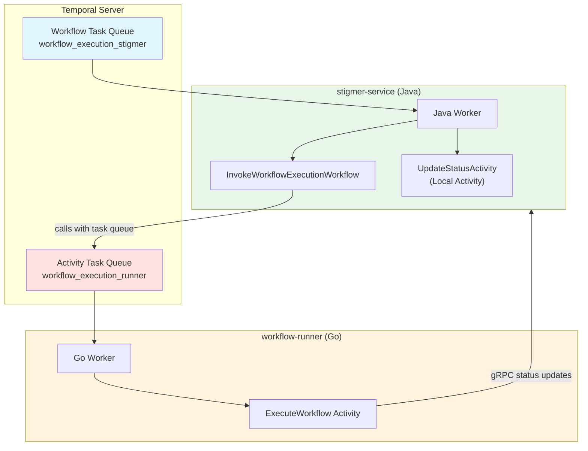
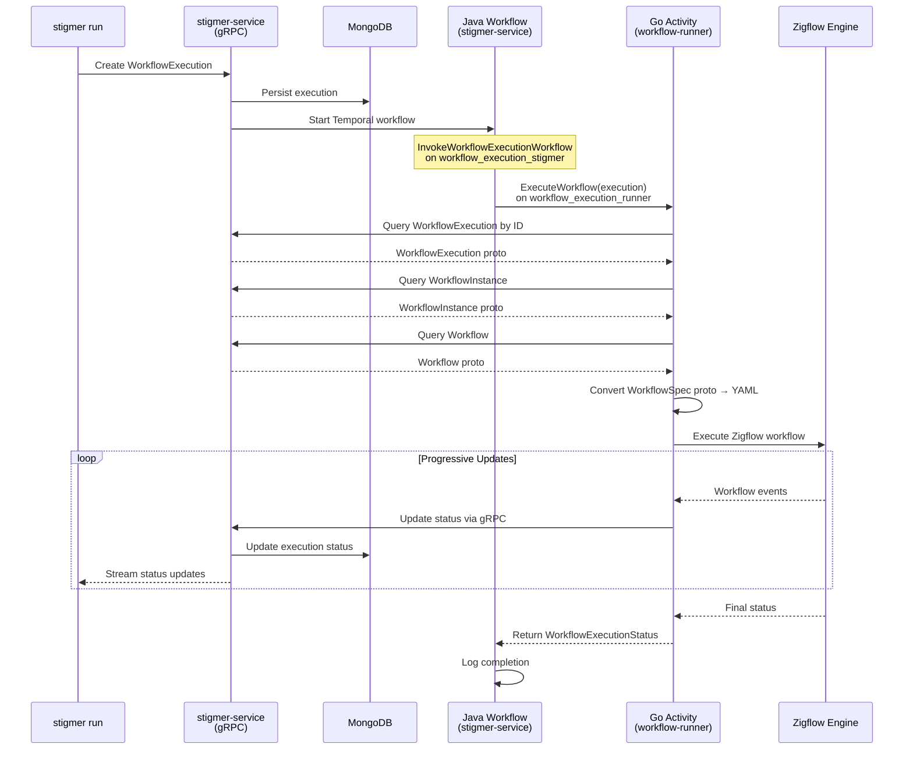
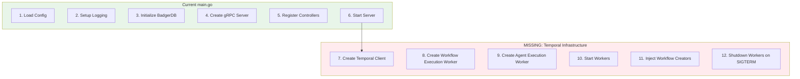

# Implementation Notes

## Task 1: Java Cloud Temporal Configuration Analysis (COMPLETED)

### Architecture Overview

Java Cloud uses a **polyglot Temporal pattern** for workflow execution:



### Worker Configuration Breakdown

#### 1. Task Queues (Polyglot Pattern)

Java Cloud uses **SEPARATE task queues** for workflows and activities:

**Queue Names:**
- **Workflow Queue**: `workflow_execution_stigmer` (Java workflows)
- **Activity Queue**: `workflow_execution_runner` (Go activities)

**Environment Variables:**
- `TEMPORAL_WORKFLOW_EXECUTION_STIGMER_TASK_QUEUE` (default: workflow_execution_stigmer)
- `TEMPORAL_WORKFLOW_EXECUTION_RUNNER_TASK_QUEUE` (default: workflow_execution_runner)

**Why Separate Queues:**
- Clear separation between orchestration (Java) and execution (Go)
- Prevents task routing collisions
- Allows independent scaling of workflow and activity workers
- Activity queue name passed via workflow memo for runtime routing

#### 2. Workflow Registration

**File:** `WorkflowExecutionTemporalWorkerConfig.java`

```java
@Bean
public Worker workflowExecutionWorker(WorkerFactory factory) {
    // Create worker on workflow_execution_stigmer queue
    Worker worker = factory.newWorker(config.getStigmerQueue());
    
    // Register ONLY workflows (no activities!)
    worker.registerWorkflowImplementationTypes(
        InvokeWorkflowExecutionWorkflowImpl.class
    );
    
    // Register local activities (in-process only)
    worker.registerActivitiesImplementations(updateStatusActivity);
    
    return worker;
}
```

**Critical Rules:**
- ✅ Java worker registers workflows ONLY on stigmer queue
- ✅ Local activities registered (run in-process, no task queue)
- ❌ NEVER register remote activities (causes task collision)

#### 3. Activity Registration

**File:** `InvokeWorkflowExecutionWorkflowImpl.java`

Activity stubs created with explicit task queue routing:

```java
// Remote activity (Go worker) - explicit task queue
private final ExecuteWorkflowActivity executeWorkflowActivity = Workflow.newActivityStub(
    ExecuteWorkflowActivity.class,
    ActivityOptions.newBuilder()
        .setTaskQueue(getActivityTaskQueue())  // Route to Go worker via memo
        .setStartToCloseTimeout(Duration.ofMinutes(30))
        .setRetryOptions(RetryOptions.newBuilder()
            .setMaximumAttempts(1)  // No retries for workflow execution
            .build())
        .build()
);

// Local activity (Java) - runs in-process
private final UpdateWorkflowExecutionStatusActivity updateStatusActivity = 
    Workflow.newLocalActivityStub(
        UpdateWorkflowExecutionStatusActivity.class,
        LocalActivityOptions.newBuilder()
            .setStartToCloseTimeout(Duration.ofSeconds(30))
            .build()
    );
```

**Key Pattern:**
- Activity queue retrieved from workflow memo (`getActivityTaskQueue()`)
- Default fallback: `workflow_execution_runner`
- Allows environment-specific configuration

#### 4. Workflow Types

**File:** `WorkflowExecutionTemporalWorkflowTypes.java`

```java
public static final String WORKFLOW_EXECUTION_INVOKE = "stigmer/workflow-execution/invoke";
public static final String WORKFLOW_EXECUTION_TASK_QUEUE = "workflow_execution";
```

**Workflow ID Format:**
```
stigmer/workflow-execution/invoke/{execution-id}
```

### Configuration Files

#### WorkflowExecutionTemporalConfig.java
```java
@ConfigurationProperties(prefix = "temporal.workflow-execution")
public class WorkflowExecutionTemporalConfig {
    private String stigmerQueue;  // Java workflows
    private String runnerQueue;   // Go activities
}
```

#### application-temporal.yaml (assumed)
```yaml
temporal:
  workflow-execution:
    stigmer-queue: ${TEMPORAL_WORKFLOW_EXECUTION_STIGMER_TASK_QUEUE:workflow_execution_stigmer}
    runner-queue: ${TEMPORAL_WORKFLOW_EXECUTION_RUNNER_TASK_QUEUE:workflow_execution_runner}
```

### Workflow Execution Flow



### Polyglot Benefits

1. **Language Strengths**: Java for orchestration, Go for Zigflow execution
2. **Independent Scaling**: Scale workflow and activity workers separately
3. **Separation of Concerns**: Business logic (Java) vs execution logic (Go)
4. **Single Source of Truth**: Activity queries fresh data from MongoDB
5. **Type Safety**: Proto-first design with validation

### Critical Design Patterns

#### Pattern 1: Agent-Runner Pattern
- Workflow passes **execution_id only** (not full payload)
- Activity **queries Stigmer service** for full context
- Benefits: Single source of truth, fresh data, simpler interface

#### Pattern 2: Progressive Status Updates
- Activity sends **real-time updates via gRPC** during execution
- Final status **returned to workflow** for Temporal observability
- Benefits: Live progress tracking, complete audit trail

#### Pattern 3: Local vs Remote Activities
- **Local activities**: Run in-process (Java) - no task queue routing
- **Remote activities**: Run in separate worker (Go) - explicit task queue
- Benefits: No task collision, clear separation

### Comparison with Agent Execution

**AgentExecutionTemporalWorkerConfig.java** (similar pattern):

```
Java Workflow Queue: agent_execution_stigmer
Python Activity Queue: agent_execution_runner

Activities: ExecuteGraphton, EnsureThread, CleanupSandbox
```

**Same polyglot pattern, different languages:**
- Agent Execution: Java workflows → Python activities
- Workflow Execution: Java workflows → Go activities

---

## Go OSS Structure Analysis (COMPLETED)

### Existing Infrastructure

✅ **GOOD NEWS:** Go OSS already has complete Temporal infrastructure!

**Files Present:**
```
backend/services/stigmer-server/pkg/domain/workflowexecution/temporal/
├── config.go                          ✅ Task queue configuration
├── worker_config.go                   ✅ Worker creation
├── workflow_types.go                  ✅ Workflow constants
├── workflows/
│   ├── invoke_workflow.go            ✅ Workflow interface
│   ├── invoke_workflow_impl.go       ✅ Workflow implementation
│   └── workflow_creator.go           ✅ Workflow creator
└── activities/
 ├── execute_workflow.go            ✅ Activity interface (for workflow-runner)
 ├── update_status.go               ✅ Local activity interface
 └── update_status_impl.go          ✅ Local activity implementation
```

### Configuration Matches Java Cloud

**config.go** (Go OSS):
```go
type Config struct {
 StigmerQueue string  // workflow_execution_stigmer
 RunnerQueue  string  // workflow_execution_runner
}
```

**WorkflowExecutionTemporalConfig.java** (Java Cloud):
```java
public class WorkflowExecutionTemporalConfig {
 private String stigmerQueue;  // workflow_execution_stigmer
 private String runnerQueue;   // workflow_execution_runner
}
```

✅ **PERFECT MATCH!** Queue names and structure are identical.

### Worker Configuration Matches Java Cloud

**worker_config.go** (Go OSS):
```go
func (wc *WorkerConfig) CreateWorker(temporalClient client.Client) worker.Worker {
 w := worker.New(temporalClient, wc.config.StigmerQueue, worker.Options{})
 
 // Register workflows ONLY
 w.RegisterWorkflow(&workflows.InvokeWorkflowExecutionWorkflowImpl{})
 
 // Register local activities
 w.RegisterActivity(wc.updateStatusActivityImpl.UpdateExecutionStatus)
 
 return w
}
```

**WorkflowExecutionTemporalWorkerConfig.java** (Java Cloud):
```java
public Worker workflowExecutionWorker(WorkerFactory factory) {
 Worker worker = factory.newWorker(config.getStigmerQueue());
 
 worker.registerWorkflowImplementationTypes(
 InvokeWorkflowExecutionWorkflowImpl.class
 );
 
 worker.registerActivitiesImplementations(updateStatusActivity);
 
 return worker;
}
```

✅ **PERFECT MATCH!** Registration pattern is identical.

### Workflow Implementation Matches Java Cloud

Both implementations follow the same flow:
1. Get activity task queue from workflow memo
2. Create activity stub with explicit task queue
3. Call ExecuteWorkflow activity on runner queue
4. Handle errors with local activity for status updates

**Go OSS** (`invoke_workflow_impl.go`):
- ✅ Gets activity queue from memo
- ✅ Creates activity stub with task queue routing
- ✅ Calls ExecuteWorkflow on runner queue
- ✅ Updates status on failure with local activity

**Java Cloud** (`InvokeWorkflowExecutionWorkflowImpl.java`):
- ✅ Gets activity queue from memo
- ✅ Creates activity stub with task queue routing
- ✅ Calls ExecuteWorkflow on runner queue
- ✅ Updates status on failure with local activity

✅ **PERFECT MATCH!** Implementation logic is identical.

---

## Root Cause Identified

### Problem: Workers Not Started

**main.go** (lines 42-213):
```go
func main() {
 // ✅ BadgerDB initialized
 store, err := badger.NewStore(cfg.DBPath)
 
 // ✅ gRPC server started
 server := grpclib.NewServer(...)
 
 // ✅ Controllers registered
 workflowExecutionController := workflowexecutioncontroller.NewWorkflowExecutionController(...)
 
 // ❌ NO Temporal client initialization
 // ❌ NO Temporal worker creation
 // ❌ NO worker.Start() calls
 
 // Start network server
 go func() {
 server.Start(cfg.GRPCPort)
 }()
}
```

### Missing Components

1. **Temporal Client** - Not created
2. **Temporal Worker** - Not initialized
3. **Worker Lifecycle** - Not started/stopped

### Evidence

**create.go:42** (WorkflowExecutionController):
```go
// StartWorkflow step (no Temporal workflow engine in OSS - stubbed for now)
// TODO: Implement when Temporal integration is added
```

**Result:**
- `stigmer run` creates WorkflowExecution successfully
- WorkflowExecution persisted to BadgerDB
- Execution stays in PENDING phase forever
- No worker to pick up workflow tasks

---

## Solution Design

### What Needs to be Added to main.go



### Implementation Steps (Task 4)

1. **Add Temporal Config** (environment variables)
2. **Create Temporal Client** (connect to Temporal server)
3. **Initialize Workflow Execution Worker**
4. **Initialize Agent Execution Worker** (if needed)
5. **Start Workers** (worker.Start())
6. **Inject Workflow Creators** into controllers
7. **Graceful Shutdown** (worker.Stop() on SIGTERM)

### Configuration Needed

**Environment Variables:**
```bash
TEMPORAL_HOST_PORT=localhost:7233
TEMPORAL_NAMESPACE=default
TEMPORAL_WORKFLOW_EXECUTION_STIGMER_TASK_QUEUE=workflow_execution_stigmer
TEMPORAL_WORKFLOW_EXECUTION_RUNNER_TASK_QUEUE=workflow_execution_runner
```

**No Code Changes Needed:**
- ✅ Worker config already exists
- ✅ Workflow implementations complete
- ✅ Activity interfaces defined
- ✅ Configuration loading implemented

---

## Key Findings Summary

### What Java Cloud Has

1. **WorkerFactory Bean** - Spring-managed Temporal worker factory
2. **Worker Beans** - Per-domain workers (workflow-execution, agent-execution)
3. **Workflow Creators** - Injected into controllers as dependencies
4. **Lifecycle Management** - Spring manages worker start/stop
5. **Configuration** - application-temporal.yaml with environment variable overrides

### What Go OSS Has

1. **Worker Config Structs** - Equivalent to Java worker beans
2. **Workflow Implementations** - Complete and matching Java
3. **Workflow Creators** - Exist but NOT injected into controllers
4. **Configuration Loading** - LoadConfig() functions implemented
5. **Activity Implementations** - Local activities implemented

### What Go OSS Is Missing

1. **Temporal Client Creation** - No client.NewClient() call in main.go
2. **Worker Initialization** - No worker creation in main.go
3. **Worker Lifecycle** - No worker.Start() or worker.Stop()
4. **Workflow Creator Injection** - Controllers don't have workflow creators

### Architecture Alignment

| Aspect | Java Cloud | Go OSS | Status |
|--------|-----------|---------|--------|
| Polyglot Pattern | ✅ Separate queues | ✅ Separate queues | ✅ Match |
| Queue Names | workflow_execution_* | workflow_execution_* | ✅ Match |
| Worker Config | ✅ Spring beans | ✅ Go structs | ✅ Match |
| Workflow Impl | ✅ Complete | ✅ Complete | ✅ Match |
| Activity Stubs | ✅ With task queue | ✅ With task queue | ✅ Match |
| Memo Pattern | ✅ Activity queue | ✅ Activity queue | ✅ Match |
| Worker Startup | ✅ Spring lifecycle | ❌ **MISSING** | ❌ Gap |
| Client Creation | ✅ Auto-configured | ❌ **MISSING** | ❌ Gap |
| Creator Injection | ✅ Dependency injection | ❌ **MISSING** | ❌ Gap |

---

## Task 1 Completion Status

✅ **COMPLETE** - Analyzed Java Cloud Temporal configuration
✅ **COMPLETE** - Compared with Go OSS structure
✅ **COMPLETE** - Identified root cause (workers not started)
✅ **COMPLETE** - Documented polyglot architecture
✅ **COMPLETE** - Mapped all components and configurations

### Next Steps

➡️ **Task 2:** Design implementation plan for worker initialization in main.go
➡️ **Task 3:** Implement Temporal client and worker startup
➡️ **Task 4:** Inject workflow creators into controllers
➡️ **Task 5:** Test end-to-end workflow execution

---

## Task 3: Implementation Plan Design (COMPLETED)

### Goal

Design a complete, step-by-step implementation plan for initializing Temporal workers in `main.go` that:
- Creates Temporal client
- Initializes workflow execution worker
- Manages worker lifecycle (start/stop)
- Injects workflow creators into controllers
- Handles graceful shutdown

### Design Principles

1. **Minimal Changes** - Infrastructure exists, just needs initialization
2. **Clean Separation** - Temporal setup isolated from controller registration
3. **Graceful Degradation** - Server can start even if Temporal is unavailable (log warning, continue)
4. **Zero Business Logic** - All logic already exists in domain packages

---

## Implementation Plan

### Phase 1: Add Temporal Configuration (Config Package)

**File:** `backend/services/stigmer-server/pkg/config/config.go`

**Changes Required:**

```go
type Config struct {
    GRPCPort int
    DBPath   string
    LogLevel string
    Env      string
    
    // NEW: Temporal configuration
    TemporalHostPort string  // Default: "localhost:7233"
    TemporalNamespace string // Default: "default"
}

func LoadConfig() (*Config, error) {
    config := &Config{
        GRPCPort: getEnvInt("GRPC_PORT", 7234),
        DBPath:   getEnvString("DB_PATH", defaultDBPath()),
        LogLevel: getEnvString("LOG_LEVEL", "info"),
        Env:      getEnvString("ENV", "local"),
        
        // NEW: Load Temporal config
        TemporalHostPort:  getEnvString("TEMPORAL_HOST_PORT", "localhost:7233"),
        TemporalNamespace: getEnvString("TEMPORAL_NAMESPACE", "default"),
    }
    
    return config, nil
}
```

**Rationale:** Centralize all configuration loading in one place. Matches existing pattern.

---

### Phase 2: Create Temporal Client (Main.go)

**Location:** After `store, err := badger.NewStore()` initialization (line ~60)

**Code Sequence:**

```go
// Initialize BadgerDB store
store, err := badger.NewStore(cfg.DBPath)
if err != nil {
    log.Fatal().Err(err).Msg("Failed to initialize BadgerDB store")
}
defer store.Close()

log.Info().Str("db_path", cfg.DBPath).Msg("BadgerDB store initialized")

// ============================================================================
// NEW: Initialize Temporal client and workers
// ============================================================================

// Create Temporal client
temporalClient, err := client.Dial(client.Options{
    HostPort:  cfg.TemporalHostPort,
    Namespace: cfg.TemporalNamespace,
})
if err != nil {
    log.Warn().
        Err(err).
        Str("host_port", cfg.TemporalHostPort).
        Str("namespace", cfg.TemporalNamespace).
        Msg("Failed to connect to Temporal server - workflows will not execute")
    temporalClient = nil // Set to nil, check before using
} else {
    defer temporalClient.Close()
    log.Info().
        Str("host_port", cfg.TemporalHostPort).
        Str("namespace", cfg.TemporalNamespace).
        Msg("Connected to Temporal server")
}
```

**Key Decisions:**

- ✅ **Non-fatal error:** Server starts even if Temporal is down
- ✅ **Clear logging:** Warn that workflows won't execute
- ✅ **Defer close:** Client cleanup on shutdown
- ✅ **Nil check:** Controllers must check before using

**Why Non-Fatal:**
- Development: Temporal may not be running locally
- Production: Graceful degradation (API queries still work)
- Testing: Can test non-workflow features without Temporal

---

### Phase 3: Create Workflow Execution Worker

**Location:** Immediately after Temporal client creation

**Code Sequence:**

```go
var workflowExecutionWorker worker.Worker
var workflowCreator *workflows.InvokeWorkflowExecutionWorkflowCreator

if temporalClient != nil {
    // Load Temporal configuration for workflow execution
    workflowExecutionTemporalConfig := workflowexecutiontemporal.LoadConfig()
    
    // Create worker configuration
    workerConfig := workflowexecutiontemporal.NewWorkerConfig(
        workflowExecutionTemporalConfig,
        store,
    )
    
    // Create worker
    workflowExecutionWorker = workerConfig.CreateWorker(temporalClient)
    
    // Create workflow creator (for controller injection)
    workflowCreator = workflows.NewInvokeWorkflowExecutionWorkflowCreator(
        temporalClient,
        workflowExecutionTemporalConfig.StigmerQueue,
        workflowExecutionTemporalConfig.RunnerQueue,
    )
    
    log.Info().
        Str("stigmer_queue", workflowExecutionTemporalConfig.StigmerQueue).
        Str("runner_queue", workflowExecutionTemporalConfig.RunnerQueue).
        Msg("Created workflow execution worker and creator")
}
```

**Key Decisions:**

- ✅ **Conditional creation:** Only if Temporal client exists
- ✅ **Separate config:** Workflow execution domain has own config
- ✅ **Worker not started yet:** Start after all registrations complete
- ✅ **Creator ready:** Available for controller injection

**Component Breakdown:**

1. **LoadConfig()** - Loads task queue names from env vars
2. **NewWorkerConfig()** - Creates worker config with store dependency
3. **CreateWorker()** - Registers workflows and activities
4. **NewInvokeWorkflowExecutionWorkflowCreator()** - Creates workflow starter

---

### Phase 4: Start Workers

**Location:** After in-process gRPC server starts (after line ~163)

**Rationale:** Workers should start AFTER all services are registered

**Code Sequence:**

```go
// Start in-process gRPC server (must be done AFTER all service registrations)
if err := server.StartInProcess(); err != nil {
    log.Fatal().Err(err).Msg("Failed to start in-process gRPC server")
}

// ============================================================================
// NEW: Start Temporal workers (after gRPC services ready)
// ============================================================================

if workflowExecutionWorker != nil {
    if err := workflowExecutionWorker.Start(); err != nil {
        log.Fatal().
            Err(err).
            Msg("Failed to start workflow execution worker")
    }
    defer workflowExecutionWorker.Stop()
    log.Info().Msg("Workflow execution worker started")
}
```

**Key Decisions:**

- ✅ **After gRPC ready:** Workers may need to make internal gRPC calls
- ✅ **Defer stop:** Graceful shutdown on exit
- ✅ **Fatal error:** If Temporal connected but worker fails, that's critical
- ✅ **Conditional start:** Only if worker was created

**Why After gRPC:**
- Workflows may call local activities
- Local activities may need downstream clients
- Ensures full dependency graph is ready

---

### Phase 5: Inject Workflow Creator into Controller

**Location:** Where other dependencies are injected (after line ~189)

**Code Sequence:**

```go
// Now inject dependencies into controllers that need them
// Note: Controllers are already registered, we're just updating their internal state
agentController.SetAgentInstanceClient(agentInstanceClient)
agentExecutionController.SetClients(agentClient, agentInstanceClient, sessionClient)
workflowController.SetWorkflowInstanceClient(workflowInstanceClient)
workflowInstanceController.SetWorkflowClient(workflowClient)
workflowExecutionController.SetWorkflowInstanceClient(workflowInstanceClient)

// NEW: Inject workflow creator (nil-safe, controller handles gracefully)
workflowExecutionController.SetWorkflowCreator(workflowCreator)

log.Info().Msg("Injected dependencies into controllers")
```

**Controller Changes Required:**

**File:** `backend/services/stigmer-server/pkg/domain/workflowexecution/controller/controller.go`

```go
type WorkflowExecutionController struct {
    store                  *badger.Store
    workflowInstanceClient workflowinstanceclient.Client
    workflowCreator        *workflows.InvokeWorkflowExecutionWorkflowCreator // NEW
}

// NEW: Add setter method
func (c *WorkflowExecutionController) SetWorkflowCreator(
    creator *workflows.InvokeWorkflowExecutionWorkflowCreator,
) {
    c.workflowCreator = creator
}
```

**File:** `backend/services/stigmer-server/pkg/domain/workflowexecution/controller/create.go`

Update the workflow start logic:

```go
// StartWorkflow step
if c.workflowCreator != nil {
    if err := c.workflowCreator.Create(ctx, execution); err != nil {
        // Failed to start workflow - update status to FAILED
        execution.Status.Phase = workflowexecutionv1.WorkflowExecution_PHASE_FAILED
        execution.Status.Message = fmt.Sprintf("Failed to start Temporal workflow: %v", err)
        
        if err := c.store.Update(ctx, execution); err != nil {
            return nil, status.Errorf(codes.Internal, "failed to update execution status after workflow start failure: %v", err)
        }
        
        return nil, status.Errorf(codes.Internal, "failed to start workflow: %v", err)
    }
} else {
    // No Temporal client - workflows won't execute
    log.Warn().
        Str("execution_id", execution.GetMetadata().GetId()).
        Msg("Workflow creator not available - execution will remain in PENDING")
}
```

**Key Decisions:**

- ✅ **Nil-safe:** Controller works even if creator is nil
- ✅ **Clear warning:** Logs explain why workflow isn't starting
- ✅ **Graceful degradation:** Create RPC succeeds, execution persisted
- ✅ **Error handling:** Failed start → mark execution as FAILED

---

### Phase 6: Update Graceful Shutdown

**Location:** Existing shutdown logic (lines ~194-212)

**No Changes Needed!** Existing `defer` statements already handle:
- ✅ `defer temporalClient.Close()`
- ✅ `defer workflowExecutionWorker.Stop()`
- ✅ `defer store.Close()`

**Shutdown Sequence (Automatic):**
1. SIGTERM received
2. `server.Stop()` - Stop accepting new gRPC requests
3. `workflowExecutionWorker.Stop()` - Stop polling for new tasks
4. `temporalClient.Close()` - Close Temporal connection
5. `store.Close()` - Close BadgerDB

**Perfect!** Deferred functions execute in LIFO order (reverse of declaration).

---

## Configuration Summary

### Required Environment Variables

```bash
# Temporal Server Connection
TEMPORAL_HOST_PORT=localhost:7233       # Temporal server address
TEMPORAL_NAMESPACE=default              # Temporal namespace

# Workflow Execution Task Queues (loaded by domain config)
TEMPORAL_WORKFLOW_EXECUTION_STIGMER_TASK_QUEUE=workflow_execution_stigmer
TEMPORAL_WORKFLOW_EXECUTION_RUNNER_TASK_QUEUE=workflow_execution_runner
```

### Default Values (No Env Vars)

```bash
TEMPORAL_HOST_PORT=localhost:7233
TEMPORAL_NAMESPACE=default
TEMPORAL_WORKFLOW_EXECUTION_STIGMER_TASK_QUEUE=workflow_execution_stigmer
TEMPORAL_WORKFLOW_EXECUTION_RUNNER_TASK_QUEUE=workflow_execution_runner
```

**Result:** Works out-of-the-box with standard Temporal setup!

---

## Integration Points in main.go

### Current Structure

```go
func main() {
    1. Load Config              ← UPDATE: Add Temporal config
    2. Setup Logging
    3. Initialize BadgerDB      ← AFTER: Create Temporal client
                                ← AFTER: Create workers (not started)
    4. Create gRPC Server
    5. Register Controllers     ← UPDATE: Pass nil for workflow creator initially
    6. Start In-Process Server  ← AFTER: Start workers
    7. Create Downstream Clients
    8. Inject Dependencies      ← UPDATE: Inject workflow creator
    9. Setup Shutdown
   10. Start Network Server
   11. Wait for Signal
   12. Graceful Shutdown        ← Already handles worker stop via defer
}
```

### Updated Structure

```go
func main() {
    1. Load Config (with Temporal)
    2. Setup Logging
    3. Initialize BadgerDB
    
    // NEW: Temporal initialization
    4a. Create Temporal client (non-fatal)
    4b. Create workflow execution worker (conditional)
    4c. Create workflow creator (conditional)
    
    5. Create gRPC Server
    6. Register Controllers (pass nil initially)
    7. Start In-Process Server
    
    // NEW: Start workers after gRPC ready
    8a. Start workflow execution worker (conditional)
    
    9. Create Downstream Clients
    10. Inject Dependencies (including workflow creator)
    11. Setup Shutdown
    12. Start Network Server
    13. Wait for Signal
    14. Graceful Shutdown (defer handles cleanup)
}
```

---

## Error Handling Strategy

### 1. Temporal Server Unavailable (Development)

**Scenario:** `temporalClient, err := client.Dial()` fails

**Response:**
- ✅ Log warning (not error)
- ✅ Set `temporalClient = nil`
- ✅ Continue server startup
- ✅ All other features work normally

**User Experience:**
```bash
$ stigmer-server
WARN Failed to connect to Temporal server - workflows will not execute host_port=localhost:7233
INFO Stigmer Server started successfully
```

### 2. Worker Registration Failed (Critical)

**Scenario:** `workflowExecutionWorker.Start()` fails after successful client connection

**Response:**
- ❌ Fatal error
- ❌ Server exits

**Rationale:** If Temporal is connected but worker can't start, that's a configuration error.

### 3. Workflow Start Failed (Runtime)

**Scenario:** `workflowCreator.Create()` fails during execution creation

**Response:**
- ✅ Mark execution as FAILED
- ✅ Return error to client
- ✅ Persist failure to BadgerDB

**User Experience:**
```bash
$ stigmer run
ERROR Failed to start workflow execution
ERROR Execution marked as FAILED: Failed to start Temporal workflow: ...
```

---

## Agent Execution Worker (Future)

**Status:** Not implemented in Go OSS yet

**When Needed:** Add similar worker for agent execution domain

**Changes:**
1. Load `agentexecutiontemporal.LoadConfig()`
2. Create `agentexecutiontemporal.NewWorkerConfig()`
3. Create `agentExecutionWorker`
4. Start worker after gRPC ready
5. Inject agent workflow creator into `AgentExecutionController`

**Pattern:** Exactly matches workflow execution worker (copy and adapt)

---

## Testing Strategy

### 1. Server Starts Without Temporal

```bash
# Don't start Temporal
$ stigmer-server

# Expected:
✓ Server starts successfully
✓ Warning logged about Temporal unavailable
✓ gRPC endpoints respond
✓ Queries work normally
✓ Workflow execution create succeeds (stays in PENDING)
```

### 2. Server Starts With Temporal

```bash
# Start Temporal first
$ temporal server start-dev

# Start server
$ stigmer-server

# Expected:
✓ Temporal client connected
✓ Worker started successfully
✓ Worker registered with Temporal
✓ Temporal UI shows worker online
```

### 3. End-to-End Workflow Execution

```bash
# With Temporal running
$ stigmer run

# Expected:
✓ Execution created in BadgerDB
✓ Workflow started in Temporal
✓ Status transitions: PENDING → IN_PROGRESS
✓ Subscribe streams real-time updates
✓ Execution completes successfully
```

---

## Files to Modify

### 1. Update: `backend/services/stigmer-server/pkg/config/config.go`
- Add `TemporalHostPort` and `TemporalNamespace` fields
- Load from environment variables with defaults

### 2. Update: `backend/services/stigmer-server/cmd/server/main.go`
- Add Temporal client creation (after BadgerDB, before gRPC server)
- Add worker creation (after Temporal client)
- Add worker start (after in-process gRPC starts)
- Add workflow creator injection (with other dependencies)
- Add imports for Temporal packages

### 3. Update: `backend/services/stigmer-server/pkg/domain/workflowexecution/controller/controller.go`
- Add `workflowCreator` field
- Add `SetWorkflowCreator()` method

### 4. Update: `backend/services/stigmer-server/pkg/domain/workflowexecution/controller/create.go`
- Update StartWorkflow step to use `workflowCreator` if available
- Add nil check and warning log if creator unavailable

---

## Implementation Checklist

**Phase 1: Configuration**
- [ ] Add Temporal config fields to `Config` struct
- [ ] Load from environment variables with defaults
- [ ] Verify configuration loading

**Phase 2: Temporal Client**
- [ ] Add Temporal client creation in `main.go`
- [ ] Handle connection failure gracefully (warn, continue)
- [ ] Add defer for client cleanup
- [ ] Add necessary imports

**Phase 3: Worker Setup**
- [ ] Load workflow execution Temporal config
- [ ] Create worker config
- [ ] Create worker (not started yet)
- [ ] Create workflow creator

**Phase 4: Worker Lifecycle**
- [ ] Start worker after gRPC server ready
- [ ] Add defer for worker stop
- [ ] Fatal error if start fails (when client exists)

**Phase 5: Controller Integration**
- [ ] Add `workflowCreator` field to controller
- [ ] Add `SetWorkflowCreator()` method
- [ ] Inject creator in main.go
- [ ] Update create.go to use creator

**Phase 6: Testing**
- [ ] Test server startup without Temporal
- [ ] Test server startup with Temporal
- [ ] Test workflow execution end-to-end
- [ ] Verify Subscribe streaming works

---

## Success Criteria

✅ **Server Startup:**
- Server starts successfully with or without Temporal
- Clear logging indicates Temporal status
- All gRPC endpoints operational

✅ **Workflow Execution:**
- `stigmer run` creates execution
- Temporal workflow starts
- Execution transitions through phases
- Subscribe streams real-time updates
- Final status persisted to BadgerDB

✅ **Worker Management:**
- Worker appears in Temporal UI
- Worker polls correct task queues
- Graceful shutdown stops worker cleanly

✅ **Error Handling:**
- Temporal unavailable → server starts with warning
- Worker start fails → server exits with error
- Workflow start fails → execution marked FAILED

---

## Design Decisions Rationale

### 1. Non-Fatal Temporal Connection

**Decision:** Server starts even if Temporal is unavailable

**Why:**
- **Development:** Local dev without Temporal dependency
- **Resilience:** Query endpoints still work
- **Debugging:** Easier to test non-workflow features

**Trade-off:** Workflows silently won't start (but warning logged)

### 2. Fatal Worker Start Failure

**Decision:** Server exits if worker.Start() fails (when client exists)

**Why:**
- **Configuration Error:** If connected but can't start → something wrong
- **Fail Fast:** Don't run in broken state
- **Clear Error:** Operator knows immediately

**Trade-off:** Less resilient, but prevents silent failures

### 3. Workflow Creator Injection

**Decision:** Inject creator via setter method (not constructor)

**Why:**
- **Existing Pattern:** Matches how other dependencies are injected
- **Nil-Safe:** Controller works without creator
- **Clean Separation:** Controller doesn't depend on Temporal directly

**Trade-off:** Extra setter method, but consistent with codebase

### 4. Start Workers After gRPC Ready

**Decision:** Workers start after in-process gRPC server

**Why:**
- **Dependencies:** Local activities may need gRPC clients
- **Initialization Order:** Ensures full graph is ready
- **Safety:** Workers can't receive tasks before ready

**Trade-off:** Slightly more complex startup sequence

---

## Next Steps (Task 4)

With design complete, Task 4 will implement:

1. **Config Changes** - Add Temporal fields, load from env
2. **Main.go Changes** - Add client, workers, injection
3. **Controller Changes** - Add creator field and usage
4. **Testing** - Verify end-to-end workflow execution

**Estimated Changes:**
- 4 files modified
- ~100 lines of code added
- All logic already exists (just wiring)

---

## References

### Java Cloud Files Analyzed
- `stigmer-cloud/backend/services/stigmer-service/src/main/java/ai/stigmer/domain/agentic/workflowexecution/temporal/WorkflowExecutionTemporalWorkerConfig.java`
- `stigmer-cloud/backend/services/stigmer-service/src/main/java/ai/stigmer/domain/agentic/workflowexecution/temporal/WorkflowExecutionTemporalConfig.java`
- `stigmer-cloud/backend/services/stigmer-service/src/main/java/ai/stigmer/domain/agentic/workflowexecution/temporal/workflow/InvokeWorkflowExecutionWorkflowImpl.java`
- `stigmer-cloud/backend/services/stigmer-service/src/main/java/ai/stigmer/domain/agentic/agentexecution/temporal/` (similar pattern)

### Go OSS Files Analyzed
- `stigmer/backend/services/stigmer-server/pkg/domain/workflowexecution/temporal/config.go`
- `stigmer/backend/services/stigmer-server/pkg/domain/workflowexecution/temporal/worker_config.go`
- `stigmer/backend/services/stigmer-server/pkg/domain/workflowexecution/temporal/workflows/invoke_workflow_impl.go`
- `stigmer/backend/services/stigmer-server/cmd/server/main.go`

### Documentation
- Temporal Go SDK: https://docs.temporal.io/dev-guide/go
- Temporal Polyglot: https://docs.temporal.io/encyclopedia/polyglot-worker
- Java Cloud READMEs: Comprehensive architecture documentation
