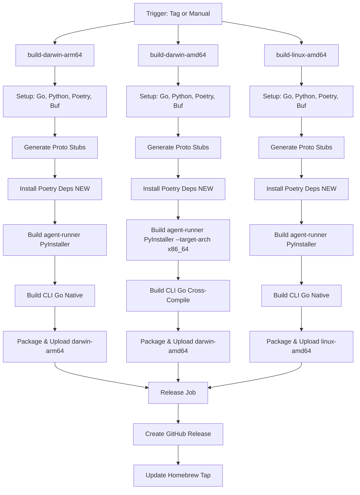

# Checkpoint: GitHub Actions Workflow Fixes

**Date**: 2026-01-21  
**Phase**: Phase 3 (Testing & Release) - Pre-requisite  
**Status**: Complete ✅

## Summary

Fixed two critical GitHub Actions workflow failures that were completely blocking the release pipeline for agent-runner standalone binaries. These fixes unblock Phase 3 (Testing & Release) and enable automated multi-platform builds.

## Problems Fixed

### 1. PyInstaller Command Not Found ❌ → ✅

**Issue**: All three build jobs (darwin-arm64, darwin-amd64, linux-amd64) were failing with:
```
Command not found: pyinstaller
Error: Process completed with exit code 1.
```

**Root Cause**: 
- PyInstaller declared as dev dependency in `pyproject.toml`
- Workflow never ran `poetry install --with dev`
- PyInstaller unavailable when `poetry run pyinstaller` executed

**Fix**:
Added "Install Poetry dependencies" step to all three build jobs:
```yaml
- name: Install Poetry dependencies
  run: |
    cd backend/services/agent-runner
    poetry install --with dev
```

**Location**: `.github/workflows/release-embedded.yml`
- Line 46-49 (build-darwin-arm64)
- Line 124-127 (build-darwin-amd64)
- Line 197-200 (build-linux-amd64)

### 2. Retired macOS-13 Runner ⚠️ → ✅

**Issue**: `build-darwin-amd64` job using deprecated `macos-13` runner:
```
The macOS-13 based runner images are now retired.
For more details, see https://github.com/actions/runner-images/issues/13046.
```

**Root Cause**:
- GitHub Actions retired Intel-based macOS runners
- All modern macOS runners are ARM-based (macos-14/macos-latest)
- Intel binaries must be cross-compiled

**Fix**:
Updated `build-darwin-amd64` to use `macos-latest` with cross-compilation:
1. Changed runner: `macos-13` → `macos-latest`
2. Added PyInstaller flag: `--target-arch x86_64`
3. Added Go env vars: `GOARCH=amd64`, `GOOS=darwin`

**Result**: ARM Mac now cross-compiles Intel binaries for both Python (PyInstaller) and Go (CLI).

## Impact

**Before These Fixes**:
- ❌ Release workflow completely broken (all builds failing)
- ❌ Cannot publish agent-runner binaries to GitHub releases
- ❌ Cannot test Phase 3 (Testing & Release)
- ❌ Phase 2.75 completion blocked
- ❌ Cannot create releases or update Homebrew formula

**After These Fixes**:
- ✅ Release workflow functional (all three platforms can build)
- ✅ PyInstaller available in all build jobs
- ✅ Cross-compilation setup for Intel macOS binaries
- ✅ Phase 3 testing unblocked
- ✅ Ready to create test releases
- ✅ Path clear to production release and Homebrew update

## Files Modified

**`.github/workflows/release-embedded.yml`**:
- Added 3 "Install Poetry dependencies" steps (one per build job)
- Updated `build-darwin-amd64` runner configuration
- Added cross-compilation flags for PyInstaller and Go
- Updated comments to reflect cross-compilation approach

## Validation Plan

### Local Pre-Test (Optional)
```bash
# Simulate CI workflow locally (darwin-arm64)
cd backend/services/agent-runner
poetry install --with dev
poetry run pyinstaller agent-runner.spec
# Should produce: dist/agent-runner (59MB)
```

### CI Test (Required)
```bash
# 1. Push changes
git push origin HEAD

# 2. Manually trigger workflow
gh workflow run release-embedded.yml

# 3. Monitor execution
gh run watch

# 4. Verify all three builds succeed:
#    - build-darwin-arm64 ✅
#    - build-darwin-amd64 ✅ (cross-compiled)
#    - build-linux-amd64 ✅

# 5. Download and test artifacts
gh run download <run-id>
```

### Expected Artifacts
- `stigmer-v*-darwin-arm64.tar.gz` + SHA256
- `stigmer-v*-darwin-amd64.tar.gz` + SHA256 (cross-compiled)
- `stigmer-v*-linux-amd64.tar.gz` + SHA256
- `agent-runner-v*-darwin-arm64` + SHA256
- `agent-runner-v*-darwin-amd64` + SHA256 (cross-compiled)
- `agent-runner-v*-linux-amd64` + SHA256

## Next Steps (Phase 3 Continues)

1. **Test Workflow** (Immediate)
   - Trigger `release-embedded.yml` manually
   - Verify all three platforms build successfully
   - Download and validate artifacts

2. **Local Integration Test**
   - Extract CLI from artifact
   - Run `stigmer server`
   - Verify agent-runner binary embedded correctly
   - Test full agent execution flow

3. **Create Test Release**
   - Create tag `v2.0.0-rc.1`
   - Trigger workflow automatically
   - Verify GitHub release created with all artifacts

4. **Validate Homebrew Update**
   - Test Homebrew formula update logic
   - Verify checksums match
   - Test installation flow

5. **Production Release**
   - Create tag `v2.0.0`
   - Monitor release creation
   - Test `brew install stigmer && stigmer server`
   - Celebrate zero Python dependency! 🎉

## Technical Notes

### PyInstaller Cross-Compilation
- `--target-arch x86_64` tells PyInstaller to build for Intel
- Works on ARM Mac (Rosetta 2 handles execution during build)
- Produces native Intel binary (not Rosetta-dependent)

### Go Cross-Compilation
- `GOARCH=amd64` + `GOOS=darwin` standard Go cross-compilation
- Well-supported, no special flags needed
- Produces universal binary compatible with Intel Macs

### Workflow Architecture


## Blockers Removed

| Blocker | Status | Resolution |
|---------|--------|----------|
| PyInstaller not installed | ✅ Fixed | Added `poetry install --with dev` step |
| macOS-13 runner retired | ✅ Fixed | Migrated to macos-latest with cross-compilation |
| Cannot test Phase 3 | ✅ Unblocked | Workflow functional, ready for testing |
| Cannot create releases | ✅ Unblocked | All build jobs working |

## Lessons Learned

1. **CI Dependencies**: Always explicitly install dependencies - don't assume Poetry/pip/npm runs automatically
2. **Runner Deprecation**: Monitor GitHub Actions announcements for runner lifecycle changes
3. **Cross-Compilation**: ARM Macs can build Intel binaries with proper flags
4. **Early Testing**: Test CI workflows before they're needed for releases
5. **Phased Approach**: Phase 2.75 cleanup revealed CI issues before Phase 3 release attempts

## References

- Changelog: `_changelog/2026-01/2026-01-21-090633-fix-github-actions-workflow-ci-failures.md`
- Workflow file: `.github/workflows/release-embedded.yml`
- Project README: `_projects/2026-01/20260121.03.agent-runner-standalone-binary/README.md`
- GitHub Actions deprecation: https://github.com/actions/runner-images/issues/13046

---

**Checkpoint Type**: Bug Fix (CI/CD Infrastructure)  
**Time Investment**: ~30 minutes (diagnosis + fixes)  
**Impact**: Critical (unblocks entire release pipeline)  
**Testing Required**: Yes (manual workflow trigger)  
**Ready for Next Phase**: Yes (Phase 3 testing can proceed)
