# Design Decision 06: Resource Dependency Management

**Status**: ✅ APPROVED - Ready for Implementation  
**Date**: 2026-01-22  
**Context**: Option C - Agent/Skill SDK Integration

---

## Problem Statement

The Stigmer SDK needs to manage creation order dependencies between resources:

```
Skill → Agent → Workflow
  ↓       ↓        ↓
  1.      2.       3.
```

**Dependency Chain:**
1. **Skill** must be created first (no dependencies)
2. **Agent** depends on Skills (agent references skills in its spec)
3. **Workflow** depends on Agents (workflow references agent in call_agent tasks)

**Key Questions:**
- How do we capture these dependencies in the SDK?
- How do we ensure correct creation order?
- Where does the ordering logic live (SDK vs CLI)?
- How does this align with Pulumi's patterns?

---

## Current State Analysis

### Workflow SDK: Task-Level Dependency Tracking ✅

The workflow SDK already has excellent dependency tracking **within** workflows:

**Implicit Dependencies (via TaskFieldRef)**:
```go
fetchTask := wf.HttpGet("fetch", url)
processTask := wf.Set("process",
    SetVar("title", fetchTask.Field("title")),  // Auto-dependency!
)
```

**Explicit Dependencies (escape hatch)**:
```go
cleanupTask := wf.Set("cleanup", ...)
cleanupTask.DependsOn(processTask)  // Explicit ordering
```

**Key Pattern:**
- Auto-export when field is accessed
- Dependency tracking through `TaskFieldRef`
- Escape hatch via `DependsOn()` method

### Cross-Resource Dependencies: Currently Missing ❌

**What We Have:**
```go
// Workflow can reference an agent by slug (string)
ref := workflow.AgentBySlug("code-reviewer")
```

**What's Missing:**
- No dependency tracking when agent instance is passed
- No guarantee agent exists when workflow references it
- No SDK-level ordering enforcement

---

## How Pulumi Solves This

### Pulumi's Dependency Model

Pulumi has **two mechanisms** for dependency management:

#### 1. Implicit Dependencies (via Outputs)

```go
// Pulumi example
bucket := s3.NewBucket(ctx, "my-bucket", nil)

// Accessing bucket.ID creates implicit dependency
website := s3.NewBucketWebsite(ctx, "website", &s3.BucketWebsiteArgs{
    Bucket: bucket.ID(),  // ← Implicit dependency on bucket!
})
```

**How it works:**
- Resources have `Output` fields (e.g., `bucket.ID()`)
- When one resource references another's `Output`, dependency is tracked
- Pulumi runtime builds dependency graph and creates resources in order

#### 2. Explicit Dependencies (via DependsOn)

```go
// Explicit dependency for side effects
server := ec2.NewInstance(ctx, "server", ...)
database := rds.NewInstance(ctx, "db", ..., pulumi.DependsOn([]pulumi.Resource{server}))
```

**ResourceOptions:**
```go
type ResourceOptions struct {
    // ...
    DependsOn []Resource              // Explicit dependencies
    DependsOnInputs []ResourceArrayInput  // Async dependencies
    Parent Resource                   // Parent-child relationship
    // ...
}
```

### Key Insights

1. **Output pattern** creates implicit dependencies through type system
2. **DependsOn** is the escape hatch for non-data dependencies
3. **Parent-child** relationships for resource hierarchies
4. **Runtime** (not SDK) does the topological sort and ordering

---

## Proposed Solution for Stigmer SDK

### Design Principles

1. **SDK captures intent, CLI enforces order**
   - SDK provides ergonomic API to express dependencies
   - CLI/Backend handles topological sorting and actual creation

2. **Align with Pulumi patterns**
   - Implicit dependencies through resource references
   - Explicit `DependsOn()` for escape hatch
   - Context tracks all resources

3. **Minimize user burden**
   - Automatic dependency tracking where possible
   - Clear, type-safe API
   - Fail fast with helpful errors

### Implementation Strategy

#### Phase 1: Context-Based Resource Registry (Foundation)

All resources register with the context:

```go
type Context struct {
    // Resource registry
    agents    []*agent.Agent
    skills    []*skill.Skill
    workflows []*workflow.Workflow
    
    // Dependency graph (built during registration)
    dependencies map[string][]string
}

func (ctx *Context) RegisterAgent(a *agent.Agent) {
    ctx.agents = append(ctx.agents, a)
    
    // Track skill dependencies
    for _, skill := range a.Skills {
        if skill.IsInline {
            ctx.addDependency(a.Name, skill.Name)
        }
    }
}

func (ctx *Context) RegisterWorkflow(wf *workflow.Workflow) {
    ctx.workflows = append(ctx.workflows, wf)
    
    // Track agent dependencies (from call_agent tasks)
    // ... analyze tasks for agent references
}
```

**Already Implemented:**
```go
// agent/agent.go (line 71-87)
func New(ctx Context, opts ...Option) (*Agent, error) {
    a := &Agent{ctx: ctx}
    
    // ... validation ...
    
    // Auto-register with context
    if a.ctx != nil {
        a.ctx.RegisterAgent(a)
    }
    
    return a, nil
}
```

#### Phase 2: Implicit Dependencies via Resource References

**Current Pattern (string-based):**
```go
// ❌ No dependency tracking
ref := workflow.AgentBySlug("code-reviewer")
```

**Proposed Pattern (instance-based):**
```go
// ✅ Automatic dependency tracking
reviewer, _ := agent.New(ctx, 
    agent.WithName("code-reviewer"),
    agent.WithInstructions("..."),
)

// When workflow references the agent instance, dependency is captured
wf, _ := workflow.New(ctx,
    workflow.WithName("pr-review"),
)

// Option A: Direct instance reference
reviewTask := wf.CallAgent("review", 
    workflow.Agent(reviewer),  // ← Captures dependency!
)

// Option B: String reference (manual dependency)
reviewTask := wf.CallAgent("review",
    workflow.AgentBySlug("code-reviewer"),
).DependsOn(reviewer)  // Manual explicit dependency
```

**Behind the scenes:**
```go
// workflow/agent_ref.go
func Agent(a *agent.Agent) AgentRef {
    // TODO: Track dependency in workflow
    // workflow.addDependency(a)
    
    return AgentRef{
        slug:  a.Name,
        scope: determineScope(a),
    }
}
```

#### Phase 3: Explicit Dependencies (Escape Hatch)

Add `DependsOn()` to all resource types:

```go
// Agent with explicit skill dependency
mySkill, _ := skill.New(...)
myAgent, _ := agent.New(ctx, ...).DependsOn(mySkill)

// Workflow with explicit agent dependency
myWorkflow, _ := workflow.New(ctx, ...).DependsOn(myAgent)
```

**Implementation:**
```go
// agent/agent.go
func (a *Agent) DependsOn(resources ...interface{}) *Agent {
    // Track dependencies (skills, other agents, etc.)
    for _, res := range resources {
        switch r := res.(type) {
        case *skill.Skill:
            a.addSkillDependency(r)
        case *Agent:
            a.addAgentDependency(r)
        default:
            // Ignore or error
        }
    }
    return a
}
```

#### Phase 4: CLI Topological Sort & Execution

The CLI reads the context and creates resources in dependency order:

```go
// stigmer CLI (pseudo-code)
func CreateResources(ctx *stigmer.Context) error {
    // 1. Extract all resources
    allResources := gatherResources(ctx)
    
    // 2. Build dependency graph
    graph := buildDependencyGraph(allResources)
    
    // 3. Topological sort
    sorted, err := topologicalSort(graph)
    if err != nil {
        return errors.Wrap(err, "circular dependency detected")
    }
    
    // 4. Create in order
    for _, resource := range sorted {
        switch r := resource.(type) {
        case *skill.Skill:
            createSkill(r)
        case *agent.Agent:
            createAgent(r)
        case *workflow.Workflow:
            createWorkflow(r)
        }
    }
    
    return nil
}
```

**Topological sort algorithm** (standard):
```go
func topologicalSort(graph DependencyGraph) ([]Resource, error) {
    // Kahn's algorithm or DFS-based topological sort
    // Returns sorted list or error if cycle detected
}
```

---

## Detailed Design

### Resource Reference Pattern

**1. Direct Instance References (Preferred)**

```go
stigmer.Run(func(ctx *stigmer.Context) error {
    // 1. Create skill
    codeAnalysis, _ := skill.New(
        skill.WithName("code-analysis"),
        skill.WithMarkdownFromFile("skills/code-analysis.md"),
    )
    
    // 2. Create agent (references skill instance)
    reviewer, _ := agent.New(ctx,
        agent.WithName("code-reviewer"),
        agent.WithInstructions("Review code for quality"),
        agent.WithSkills(codeAnalysis),  // ← Implicit dependency!
    )
    
    // 3. Create workflow (references agent instance)
    wf, _ := workflow.New(ctx,
        workflow.WithName("pr-review-flow"),
    )
    
    reviewTask := wf.CallAgent("review",
        workflow.Agent(reviewer),  // ← Implicit dependency!
    )
    
    return nil
})
```

**How dependency tracking works:**

```mermaid
flowchart TB
    A[skill.New] --> B[Skill instance created]
    B --> C[agent.New with skill ref]
    C --> D[Context tracks: agent → skill]
    D --> E[workflow.CallAgent with agent ref]
    E --> F[Context tracks: workflow → agent]
    F --> G[CLI reads dependency graph]
    G --> H{Topological Sort}
    H --> I[Create: skill → agent → workflow]
```



**2. String References (Legacy/External)**

```go
stigmer.Run(func(ctx *stigmer.Context) error {
    wf, _ := workflow.New(ctx,
        workflow.WithName("review-flow"),
    )
    
    // Reference external/platform agent by slug
    reviewTask := wf.CallAgent("review",
        workflow.AgentBySlug("code-reviewer", "platform"),
    )
    // No dependency tracking (external resource)
    
    return nil
})
```

### Dependency Tracking in Context

```go
// stigmer/context.go
type Context struct {
    // Resource registries
    skills    []*skill.Skill
    agents    []*agent.Agent
    workflows []*workflow.Workflow
    
    // Dependency graph: resourceID -> []dependencyIDs
    dependencies map[string][]string
}

func (ctx *Context) addDependency(resourceID, dependsOnID string) {
    if ctx.dependencies == nil {
        ctx.dependencies = make(map[string][]string)
    }
    ctx.dependencies[resourceID] = append(ctx.dependencies[resourceID], dependsOnID)
}

func (ctx *Context) RegisterAgent(a *agent.Agent) {
    ctx.agents = append(ctx.agents, a)
    
    // Auto-track skill dependencies
    for _, skill := range a.Skills {
        if skill.IsInline {
            // Inline skill: track dependency
            ctx.addDependency(
                agentResourceID(a),
                skillResourceID(&skill),
            )
        }
        // External skill references: no dependency
    }
}

func (ctx *Context) RegisterWorkflow(wf *workflow.Workflow) {
    ctx.workflows = append(ctx.workflows, wf)
    
    // Scan tasks for agent references
    for _, task := range wf.Tasks {
        if task.Kind == workflow.TaskKindAgentCall {
            // Extract agent ref from task config
            // If it's a reference to an inline agent, track dependency
        }
    }
}
```

### Resource ID Convention

```go
func agentResourceID(a *agent.Agent) string {
    return fmt.Sprintf("agent:%s", a.Name)
}

func skillResourceID(s *skill.Skill) string {
    if s.IsInline {
        return fmt.Sprintf("skill:%s", s.Name)
    }
    return fmt.Sprintf("skill:external:%s", s.Slug)
}

func workflowResourceID(wf *workflow.Workflow) string {
    return fmt.Sprintf("workflow:%s", wf.Name)
}
```

### CLI Execution Flow

```mermaid
flowchart TB
    A[stigmer apply] --> B[Load user code]
    B --> C[Execute stigmer.Run]
    C --> D[Resources register with context]
    D --> E[Context builds dependency graph]
    E --> F[CLI extracts graph from context]
    F --> G{Topological Sort}
    G -->|Success| H[Create resources in order]
    G -->|Cycle| I[Error: Circular dependency]
    H --> J[Skill 1]
    J --> K[Skill 2]
    K --> L[Agent 1]
    L --> M[Agent 2]
    M --> N[Workflow 1]
    N --> O[✅ Success]
```



---

## Implementation Phases

### Phase 1: Foundation (Option C - Current)

**Goal**: Context-based resource registry

**Tasks:**
- [x] Agent registers with context (already done)
- [x] Skill creation (already done)
- [ ] Workflow registers with context
- [ ] Context stores resource lists

**Deliverable**: All resources tracked in context

### Phase 2: Dependency Tracking (Option C Extension)

**Goal**: Automatic dependency detection

**Tasks:**
- [ ] Add `dependencies` map to Context
- [ ] Agent registration tracks inline skill dependencies
- [ ] Workflow registration scans tasks for agent references
- [ ] Helper functions for resource IDs

**Deliverable**: Dependency graph in context

### Phase 3: Explicit Dependencies (API Enhancement)

**Goal**: Provide escape hatch for manual dependencies

**Tasks:**
- [ ] Add `DependsOn()` method to Agent
- [ ] Add `DependsOn()` method to Workflow  
- [ ] Add `DependsOn()` method to Skill (future)
- [ ] Update context to track explicit dependencies

**Deliverable**: Full Pulumi-style dependency API

### Phase 4: CLI Execution (Backend Work)

**Goal**: Respect dependencies during resource creation

**Tasks:**
- [ ] Extract dependency graph from context
- [ ] Implement topological sort algorithm
- [ ] Create resources in sorted order
- [ ] Detect and report circular dependencies

**Deliverable**: Correct creation order guaranteed

---

## API Examples

### Example 1: Simple Agent with Inline Skill

```go
stigmer.Run(func(ctx *stigmer.Context) error {
    // Skill created first (no dependencies)
    codeSkill, _ := skill.New(
        skill.WithName("code-analysis"),
        skill.WithMarkdownFromFile("skills/code.md"),
    )
    
    // Agent depends on skill
    reviewer, _ := agent.New(ctx,
        agent.WithName("reviewer"),
        agent.WithInstructions("Review code"),
        agent.WithSkills(codeSkill),  // Implicit dependency
    )
    
    // CLI creates: skill → agent
    return nil
})
```

**Dependency Graph:**
```
agent:reviewer → skill:code-analysis
```

### Example 2: Workflow Calling Agent

```go
stigmer.Run(func(ctx *stigmer.Context) error {
    // Agent
    reviewer, _ := agent.New(ctx,
        agent.WithName("reviewer"),
        agent.WithInstructions("Review code"),
    )
    
    // Workflow calling agent
    wf, _ := workflow.New(ctx,
        workflow.WithName("pr-flow"),
    )
    
    wf.CallAgent("review", workflow.Agent(reviewer))
    
    // CLI creates: agent → workflow
    return nil
})
```

**Dependency Graph:**
```
workflow:pr-flow → agent:reviewer
```

### Example 3: Complex Multi-Resource

```go
stigmer.Run(func(ctx *stigmer.Context) error {
    // Skills (no dependencies)
    skill1, _ := skill.New(skill.WithName("coding"), ...)
    skill2, _ := skill.New(skill.WithName("security"), ...)
    
    // Agents (depend on skills)
    codeReviewer, _ := agent.New(ctx,
        agent.WithName("code-reviewer"),
        agent.WithSkills(skill1),
    )
    
    secReviewer, _ := agent.New(ctx,
        agent.WithName("sec-reviewer"),
        agent.WithSkills(skill2),
    )
    
    // Workflow (depends on both agents)
    wf, _ := workflow.New(ctx, workflow.WithName("review-flow"))
    wf.CallAgent("code-review", workflow.Agent(codeReviewer))
    wf.CallAgent("sec-review", workflow.Agent(secReviewer))
    
    // CLI creates: skill1, skill2 → codeReviewer, secReviewer → workflow
    return nil
})
```

**Dependency Graph:**
```
workflow:review-flow → agent:code-reviewer
workflow:review-flow → agent:sec-reviewer
agent:code-reviewer → skill:coding
agent:sec-reviewer → skill:security
```

**Topological Sort Result:**
```
1. skill:coding
2. skill:security
3. agent:code-reviewer  (can run in parallel with #4)
4. agent:sec-reviewer   (can run in parallel with #3)
5. workflow:review-flow
```

### Example 4: Explicit Dependencies (Escape Hatch)

```go
stigmer.Run(func(ctx *stigmer.Context) error {
    // Skill
    skill1, _ := skill.New(skill.WithName("skill1"), ...)
    
    // Agent doesn't reference skill in spec, but needs it created first
    agent1, _ := agent.New(ctx,
        agent.WithName("agent1"),
        agent.WithInstructions("..."),
    ).DependsOn(skill1)  // Explicit dependency
    
    // CLI creates: skill1 → agent1 (even though no reference in spec)
    return nil
})
```

---

## Edge Cases & Considerations

### 1. Circular Dependencies

```go
// ❌ This should fail
agent1, _ := agent.New(ctx, ...).DependsOn(agent2)
agent2, _ := agent.New(ctx, ...).DependsOn(agent1)
```

**Solution**: Topological sort detects cycle, CLI fails with clear error:
```
Error: Circular dependency detected:
  agent:agent1 → agent:agent2 → agent:agent1
```

### 2. External/Platform Resources

```go
// Platform agent (not created by user)
wf.CallAgent("review", workflow.AgentBySlug("platform-reviewer", "platform"))
```

**Solution**: No dependency tracked for external resources. They must already exist.

### 3. Skill References (Platform vs Inline)

```go
// Inline skill: dependency tracked
inlineSkill, _ := skill.New(skill.WithName("my-skill"), ...)
agent.WithSkills(inlineSkill)  // → dependency: agent → skill

// Platform skill: no dependency
platformSkill := skill.Platform("coding-guidelines")
agent.WithSkills(platformSkill)  // → no dependency (external)
```

**Solution**: Context only tracks dependencies for inline resources.

### 4. Multiple Workflows Sharing Agent

```go
agent1, _ := agent.New(ctx, ...)
wf1, _ := workflow.New(ctx, ...)
wf2, _ := workflow.New(ctx, ...)

wf1.CallAgent("task1", workflow.Agent(agent1))
wf2.CallAgent("task2", workflow.Agent(agent1))
```

**Dependency Graph:**
```
workflow:wf1 → agent:agent1
workflow:wf2 → agent:agent1
```

**Execution Order:**
```
1. agent:agent1
2. workflow:wf1  (parallel with #3)
3. workflow:wf2  (parallel with #2)
```

**Solution**: Works correctly. Agent created once, both workflows can be created in parallel.

---

## Migration Path

### Current State (Pre-Implementation)

Users create resources in any order:
```go
stigmer.Run(func(ctx *stigmer.Context) error {
    // No dependency tracking - user must manually order
    wf, _ := workflow.New(ctx, ...)
    agent, _ := agent.New(ctx, ...)
    skill, _ := skill.New(...)
    
    // CLI creates in registration order (wrong!)
    return nil
})
```

### Phase 1: Add Registry (Backward Compatible)

```go
// Same API, but resources register with context
stigmer.Run(func(ctx *stigmer.Context) error {
    wf, _ := workflow.New(ctx, ...)    // Registers with ctx
    agent, _ := agent.New(ctx, ...)    // Registers with ctx
    skill, _ := skill.New(...)         // Standalone (no ctx yet)
    
    // CLI creates in registration order (still wrong, but tracked)
    return nil
})
```

### Phase 2: Add Dependency Tracking (Breaking Change)

```go
// CLI now respects dependencies
stigmer.Run(func(ctx *stigmer.Context) error {
    // Order doesn't matter anymore!
    wf, _ := workflow.New(ctx, ...)
    agent, _ := agent.New(ctx, ...)
    skill, _ := skill.New(...)
    
    // CLI creates in dependency order: skill → agent → workflow ✅
    return nil
})
```

**Breaking Change**: Workflows/agents that relied on registration order may break if they had implicit ordering assumptions.

**Mitigation**: 
1. Add deprecation warning in Phase 1
2. Document dependency tracking in migration guide
3. Provide tool to detect potential issues

---

## Testing Strategy

### Unit Tests

```go
func TestDependencyTracking(t *testing.T) {
    ctx := stigmer.NewContext()
    
    skill := skill.New(skill.WithName("s1"), ...)
    agent := agent.New(ctx, agent.WithSkills(skill))
    
    // Assert: context tracked dependency
    assert.Contains(t, ctx.dependencies["agent:agent1"], "skill:s1")
}

func TestTopologicalSort(t *testing.T) {
    graph := DependencyGraph{
        "a": []string{"b", "c"},
        "b": []string{"c"},
        "c": []string{},
    }
    
    sorted := topologicalSort(graph)
    
    // Assert: c before b, b before a
    assert.Equal(t, []string{"c", "b", "a"}, sorted)
}

func TestCircularDependency(t *testing.T) {
    graph := DependencyGraph{
        "a": []string{"b"},
        "b": []string{"a"},  // Cycle!
    }
    
    _, err := topologicalSort(graph)
    assert.Error(t, err)
    assert.Contains(t, err.Error(), "circular dependency")
}
```

### Integration Tests

```go
func TestRealWorldFlow(t *testing.T) {
    stigmer.Run(func(ctx *stigmer.Context) error {
        skill1 := skill.New(skill.WithName("coding"), ...)
        skill2 := skill.New(skill.WithName("security"), ...)
        
        agent1 := agent.New(ctx, agent.WithSkills(skill1))
        agent2 := agent.New(ctx, agent.WithSkills(skill2))
        
        wf := workflow.New(ctx, ...)
        wf.CallAgent("review1", workflow.Agent(agent1))
        wf.CallAgent("review2", workflow.Agent(agent2))
        
        // Verify dependency graph
        assert.Equal(t, 
            map[string][]string{
                "agent:agent1": {"skill:coding"},
                "agent:agent2": {"skill:security"},
                "workflow:wf": {"agent:agent1", "agent:agent2"},
            },
            ctx.dependencies,
        )
        
        return nil
    })
}
```

---

## Decision

**✅ APPROVED**: Implement resource dependency management following this design.

**Rationale:**
1. Aligns with Pulumi's proven patterns (implicit + explicit dependencies)
2. Separates concerns (SDK captures intent, CLI enforces order)
3. Provides escape hatch for edge cases (`DependsOn()`)
4. Minimal impact on user code (mostly automatic)
5. Solves real problem (correct creation order)

**Implementation Timeline:**
- Phase 1-2: Part of Option C (current sprint)
- Phase 3: Enhancement (next sprint)
- Phase 4: CLI work (separate effort)

---

## References

- **Pulumi Resource Options**: `/Users/suresh/scm/github.com/pulumi/pulumi/sdk/go/pulumi/resource.go:410`
- **Pulumi Dependency Tracking**: `/Users/suresh/scm/github.com/pulumi/pulumi/sdk/go/pulumi/resource.go:533`
- **Workflow DependsOn**: `sdk/go/workflow/task.go:149`
- **Agent Registration**: `sdk/go/agent/agent.go:71`
- **AgentRef Pattern**: `sdk/go/workflow/agent_ref.go`

---

## Next Steps

1. ✅ **Document the design** (this file)
2. 🔲 **Implement Phase 1-2** (Option C integration)
   - Add workflow registration to context
   - Implement dependency tracking in context
   - Extract agent refs from workflow tasks
3. 🔲 **Implement Phase 3** (next sprint)
   - Add `DependsOn()` methods
   - Support explicit dependencies
4. 🔲 **CLI Implementation** (separate task)
   - Topological sort algorithm
   - Resource creation in order
   - Circular dependency detection

---

**Status**: Ready for implementation in Option C integration phase.
