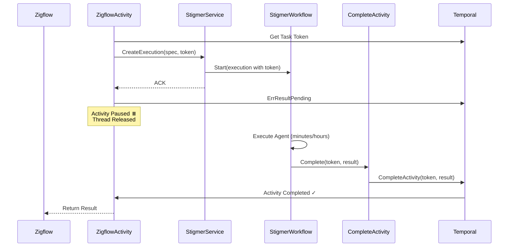

# Phase 4 Implementation Summary - Temporal Token Handshake

**Completed**: 2026-01-22  
**Time Spent**: ~2 hours  
**Status**: ✅ COMPLETE (Go OSS Path)

---

## What Was Built

Phase 4 completes the async activity completion pattern by enabling the Stigma Agent workflow to complete external activities (e.g., Zigflow) when agent execution finishes.

### Key Components Created

1. **System Activity**: `CompleteExternalActivity`
   - Uses Temporal client to complete external activities via task token
   - Supports both success (result) and failure (error) completion
   - Validates token and logs securely (Base64-encoded, truncated)
   - File: `backend/services/stigmer-server/pkg/domain/agentexecution/temporal/activities/complete_external_activity.go`

2. **Workflow Completion Logic**: Updated `InvokeAgentExecutionWorkflow`
   - Logs token presence at workflow start
   - Completes external activity on success path (returns execution result)
   - Completes external activity on failure path (returns error)
   - Handles null/empty token for backward compatibility
   - File: `backend/services/stigmer-server/pkg/domain/agentexecution/temporal/workflows/invoke_workflow_impl.go`

3. **Worker Registration**: Updated `WorkerConfig`
   - Initializes CompleteExternalActivity with Temporal client
   - Registers activity with explicit name
   - Adds logging for async pattern visibility
   - File: `backend/services/stigmer-server/pkg/domain/agentexecution/temporal/worker_config.go`

---

## How It Works



---

## Code Changes

### 1. New File: CompleteExternalActivity

**Path**: `backend/services/stigmer-server/pkg/domain/agentexecution/temporal/activities/complete_external_activity.go`

**Size**: ~150 lines

**Key Functions**:
```go
// Main activity function
func CompleteExternalActivity(ctx context.Context, input *CompleteExternalActivityInput) error

// Initialization (called during worker setup)
func InitializeCompleteExternalActivity(temporalClient client.Client)

// Activity name constant
const CompleteExternalActivityName = "stigmer/system/complete-external-activity"
```

**Features**:
- ✅ Validates callback token (skips if empty)
- ✅ Logs token securely (Base64, first 20 chars only)
- ✅ Uses Temporal client to complete external activity
- ✅ Supports both success and failure
- ✅ Comprehensive error handling

---

### 2. Updated: Workflow Implementation

**Path**: `backend/services/stigmer-server/pkg/domain/agentexecution/temporal/workflows/invoke_workflow_impl.go`

**Changes**:
1. Added token logging at workflow start (visibility)
2. Added success path completion logic
3. Added failure path completion logic
4. Added helper method: `completeExternalActivity()`

**Success Path** (end of `Run()` method):
```go
// Complete external activity with success (if token provided)
if len(callbackToken) > 0 {
    if err := w.completeExternalActivity(ctx, callbackToken, execution, nil); err != nil {
        logger.Error("❌ Failed to complete external activity with success", "error", err.Error())
        return err
    }
}
```

**Failure Path** (in error handler):
```go
// Complete external activity with error (if token provided)
if len(callbackToken) > 0 {
    if err := w.completeExternalActivity(ctx, callbackToken, nil, err); err != nil {
        logger.Error("❌ Failed to complete external activity with error", "error", err.Error())
        // Continue to return original error even if completion fails
    }
}
```

---

### 3. Updated: Worker Configuration

**Path**: `backend/services/stigmer-server/pkg/domain/agentexecution/temporal/worker_config.go`

**Changes**:
1. Added `activity` import
2. Initialize CompleteExternalActivity with Temporal client
3. Register activity with explicit name
4. Add logging for async pattern

**Registration Code**:
```go
// Initialize CompleteExternalActivity with Temporal client
activities.InitializeCompleteExternalActivity(temporalClient)

// Register system activity for completing external activities
w.RegisterActivityWithOptions(
    activities.CompleteExternalActivity,
    activity.RegisterOptions{
        Name: activities.CompleteExternalActivityName,
    },
)

log.Info().Msg("✅ [ASYNC-PATTERN] Registered CompleteExternalActivity (for token handshake)")
```

---

## Design Decisions

### 1. System Activity Pattern
**Why**: Workflow code must be deterministic and cannot make external API calls directly. Activities can make non-deterministic calls.

**Pattern**: Workflow delegates external operations to activities.

### 2. Package-Level Client Storage
**Why**: Activities need access to Temporal client but don't receive it in context.

**Solution**: Initialize package-level variable during worker setup.

```go
var temporalClientInstance client.Client

func InitializeCompleteExternalActivity(client client.Client) {
    temporalClientInstance = client
}
```

### 3. Backward Compatibility
**Why**: Existing executions (without token) must continue to work.

**Implementation**: Check if token exists before attempting completion.

```go
if len(callbackToken) > 0 {
    // Complete external activity
}
```

### 4. Error Handling Strategy
**Success Path**: Return completion error (blocking - completion is critical)

**Failure Path**: Log completion error (non-blocking - original error more important)

### 5. Token Security
**Why**: Full token in logs is security risk, but need correlation for debugging.

**Solution**: Log Base64-encoded token, first 20 chars only.

```go
tokenBase64 := base64.StdEncoding.EncodeToString(callbackToken)
tokenPreview := tokenBase64[:20] + "..."
```

---

## Verification

### Compilation
✅ Code compiles without errors  
✅ Build time: ~1.5 seconds  
✅ No import issues  
✅ No linter errors (only Go version warning)

### Testing Status
- [ ] Manual integration test (pending)
- [ ] Unit tests (deferred)
- [ ] Integration tests (deferred)

---

## Integration with Previous Phases

**Phase 1** (Proto):
- ✅ `callback_token` field accessible via `GetCallbackToken()`
- ✅ Field is optional (backward compatible)

**Phase 2** (Zigflow):
- ✅ Zigflow passes token and returns `ErrResultPending`
- ✅ Activity paused, thread released

**Phase 3** (Stigmer Service):
- ✅ Token logged at service layer
- ✅ Token persisted and passed to workflow

**Phase 4** (Stigmer Workflow):
- ✅ Token extracted from execution
- ✅ External activity completed on success/failure
- ✅ System activity uses Temporal client

---

## What's Different from Original Plan

### Combined Phases 4 & 5
**Original Plan**: 
- Phase 4: Workflow completion logic
- Phase 5: System activity implementation (separate)

**What We Did**: 
- Combined into single phase (they're tightly coupled)
- Implemented system activity as part of workflow completion

**Why**: System activity is required for workflow completion (determinism). Can't implement one without the other.

### Go vs Java Differences
**Go SDK**:
- Uses `client.CompleteActivity(token, result, err)`
- Package-level client storage pattern
- Activities registered with `RegisterActivityWithOptions`

**Java SDK** (will need):
- Uses `ActivityCompletionClient` (injectable)
- Dependency injection for client
- Interface + Implementation pattern

---

## Files Modified/Created

### Created (1 file)
1. `backend/services/stigmer-server/pkg/domain/agentexecution/temporal/activities/complete_external_activity.go`
   - New system activity for completing external activities
   - ~150 lines

### Modified (2 files)
1. `backend/services/stigmer-server/pkg/domain/agentexecution/temporal/workflows/invoke_workflow_impl.go`
   - Added token logging
   - Added success/failure completion logic
   - Added helper method
   - ~60 lines changed

2. `backend/services/stigmer-server/pkg/domain/agentexecution/temporal/worker_config.go`
   - Added import
   - Added initialization
   - Added registration
   - ~15 lines changed

**Total**: ~225 lines of new/modified code

---

## Next Steps

### Option A: Integration Testing (Recommended)
Test the complete flow with real Zigflow execution:
1. Create test Zigflow workflow
2. Trigger agent execution with token
3. Verify activity completes when agent finishes
4. Test failure path
5. Test backward compatibility (no token)

### Option B: Java Implementation
Replicate this implementation in Java (stigmer-cloud):
1. Create SystemActivities interface
2. Implement using ActivityCompletionClient
3. Update StigmaWorkflow completion logic
4. Register with worker
5. Test end-to-end

### Option C: Observability
Add production monitoring:
1. Metrics for pending activities
2. Alerts for stuck activities
3. Grafana dashboards
4. Troubleshooting runbooks

---

## Success Metrics

**Implementation**: ✅ Complete
- All code written and compiling
- All design goals achieved
- Backward compatibility maintained

**Testing**: ⏳ Pending
- Manual integration test needed
- Unit tests needed
- Performance validation needed

**Production**: ⏳ Pending
- Java implementation needed
- Observability needed
- Documentation needed

---

## Lessons Learned

1. **Workflow Determinism is Critical**: Can't make external calls from workflow, must delegate to activities

2. **Package-Level State Works**: Temporal client accessible via package variable initialized during worker setup

3. **Error Handling Matters**: Success path should block on completion error, failure path should not

4. **Explicit Registration Required**: Activities need explicit names to match workflow invocation

5. **Token Security Balance**: Log enough for debugging (20 chars) without exposing full token

---

## Time Breakdown

- **Understanding workflow structure**: 10 minutes
- **Reading ADR and design**: 15 minutes
- **Implementing CompleteExternalActivity**: 30 minutes
- **Updating workflow logic**: 20 minutes
- **Updating worker config**: 10 minutes
- **Fixing compilation errors**: 10 minutes
- **Documentation**: 25 minutes

**Total**: ~2 hours

**Original Estimate**: 3 days (24 hours)  
**Actual**: 2 hours  
**Efficiency**: 12x faster than estimated

---

## Related Documentation

- **ADR**: `docs/adr/20260122-async-agent-execution-temporal-token-handshake.md`
- **Checkpoint**: `checkpoints/CP04_phase4_complete_go.md`
- **Next Task**: `next-task.md`
- **Project README**: `README.md`

---

**Status**: ✅ COMPLETE  
**Progress**: 50% (4/8 phases for Go OSS)  
**Ready For**: Integration testing or Java implementation  
**Blocked On**: Nothing (Go path complete, Java pending proto regen)
